# **Aplicación WEB Inteligente de Tutoría Adaptativa y Análisis Biomecánico para Brazilian Jiu-Jitsu**

<br>

<div align="center">

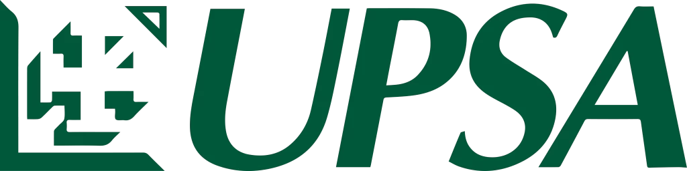

<br>
<br>

**Santiago Borda Zambrana**  
*Registro: 2021210057*  

<br>

**Facultad de Ingeniería**  
*Carrera de Ingeniería de Sistemas*  
**Universidad Privada de Santa Cruz de la Sierra**  

<br>

**Modalidad de Graduación: Proyecto de Grado**  
*Para optar al título de Licenciado en Ingeniería de Sistemas*  

<br>

**Tutor:** Jose Antonio Benavente Blacutt  

<br>

**Santa Cruz de la Sierra - Bolivia**  
**2026**

</div>

<br>

# **Agradecimientos**

Agradezco a Dios por traerme a este mundo fuerte y saludable.
A mi madre, que gracias a su amor incondicional y su esfuerzo me permitió estudiar. Gracias, mami.
A mi abuela, por alimentarme y tener siempre un plato de comida listo.
A mis tíos, por sus palabras y experiencias de vida compartidas que me ayudaron a aprender.
Al Jiu-Jitsu Brasileño, por enseñarme a afrontar los miedos, a seguir adelante incluso cuando no se percibe un avance inmediato, a lidiar con la sensación de la derrota y, sobre todo, a no rendirme y seguir aprendiendo.

*Un cinturón negro es un cinturón blanco que nunca se rindió.*

<br>

# **Abstract**

| TÍTULO | Aplicación WEB Inteligente de Tutoría Adaptativa y Análisis Biomecánico para Brazilian Jiu-Jitsu |
| :--- | :--- |
| **AUTOR** | SANTIAGO BORDA ZAMBRANA |

### **Problemática**
En el aprendizaje del Brazilian Jiu-Jitsu (BJJ), los practicantes carecen de sistemas objetivos que evalúen su ejecución técnica de manera continua y adaptada a sus características físicas básicas. Las plataformas actuales presentan rigidez semántica al acoplarse a reglas de movimiento codificadas de forma estática (hardcoded), lo que impide la incorporación de nuevas variantes técnicas introducidas por la comunidad de usuarios o academias sin reescribir el software. Asimismo, no consideran el historial de errores del alumno para adaptar la estrategia pedagógica, limitando el progreso individual y la retroalimentación en entornos de entrenamiento masivos.

### **Objetivo General**
Desarrollar el diseño de una aplicación web progresiva (PWA) inteligente que combine el análisis biomecánico 3D en el cliente y la recuperación aumentada por generación (RAG) en tiempo real para la tutoría pedagógica adaptativa del Jiu-Jitsu Brasileño, abarcando todos los niveles de graduación (desde cinturón blanco hasta negro) mediante la inyección y autodetección dinámica de conocimiento literario y audiovisual.

### **Contenido**
El presente trabajo de investigación se ha desarrollado bajo la metodología del Proceso Unificado (UP) y consta de los primeros cinco capítulos estructurados de acuerdo con los requisitos lógicos de estimación de pose, RAG dinámico (RAG Vivo), y perfilamiento de competencia de los usuarios:

| CARRERA | Ingeniería de Sistemas |
| :--- | :--- |
| **GUÍA** | Jose Antonio Benavente Blacutt |
| **DESCRIPTORES** | Visión por Computadora 3D, Recuperación Aumentada por Generación (RAG), Modelos de Pose Monocular, Tutoría Adaptativa, GRASP, PWA. |
| **EMAIL** | santiagobordazambrana@gmail.com |
| **FECHA** | Santa Cruz de la Sierra, 2026 |

<br>

# **Resumen**

En este trabajo se expone el diseño y modelado orientado a objetos de una plataforma inteligente de asistencia deportiva y tutoría adaptativa para el Brazilian Jiu-Jitsu. La solución supera las rigideces metodológicas de sistemas previos mediante una arquitectura híbrida cliente-ligero. La extracción cinemática tridimensional (landmarks 3D) ocurre directamente en el navegador del cliente mediante modelos monoculares libres de sensores físicos. Para la evaluación táctica y corrección del movimiento, se inyectan dinámicamente manuales técnicos y transcripciones de videos vectorizados en el servidor central. El sistema realiza el seguimiento del progreso histórico del alumno mediante un perfil de competencia y altera la estrategia didáctica ante fallos recurrentes, ofreciendo una ruta de aprendizaje multi-nivel personalizada. La validez de la arquitectura se sustenta en el Proceso Unificado y el diseño orientado a objetos basado en patrones GRASP.

# **Índice de Contenidos**

- [**Agradecimientos**](#agradecimientos)
- [**Abstract**](#abstract)
- [**Resumen**](#resumen)
- [**Capítulo I: Definición del Proyecto de Investigación**](#capítulo-i-definición-del-proyecto-de-investigación)
  - [1.1 Definición del problema](#11-definición-del-problema)
    - [1.1.1 Situación problemática](#111-situación-problemática)
    - [1.1.2 Situación deseada](#112-situación-deseada)
    - [1.1.3 Objeto de investigación](#113-objeto-de-investigación)
    - [1.1.4 Alcance](#114-alcance)
    - [1.1.5 Justificación](#115-justificación)
  - [1.2 Objetivos](#12-objetivos)
    - [1.2.1 Objetivo General](#121-objetivo-general)
    - [1.2.2 Objetivos Específicos](#122-objetivos-específicos)
  - [1.3 Metodología](#13-metodología)
    - [1.3.1 Ingeniería de Software (Proceso Unificado)](#131-ingeniería-de-software-proceso-unificado)
    - [1.3.2 Gestión del Proyecto (Scrum)](#132-gestión-del-proyecto-scrum)
- [**Capítulo II: Descripción de la Entidad (Corpo \& Mente)**](#capítulo-ii-descripción-de-la-entidad-corpo--mente)
  - [2.1 Descripción de la organización](#21-descripción-de-la-organización)
  - [2.2 Descripción organizacional](#22-descripción-organizacional)
  - [2.3 Manual de funciones](#23-manual-de-funciones)
  - [2.4 Descripción de los productos y servicios](#24-descripción-de-los-productos-y-servicios)
- [**Capítulo III: Marco Teórico y Estado del Arte**](#capítulo-iii-marco-teórico-y-estado-del-arte)
  - [3.1 Conceptos y definiciones](#31-conceptos-y-definiciones)
  - [3.2 Estado del arte](#32-estado-del-arte)
  - [3.3 Modelos y teorías relevantes](#33-modelos-y-teorías-relevantes)
  - [3.4 Tecnologías y herramientas](#34-tecnologías-y-herramientas)
  - [3.5 Valor agregado](#35-valor-agregado)
  - [3.6 Limitaciones](#36-limitaciones)
  - [3.7 Justificación teórica de la metodología](#37-justificación-teórica-de-la-metodología)
- [**Capítulo IV: Definición de Requisitos**](#capítulo-iv-definición-de-requisitos)
  - [4.1 Introducción](#41-introducción)
    - [4.1.1 Propósito](#411-propósito)
    - [4.1.2 Ámbito del Sistema](#412-ámbito-del-sistema)
    - [4.1.3 Definiciones, Acrónimos y Abreviaturas](#413-definiciones-acrónimos-y-abreviaturas)
    - [4.1.4 Referencias](#414-referencias)
    - [4.1.5 Perspectiva General](#415-perspectiva-general)
  - [4.2 Descripción General](#42-descripción-general)
    - [4.2.1 Perspectiva del Producto](#421-perspectiva-del-producto)
    - [4.2.2 Funciones del Producto](#422-funciones-del-producto)
    - [4.2.3 Características de los Usuarios](#423-características-de-los-usuarios)
    - [4.2.4 Restricciones](#424-restricciones)
    - [4.2.5 Suposiciones y Dependencias](#425-suposiciones-y-dependencias)
  - [4.3 Requisitos Específicos](#43-requisitos-específicos)
    - [4.3.1 Interfaces Externas](#431-interfaces-externas)
    - [4.3.2 Requisitos Funcionales](#432-requisitos-funcionales)
    - [4.3.3 Requisitos No Funcionales (Modelo FURPS+)](#433-requisitos-no-funcionales-modelo-furps)
    - [4.3.4 Restricciones de Diseño](#434-restricciones-de-diseño)
    - [4.3.5 Atributos del Sistema de Software](#435-atributos-del-sistema-de-software)
- [**Capítulo V: Análisis y Diseño Orientado a Objetos**](#capítulo-v-análisis-y-diseño-orientado-a-objetos)
  - [5.1 Modelo de Dominio Conceptual](#51-modelo-de-dominio-conceptual)
  - [5.2 Especificación de Casos de Uso Principales](#52-especificación-de-casos-de-uso-principales)
  - [5.3 Diagramas de Secuencia del Sistema (DSS)](#53-diagramas-de-secuencia-del-sistema-dss)
  - [5.4 Contratos de las Operaciones del Sistema](#54-contratos-de-las-operaciones-del-sistema)
  - [5.5 Diseño de la Arquitectura Lógica (Patrón Capas)](#55-diseño-de-la-arquitectura-lógica-patrón-capas)
  - [5.6 Realización del Caso de Uso con Patrones GRASP](#56-realización-del-caso-de-uso-con-patrones-grasp)
  - [5.7 Diagrama de Estados para el Controlador](#57-diagrama-de-estados-para-el-controlador)
  - [5.8 Diagrama de Clases de Diseño (DCD)](#58-diagrama-de-clases-de-diseño-dcd)
  - [5.9 Diagrama de Despliegue Físico](#59-diagrama-de-despliegue-físico)
  - [5.10 Diseño de Interfaces de Usuario (UI)](#510-diseño-de-interfaces-de-usuario-ui)

# **Índice de Tablas**

- [**Tabla 1** *Análisis Comparativo de Soluciones Tecnológicas de Retroalimentación Deportiva*](#tabla-1)
- [**Tabla 2** *Especificación de Requisitos No Funcionales (FURPS+)*](#tabla-2)
- [**Tabla 3** *Responsabilidades por Capa de la Arquitectura Lógica*](#tabla-3)
- [**Tabla 4** *Justificación de Decisiones de Diseño Basadas en Patrones GRASP*](#tabla-4)
- [**Tabla 5** *Diccionario de Datos (Especificaciones de Atributos)*](#tabla-5)

# **Índice de Figuras**

- [**Figura 1** *Modelo de Dominio Conceptual de OpenBJJ*](#figura-1)
- [**Figura 2** *Diagrama Global de Casos de Uso del Sistema*](#figura-2)
- [**Figura 3** *DSS-CU01: Flujo Completo de Análisis Biomecánico y Autodetección*](#figura-3)
- [**Figura 4** *DSS-CU02: Flujo de Ingesta y Vectorización RAG*](#figura-4)
- [**Figura 5** *DSS-CU03: Flujo de Consulta de Progreso y Tutoría Adaptativa*](#figura-5)
- [**Figura 6** *DSS-CU10: Flujo de Recomendación y Adaptación de Videos de YouTube*](#figura-6)
- [**Figura 7** *Diagrama de Secuencia de Diseño (Realización de CU01)*](#figura-7)
- [**Figura 8** *Máquina de Estados de SesionEntrenamientoController*](#figura-8)
- [**Figura 9** *Diagrama de Clases de Diseño (DCD)*](#figura-9)
- [**Figura 10** *Diagrama de Despliegue Físico de OpenBJJ*](#figura-10)
- [**Figura 11** *Diagrama de Secuencia de Diseño (Realización de CU02)*](#figura-11)
- [**Figura 12** *Diagrama de Secuencia de Diseño (Realización de CU03)*](#figura-12)

---

# **CAPÍTULO I: DEFINICIÓN DEL PROYECTO DE INVESTIGACIÓN**

## **1.1 Definición del problema**

### **1.1.1 Situación problemática**
En el aprendizaje de las artes marciales y, en específico, del Brazilian Jiu-Jitsu (BJJ), los practicantes se enfrentan a una dependencia crítica de la instrucción presencial y sincrónica para corregir sus errores técnicos. En entornos de entrenamiento masivos, los instructores no pueden proporcionar atención personalizada frame por frame a cada alumno, lo que ralentiza significativamente su curva de aprendizaje.

Las soluciones tecnológicas actuales presentan limitaciones severas que impiden resolver este vacío de manera efectiva:
- **Rigidez del conocimiento (Knowledge Rigidity):** Los sistemas existentes de retroalimentación deportiva poseen reglas técnicas estáticas grabadas directamente en su código fuente (hardcoded). Esto impide la incorporación de literatura técnica diversa (manuales oficiales, reglamentos federativos variados o videos explicativos de YouTube) que los propios profesores o academias desean utilizar como fuente de verdad en un dominio abierto (Open-Domain).
- **Falta de adaptabilidad pedagógica:** Las aplicaciones no consideran el historial de rendimiento del alumno. Emiten diagnósticos aislados y genéricos sin comprender si un error es recurrente, lo que imposibilita la personalización de las estrategias de enseñanza para alumnos que presentan dificultades de progreso en articulaciones específicas.
- **Complejidad y costes de hardware:** Las herramientas que ofrecen análisis biomecánico cuantitativo preciso exigen sensores inerciales físicos (IMUs) adheridos al cuerpo o cámaras de alta velocidad en entornos controlados, lo cual es inviable sobre un tatami de sparring de BJJ por razones de seguridad, costo y usabilidad.

### **1.1.2 Situación deseada**
Se busca desarrollar una plataforma web progresiva (PWA) inteligente que actúe como un tutor biomecánico y táctico adaptativo. El practicante, independientemente de su nivel de graduación (desde cinturón blanco hasta cinturón negro), podrá cargar un video monocular de su sparring o ejecución técnica. 

El sistema procesará el video localmente en el dispositivo del usuario utilizando visión por computadora en el cliente para estimar landmarks biomecánicos en 3D sin requerir sensores físicos. Un motor de Inteligencia Artificial (IA) contrastará esta cinemática en tiempo real con especificaciones técnicas recuperadas dinámicamente desde una base de datos vectorial inyectada por el usuario (motor RAG de manuales en PDF y transcripciones de YouTube).

El sistema detectará automáticamente la técnica o deporte del video mediante inferencia multimodal y mantendrá un perfil de competencia basado en el historial del alumno. Si el alumno falla repetidamente (más de 3 veces) en una desviación técnica detectada (ej. ángulo de codo incorrecto), el motor de tutoría adaptativa modificará automáticamente la estrategia pedagógica, conmutando la recomendación de videos explicativos genéricos a drills específicos de fortalecimiento e indicaciones anatómicas. El sistema operará bajo la filosofía de "RAG Vivo", permitiendo asimilar de forma dinámica nuevas técnicas cargadas por la comunidad de usuarios sin reentrenamiento de red.

### **1.1.3 Objeto de investigación**
El objeto de este estudio es el modelado y diseño de una arquitectura de software orientada a objetos que combine la estimación de pose 3D client-side (sin sensores) y el procesamiento semántico RAG (Retrieval-Augmented Generation) para la tutoría adaptativa, multinivel y de dominio abierto (Open-Domain) de artes marciales en tiempo de ejecución.

### **1.1.4 Alcance**
El proyecto OpenBJJ se delimita bajo los siguientes criterios:
- **Alcance Técnico:** Extracción de landmarks corporales en 3D en el lado del cliente (navegador web) a través de MediaPipe y TensorFlow.js, eliminando la transmisión del video original a servidores externos de terceros. La persistencia de datos maestros, perfiles de competencia e indexación semántica/vectorial del motor RAG se gestionan de forma centralizada en el Servidor Local, interactuando el cliente con el backend central mediante una API HTTPS. Esto elimina el uso de procesamiento vectorial o almacenamiento IndexedDB en el dispositivo cliente, garantizando la ligereza de la PWA.
- **Alcance de Dominio:** Cobertura de técnicas correspondientes a todos los niveles de graduación de Brazilian Jiu-Jitsu (cinturones Blanco, Azul, Morado, Marrón y Negro), con capacidad de extensión a otras disciplinas de artes marciales a través del mecanismo de ingesta dinámica de fuentes de conocimiento (Open-Domain).
- **Alcance Metodológico:** Modelado lógico, diseño orientado a objetos y especificación arquitectónica del Proceso Unificado (UP) hasta la fase de Elaboración inclusive, y la aplicación de los patrones GRASP de Craig Larman (2ª Edición).
- **Alcance de Despliegue:** Aplicación Web Progresiva (PWA) responsiva compatible con dispositivos móviles y ordenadores de escritorio mediante navegadores modernos con soporte WebGL.

### **1.1.5 Justificación**
- **Tecnológica:** Demuestra la viabilidad de implementar arquitecturas cognitivas complejas (visión 3D + RAG) mediante un modelo híbrido en el borde (Edge AI) para la captura cinemática y un nodo centralizado local para la soberanía del motor RAG corporativo.
- **Económica:** Suprime la necesidad de servidores de procesamiento de video basados en GPU, delegando la carga computacional pesada al procesador local del cliente. El consumo de APIs se restringe a llamadas de texto y embeddings vectoriales de bajo costo.
- **Social:** Facilita el acceso democratizado y autónomo a la educación de artes marciales de alta calidad, alineándose con las fuentes bibliográficas de preferencia de cada academia sin intervención del programador.

## **1.2 Objetivos**

### **1.2.1 Objetivo General**
Desarrollar el diseño arquitectónico de una aplicación web inteligente de tutoría adaptativa y análisis biomecánico para Brazilian Jiu-Jitsu mediante visión computacional client-side e inyección dinámica de conocimiento por recuperación aumentada (RAG).

### **1.2.2 Objetivos Específicos**
1. Diseñar un pipeline de visión computacional client-side (MediaPipe/WebGL) para extraer landmarks en 3D y calcular métricas cinemáticas (ángulos articulares, velocidades, aceleraciones) desde videos monoculares 2D de sparring.
2. Diseñar un mecanismo de clasificación multimodal (Gemini API) para la autodetección automática del tipo de técnica o disciplina en el video sin selección manual previa por parte del usuario.
3. Modelar un motor de recuperación semántica (RAG) centralizado que indexe dinámicamente manuales oficiales (PDF) y transcripciones de videos (YouTube) en una base de datos vectorial centralizada para grounding de la IA evaluadora a través de un Dynamic Prompt Builder.
4. Modelar un motor de recomendación pedagógica adaptativo que evalúe la persistencia de fallos (límite de 3 intentos), mantenga un perfil de competencia y altere las estrategias de retroalimentación (redireccionando a videos de YouTube alternativos o drills de aislamiento) conforme al historial de progreso del estudiante.
5. Modelar el dominio y comportamiento del sistema utilizando diagramas UML y aplicando los patrones GRASP de Craig Larman para aislar la lógica biomecánica, RAG y adaptativa en componentes reutilizables de bajo acoplamiento.

## **1.3 Metodología**

### **1.3.1 Ingeniería de Software (Proceso Unificado)**
El Proceso Unificado (UP) rige la arquitectura técnica, el modelado y la documentación de diseño del sistema, estructurado en cuatro fases clave:
1. **Inicio (Inception):** Definición de la visión del producto, análisis preliminar de la viabilidad y establecimiento de la Lista de Riesgos inicial.
2. **Elaboración (Elaboration):** Diseño y estabilización de la arquitectura lógica ejecutable (mitigando los riesgos principales), especificación de los contratos de las operaciones del sistema, diagramación de secuencia del sistema e iteración de los diagramas de clases de diseño (DCD) y modelo de dominio conceptual.
3. **Construcción (Construction):** Programación iterativa de los componentes de software (para el próximo semestre).
4. **Transición (Transition):** Despliegue de la PWA, pruebas de campo en el tatami, y optimizaciones de rendimiento y latencia (para el próximo semestre).

### **1.3.2 Gestión del Proyecto (Scrum)**
Se utiliza Scrum para organizar el esfuerzo temporal y el backlog del proyecto a través de iteraciones fijas (*Sprints*) de 3 semanas, facilitando la inspección y adaptación constante ante impedimentos técnicos o cambios de API. Los roles clave de Product Owner, Scrum Master y Development Team se definen dentro del contexto académico para la estructuración y revisión de entregables incrementales de diseño.

El trabajo correspondiente al presente documento (Fases de Inicio y Elaboración) se estructuró en dos Sprints de 3 semanas. El **Sprint 1** abordó la mitigación del riesgo R-01 (viabilidad de extracción de landmarks client-side con MediaPipe). El **Sprint 2** se enfocó en el riesgo R-02 y R-03, desarrollando el diseño del motor RAG centralizado y la integración estructurada con la API de Gemini.

---

# **CAPÍTULO II: DESCRIPCIÓN DE LA ENTIDAD (CORPO & MENTE)**

## **2.1 Descripción de la organización**
El contexto de aplicación de la plataforma inteligente es la "Academia Moderna de Artes Marciales". Tradicionalmente, los dojos y academias han dependido exclusivamente de la transmisión verbal y la instrucción física sincrónica de las técnicas de combate. Una academia moderna busca integrar la tecnología digital no para sustituir la interacción física —esencia indispensable de los deportes de contacto—, sino para expandir y complementar las capacidades de asimilación cognitiva del alumno fuera del dojo o en momentos de práctica libre autónoma. La entidad actúa como un espacio de entrenamiento híbrido donde los aspectos mecánicos del cuerpo (Corpo) y el entendimiento táctico de la mente (Mente) se unifican mediante la retroalimentación objetiva de datos.

## **2.2 Descripción organizacional**
La estructura organizativa del ecosistema digital de la academia se compone de dos actores principales:
1. **Instructores / Profesores Certificados:** Responsables de la calidad de la enseñanza física y de proveer manuales y fuentes oficiales de entrenamiento.
2. **Practicantes (Alumnos):** Estudiantes de diversos niveles de graduación (cinturón blanco a negro) que interactúan con la interfaz para registrar entrenamientos, recibir tutorías y cargar material de estudio de forma colaborativa.
Las tareas de soporte técnico y calibración de la base de datos se gestionan de forma serverless y automática por la aplicación web.

## **2.3 Manual de funciones**
- **Practicante:**
  - Cargar o grabar videos de sparring o drills técnicos.
  - Configurar manualmente sus datos antropométricos básicos (altura, peso) para el escalado cinemático.
  - Consultar reportes cinemáticos y seguir las recomendaciones pedagógicas adaptativas en YouTube o guías de drills.
  - Cargar de forma colaborativa fuentes de conocimiento (PDFs o videos) para su análisis e ingesta.
- **Instructor:**
  - Cargar manuales oficiales de la academia (PDF) o transcripciones de videos tutoriales, delegando en el motor de IA (Gemini) la validación de pertinencia de forma autónoma.
  - Supervisar el progreso y la evolución técnica general de los alumnos del dojo.


## **2.4 Descripción de los productos y servicios**
La aplicación web inteligente proporciona los siguientes servicios clave como extensión del entrenamiento del tatami:
- **Autoevaluación Cinemática Local:** Servicio que procesa videos del usuario en tiempo real y calcula métricas cinemáticas directamente en su dispositivo.
- **Tutoría Adaptativa y Grounding:** Inferencia en lenguaje natural basada en manuales de verdad validados.
- **Redirección de Aprendizaje de YouTube (Deep Linking):** Sugerencia de videos tutoriales en la app móvil o web de YouTube según el error biomecánico detectado, con lógica de cambio de estrategia en caso de persistencia del fallo.

---

# **CAPÍTULO III: MARCO TEÓRICO Y ESTADO DEL ARTE**

## **3.1 Conceptos y definiciones**
- **Inteligencia Artificial Generativa Multimodal:** Modelos fundacionales entrenados con múltiples modalidades de datos (texto, audio, imagen, video) capaces de razonar contextualmente sobre la semántica de una secuencia visual, detectando acciones y posturas en lenguaje natural.
- **Arquitectura Cliente-Ligero (Client-Side Light Architecture):** Patrón de despliegue donde la carga computacional biomecánica se delega al cliente web mediante WebAssembly y WebGL, mientras que el almacenamiento vectorial, indexación semántica y la persistencia de datos maestros se centralizan en el Nodo Servidor Local accesible vía API.
- **RAG Centralizado y Grounding:** Arquitectura que optimiza la generación de respuestas de un LLM al recuperar fragmentos de texto relevantes de documentos externos validados por similitud semántica en tiempo de ejecución desde el servidor principal.
- **RAG Vivo (Dynamic Knowledge Ingestion y Aprendizaje Colectivo):** Mecanismo de ingesta que asimila nuevos manuales, videos y técnicas desconocidas sin requerir reentrenamiento del modelo (Zero-Shot Learning). Si un Practicante sube un video ejecutando una técnica no registrada en el sistema (ej. "Técnica D"), la API de Gemini Vision en el Servidor Local analiza el video para generar una descripción semántica y biomecánica detallada de sus movimientos, creando automáticamente una nueva entidad `Tecnica` en la base de datos centralizada e indexándola en la base de datos vectorial (Vector DB). Gracias a este descubrimiento autónomo y aprendizaje colectivo, cuando cualquier otro Practicante suba un video de la "Técnica D" posteriormente, el sistema ya la conocerá y podrá evaluarla contra la descripción semántica previamente indexada.
- **Embeddings Vectoriales:** Vectores matemáticos densos generados por redes neuronales (como BERT o MobileBERT) que encapsulan el significado semántico de fragmentos de texto dentro de un espacio de alta dimensionalidad.
- **Biomecánica Computacional:** Disciplina que aplica principios mecánicos a la biología y estructura de los seres vivos mediante análisis numérico computerizado.
- **Estimación de Pose Monocular:** Algoritmo que reconstruye la topología del esqueleto humano en 3D (33 landmarks) a partir de una única transmisión de video en 2D en color (RGB), sin recurrir a sensores de profundidad físicos ni marcadores reflectivos.

## **3.2 Estado del arte**

Las soluciones de análisis cinemático deportivo actuales presentan brechas severas con el Jiu-Jitsu y disciplinas afines. Los sistemas inerciales (IMUs) proveen datos de alta precisión de aceleración y orientación articular, pero su equipamiento físico es costoso y peligroso al rodar sobre el tatami por la fricción de kimonos y las caídas directas. Las videotecas estáticas proveen colecciones ordenadas pero carecen de análisis cinemático interactivo. Las aplicaciones monoculares comerciales de golf y tenis calculan variables de posición en 2D, pero acoplan su lógica a un conjunto de reglas técnicas estáticas codificadas por el programador.

El siguiente cuadro analiza comparativamente las soluciones respecto a la propuesta integrada de OpenBJJ:

<a id="tabla-1"></a>
**Tabla 1**  
*Análisis Comparativo de Soluciones Tecnológicas de Retroalimentación Deportiva*

| Característica / Criterio | Sistemas Inerciales (IMUs) | Apps de Videotecas Estáticas | Apps de Golf/Tenis Monoculares | OpenBJJ (Propuesta) |
| :--- | :--- | :--- | :--- | :--- |
| **Análisis 3D sin Sensores** | No (Hardware físico) | No (Ninguno) | Sí (Estimación 2D/3D acoplada) | Sí (Pose 3D local con MediaPipe) |
| **Ingesta Dinámica (RAG Vivo)** | No | No | No (Reglas rígidas fijas) | Sí (Embeddings de PDF/YouTube) |
| **Soporte Multi-nivel** | N/A | Sí (Solo visualización) | No | Sí (Rutas de Blanco a Negro) |
| **Adaptabilidad Pedagógica** | No | No | No (Evaluación aislada) | Sí (Rastreo histórico de errores) |
| **Seguridad y Privacidad** | Media (Datos en nube) | Alta (No graba) | Baja (Video enviado a servidores) | Alta (Procesamiento local client-side) |
| **Costo Operativo de GPU** | Alto | Nulo | Alto (Servidores en la nube) | Nulo para la nube (Carga cinemática en cliente y procesamiento RAG optimizado en servidor local) |
| **Autodetección Multimodal** | No (Selección manual) | No | No (Selección manual) | Sí (Detección por Gemini Vision) |
| **Open-Domain (Sin prompts fijos)** | No | No | No (Hardcoded) | Sí (Dynamic Prompt Builder) |

## **3.3 Modelos y teorías relevantes**
- **Proceso Unificado (UP):** Metodología iterativa e incremental guiada por casos de uso y centrada en la arquitectura lógicamente consistente. Permite mitigar los riesgos principales (técnicos y de rendimiento) en las primeras fases del desarrollo.
- **Patrones GRASP (General Responsibility Assignment Software Patterns) de Larman:** Colección de principios de diseño estructurados (Experto, Creador, Controlador, Bajo Acoplamiento, Alta Cohesión, Fabricación Pura, Polimorfismo, Variaciones Protegidas) para guiar la asignación sistemática de responsabilidades en la orientación a objetos.
- **Scrum adaptado:** Marco de trabajo ágil iterativo modificado para integrar los entregables de modelado de software universitarios de manera adaptada al ritmo de iteraciones académicas.

- **Privacidad Controlada de Datos:** Al procesarse el video localmente mediante MediaPipe, el video original no se expone a servidores externos públicos. Los metadatos cinemáticos y de perfil se transmiten de forma segura y controlada al Servidor Local, manteniéndose alejados de nubes públicas de terceros.
- **Soberanía de Infraestructura:** El uso de un Servidor Local garantiza la soberanía de los datos maestros y vectoriales de la academia, evitando depender de APIs y servicios de pago comerciales para la persistencia vectorial.
- **Inferencia en Dominio Abierto (Zero-Shot RAG):** Se pueden asimilar nuevas artes marciales inyectando manuales directamente en la base de datos centralizada del servidor. El prompt builder dinámico nutre al LLM con este contexto semántico instantáneamente, sin requerir reentrenamiento del modelo.

## **3.6 Limitaciones**
- **Dependencia de Aceleración Gráfica (WebGL):** Dispositivos móviles antiguos sin soporte activo de WebGL presentarán tasas de refresco bajas (latencia de extracción).
- **Oclusiones Físicas bajo Kimonos Holgados:** Kimonos de Jiu-Jitsu excesivamente anchos pueden alterar temporalmente la precisión de la estimación de la profundidad z del esqueleto 3D.
- **Calidad de Clasificación Autónoma:** La consistencia del grounding RAG depende de la precisión del motor de IA al evaluar y clasificar autónomamente la pertinencia de las fuentes en tiempo de ejecución.

## **3.7 Justificación teórica de la metodología**
La combinación del Proceso Unificado (UP) y los patrones GRASP de Larman resulta óptima para el proyecto OpenBJJ debido a la alta incertidumbre técnica del desarrollo híbrido (estimación de pose client-side y RAG centralizado). UP promueve la estabilización temprana de la arquitectura física y lógica en la fase de Elaboración, mitigando los riesgos principales mediante casos de uso ejecutables y contratos estructurados. Por su parte, los patrones GRASP resuelven de manera formal el acoplamiento y cohesión del código al aislar la estimación de landmarks, la vectorización en el servidor y la comunicación externa de Gemini en Fabricaciones Puras y Variaciones Protegidas independientes.

---

# **CAPÍTULO IV: DEFINICIÓN DE REQUISITOS**

## **4.1 Introducción**

### **4.1.1 Propósito**
El propósito de este pliego de condiciones técnicas es definir detalladamente los requisitos de software del sistema para la plataforma OpenBJJ. El documento sirve como la especificación de requisitos formal (SRS) y especificación suplementaria para el desarrollo, pruebas e implementación del próximo semestre, orientando tanto a desarrolladores, personal docente y stakeholders del proyecto.

### **4.1.2 Ámbito del Sistema**
El sistema OpenBJJ es una aplicación web inteligente que actúa como tutor deportivo adaptativo y asistente cinemático. El software analiza videos de combates y sparrings monoculares en 2D sin sensores físicos en el tatami, autodetecta la técnica o arte marcial representada mediante IA multimodal, calcula métricas articulares en 3D en tiempo real de forma local y evalúa el movimiento contrastando la cinemática con literatura inyectada en su base de datos vectorial centralizada (RAG Vivo). El sistema adapta la estrategia pedagógica (enlace dinámico a YouTube o drills físicos) en función de los fallos reiterados detectados en el perfil de competencia histórica del alumno.

### **4.1.3 Definiciones, Acrónimos y Abreviaturas**
- **Landmark 3D:** Coordenada tridimensional estimada para un punto de articulación anatómica del esqueleto corporal.
- **RAG:** Recuperación Aumentada por Generación (Retrieval-Augmented Generation).
- **RAG Vivo:** Mecanismo dinámico de inyección semántica indexada en la base de datos centralizada que habilita Zero-Shot Learning en el LLM.
- **PWA:** Aplicación Web Progresiva (Progressive Web App).
- **LLM:** Modelo de Lenguaje de Gran Escala (Large Language Model).
- **WebGL:** Librería gráfica para la renderización acelerada por GPU en navegadores web.
- **Base de Datos Centralizada:** Repositorio vectorial y de datos maestros alojado en el Servidor Local para almacenar el corpus de grounding y los metadatos.

### **4.1.4 Referencias**
1. **IEEE Std 830-1998:** Prácticas recomendadas por IEEE para especificaciones de requisitos de software.
2. **Larman, C. (2003):** Aplicación de patrones UML y GRASP (2ª Edición).
3. **Especificaciones de MediaPipe Pose Landmarker:** Estimación de 33 landmarks tridimensionales corporales.

### **4.1.5 Perspectiva General**
Las secciones subsecuentes detallan la perspectiva del producto en términos arquitectónicos (Sección 4.2), catalogando las interfaces externas, requisitos funcionales y no funcionales detallados (Sección 4.3) para sentar la trazabilidad absoluta del modelo y diseño del Capítulo V.

## **4.2 Descripción General**

### **4.2.1 Perspectiva del Producto**
OpenBJJ opera bajo una topología de arquitectura híbrida cliente-servidor. El procesamiento de fotogramas y cálculo de landmarks 3D ocurre localmente en el dispositivo cliente, mientras que la base de datos vectorial de grounding, perfiles e indexación semántica residen de forma centralizada en el Servidor Local.

### **4.2.2 Funciones del Producto**
- **Autodetección Multimodal de Técnicas:** Clasificación analítica del video para detectar la disciplina y movimiento ejecutado.
- **Análisis Biomecánico Monocular:** Cálculo local de ángulos articulares vectoriales, velocidad y aceleraciones.
- **RAG Vivo Centralizado:** Segmentación, indexación y almacenamiento vectorial de manuales técnicos en la base de datos centralizada.
- **Tutoría Pedagógica Adaptativa:** Redirección a videos e inyección de drills de aislamiento si el error biomecánico persiste por más de 3 intentos.

### **4.2.3 Características de los Usuarios**
El sistema define dos actores formales:
1. **Practicante (Alumno):** Usuario atleta que sube videos, registra sus datos antropométricos (altura/peso) en la app y sigue las recomendaciones pedagógicas adaptativas.
2. **Instructor:** Director técnico y pedagógico que sube manuales oficiales y supervisa el progreso general de los alumnos.

Al operar bajo una arquitectura cliente-servidor centralizada en el Servidor Local, no se requiere la presencia de un Administrador humano local, delegando las tareas de calibración de almacenamiento e integridad a procesos automatizados del sistema.

**Gestión de Acceso y Perfiles:** La plataforma autentica y gestiona los perfiles de usuario de forma centralizada en la base de datos del Servidor Local, donde se consolidan las credenciales y configuraciones de perfiles de Practicantes e Instructores.

### **4.2.4 Restricciones**
- La API de MediaPipe client-side exige soporte WebGL activo en el navegador para acelerar el procesamiento de fotogramas.
- El video monocular de entrada debe capturar el cuerpo entero del practicante sin oclusiones severas para garantizar la consistencia temporal de landmarks.
- **Restricción de Tránsito de Datos (Ancho de Banda):** No se permite la transmisión de coordenadas 3D crudas por cada frame de video hacia la API del LLM, para evitar el desbordamiento de tokens y problemas de red. Las coordenadas de landmarks se deben resumir en métricas cinemáticas locales (ángulos críticos y velocidad articular) en el cliente antes de su transmisión hacia la nube.

**Gestión de Riesgos del Proyecto (Risk List):**
Siguiendo las directrices del UP, se identifican y priorizan los riesgos técnicos críticos que restringen el diseño y desarrollo:
- **R-01 (Riesgo Técnico - Carga de Memoria y CPU en el Cliente):** El análisis biomecánico continuo en el navegador mediante MediaPipe puede causar congelamiento de la pestaña o fatiga de la CPU en dispositivos móviles de gama media/baja si los videos son extensos. Para mitigar esto, se aplica una restricción de tiempo máximo de duración de 45 segundos al video que el practicante graba o sube para su análisis. Para mitigar esto, se aplica una restricción de tiempo máximo de duración de 45 segundos al video que el practicante graba o sube para su análisis.
  - *Mitigación:* Se implementa un límite estricto de duración de video a 45 segundos en el cliente y se realiza un submuestreo de fotogramas clave en lugar de procesar los 30 fps continuos.
- **R-02 (Riesgo Técnico - Alucinaciones y Desviación del LLM):** El modelo de lenguaje generativo (Gemini) puede inventar detalles biomecánicos erróneos o alucinar técnicas no presentes en el Jiu-Jitsu.
  - *Mitigación:* Se implementa un prompt de grounding rígido con inyección RAG de manuales validados (calidad de datos) y se restringe la respuesta a un esquema JSON estricto mediante la configuración de la API de Gemini.
- **R-03 (Riesgo Técnico - Latencia de Payload en Inferencia):** El envío de coordenadas tridimensionales crudas para 1,350 fotogramas satura el canal de red y excede el límite de tokens de la ventana de contexto.
  - *Mitigación:* La lógica de negocio pre-procesa y filtra los datos cinemáticos en el cliente, extrayendo únicamente los valores angulares y de velocidad críticos (resumen cinemático) para ser inyectados en formato de texto breve (JSON de 3KB).
- **R-04 (Riesgo de Usabilidad - Operación en Tatami):** Dificultad para iniciar y detener el análisis de forma interactiva durante la ejecución física de la técnica.
  - *Mitigación:* Se implementa un temporizador de cuenta regresiva (ej. 5 o 10 segundos) visible y con alertas sonoras previo al inicio de la captura de video, permitiendo al practicante colocarse en posición antes de iniciar la estimación de landmarks.

### **4.2.5 Suposiciones y Dependencias**
El cliente requiere conectividad por red local con el Servidor Local. Toda petición de inferencia con Gemini API (visión multimodal y generación de texto) y la interacción con la base de datos vectorial se enrutan obligatoriamente a través del API Gateway del Servidor Local, el cual actúa como intermediario seguro ante la API externa de Gemini. Se requiere conexión a internet en el Servidor Local para comunicarse con la API de Gemini y en el cliente para resolver la redirección de videos de YouTube.

## **4.3 Requisitos Específicos**

### **4.3.1 Interfaces Externas**
- **Interfaz de Usuario (UI):** Responsiva, con diseño glassmorphic de alta visibilidad, con interfaz optimizada para iniciar la captura mediante un temporizador simple.
- **Interfaz de Hardware:** Cámara integrada (móvil o laptop) y GPU compatible con WebGL.
- **Interfaz de Software:** SDK de Google Gemini, API REST del Servidor Local.
- **Interfaz de Comunicaciones:** Protocolo HTTPS/REST para el envío de payloads resumen de landmarks y comunicación de datos maestros con el servidor central.

### **4.3.2 Requisitos Funcionales**
- **RF01: Autodetección Multimodal de la técnica/deporte:** El sistema debe procesar el archivo de video y, utilizando capacidades multimodales de la API de Gemini, detectar la técnica y disciplina realizada sin intervención manual del usuario. El video grabado o subido por el practicante para este análisis biomecánico tiene una restricción de tiempo máximo de duración de 45 segundos. El video grabado o subido por el practicante para este análisis biomecánico tiene una restricción de tiempo máximo de duración de 45 segundos.
- **RF02: Extracción de Landmarks 3D y cálculo cinemático local:** El sistema debe procesar localmente el video en el navegador mediante MediaPipe, extrayendo los 33 landmarks corporales y derivando ángulos, velocidad y aceleración de articulaciones en WebGL.
- **RF03: Ingesta y vectorización de fuentes externas (RAG Vivo Centralizado):** El sistema debe permitir a los usuarios enviar archivos PDF y transcripciones de YouTube hacia la API del Servidor Local. El servidor procesará el texto, generará los embeddings vectoriales y los persistirá en la base de datos vectorial centralizada. Si el material describe una técnica nueva y es validado por la IA, el contexto RAG se actualizará inmediatamente en el servidor para todas las futuras inferencias de la comunidad.
- **RF04: Motor de Tutoría Adaptativa:** El sistema debe contrastar la cinemática del video analizado con la verdad de grounding vectorial. Si detecta desviaciones reiteradas de forma sistemática en el historial, debe alterar la estrategia didáctica.
- **RF05: Perfil de Competencia del Usuario Centralizado:** El sistema debe mantener un perfil en la base de datos del Servidor Local que consolide históricamente las técnicas practicadas por el estudiante, la frecuencia de sus errores cinemáticos, el historial de intentos, los videos vistos y la efectividad de dichos videos (evaluación cinemática posterior) para personalizar dinámicamente su estrategia pedagógica y ruta de aprendizaje activa.
- **RF06: Dynamic Prompt Builder:** El sistema debe compilar en tiempo real el prompt del LLM inyectando dinámicamente las métricas biomecánicas calculadas locales y los fragmentos textuales semánticamente coincidentes del RAG centralizado, evitando prompts estáticos (hardcoded).
- **RF07: Sistema de Recomendación de Videos de YouTube:** El sistema debe redirigir al usuario a URLs específicas de YouTube (deep link) para práctica técnica. Ante fallas recurrentes (más de 3 intentos en el mismo error), debe alternar la recomendación hacia videos alternativos o drills de aislamiento/fortalecimiento.

### **4.3.3 Requisitos No Funcionales (Modelo FURPS+)**

Los requisitos no funcionales se estructuran bajo el estándar de calidad FURPS+:

<a id="tabla-2"></a>
**Tabla 2**  
*Especificación de Requisitos No Funcionales (FURPS+)*

| ID | Categoría (FURPS+) | Descripción del Requisito No Funcional |
| :--- | :--- | :--- |
| **RNF01** | Usabilidad (U) | La interfaz gráfica debe adaptarse responsivamente a pantallas móviles táctiles, asegurando operabilidad dentro del tatami con guantes o vendajes. |
| **RNF02** | Confiabilidad (R) | El sistema debe validar el formato de las coordenadas vectoriales devueltas por MediaPipe antes de enviarlas al LLM, evitando excepciones de formato en tiempo de ejecución. |
| **RNF03** | Confiabilidad / Precisión (R) | **Consistencia Temporal:** El algoritmo debe ser capaz de identificar desviaciones angulares mayores a 15 grados respecto al patrón ideal de la técnica, manteniendo una tasa de falsos positivos inferior al 10% bajo kimonos deportivos. |
| **RNF04** | Rendimiento (P) | El tiempo transcurrido entre la finalización de la extracción de landmarks y la visualización de la retroalimentación adaptativa estructurada debe ser menor a 3 segundos. |
| **RNF05** | Seguridad / Privacidad (+) | **Principio de Confidencialidad:** El archivo de video original en formato bruto nunca debe transmitirse a través de la red; el análisis espacial e inferencia de coordenadas ocurre estrictamente en memoria volátil local. |
| **RNF06** | Mantenibilidad / Soporte (S) | El motor de análisis y la lógica de recomendación pedagógica deben estar desacoplados de los servicios tecnológicos de estimación de pose mediante interfaces y patrones de Fabricación Pura. |
| **RNF07** | Usabilidad (U) | **Simplicidad Operativa:** La interfaz debe permitir iniciar una sesión de análisis en máximo 3 clics/toques, priorizando la rapidez sobre funciones accesorias. |

### **4.3.4 Restricciones de Diseño**
- El desarrollo de cliente se restringe a PWA responsiva programada sobre React y TypeScript de alta cohesión.
- La persistencia vectorial y de datos maestros reside en una base de datos centralizada alojada en el Servidor Local, a la cual los clientes se conectan a través de una API.
- El cliente (PWA) nunca se comunica de forma directa con la API de Gemini. Toda interacción con la API de Gemini para visión de video o generación de texto pasa obligatoriamente por el API Gateway del Servidor Local, el cual enruta de forma segura estas peticiones.
- No se permite el almacenamiento de video bruto; la persistencia de perfiles y resúmenes cinemáticos filtrados (payloads de 3KB) se realiza de manera centralizada en la base de datos del Servidor Local a través de la API.


### **4.3.5 Atributos del Sistema de Software**

#### **4.3.5.1 Confiabilidad y Disponibilidad Local**
El sistema debe estar disponible en modo offline para el cálculo biomecánico mediante MediaPipe (cuyos resultados se diferirán), pero la visualización del perfil histórico y el envío final de datos requerirá conexión al servidor central.

#### **4.3.5.2 Reglas de Dominio (Reglas de Negocio)**
- **RD-01 (Jerarquía de Graduación):** Un practicante solo puede recibir tutoría de técnicas correspondientes a su cinturón actual o inferior, salvo autorización explícita del instructor.
- **RD-02 (Tolerancia de Rango Articular):** El umbral de error para ángulos articulares ideales se establece en un margen fijo de tolerancia de $\pm 15^{\circ}$, ajustándose en base a las proporciones físicas ingresadas por el usuario, sin requerir pruebas de movilidad previas.
- **RD-03 (Filtro Autónomo y Moderación Híbrida):** Todo material suministrado al sistema mediante el CU02 es evaluado en primera instancia por el motor multimodal de Gemini en el servidor para verificar su pertinencia al Jiu-Jitsu. Una vez aceptado por la IA, el material queda indexado. El Instructor de la academia cuenta con la facultad de auditar el repositorio central desde su perfil para purgar o recategorizar fuentes si fuera necesario, garantizando la soberanía pedagógica del dojo.

#### **4.3.5.3 Diccionario de Datos (Especificaciones de Atributos)**

<a id="tabla-5"></a>
**Tabla 5**  
*Diccionario de Datos (Especificaciones de Atributos)*

| Entidad | Atributo | Tipo de Dato | Formato / Rango | Reglas de Validación |
| :--- | :--- | :--- | :--- | :--- |
| **Usuario** | `cinturon` | Enumerado | `{Blanco, Azul, Morado, Marrón, Negro}` | Obligatorio. Rige el catálogo de técnicas visible. |
| **Usuario** | `altura` | Decimal | `[0.50, 2.50]` metros | Mayor que cero. Usado para normalizar las longitudes relativas de landmarks. |
| **Usuario** | `peso` | Decimal | `[30.00, 250.00]` kilogramos | Mayor que cero. Usado para métricas de fuerza/masa relativas si aplica. |
| **MetricaCinematica** | `anguloMedido` | Decimal | `[0.00, 360.00]` grados | Calculado por la fórmula de coseno entre tres landmarks de la articulación. |
| **ErrorBiomecanico** | `severidad` | Enumerado | `{Leve, Moderado, Crítico}` | Leve: desv. entre $16^{\circ}$ y $25^{\circ}$; Moderado: desv. entre $26^{\circ}$ y $40^{\circ}$; Crítico: desv. $> 40^{\circ}$ o error recurrente. |
| **FuenteConocimiento** | `estadoValidacion` | Enumerado | `{Aceptado, Rechazado}` | Asignado automáticamente por la IA en tiempo de ejecución. Solo "Aceptado" pasa a estar disponible para el RAG. |
| **VideoRecomendado** | `youtubeVideoId` | Cadena | Alfanumérico ID de YouTube | Longitud exacta de 11 caracteres. Obligatorio para deep link. |
| **Tecnica** | `tecnicaId` | Cadena | Alfanumérico | Código identificador único de la técnica (código interno). Obligatorio. |
| **Tecnica** | `nombre` | Cadena | Alfanumérico | Obligatorio. Nombre descriptivo de la técnica (ej. "Guardia Cerrada"). |
| **Tecnica** | `categoria` | Enumerado | `{Guardia, Pasaje, Sumisión, Derribo, Transición}` | Obligatorio. Define la categoría táctica del movimiento. |
| **CheckpointTecnico** | `anguloArticularIdeal` | Decimal | `[0.00, 180.00]` grados | Ángulo objetivo para la articulación en una fase determinada. |
| **CheckpointTecnico** | `toleranciaGrados` | Decimal | `[0.00, 45.00]` grados | Margen de desviación permitido antes de registrar un error biomecánico. |
| **RutaAprendizaje** | `progresoGeneral` | Decimal | `[0.00, 100.00]` % | Porcentaje acumulado de maestría del nivel actual. |
| **RutaAprendizaje** | `nivelCompetenciaActual` | Enumerado | `{Principiante, Intermedio, Avanzado}` | Rige la dificultad de los drills y videos pedagógicos recomendados. |

---

# **CAPÍTULO V: ANÁLISIS Y DISEÑO ORIENTADO A OBJETOS**

## **5.1 Modelo de Dominio Conceptual**
El modelo de dominio representa las abstracciones significativas de la tutoría adaptativa de artes marciales en OpenBJJ, enfocado en el flujo de grounding y persistencia local simplificada.

<a id="figura-1"></a>
**Figura 1**  
*Modelo de Dominio Conceptual de OpenBJJ*

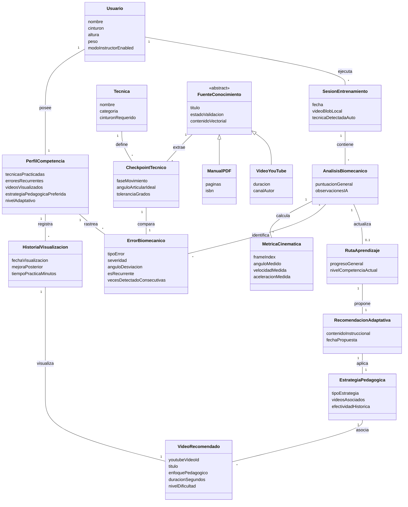

## **5.2 Especificación de Casos de Uso Principales**

### **Paso 1: Diagrama de Casos de Uso del Sistema**

El siguiente diagrama define los límites del sistema, relacionando los actores clave con los 11 casos de uso (CU) propuestos:

<a id="figura-2"></a>
**Figura 2**  
*Diagrama Global de Casos de Uso del Sistema*

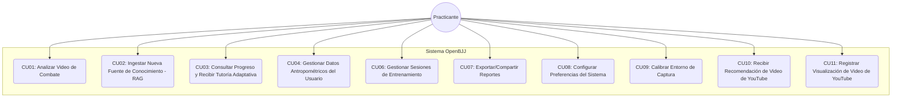

---

### **Paso 2: Redacción en Formato Larman**

#### **Casos de Uso Completamente Vestidos (Fully Dressed)**

---

### Caso de Uso CU01: Analizar Video de Combate

**Actor Principal:** Practicante

**Interesados y sus Intereses:**
* **Practicante:** Desea recibir retroalimentación cinemática rápida, precisa y objetiva de su sparring o drill sin sensores físicos invasivos sobre el tatami.
* **Instructor:** Desea que la app actúe como un validador de los patrones biomecánicos del dojo.
* **Sistema/IA:** Requiere datos cinemáticos depurados para estructurar la respuesta en JSON a través del backend del Servidor Local.

**Precondiciones:**
* Soporte WebGL activo en el dispositivo.
* Acceso a cámara o almacenamiento local concedido y funcional.
* El video grabado o subido para su análisis debe tener un tiempo máximo de duración de 45 segundos.

**Garantía de Éxito / Postcondiciones:**
* Los landmarks 3D son extraídos de forma local en el cliente web, la técnica es clasificada automáticamente, la base de datos vectorial de grounding (RAG) en el Servidor Local es consultada, el prompt dinámico es estructurado por el backend y la evaluación cinemática en JSON es devuelta y persistida localmente.

**Escenario Principal de Éxito (Flujo Básico):**
1. El Practicante graba o carga un video (máximo de 45 segundos de duración) de su combate o drill técnico.
2. El Sistema valida el límite de duración local y procesa el video mediante submuestreo de fotogramas clave.
3. El `MediaPipePoseAdapter` de visión computacional extrae los landmarks 3D $(x,y,z)$ locales en el cliente.
4. El controlador local calcula las métricas cinemáticas locales (ángulos críticos, velocidad de extremidades).
5. El Sistema envía un resumen visual (keyframes) al API Gateway del Servidor Local, el cual realiza una llamada interna a `GeminiServiceAdapter` para clasificar la técnica del video de manera autónoma (Autodetección Multimodal).
6. El Servidor Local (a través de Gemini) responde con el ID de la técnica y el identificador de la disciplina (ej. "Guardia Cerrada").
7. El `RetrievalAugmentedController` del cliente realiza una petición HTTP al API Gateway del Servidor Local, delegando en el `CentralVectorDBAdapter` la búsqueda de fragmentos semánticamente equivalentes en la base de datos vectorial centralizada para esa técnica.

**Extensiones (Flujos Alternativos):**
* **3.a. Fallo en estimación de landmarks (oclusión severa):**
  1. MediaPipe reporta una confianza media inferior a 0.5.
  2. El sistema alerta al Practicante y detiene el análisis sugiriendo mejor iluminación o encuadre.
* **6.a. Gemini no identifica la técnica:**
  1. Gemini devuelve "Técnica Desconocida / Estilo Libre".
  2. El sistema conmuta a un prompt de evaluación basado en principios universales de balance, postura y palanca.
* **6.b. Técnica Desconocida (Zero-Shot Discovery / Técnica D):**
  1. El sistema identifica que la técnica analizada no está registrada en el sistema (ej. "Técnica D").
  2. El Servidor Local (vía Gemini Vision) analiza detalladamente el video para generar una descripción semántica y biomecánica formal (ángulos, fases y posturas de la técnica).
  3. El Servidor Local crea automáticamente una nueva entidad `Tecnica` en la base de datos relacional y genera los embeddings vectoriales de su descripción para indexarla de inmediato en el Vector DB.
  4. Gracias a este aprendizaje colectivo, si mañana el Practicante G (o cualquier otro usuario) carga un video ejecutando la "Técnica D", el sistema la reconocerá en el paso 6 y podrá evaluarla con el RAG utilizando el registro recién creado.
* **9.a. Error de conexión de red:**
  1. El envío del prompt al Servidor Local falla.
  2. El sistema almacena localmente el resumen biomecánico numérico y programa la inferencia diferida para cuando se restablezca la conexión.

**Requisitos Especiales:**
* El video cargado o grabado debe tener un límite estricto de duración máxima de 45 segundos.
* El cálculo biomecánico y la renderización en el reproductor 3D deben ser fluidos (tasa de refresco superior a 15 FPS en WebGL).

**Lista de Variaciones de Tecnología y Datos:**
* Entrada de video en formato MP4, WebM o MOV.
* Inferencia de landmarks usando modelos MediaPipe Pose en WebAssembly (WASM).

**Frecuencia de Ocurrencia:**
* Alta - Múltiples veces al día por practicante activo para evaluar sus combates o drills técnicos.

**Problemas Abiertos:**
* Optimizar la precisión de estimación z de landmarks bajo kimonos holgados.


### Caso de Uso CU02: Ingestar Nueva Fuente de Conocimiento (RAG)

**Actor Principal:** Practicante

**Interesados y sus Intereses:**
* **Practicante:** Desea aportar material de estudio propio o de la comunidad (PDFs, manuales técnicos o videos explicativos de YouTube) para enriquecer el motor de grounding de la IA, sin necesidad de esperar aprobación humana manual.
* **Sistema/IA:** Requiere filtrar de manera autónoma contenido basura o de otros deportes para mantener la especialización técnica de grounding del sistema y evitar la contaminación del Vector DB.
* **Comunidad de la Academia:** Se beneficia de una base de datos de conocimiento técnico adaptativa y colaborativa en tiempo real (RAG Vivo).

**Precondiciones:**
* El usuario se encuentra conectado a internet y tiene acceso activo por red local/API al Servidor Local.
* El archivo PDF o la URL de YouTube están en un formato legible.

**Garantía de Éxito / Postcondiciones:**
* Si la IA clasifica positivamente la pertinencia, se crea una instancia de `FuenteConocimiento` con el estado "Aceptado", persistiendo sus chunks y embeddings en la base de datos centralizada del Servidor Local. Si es inválido, es rechazado y eliminado sin persistir ningún dato.

**Escenario Principal de Éxito (Flujo Básico):**
1. El Practicante selecciona la opción "Ingestar Fuente de Conocimiento" en el panel.
2. El Sistema presenta las opciones de carga: archivo PDF técnico o enlace de YouTube.
3. El Practicante carga un archivo PDF desde su dispositivo o pega una URL de YouTube.
4. El Sistema valida el formato básico y accesibilidad del archivo.
5. El Sistema (a través de `RetrievalAugmentedController`) extrae una muestra de texto o transcripción y la envía al API Gateway del Servidor Local.
6. El Servidor Local (a través de Gemini Service) evalúa la muestra y determina de forma autónoma que pertenece estrictamente al dominio de Brazilian Jiu-Jitsu (estado "Aceptado").
7. El Servidor Local segmenta la fuente en chunks de texto lógicos y genera sus correspondientes embeddings vectoriales.
8. El Servidor Local persiste los fragmentos y vectores en la base de datos vectorial centralizada con el estado "Aceptado", quedando disponible de forma inmediata para el motor RAG de todos los usuarios.
9. El Sistema en la PWA confirma al Practicante que el contenido fue validado y aceptado automáticamente.

**Extensiones (Flujos Alternativos):**
* **4.a. El archivo no es un PDF válido o la URL de YouTube es inaccesible:**
  1. El Sistema detecta la anomalía de formato.
  2. El Sistema muestra un mensaje de error y retorna al paso 3.
* **6.a. El motor de IA (Gemini) clasifica el contenido como Fuera de Dominio (ej. Boxeo, Cocina, etc.):**
  1. El Servidor Local identifica la clasificación negativa de la IA.
  2. El Servidor Local rechaza la ingesta y descarta el contenido sin almacenar ningún dato en la base de datos centralizada.
  3. El Sistema notifica al Practicante: "Contenido rechazado: El material no está relacionado con el Jiu-Jitsu".
  4. El caso de uso finaliza sin guardar ni persistir ningún dato en el Servidor Local.
* **7.a. Fallo de red en la comunicación con el Servidor Local:**
  1. El envío de chunks o embeddings al Servidor Local falla.
  2. El Sistema notifica al Practicante que la base de datos central no está disponible y sugiere reintentar.

**Requisitos Especiales:**
* El filtro autónomo de pertinencia de la IA debe responder en menos de 5 segundos.
* El Servidor Local debe indexar los embeddings en tiempo real para disponibilidad inmediata.

**Lista de Variaciones de Tecnología y Datos:**
* Carga de PDF a través de API multipart/form-data.
* Subtítulos de YouTube recuperados mediante API de transcripción externa.
* Protocolo HTTPS para la transferencia segura de documentos y metadatos.

**Frecuencia de Ocurrencia:**
* Baja a Media - Depende del dinamismo y aportes de la comunidad de la academia para enriquecer la base de conocimiento.

**Problemas Abiertos:**
* Manejo de transcripciones en idiomas diferentes al del dojo (requiere traducción o soporte multilingüe en tiempo real).


### Caso de Uso CU03: Consultar Progreso y Recibir Tutoría Adaptativa

**Actor Principal:** Practicante

**Interesados y sus Intereses:**
* **Practicante:** Desea comprender su evolución técnica a lo largo del tiempo y recibir orientaciones pedagógicas personalizadas que aborden sus errores recurrentes de forma específica.
* **Instructor:** Desea que el sistema identifique patrones de fallo persistentes en sus alumnos para intervenir de manera focalizada presencialmente.
* **Sistema/IA:** Requiere acceder al historial completo de `ErrorBiomecanico` y `PerfilCompetencia` (que rastrea el historial de intentos, videos vistos y la efectividad de las recomendaciones de video) para determinar si la estrategia pedagógica actual es efectiva o debe conmutarse.

**Precondiciones:**
* El Practicante ha realizado al menos una sesión de análisis biomecánico (CU01) cuyos resultados están persistidos en la base de datos centralizada del Servidor Local.
* Existe una instancia de `PerfilCompetencia` inicializada para el usuario.

**Garantía de Éxito / Postcondiciones:**
* Se calcula la evolución cinemática histórica del Practicante, se evalúa la recurrencia de desviaciones y se actualiza el plan pedagógico en `RutaAprendizaje`, sugiriendo drills o videos de YouTube alternativos si no se detectó mejoría cinemática.

**Escenario Principal de Éxito (Flujo Básico):**
1. El Practicante navega a la sección "Progreso y Ruta de Aprendizaje" en la PWA.
2. El Sistema carga el `PerfilCompetencia` del usuario desde la base de datos centralizada del Servidor Local.
3. El `AdaptationController` consulta el historial de `ErrorBiomecanico` y la efectividad de las tutorías pasadas asociadas al Practicante.
4. El Sistema procesa la frecuencia de las desviaciones y detecta errores recurrentes donde `vecesDetectadoConsecutivas > 3`.
5. El Sistema evalúa si la estrategia pedagógica actual ha producido mejoría cinemática comparando las métricas de las últimas tres sesiones.
6. Si no hay mejoría cinemática (el practicante vio el video sugerido, volvió a grabar la técnica y el error biomecánico persiste), el Sistema activa el cambio de estrategia instruccional: es lo suficientemente inteligente para cambiar la estrategia pedagógica, sugiriendo un video de YouTube alternativo (que muestre la técnica desde otro ángulo, de otra academia, o en cámara lenta) o bien un drill físico de aislamiento diseñado para corregir la biomecánica de la articulación afectada.
7. El Sistema actualiza la entidad `RutaAprendizaje` y genera los reportes cinemáticos gráficos.
8. El Sistema despliega la ruta de aprendizaje personalizada, incluyendo los enlaces de YouTube actualizados y los drills anatómicos recomendados.

**Extensiones (Flujos Alternativos):**
* **3.a. No existe historial de análisis previo:**
  1. El Sistema detecta que `PerfilCompetencia` no contiene entradas de `ErrorBiomecanico`.
  2. El Sistema muestra un mensaje indicando que aún no hay datos de progreso e invita al Practicante a realizar su primer análisis (CU01).
* **5.a. El usuario ha mostrado mejoría cinemática en las últimas tres sesiones:**
  1. El Sistema determina que las desviaciones se han reducido por debajo del umbral de $15^{\circ}$.
  2. El Sistema mantiene la estrategia pedagógica y felicita al Practicante.
  3. El flujo continúa al paso 7.

**Requisitos Especiales:**
* La comparación cinemática de recurrencia de errores debe aplicarse estrictamente a la misma técnica para evitar falsos positivos.

**Lista de Variaciones de Tecnología y Datos:**
* Visualización de datos usando SVG responsivos o gráficos dinámicos basados en Chart.js.
* Formatos de salida JSON para persistir las estrategias recomendadas en el perfil local.

**Frecuencia de Ocurrencia:**
* Alta - Cada vez que el Practicante consulta su perfil en la PWA para comprobar su avance y ajustar sus entrenamientos.

**Problemas Abiertos:**
* Definir umbrales dinámicos de normalización para personas de complexión asimétrica y optimizar el cálculo adaptativo en el cliente móvil.


### Caso de Uso CU04: Gestionar Datos Antropométricos del Usuario

**Actor Principal:** Practicante

**Interesados y sus Intereses:**
* **Practicante:** Desea que las métricas biomecánicas calculadas por el Sistema estén normalizadas según su complexidad física (altura, peso) para recibir evaluaciones justas y comparables a lo largo del tiempo.
* **Sistema/IA:** Requiere datos antropométricos actualizados para escalar correctamente los umbrales de tolerancia angular y las velocidades articulares esperadas.
* **Instructor:** Desea que los reportes de sus alumnos utilicen métricas ajustadas antropométricamente para evaluar con precisión el esfuerzo articular en relación a la estatura y peso de cada alumno.

**Precondiciones:**
* El usuario ha creado un perfil de Practicante en la aplicación y su instancia de `Usuario` existe en la base de datos centralizada del Servidor Local.

**Garantía de Éxito / Postcondiciones:**
* Se modificó la instancia de `Usuario` asociada al Practicante, actualizando los atributos `altura` y `peso` con los nuevos valores numéricos validados, quedando disponibles de inmediato para el siguiente análisis biomecánico (CU01).

**Escenario Principal de Éxito (Flujo Básico):**
1. El Practicante navega a la sección "Ajustes de Perfil" desde el menú principal.
2. El Sistema carga los datos antropométricos actuales del objeto `Usuario` desde la base de datos centralizada del Servidor Local y los presenta en un formulario editable.
3. El Practicante ingresa o modifica su altura (en cm) y peso (en kg).
4. El Sistema valida que los valores se encuentren dentro de rangos numéricos aceptables (altura: 100-220 cm, peso: 30-200 kg).
5. El Sistema persiste los nuevos valores en la instancia de `Usuario` en la base de datos centralizada del Servidor Local.
6. El Sistema confirma al Practicante que sus datos fueron actualizados correctamente.

**Extensiones (Flujos Alternativos):**
* **4.a. Los valores ingresados están fuera de rango:**
  1. El Sistema detecta que la altura o el peso no se encuentran dentro de los rangos aceptables.
  2. El Sistema resalta el campo inválido con un mensaje de error específico.
  3. El flujo retorna al paso 3.
* **5.a. Error de escritura en la base de datos centralizada:**
  1. El Sistema no puede persistir los datos por un fallo de red o almacenamiento en el Servidor Local.
  2. El Sistema notifica al Practicante que no se pudieron guardar los cambios y sugiere reintentar.

**Requisitos Especiales:**
* Los datos antropométricos se almacenan de forma segura en la base de datos centralizada del Servidor Local y no se transmiten a nubes comerciales de terceros.
* El formulario debe incluir indicadores de unidad de medida (cm, kg) claros para evitar confusión del usuario.

**Lista de Variaciones de Tecnología y Datos:**
* Ingreso de datos antropométricos manuales por el usuario.
* Soporte para selección de unidades imperiales (pulgadas/libras) con conversión automática.

**Frecuencia de Ocurrencia:**
* Baja - Ocasionalmente ante cambios físicos significativos o durante el registro inicial del practicante.

**Problemas Abiertos:**
* Manejar la conversión dinámica si el usuario cambia el sistema de unidades del perfil (métrico/imperial) sin introducir ruido en el historial biomecánico acumulado.


### Caso de Uso CU06: Gestionar Sesiones de Entrenamiento

**Actor Principal:** Practicante

**Interesados y sus Intereses:**
* **Practicante:** Desea organizar su historial de entrenamientos, eliminando videos obsoletos o clasificando sesiones por fecha, técnica o nivel de intensidad para facilitar la consulta retrospectiva de su progreso.
* **Sistema/IA:** Requiere mantener la base de datos centralizada optimizada, eliminando registros que el usuario ya no considera relevantes para mejorar el rendimiento de las consultas.
* **Instructor:** Desea que sus alumnos mantengan un registro ordenado y etiquetado para revisar la asistencia y el volumen de drills técnicos realizados en el tatami.

**Precondiciones:**
* El Practicante ha realizado al menos una sesión de entrenamiento (CU01) que está almacenada como instancia de `SesionEntrenamiento` en la base de datos centralizada del Servidor Local.

**Garantía de Éxito / Postcondiciones:**
* Se modificó, eliminó o reclasificó al menos una instancia de `SesionEntrenamiento` en el historial de la base de datos centralizada del Servidor Local.

**Escenario Principal de Éxito (Flujo Básico):**
1. El Practicante navega a la sección "Historial de Entrenamientos" desde el panel principal.
2. El Sistema carga todas las instancias de `SesionEntrenamiento` asociadas al perfil del Practicante desde la base de datos centralizada del Servidor Local.
3. El Sistema despliega la lista de sesiones ordenadas cronológicamente, mostrando metadatos resumidos (fecha, técnica detectada, puntuación táctica).
4. El Practicante selecciona una sesión específica para gestionar.
5. El Sistema presenta las opciones disponibles: ver detalle, renombrar, clasificar por etiqueta o eliminar.
6. El Practicante selecciona la operación deseada y confirma la acción.
7. El Sistema ejecuta la operación CRUD correspondiente sobre la instancia de `SesionEntrenamiento` en la base de datos centralizada del Servidor Local.
8. El Sistema confirma al Practicante que la operación se completó exitosamente y actualiza la vista del historial.

**Extensiones (Flujos Alternativos):**
* **3.a. No existen sesiones de entrenamiento registradas:**
  1. El Sistema detecta que la base de datos centralizada no contiene instancias de `SesionEntrenamiento` para este usuario.
  2. El Sistema muestra un mensaje invitando al Practicante a realizar su primer análisis (CU01).
* **6.a. El Practicante selecciona eliminar una sesión:**
  1. El Sistema muestra un diálogo de confirmación advirtiendo que la acción es irreversible.
  2. Si el Practicante confirma, el Sistema elimina la instancia de `SesionEntrenamiento` y sus entidades asociadas (`AnalisisBiomecanico`, `MetricaCinematica`) de la base de datos centralizada del Servidor Local.
  3. Si el Practicante cancela, el flujo retorna al paso 5.
* **7.a. Error de escritura en la base de datos centralizada durante la operación:**
  1. El Sistema falla al persistir la operación CRUD.
  2. El Sistema notifica al Practicante que no se pudo completar la acción y sugiere reintentar.

**Requisitos Especiales:**
* La lista de sesiones debe soportar filtrado por rango de fechas, técnica y etiqueta para facilitar la navegación en historiales extensos.
* La eliminación de sesiones debe ser lógica (marcado como eliminado) o física en la base de datos centralizada, garantizando que los datos eliminados no sean recuperables por consultas semánticas futuras.

**Lista de Variaciones de Tecnología y Datos:**
* Visualización móvil optimizada para interacción táctil rápida.
* Exportación de metadatos de sesión en formato CSV o JSON.

**Frecuencia de Ocurrencia:**
* Media - Al final de cada semana o mes de entrenamiento para depurar videos y organizar la base de datos local.

**Problemas Abiertos:**
* Optimizar la velocidad de carga de miniaturas de esqueleto 3D para dispositivos de baja gama.


### Caso de Uso CU07: Exportar/Compartir Reportes

**Actor Principal:** Practicante

**Interesados y sus Intereses:**
* **Practicante:** Desea generar un archivo portable (PDF o imagen) del reporte de análisis biomecánico para compartirlo con su instructor, documentar su progreso o archivarlo externamente a la aplicación.
* **Instructor:** Se beneficia al recibir reportes estructurados de sus alumnos que facilitan la preparación de sesiones de corrección personalizada.
* **Sistema/IA:** Requiere componer una representación visual del esqueleto 3D superpuesto al video frame clave junto con la puntuación táctica y las desviaciones detectadas en un formato exportable.

**Precondiciones:**
* Existe al menos una instancia de `AnalisisBiomecanico` completada con resultados de Gemini persistidos en la base de datos centralizada del Servidor Local para la sesión seleccionada.

**Garantía de Éxito / Postcondiciones:**
* Se generó un archivo exportable (PDF o imagen) que contiene el esqueleto 3D superpuesto, las métricas cinemáticas, la puntuación táctica y las recomendaciones de corrección, el cual fue descargado al dispositivo o compartido.

**Escenario Principal de Éxito (Flujo Básico):**
1. El Practicante selecciona una sesión de análisis completada desde su historial de entrenamientos.
2. El Sistema despliega el detalle del análisis con las métricas cinemáticas y la evaluación de Gemini.
3. El Practicante selecciona la opción "Exportar Reporte".
4. El Sistema presenta las opciones de formato: PDF o imagen PNG.
5. El Practicante selecciona el formato deseado.
6. El Sistema compone el reporte renderizando el esqueleto 3D superpuesto al frame clave del video, las métricas cinemáticas calculadas, la puntuación táctica y las desviaciones angulares detectadas.
7. El Sistema genera el archivo en el formato seleccionado y lo descarga al dispositivo del Practicante.
8. El Sistema ofrece la opción de compartir el archivo directamente mediante la Web Share API.

**Extensiones (Flujos Alternativos):**
* **4.a. El navegador no soporta Web Share API:**
  1. El Sistema detecta que el dispositivo no soporta compartir nativamente.
  2. El Sistema omite la opción de compartir y solo ofrece la descarga del archivo.
* **6.a. Error al renderizar el esqueleto 3D para exportación:**
  1. El Sistema falla al capturar el frame del WebGL Renderer.
  2. El Sistema genera el reporte sin la imagen del esqueleto 3D, incluyendo únicamente las métricas numéricas y el texto de evaluación.
  3. El Sistema notifica al Practicante que la visualización 3D no pudo incluirse.
* **7.a. Error de descarga por almacenamiento insuficiente:**
  1. El dispositivo no tiene espacio suficiente para guardar el archivo generado.
  2. El Sistema notifica al Practicante y sugiere liberar espacio antes de reintentar.

**Requisitos Especiales:**
* El reporte PDF debe incluir la fecha, hora y duración del análisis, así como el nivel de graduación del Practicante para contextualizar la evaluación.
* La generación del archivo debe completarse en menos de 10 segundos en un dispositivo móvil de gama media.

**Lista de Variaciones de Tecnología y Datos:**
* Exportación en formato PDF o imagen PNG.
* Compartir por mensajería a través de Web Share API nativa o enlaces temporales.

**Frecuencia de Ocurrencia:**
* Media - Cada vez que un alumno quiere mostrar avances relevantes o consultar al profesor de forma remota.

**Problemas Abiertos:**
* Permitir a los profesores agregar comentarios de texto anotados directamente sobre el PDF exportado antes de su almacenamiento definitivo.


### Caso de Uso CU08: Configurar Preferencias del Sistema

**Actor Principal:** Practicante

**Interesados y sus Intereses:**
* **Practicante:** Desea personalizar la experiencia de uso de la PWA según sus necesidades individuales, como el idioma de retroalimentación de la IA, el nivel de zoom del esqueleto 3D y el sistema métrico para la estimación física.
* **Sistema/IA:** Requiere conocer las preferencias del usuario para adaptar la presentación de resultados, el idioma de los prompts enviados a Gemini y la escala de visualización del renderer 3D.
* **Instructor:** Desea que los reportes de sus alumnos utilicen métricas alineadas con las unidades oficiales de la federación.

**Precondiciones:**
* El Practicante tiene un perfil activo en la aplicación con una instancia de `Usuario` persistida en la base de datos centralizada del Servidor Local.

**Garantía de Éxito / Postcondiciones:**
* Se modificaron las preferencias de configuración del Practicante en su perfil centralizado y se aplicaron de forma inmediata a la interfaz y comportamiento del Sistema.

**Escenario Principal de Éxito (Flujo Básico):**
1. El Practicante navega a la sección "Configuración" desde el menú principal.
2. El Sistema carga las preferencias actuales del Practicante desde la base de datos centralizada del Servidor Local y las presenta en un formulario con las opciones disponibles.
3. El Practicante modifica una o más preferencias: idioma de retroalimentación de la IA (ej. español, inglés, portugués), nivel de zoom predeterminado del esqueleto 3D, sistema métrico (métrico/imperial).
4. El Sistema valida que las selecciones sean opciones soportadas.
5. El Sistema persiste las nuevas preferencias en el perfil del Practicante en la base de datos centralizada del Servidor Local.
6. El Sistema aplica los cambios inmediatamente a la interfaz activa y confirma al Practicante que la configuración fue actualizada.

**Extensiones (Flujos Alternativos):**
* **4.a. El Practicante selecciona una opción no soportada:**
  1. El Sistema detecta una preferencia inválida (posible manipulación del DOM).
  2. El Sistema rechaza el cambio y restaura el valor anterior, mostrando un mensaje de error.
* **5.a. Error de escritura en la base de datos centralizada:**
  1. El Sistema no puede persistir las preferencias por un fallo de comunicación con el Servidor Local.
  2. El Sistema notifica al Practicante y mantiene las preferencias anteriores activas hasta que la operación se complete.

**Requisitos Especiales:**
* Las preferencias de idioma deben afectar tanto la interfaz de usuario como el idioma del prompt enviado a la API de Gemini para la generación de retroalimentación en lenguaje natural.
* El cambio de sistema métrico debe recalcular y redimensionar las visualizaciones numéricas existentes sin alterar los datos cinemáticos crudos almacenados.

**Lista de Variaciones de Tecnología y Datos:**
* Idiomas soportados: Español, Inglés y Portugués.
* Persistencia local en localStorage del navegador y sincronización en la base de datos.

**Frecuencia de Ocurrencia:**
* Muy Baja - Generalmente configurado una sola vez durante el primer inicio o registro en la aplicación.

**Problemas Abiertos:**
* Sincronizar preferencias del usuario entre múltiples dispositivos utilizando almacenamiento local temporal (localStorage) y base de datos centralizada de manera consistente.


### Caso de Uso CU09: Calibrar Entorno de Captura

**Actor Principal:** Practicante

**Interesados y sus Intereses:**
* **Practicante:** Desea asegurarse de que las condiciones de iluminación, encuadre y distancia de la cámara sean óptimas antes de iniciar un análisis biomecánico, maximizando la precisión de la estimación de landmarks 3D.
* **Sistema/IA:** Requiere que el video de entrada cumpla con condiciones mínimas de calidad visual para que MediaPipe pueda extraer landmarks con un nivel de confianza suficiente (media > 0.5).
* **Instructor:** Desea asegurar que las métricas cinemáticas recogidas en casa o el tatami secundario tengan la misma fidelidad que las grabadas en el dojo central.

**Precondiciones:**
* El dispositivo del Practicante cuenta con una cámara funcional accesible desde el navegador (permiso de cámara concedido).
* El soporte WebGL está activo para la ejecución de MediaPipe.

**Garantía de Éxito / Postcondiciones:**
* El Sistema evalúa las condiciones (iluminación, encuadre, distancia) en memoria volátil sin guardar video, confirmando su idoneidad para un análisis biomecánico preciso.

**Escenario Principal de Éxito (Flujo Básico):**
1. El Practicante selecciona la opción "Calibrar Entorno de Captura" desde el panel principal.
2. El Sistema activa la cámara del dispositivo y muestra una vista en tiempo real con superposiciones de guía visual (zonas de encuadre, indicador de iluminación).
3. El Sistema ejecuta un análisis preliminar con MediaPipe para detectar la presencia del cuerpo completo del Practicante en el encuadre.
4. El Sistema evalúa el nivel de iluminación del fondo y la nitidez de la imagen capturada.
5. El Sistema verifica que todas las articulaciones clave (hombros, codos, caderas, rodillas, tobillos) sean detectables con un nivel de confianza aceptable.
6. El Sistema muestra un indicador de estado (verde/amarillo/rojo) para cada condición evaluada: encuadre, iluminación, detección corporal.
7. Si todas las condiciones son adecuadas, el Sistema confirma al Practicante que el entorno está calibrado y listo para grabar.

**Extensiones (Flujos Alternativos):**
* **3.a. MediaPipe no detecta un cuerpo completo en el encuadre:**
  1. El Sistema identifica que partes del cuerpo (ej. pies o cabeza) están fuera del campo visual.
  2. El Sistema muestra una superposición visual indicando la zona donde el Practicante debe posicionarse.
  3. El Practicante ajusta su posición y el Sistema reintenta la detección.
* **4.a. La iluminación es insuficiente:**
  1. El Sistema detecta que el nivel de luz de fondo está por debajo del umbral mínimo para una estimación precisa.
  2. El Sistema muestra una alerta: "Iluminación insuficiente. Acérquese a una fuente de luz o encienda una lámpara frontal."
  3. El Practicante ajusta la iluminación y el Sistema reintenta la evaluación.
* **4.b. La iluminación es excesiva (sobreexposición):**
  1. El Sistema detecta que la imagen está sobreexpuesta, lo que reduce el contraste de las articulaciones.
  2. El Sistema sugiere reducir la intensidad de la luz o cambiar el ángulo de la cámara.
* **5.a. Confianza de detección inferior al umbral mínimo:**
  1. El Sistema detecta que las articulaciones clave tienen un nivel de confianza medio inferior a 0.5.
  2. El Sistema sugiere alejar la cámara, usar ropa de contraste con el fondo o eliminar obstáculos visuales.

**Requisitos Especiales:**
* La calibración debe completarse en menos de 15 segundos para no interrumpir significativamente la rutina de entrenamiento del Practicante.
* Las guías visuales de superposición deben ser claras y visibles incluso en pantallas móviles pequeñas (mínimo 320px de ancho).
* La cámara NO debe grabar ni almacenar video durante la calibración; solo se procesan frames en memoria volátil para la evaluación de condiciones.

**Lista de Variaciones de Tecnología y Datos:**
* Cámara delantera o trasera en dispositivos móviles, webcam en ordenadores de escritorio.
* Inferencia MediaPipe Pose sobre WebAssembly (WASM).

**Frecuencia de Ocurrencia:**
* Alta - Se ejecuta antes de iniciar una sesión en nuevos tatamis o con iluminación variable.

**Problemas Abiertos:**
* Implementar alertas hápticas o de voz ante cambios de estado de calibración para que el practicante no tenga que ver la pantalla mientras se posiciona.


### Caso de Uso CU10: Recibir Recomendación de Video de YouTube

**Actor Principal:** Practicante

**Interesados y sus Intereses:**
* **Practicante:** Desea un enlace preciso a un video de YouTube que lo guíe a corregir el error biomecánico detectado en su sparring.
* **Servidor Local (IA):** Desea realizar un seguimiento de los videos consumidos por el usuario y evaluar su efectividad biomecánica en los siguientes intentos.
* **Instructor:** Desea que las recomendaciones didácticas de video sean coherentes con la escuela de Brazilian Jiu-Jitsu para no confundir a los practicantes con metodologías de otras academias.

**Precondiciones:**
* Se ha finalizado un análisis biomecánico con detección de desviaciones técnicas.

**Garantía de Éxito / Postcondiciones:**
* El usuario recibe una recomendación de video de YouTube (deep link) adaptada y el intento de tutoría se registra en `HistorialVisualizacion` de su `PerfilCompetencia` para su posterior evaluación cinemática.

**Escenario Principal de Éxito (Flujo Básico):**
1. El Practicante finaliza un análisis de video donde se identificó un `ErrorBiomecanico`.
2. El `AdaptationController` busca en la base de datos centralizada del Servidor Local videos instructivos para la técnica y el error específico.
3. El controlador contrasta los videos disponibles contra el `HistorialVisualizacion` del usuario y su recurrencia de fallos.
4. Si el usuario ya vio el video técnico estándar pero ha fallado más de 3 veces consecutivas en la misma articulación, el sistema marca el video como "Visto sin mejora".
5. El sistema detecta mediante el PerfilCompetencia que no hubo mejora cinemática tras ver el video anterior; conmuta de estrategia pedagógica y recomienda un video de YouTube alternativo (por ejemplo, con otro ángulo de cámara, de una academia diferente, o reproducido a cámara lenta) o bien un drill físico de aislamiento diseñado para corregir la biomecánica de la articulación afectada.
6. El sistema muestra la tarjeta de YouTube con redirección directa (deep link).
7. El Practicante hace clic en el enlace, abriendo YouTube externamente.
8. El Practicante confirma su visualización y la app registra el consumo en su historial en el Servidor Local.

**Extensiones (Flujos Alternativos):**
* **2.a. No existen videos tutoriales en el Servidor Local para esa técnica:**
  1. El sistema emite un aviso para realizar una búsqueda semántica de fallback en el corpus o indica que se requiere drill físico.
* **8.a. El Practicante no confirma la visualización:**
  1. El Sistema guarda la recomendación como pendiente y se validará en la próxima sesión cinemática.

**Requisitos Especiales:**
* El enlace debe estar en formato universal de YouTube compatible con la app móvil.

**Lista de Variaciones de Tecnología y Datos:**
* Shorts de YouTube y videos estándar de YouTube de alta resolución.
* Protocolo HTTPS y deep linking nativo.

**Frecuencia de Ocurrencia:**
* Muy Alta - En cada reporte con desviaciones biomecánicas de los practicantes.

**Problemas Abiertos:**
* Establecer la efectividad relativa de videos explicativos en cámara lenta frente a videos con diferente perspectiva.


---

## **5.3 Diagramas de Secuencia del Sistema (DSS)**

Los diagramas describen el comportamiento del sistema como caja negra, capturando las operaciones de entrada/salida para los flujos principales.

### **DSS-CU01: Realizar Análisis Biomecánico y Autodetección**

<a id="figura-3"></a>
**Figura 3**  
*DSS-CU01: Flujo Completo de Análisis Biomecánico y Autodetección*


### **DSS-CU02: Ingestar Nueva Fuente de Conocimiento (RAG)**

<a id="figura-4"></a>
**Figura 4**  
*DSS-CU02: Flujo de Ingesta y Vectorización RAG*

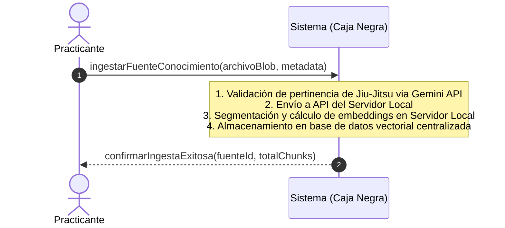

### **DSS-CU03: Consultar Progreso y Tutoría Adaptativa**

<a id="figura-5"></a>
**Figura 5**  
*DSS-CU03: Flujo de Consulta de Progreso y Tutoría Adaptativa*

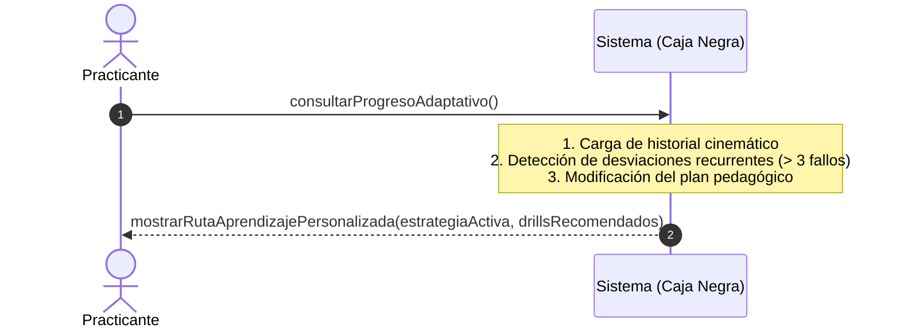

### **DSS-CU10: Recibir Recomendación de Video de YouTube**

<a id="figura-6"></a>
**Figura 6**  
*DSS-CU10: Flujo de Recomendación y Adaptación de Videos de YouTube*

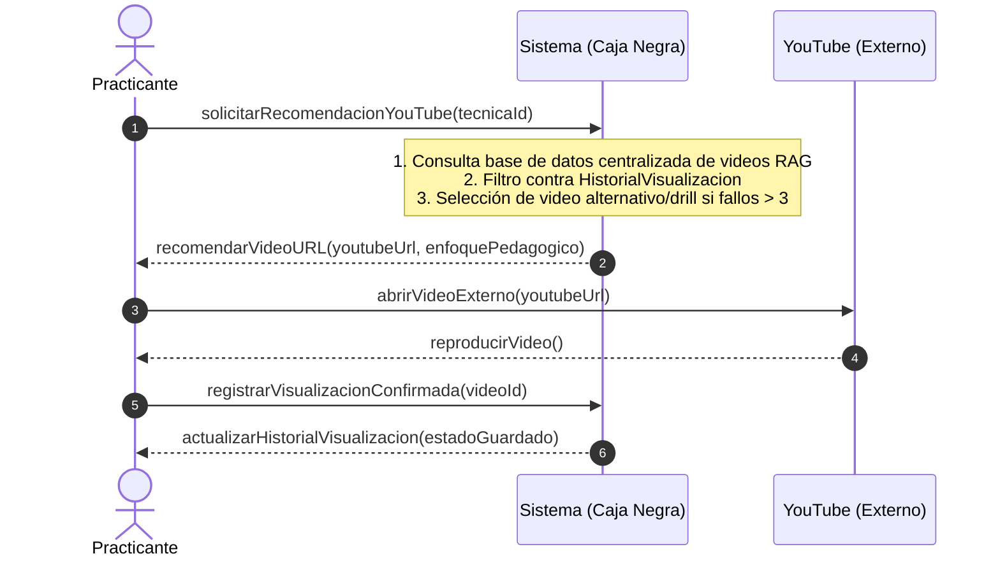

---

## **5.4 Contratos de las Operaciones del Sistema**

### **Contrato CO01: `analizarVideo`**
*   **Operación:** `analizarVideo(videoBlob: Blob): AnalisisReporte`
*   **Referencias Cruzadas:** Caso de Uso CU01 (Analizar Video de Combate).
*   **Precondiciones:**
    *   La GPU tiene soporte WebGL habilitado y el tamaño del archivo no excede 50MB (duración < 45 segundos).
*   **Postcondiciones:**
    *   Se creó una instancia `s` de la entidad `SesionEntrenamiento`.
    *   `s.fecha` se modificó a la fecha actual del sistema.
    *   `s.videoBlobLocal` se modificó al archivo cargado.
    *   Se crearon múltiples instancias de `MetricaCinematica` y se asociaron a `s`.
    *   Se asoció una instancia de la entidad `Tecnica` a `s`.
    *   Se creó una instancia `ab` de `AnalisisBiomecanico` y se asoció a `s`.

---

### **Contrato CO02: `ingestarFuenteConocimiento`**
*   **Operación:** `ingestarFuenteConocimiento(archivo: Blob, metadata: Metadata): void`
*   **Referencias Cruzadas:** Caso de Uso CU02.
*   **Precondiciones:**
    *   El usuario se encuentra conectado a internet y tiene comunicación activa con la API del Servidor Local.
*   **Postcondiciones:**
    *   Si el análisis de pertinencia de IA clasifica la fuente como Jiu-Jitsu (estado "Aceptado"):
        *   Se creó una instancia `fc` de `FuenteConocimiento` (o de sus subclases `ManualPDF` o `VideoYouTube`).
        *   Los atributos de `fc` se modificaron con los valores del archivo y de `metadata`, y su `estadoValidacion` se modificó a "Aceptado".
        *   Se asoció `fc` a la colección de fuentes de la base de datos centralizada en el servidor principal.
    *   Si el análisis de pertinencia de IA clasifica la fuente como fuera de dominio (estado "Rechazado"):
        *   No se crearon ni asociaron nuevas instancias de `FuenteConocimiento` en la base de datos centralizada.

---

### **Contrato CO03: `consultarProgresoAdaptativo`**
*   **Operación:** `consultarProgresoAdaptativo(usuarioId: UUID): RutaAprendizaje`
*   **Referencias Cruzadas:** Caso de Uso CU03 y CU10.
*   **Precondiciones:**
    *   Existe un `PerfilCompetencia` inicializado para el `usuarioId`.
*   **Postcondiciones:**
    *   Para cada `ErrorBiomecanico` cuya cantidad de `vecesDetectadoConsecutivas` superó el umbral de 3, su atributo `esRecurrente` se modificó a `true`.
    *   Los atributos de la entidad `RutaAprendizaje` asociada al perfil del usuario se modificaron de acuerdo a la nueva estrategia didáctica.

---

### **Contrato CO04: `actualizarDatosUsuario`**
*   **Operación:** `actualizarDatosUsuario(usuarioId: UUID, datos: PerfilDatos): void`
*   **Referencias Cruzadas:** Caso de Uso CU04.
*   **Precondiciones:**
    *   `usuarioId` existe en el almacenamiento local.
*   **Postcondiciones:**
    *   Se modificó la instancia de `Usuario` asociada al `usuarioId`.
    *   `Usuario.altura` y `Usuario.peso` se guardaron con los nuevos valores numéricos provistos en `datos`.

---

## **5.5 Diseño de la Arquitectura Lógica (Patrón Capas)**

El sistema se estructura bajo el patrón de arquitectura lógica por capas, aislando los elementos de interacción gráfica del dominio de cálculo cinemático y servicios de bajo nivel:

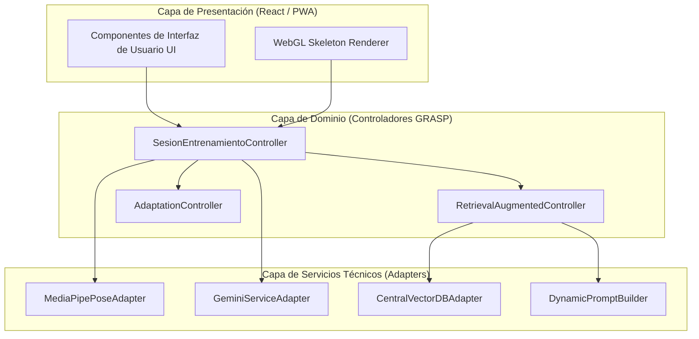

La asignación de responsabilidades de las capas lógicas se detalla a continuación:

<a id="tabla-3"></a>
**Tabla 3**  
*Responsabilidades por Capa de la Arquitectura Lógica*

| Capa | Responsabilidad Primaria | Componentes Clave |
| :--- | :--- | :--- |
| **Presentación** | Capturar los eventos del usuario, renderizar el reproductor de video con el esqueleto 3D superpuesto y gestionar los botones táctiles y el temporizador inicial. | `HistoryView`, `PoseAnimator`, `DojoDashboard` |
| **Dominio** | Coordinar los flujos del caso de uso, invocar las operaciones cinemáticas, evaluar la recurrencia de errores y decidir el plan de adaptación pedagógica. | `SesionEntrenamientoController`, `RetrievalAugmentedController`, `AdaptationController` |
| **Servicios Técnicos** | Proveer adaptadores especializados de bajo nivel que aíslan las APIs externas del motor del navegador. | `MediaPipePoseAdapter`, `GeminiServiceAdapter`, `CentralVectorDBAdapter`, `DynamicPromptBuilder` |

---

## **5.6 Realización del Caso de Uso con Patrones GRASP**

La realización de los casos de uso demuestra cómo interactúan las clases de diseño asignando responsabilidades según los patrones GRASP de Larman. A continuación, se detallan los diagramas de secuencia de diseño (DSD) para el flujo principal de análisis (CU01), la ingesta y validación de conocimiento (CU02) y la lógica de tutoría adaptativa (CU03), sirviendo estos últimos como ejemplos de aplicación de patrones en escenarios complejos (RAG y Adaptación).

### **Paso 1: Diagrama de Secuencia de Diseño (DSD) para CU01**

El siguiente diagrama detalla cómo se comunican las clases de diseño para el análisis biomecánico en el CU01:

<a id="figura-7"></a>
**Figura 7**  
*Diagrama de Secuencia de Diseño (Realización de CU01)*

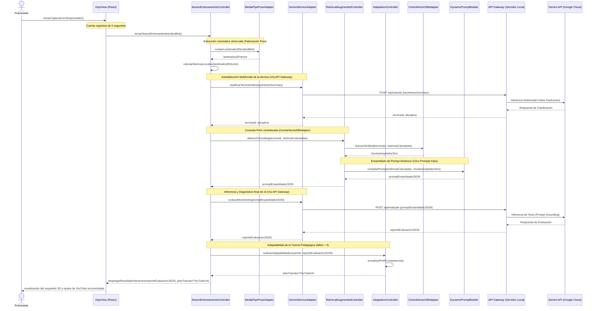

---

### **Paso 2: Diagrama de Secuencia de Diseño (DSD) para CU02**

El siguiente diagrama ilustra la colaboración entre clases para la validación, segmentación e indexación de nuevas fuentes de conocimiento en el motor RAG:

<a id="figura-11"></a>
**Figura 11**  
*Diagrama de Secuencia de Diseño (Realización de CU02)*

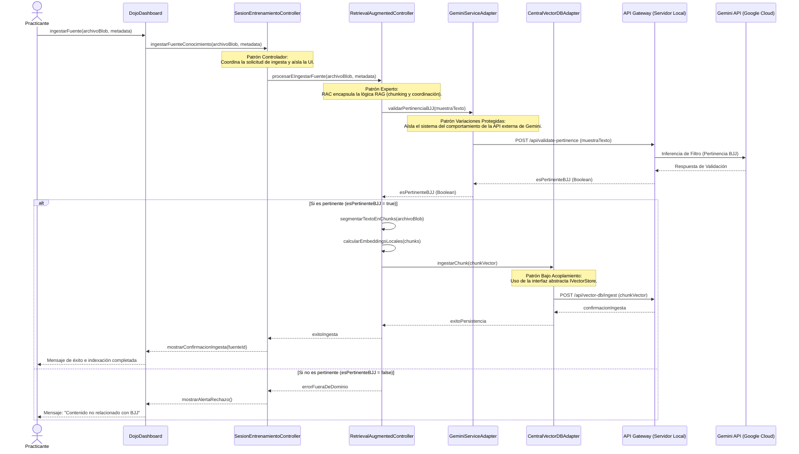

---

### **Paso 3: Diagrama de Secuencia de Diseño (DSD) para CU03**

El siguiente diagrama detalla la interacción dinámica para analizar el rendimiento del alumno, evaluar la persistencia de fallos cinemáticos y recalibrar adaptativamente su plan pedagógico:

<a id="figura-12"></a>
**Figura 12**  
*Diagrama de Secuencia de Diseño (Realización de CU03)*

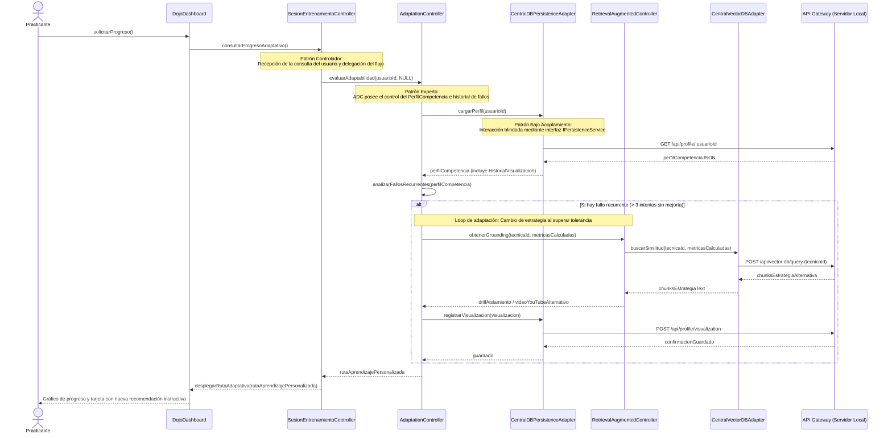

---

### **Paso 4: Justificación del Diseño basada en Patrones GRASP**

La asignación de responsabilidades del diseño dinámico expuesto se fundamenta en los patrones GRASP de Craig Larman:

<a id="tabla-4"></a>
**Tabla 4**  
*Justificación de Decisiones de Diseño Basadas en Patrones GRASP*

| Patrón GRASP | Componente / Decisión de Diseño | Justificación Académica (Larman) |
| :--- | :--- | :--- |
| **Controlador** | `SesionEntrenamientoController` | Es un objeto que no maneja la interfaz gráfica directa, encargado de recibir los eventos del sistema y coordinar el flujo biomecánico y de IA. |
| **Experto en Información** | `AdaptationController` | Posee el acceso directo a las entidades de `PerfilCompetencia` e `HistorialVisualizacion`, resultando idóneo para estimar los fallos recurrentes y readaptar la ruta de estudio. |
| **Fabricación Pura** | `MediaPipePoseAdapter`, `DynamicPromptBuilder` | Clases construidas artificialmente para aislar al dominio de detalles de bajo nivel (cálculo de pose en WebAssembly y parseo del prompt de Gemini) maximizando la cohesión. |
| **Bajo Acoplamiento** | Inyección de interfaces (`IPoseEstimator`, `IVectorStore`) | Los controladores de dominio interactúan con interfaces abstractas y no con implementaciones concretas, blindando el sistema ante cambios tecnológicos de las APIs. |
| **Variaciones Protegidas** | `GeminiServiceAdapter` | Protege al núcleo de dominio de las variaciones de la API externa de Gemini, encapsulando las peticiones serializadas en formato JSON que se envían de forma segura a través del API Gateway del Servidor Local. |

---

## **5.7 Diagrama de Estados para el Controlador**

La máquina de estados del objeto `SesionEntrenamientoController` coordina el ciclo de vida del análisis y el motor pedagógico cuando se identifican desviaciones técnicas:

<a id="figura-8"></a>
**Figura 8**  
*Máquina de Estados de SesionEntrenamientoController*

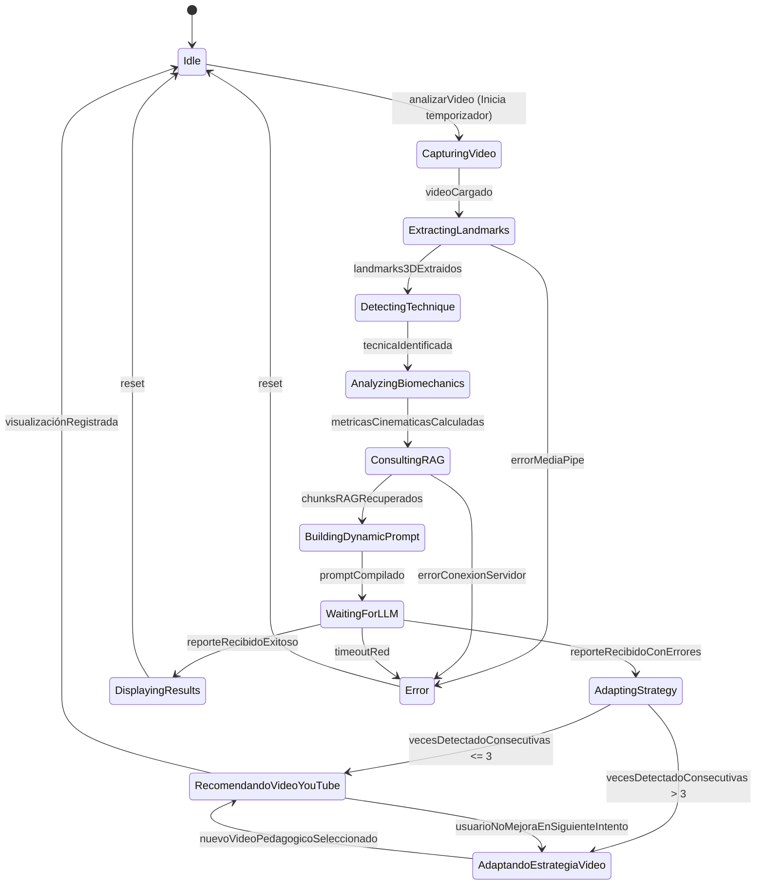

---

## **5.8 Diagrama de Clases de Diseño (DCD)**

El diagrama de clases estático detalla los tipos de datos, visibilidad de atributos y la inyección de dependencias para aislar el núcleo del software:

<a id="figura-9"></a>
**Figura 9**  
*Diagrama de Clases de Diseño (DCD)*

```mermaid
classDiagram
    IPoseEstimator <|.. MediaPipePoseAdapter
    IVectorStore <|.. CentralVectorDBAdapter
    ILLMProvider <|.. GeminiServiceAdapter
    ITechniqueClassifier <|.. GeminiServiceAdapter
    IPersistenceService <|.. CentralDBPersistenceAdapter
    
    SesionEntrenamientoController --> IPoseEstimator
    SesionEntrenamientoController --> ILLMProvider
    SesionEntrenamientoController --> ITechniqueClassifier
    SesionEntrenamientoController --> RetrievalAugmentedController
    SesionEntrenamientoController --> AdaptationController
    
    RetrievalAugmentedController --> IVectorStore
    RetrievalAugmentedController --> DynamicPromptBuilder
    
    AdaptationController --> IPersistenceService
    
    class IPoseEstimator {
        <<interface>>
        +extraerLandmarks3D(video: Blob) List~Landmark3D~
    }
    class IVectorStore {
        <<interface>>
        +buscarSimilitud(tecnicaId: String, queryVector: number[]) List~ChunkText~
        +ingestarChunk(chunk: ChunkText) boolean
    }
    class ILLMProvider {
        <<interface>>
        +evaluarMovimiento(promptJSON: String) String
    }
    class ITechniqueClassifier {
        <<interface>>
        +clasificarTecnicaVideo(keyframesSummary: KeyframesDataType) String
    }
    class IPersistenceService {
        <<interface>>
        +cargarPerfil(usuarioId: String) PerfilCompetencia
        +guardarAnalisis(analisis: AnalisisBiomecanico) boolean
        +registrarVisualizacion(visualizacion: HistorialVisualizacion) boolean
    }
    
    class MediaPipePoseAdapter {
        -poseModel: WebAssemblyInstance
        -webglContext: WebGL2RenderingContext
        +extraerLandmarks3D(video: Blob) List~Landmark3D~
    }
    class CentralVectorDBAdapter {
        -apiEndpoint: String
        -authToken: String
        +buscarSimilitud(tecnicaId: String, queryVector: number[]) List~ChunkText~
        +ingestarChunk(chunk: ChunkText) boolean
    }


    class GeminiServiceAdapter {
        -apiKey: String
        -client: GeminiClient
        +evaluarMovimiento(promptJSON: String) String
        +clasificarTecnicaVideo(keyframesSummary: KeyframesDataType) String
    }
    class CentralDBPersistenceAdapter {
        -apiEndpoint: String
        +cargarPerfil(usuarioId: String) PerfilCompetencia
        +guardarAnalisis(analisis: AnalisisBiomecanico) boolean
        +registrarVisualizacion(visualizacion: HistorialVisualizacion) boolean
    }
    
    class SesionEntrenamientoController {
        -poseEstimator: IPoseEstimator
        -llmProvider: ILLMProvider
        -classifier: ITechniqueClassifier
        -ragController: RetrievalAugmentedController
        -adaptationController: AdaptationController
        +iniciarSesionEntrenamiento(videoBlob: Blob) void
        -calcularMetricasLocales(landmarks: List~Landmark3D~) List~MetricaCinematica~
    }
    class RetrievalAugmentedController {
        -vectorStore: IVectorStore
        -promptBuilder: DynamicPromptBuilder
        +obtenerGrounding(tecnicaId: String, metricas: List~MetricaCinematica~) String
    }
    class AdaptationController {
        -persistence: IPersistenceService
        +evaluarAdaptabilidad(usuarioId: String, reporte: String) String
        -cambiarEstrategiaPedagogica(error: ErrorBiomecanico) String
    }
    class DynamicPromptBuilder {
        +compilarPrompt(metricas: List~MetricaCinematica~, chunks: List~ChunkText~) String
    }
```

---

El despliegue del sistema sigue un modelo cliente-servidor centralizado híbrido. El procesamiento de video y cálculo cinemático 3D se ejecutan localmente en el dispositivo cliente para optimizar la latencia, mientras que la base de datos vectorial y los datos maestros se almacenan de manera centralizada en el Servidor Local, al cual los clientes acceden mediante una API segura.

<a id="figura-10"></a>
**Figura 10**  
*Diagrama de Despliegue Físico de OpenBJJ*

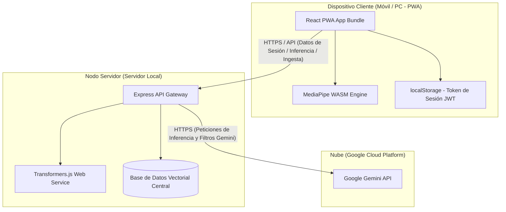

> [!IMPORTANT]
> **Nota de Privacidad Controlada:** El archivo de video original en formato bruto permanece local en el dispositivo del cliente. Hacia el Servidor Local viajan únicamente los metadatos cinemáticos y perfiles procesados de forma segura, evitando la exposición de información en nubes públicas comerciales de terceros.

---

## **5.10 Diseño de Interfaces de Usuario (UI)**
El diseño de la interfaz de usuario se rige bajo tres principios ergonómicos fundamentales para entornos deportivos de contacto:
1.  **Mobile-First y Simplicidad Operativa:** Botones e indicadores táctiles sobredimensionados para interactuar fácilmente con dedos vendados. La interfaz integra un temporizador de cuenta regresiva (ej. 5 o 10 segundos) visible y con alertas sonoras previo al inicio de la captura de video, permitiendo al practicante posicionarse sin interacción compleja.
2.  **Estética Glassmorphic Dark UI:** Paleta de colores en base a tonalidades oscuras de alta frecuencia (HSL balanceado) que minimizan el consumo de batería en pantallas AMOLED y aumentan el contraste bajo iluminación de tubos fluorescentes de dojos de BJJ.
3.  **Línea de Tiempo Interactiva 3D:** Renderizado tridimensional del esqueleto superpuesto al video mediante WebGL, permitiendo al usuario rotar el ángulo de la visualización cinemática para entender fallos de profundidad de codos o cadera.

---

### **Pseudocódigo del Motor de Adaptación Pedagógica**

Para complementar la lógica del diseño adaptativo del Capítulo V, se especifica el algoritmo del controlador encargado de conmutar las estrategias didácticas y las redirecciones a YouTube:

```typescript
// Controlador de adaptación e inyección pedagógica centralizada
function recomendarVideoYouTube(
  errorBiomecanico: ErrorBiomecanico, 
  historialUsuario: PerfilCompetencia
): VideoRecomendado | DrillAlternativo {
  
  // 1. Realizar petición a la API del servidor central para buscar videos asociados al error
  const videosRelevantes: List<VideoRecomendado> = ragSearchCentralServer({
    tipoRecurso: "video_tutorial",
    tecnicaId: errorBiomecanico.tecnicaId,
    articulacionAfectada: errorBiomecanico.tipoError
  });
  
  // 2. Filtrar videos que el practicante ya haya visualizado en el servidor sin mostrar mejora
  const videosNoVistosSinProgreso = videosRelevantes.filter(video => {
    const visualizado = historialUsuario.videosVisualizados.find(v => v.videoId === video.youtubeVideoId);
    return !(visualizado && visualizado.mejoraPosterior === false);
  });
  
  // 3. Si se han acumulado más de 3 fallos consecutivos, conmutar la estrategia pedagógica en el backend
  if (errorBiomecanico.vecesDetectadoConsecutivas > 3 || videosNoVistosSinProgreso.length === 0) {
    const estrategiaAlternativa: EstrategiaPedagogica = cambiarEstrategiaPedagogicaCentral(
      errorBiomecanico, 
      historialUsuario
    );
    
    // Retornar drill físico de aislamiento extraído del manual oficial indexado en el servidor
    return obtenerDrillAislamientoFisicoServer(estrategiaAlternativa);
  }
  
  // 4. Ordenar y recomendar el video óptimo basado en la efectividad histórica registrada en el dojo
  return videosNoVistosSinProgreso.sort((a, b) => {
    return b.efectividadHistorica - a.efectividadHistorica;
  })[0];
}
```

# Referencias

1. IEEE Computer Society. (1998). *IEEE Std 830-1998: Recommended Practice for Software Requirements Specifications*.
2. Larman, C. (2003). *UML and Patterns: An Introduction to Object-Oriented Analysis and Design and the Unified Process* (2nd Ed.). Prentice Hall.
3. Google Developers. (2023). *MediaPipe Pose Landmarker: Framework for ML Pipelines*.
4. Google Cloud. (2023). *Gemini API: Multimodal AI Platform*.
