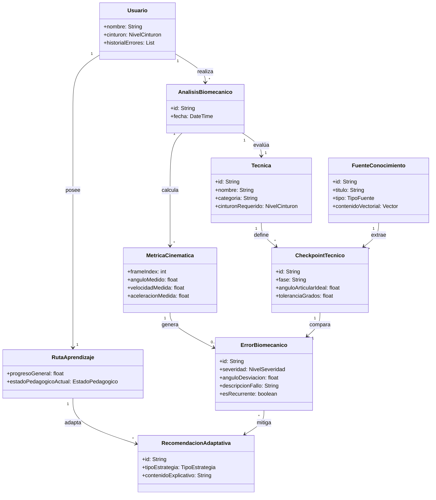
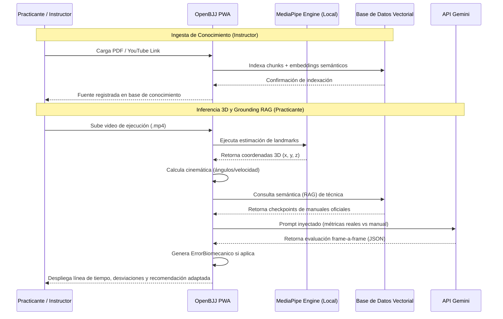
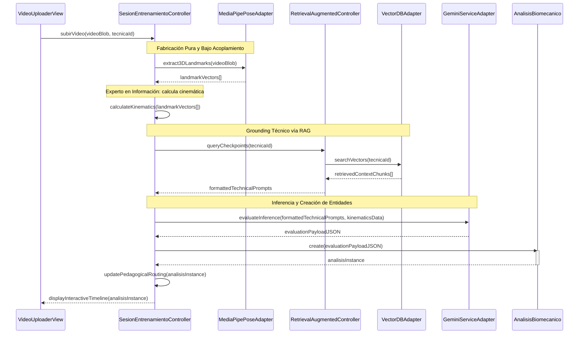

# **APLICACIÓN WEB CON INTELIGENCIA ARTIFICIAL PARA ANALIZAR VIDEOS DE ENTRENAMIENTO DE ARTES MARCIALES EN BRAZILIAN JIU-JITSU PARA PRINCIPIANTES DE CINTURÓN BLANCO**

 

**Santiago Borda Zambrana**  
*Registro: 2021210057*  

 

**Facultad de Ingeniería**  
*Carrera de Ingeniería de Sistemas*  
**Universidad Privada de Santa Cruz de la Sierra**  

 

**Modalidad de Graduación: Proyecto de Grado**  
*Para optar al título de Licenciado en Ingeniería de Sistemas*  

 

**Tutor:** Jose Antonio Benavente Blacutt  

 

**Santa Cruz de la Sierra - Bolivia**  
**2026**

# **Agradecimientos**

Agradezco a Dios por traerme a este mundo fuerte y saludable.
A mi madre que gracias a su amor incondicional y su esfuerzo pude estudiar gracias mami.
A mi abuela por alimentarse y tener siempre un plato de comida.
A mis tíos por sus palabras y experiencias vividas para que aprenda.
Al jiujitsu brasileno, por enseñarme a afrontar los miedos, seguir incluso cuando no se ve el avance, saber lidiar con la sensación de la derrota y sobre todo a no rendirme y aprender.
un cinturon negro fue un cinturon blanco que no se rindio.

# **Abstract**

| TÍTULO | APLICACIÓN WEB CON INTELIGENCIA ARTIFICIAL PARA ANALIZAR VIDEOS DE ENTRENAMIENTO DE ARTES MARCIALES EN BRAZILIAN JIU-JITSU PARA PRINCIPIANTES DE CINTURÓN BLANCO |
| :--- | :--- |
| **AUTOR** | SANTIAGO BORDA ZAMBRANA |

### **Problemática**
En el aprendizaje del Brazilian Jiu-Jitsu (BJJ), los practicantes principiantes enfrentan dificultades para evaluar su rendimiento técnico de manera objetiva. Actualmente, el progreso depende casi en su totalidad de la observación directa del instructor en tiempo real, lo que genera problemas críticos: falta de atención individualizada en clases numerosas, criterios de evaluación variables según el profesor, y una retroalimentación diferida o nula si el error no es detectado en el momento.

### **Objetivo General**
Desarrollar e implementar la aplicación web progresiva (PWA) "OpenBJJ" para analizar videos de entrenamiento usando la IA generativa de Gemini, con el fin de automatizar la retroalimentación táctica en las posiciones de Montada y Control Lateral. El sistema busca optimizar el proceso de autoevaluación reduciendo la dependencia del instructor, entregando respuestas estructuradas que incluyan la detección de errores, recomendaciones, y referencias directas al libro "Jiu-Jitsu University" junto con enlaces a videos de apoyo en YouTube.

### **Contenido**
El presente trabajo de investigación se ha desarrollado bajo la metodología del Proceso Unificado (UP) que maneja IA y consta de los siguientes capítulos:

| CARRERA | Ingeniería de Sistemas |
| :--- | :--- |
| **GUÍA** | Jose Antonio Benavente Blacutt |
| **DESCRIPTORES** | Inteligencia Artificial Generativa, Inferencia Multimodal, Arquitectura Cliente-Ligero, PWA, Brazilian Jiu-Jitsu, IndexedDB. |
| **EMAIL** | santiagobordazambrana@gmail.com |
| **FECHA** | Santa Cruz de la Sierra, 2026 |

# **Resumen**

En este documento se aborda la problemática que enfrentan los practicantes principiantes de Brazilian Jiu-Jitsu (BJJ) para evaluar su rendimiento técnico de manera objetiva y continua. Actualmente, la retroalimentación depende exclusivamente de la observación y experiencia del instructor, lo que genera evaluaciones subjetivas. Lo cual provoca que el alumno permanezca estancado en su progreso de aprendizaje por mucho tiempo.
En respuesta a esta necesidad, se propone el desarrollo de una aplicación web progresiva (PWA) que integra inteligencia artificial y visión por computadora para analizar videos de entrenamiento.

El desarrollo del software se divide en 4 etapas: análisis del problema, diseño de la solución propuesta y desarrollo del prototipo, por último, la etapa de pruebas.
Más allá de resolver las limitaciones actuales en la enseñanza del BJJ, esta iniciativa contribuirá a optimizar el proceso de aprendizaje, ofreciendo a los practicantes un software para mejorar su desempeño mediante análisis automatizado.

# **Índice de Contenidos**

- [**Agradecimientos**](#agradecimientos)
- [**Abstract**](#abstract)
- [**Resumen**](#resumen)
- [**Capítulo I: Definición del Proyecto de Investigación**](#capítulo-i-definición-del-proyecto-de-investigación)
  - [1.1 Definición del problema](#11-definición-del-problema)
    - [1.1.1 Situación problemática](#111-situación-problemática)
    - [1.1.2 Situación deseada](#112-situación-deseada)
    - [1.1.3 Objeto de investigación](#113-objeto-de-investigación)
    - [1.1.4 Alcance](#114-alcance)
    - [1.1.5 Justificación](#115-justificación)
  - [1.2 Objetivos](#12-objetivos)
    - [1.2.1 Objetivo General](#121-objetivo-general)
    - [1.2.2 Objetivos Específicos](#122-objetivos-específicos)
  - [1.3 Metodología](#13-metodología)
    - [1.3.1 Ingeniería de Software (Proceso Unificado)](#131-ingeniería-de-software-proceso-unificado)
    - [1.3.2 Gestión del Proyecto (Scrum)](#132-gestión-del-proyecto-scrum)
- [**Capítulo II: Descripción de la Entidad (Corpo & Mente)**](#capítulo-ii-descripción-de-la-entidad-corpo--mente)
  - [2.1 Descripción de la organización](#21-descripción-de-la-organización)
  - [2.2 Descripción organizacional](#22-descripción-organizacional)
  - [2.3 Manual de funciones](#23-manual-de-funciones)
  - [2.4 Descripción de los productos y servicios](#24-descripción-de-los-productos-y-servicios)
  - [2.5 Flujo del negocio](#25-flujo-del-negocio)
- [**Capítulo III: Marco Teórico y Estado del Arte**](#capítulo-iii-marco-teórico-y-estado-del-arte)
  - [3.1 Conceptos y definiciones](#31-conceptos-y-definiciones)
    - [3.1.1 Inteligencia artificial generativa multimodal](#311-inteligencia-artificial-generativa-multimodal)
    - [3.1.2 Almacenamiento local y arquitectura cliente-ligero](#312-almacenamiento-local-y-arquitectura-cliente-ligero)
    - [3.1.3 Ingeniería de prompts y grounding de dominio](#313-ingeniería-de-prompts-y-grounding-de-dominio)
  - [3.2 Estado del arte](#32-estado-del-arte)
    - [3.2.1 Análisis automatizado en deportes de combate](#321-análisis-automatizado-en-deportes-de-combate)
    - [3.2.2 Aplicaciones existentes de retroalimentación técnica](#322-aplicaciones-existentes-de-retroalimentación-técnica)
  - [3.3 Modelos y teorías relevantes](#33-modelos-y-teorías-relevantes)
    - [3.3.1 Proceso Unificado (UP) y desarrollo iterativo](#331-proceso-unificado-up-y-desarrollo-iterativo)
    - [3.3.2 Asignación de responsabilidades y patrones GRASP](#332-asignación-de-responsabilidades-y-patrones-grasp)
    - [3.3.3 Marco de trabajo ágil (Scrum adaptado)](#333-marco-de-trabajo-ágil-scrum-adaptado)
  - [3.4 Tecnologías y herramientas relevantes](#34-tecnologías-y-herramientas-relevantes)
    - [3.4.1 API de Gemini y procesamiento de video](#341-api-de-gemini-y-procesamiento-de-video)
    - [3.4.2 React, TypeScript y PWA](#342-react-typescript-y-pwa)
    - [3.4.3 IndexedDB y gestión de datos en el cliente](#343-indexeddb-y-gestión-de-datos-en-el-cliente)
  - [3.5 Valor agregado](#35-valor-agregado)
  - [3.6 Limitaciones](#36-limitaciones)
  - [3.7 Justificación teórica](#37-justificación-teórica)
- [**Capítulo IV: Definición de Requisitos**](#capítulo-iv-definición-de-requisitos)
  - [4.1 Introducción](#41-introducción)
    - [4.1.1 Propósito](#411-propósito)
    - [4.1.2 Ámbito del Sistema](#412-ámbito-del-sistema)
    - [4.1.3 Definiciones, Acrónimos y Abreviaturas](#413-definiciones-acrónimos-y-abreviaturas)
    - [4.1.4 Referencias](#414-referencias)
    - [4.1.5 Perspectiva General](#415-perspectiva-general)
  - [4.2 Descripción General](#42-descripción-general)
    - [4.2.1 Perspectiva del Producto](#421-perspectiva-del-producto)
    - [4.2.2 Funciones del Producto](#422-funciones-del-producto)
    - [4.2.3 Características de los Usuarios](#423-características-de-los-usuarios)
    - [4.2.4 Restricciones](#424-restricciones)
    - [4.2.5 Suposiciones y Dependencias](#425-suposiciones-y-dependencias)
  - [4.3 Requisitos Específicos](#43-requisitos-específicos)
    - [4.3.1 Interfaces Externas](#431-interfaces-externas)
    - [4.3.2 Requisitos Funcionales](#432-requisitos-funcionales)
    - [4.3.3 Requisitos No Funcionales (Modelo FURPS+)](#433-requisitos-no-funcionales-modelo-furps)
    - [4.3.4 Restricciones de Diseño](#434-restricciones-de-diseño)
    - [4.3.5 Atributos del Sistema de Software](#435-atributos-del-sistema-de-software)
- [**Capítulo V: Análisis y Diseño Orientado a Objetos**](#capítulo-v-análisis-y-diseño-orientado-a-objetos)
  - [5.1 Especificación de Casos de Uso Principales](#51-especificación-de-casos-de-uso-principales)
    - [Caso de Uso CU01: Analizar Video de Combate](#caso-de-uso-cu01-analizar-video-de-combate)
    - [Caso de Uso CU02: Consultar Historial Táctico](#caso-de-uso-cu02-consultar-historial-táctico)
    - [Caso de Uso CU03: Gestionar Registros Locales](#caso-de-uso-cu03-gestionar-registros-locales)
  - [5.2 Modelo de Dominio Conceptual](#52-modelo-de-dominio-conceptual)
  - [5.3 Diagramas de Secuencia del Sistema (DSS)](#53-diagramas-de-secuencia-del-sistema-dss)
  - [5.4 Contratos de las Operaciones del Sistema](#54-contratos-de-las-operaciones-del-sistema)
  - [5.5 Diseño de la Arquitectura Lógica (Patrón Capas)](#55-diseño-de-la-arquitectura-lógica-patrón-capas)
  - [5.6 Realización del Caso de Uso con Patrones GRASP](#56-realización-del-caso-de-uso-con-patrones-grasp)
  - [5.7 Diagrama de Estados para el Controlador](#57-diagrama-de-estados-para-el-controlador)
  - [5.8 Diagrama de Clases de Diseño (DCD)](#58-diagrama-de-clases-de-diseño-dcd)
  - [5.9 Diagrama de Despliegue Físico](#59-diagrama-de-despliegue-físico)
  - [5.10 Diseño de Interfaces de Usuario (UI)](#510-diseño-de-interfaces-de-usuario-ui)
- [**Capítulo VI: Implementación**](#capítulo-vi-implementación)
  - [6.1 Introducción al Modelo de Implementación](#61-introducción-al-modelo-de-implementación)
  - [6.2 Entorno Tecnológico y Herramientas](#62-entorno-tecnológico-y-herramientas)
  - [6.3 Correspondencia de Paquetes y Estructura de Directorios](#63-correspondencia-de-paquetes-y-estructura-de-directorios)
  - [6.4 Materialización del Diseño Orientado a Objetos](#64-materialización-del-diseño-orientado-a-objetos)
  - [6.5 Implementación del Flujo Principal (CU01)](#65-implementación-del-flujo-principal-cu01)
  - [6.6 Orden de Implementación](#66-orden-de-implementación)
- [**Capítulo VII: Seguridad**](#capítulo-vii-seguridad)
  - [7.1 Introducción a la Seguridad de la Arquitectura](#71-introducción-a-la-seguridad-de-la-arquitectura)
  - [7.2 Confidencialidad](#72-confidencialidad)
  - [7.3 Integridad](#73-integridad)
  - [7.4 Disponibilidad](#74-disponibilidad)
- [**Capítulo VIII: Pruebas**](#capítulo-viii-pruebas)
  - [8.1 Introducción a las Pruebas](#81-introducción-a-las-pruebas)
  - [8.2 Estrategia de Evaluación](#82-estrategia-de-evaluación)
  - [8.3 Casos de Prueba Funcionales](#83-casos-de-prueba-funcionales)
  - [8.4 Pruebas de Calidad del Sistema](#84-pruebas-de-calidad-del-sistema)
- [**Capítulo IX: Conclusiones y Recomendaciones**](#capítulo-ix-conclusiones-y-recomendaciones)
  - [9.1 Conclusiones](#91-conclusiones)
  - [9.2 Recomendaciones](#92-recomendaciones)
- [**Referencias**](#referencias)

# **Índice de Tablas**

- [**Tabla 1** *Fundamentos Teóricos del Proyecto*](#tabla-1)
- [**Tabla 2** *Requisitos no Funcionales*](#tabla-2)
- [**Tabla 4** *Responsabilidades por Capa de la Arquitectura*](#tabla-4)
- [**Tabla 5** *Justificación de Patrones GRASP Aplicados*](#tabla-5)
- [**Tabla 6** *Componentes de la Capa Cliente (Dispositivo)*](#tabla-6)
- [**Tabla 7** *Componentes de los Servicios Externos*](#tabla-7)
- [**Tabla 9** *Entorno Tecnológico del Sistema OpenBJJ*](#tabla-9)
- [**Tabla 10** *Materialización de las Clases de Diseño en Código Fuente*](#tabla-10)
- [**Tabla 11** *Caso de Prueba 01: Flujo Básico de Análisis*](#tabla-11)
- [**Tabla 12** *Caso de Prueba 02: Límite de Duración del Video*](#tabla-12)
- [**Tabla 13** *Caso de Prueba 03: Cancelación del Análisis*](#tabla-13)
- [**Tabla 14** *Caso de Prueba 04: Historial Vacío*](#tabla-14)
- [**Tabla 15** *Caso de Prueba 05: Eliminación de Registros Locales*](#tabla-15)
- [**Tabla 16** *Evaluación de Rendimiento y Estabilidad*](#tabla-16)

# **Índice de Figuras**

- [**Figura 1** *Interacción del Practicante con OpenBJJ*](#figura-1)
- [**Figura 2** *Posición Montada*](#figura-2)
- [**Figura 3** *Posición Control lateral*](#figura-3)
- [**Figura 4** *Estructura Organizacional de Corpo & Mente Bolivia*](#figura-4)
- [**Figura 5** *Sistema de Cinturones de Jiu-Jitsu Brasileño*](#figura-5)
- [**Figura 6** *Flujo del Negocio Actual y Detección de Cuellos de Botella*](#figura-6)
- [**Figura 7** *Fases del Proceso Unificado*](#figura-7)
- [**Figura 8** *Modelo de Dominio Conceptual de OpenBJJ (Iteración 1)*](#figura-8)
- [**Figura 9** *Diagrama de Secuencia del Sistema para CU01: Analizar Video de Combate*](#figura-9)
- [**Figura 10** *Diseño de la Arquitectura Lógica*](#figura-10)
- [**Figura 11** *Diagrama de Secuencia de Diseño del CU01*](#figura-11)
- [**Figura 12** *Máquina de Estados de los Casos de Uso*](#figura-12)
- [**Figura 13** *Diagrama de Clases de Diseño (DCD)*](#figura-13)
- [**Figura 14** *Diagrama de Despliegue del Sistema*](#figura-14)
- [**Figura 15** *Pantalla de Ingesta de Video*](#figura-15)
- [**Figura 16** *Pantalla de Carga y Procesamiento de Video*](#figura-16)
- [**Figura 17** *Pantalla de Reporte Táctico*](#figura-17)
- [**Figura 18** *Pantalla de Historial Local*](#figura-18)
- [**Figura 19** *Métricas de OpenBJJ*](#figura-19)

# **CAPÍTULO I: DEFINICIÓN DEL PROYECTO DE INVESTIGACIÓN**

## **1.1 Definición del problema**

### **1.1.1 Situación problemática**
En el aprendizaje de las artes marciales y, en específico, del Brazilian Jiu-Jitsu (BJJ), los practicantes se enfrentan a una dependencia crítica de la instrucción presencial y sincrónica para corregir sus errores técnicos. En entornos de entrenamiento masivos, los instructores no pueden proporcionar atención personalizada frame por frame a cada alumno, lo que ralentiza significativamente su curva de aprendizaje.

Las soluciones tecnológicas actuales presentan limitaciones severas que impiden resolver este vacío de manera efectiva:
- **Rigidez del conocimiento:** Los sistemas existentes de retroalimentación deportiva poseen reglas técnicas estáticas grabadas directamente en su código fuente (hardcoded). Esto impide la incorporación de literatura técnica diversa (manuales oficiales, reglamentos federativos variados o videos explicativos de YouTube) que los propios profesores o academias desean utilizar como fuente de verdad.
- **Falta de adaptabilidad pedagógica:** Las aplicaciones no consideran el historial de rendimiento del alumno. Emiten diagnósticos aislados y genéricos sin comprender si un error es recurrente, lo que imposibilita la personalización de las estrategias de enseñanza para alumnos que presentan dificultades de progreso persistentes.
- **Complejidad y costes de hardware:** Las herramientas que ofrecen análisis biomecánico cuantitativo preciso exigen sensores inerciales físicos (IMUs) adheridos al cuerpo o cámaras de alta velocidad en entornos controlados, lo cual es inviable sobre un tatami de sparring de BJJ por razones de seguridad, costo y usabilidad.

### **1.1.2 Situación deseada**
Se busca desarrollar una plataforma web progresiva (PWA) inteligente que actúe como un tutor biomecánico y táctico adaptativo. El practicante, independientemente de su nivel de graduación (desde cinturón blanco hasta cinturón negro), podrá cargar un video monocular de su sparring o ejecución técnica. 

El sistema procesará el video localmente en el dispositivo del usuario utilizando visión por computadora en el cliente para estimar landmarks biomecánicos en 3D sin requerir sensores físicos. Un motor de Inteligencia Artificial (IA) contrastará esta cinemática en tiempo real con especificaciones técnicas recuperadas dinámicamente desde una base de datos vectorial inyectada por el usuario (motor RAG de manuales en PDF y transcripciones de YouTube).

Si el alumno falla repetidamente en corregir una desviación técnica detectada, un motor de tutoría adaptativa modificará automáticamente la estrategia pedagógica (conmutando, por ejemplo, de recomendaciones en video de YouTube a drills de flexibilidad específicos o explicaciones anatómicas textuales), adaptando de forma dinámica la ruta de aprendizaje. Todo esto bajo una arquitectura cliente-servidor ligera que ejecute la estimación visual en el navegador del usuario para preservar la confidencialidad absoluta del video y suprimir costos operativos de GPU en el servidor.

**Figura 1**
*Interacción del Practicante con OpenBJJ*

### **1.1.3 Objeto de investigación**
El objeto de este estudio es el modelado y diseño de una arquitectura de software orientada a objetos que combine la estimación de pose 3D client-side (sin sensores) y el procesamiento semántico RAG (Retrieval-Augmented Generation) para la tutoría adaptativa y multi-nivel de artes marciales en tiempo de ejecución.

### **1.1.4 Alcance**
El proyecto OpenBJJ se delimita bajo los siguientes criterios:
- **Alcance Técnico:** Extracción de landmarks corporales en 3D en el lado del cliente (navegador web) a través de MediaPipe y TensorFlow.js, eliminando la transmisión del video original a servidores externos para proteger la privacidad. Base de datos vectorial en la nube (ej. Supabase Vector / Pinecone) para almacenar representaciones de documentos técnicos e indexación RAG. Lógica de adaptación instruccional serverless.
- **Alcance de Dominio:** Cobertura de técnicas correspondientes a todos los niveles de graduación de Brazilian Jiu-Jitsu (cinturones Blanco, Azul, Morado, Marrón y Negro).
- **Alcance Metodológico:** Implementación de la metodología del Proceso Unificado (UP) y asignación de responsabilidades de Craig Larman (patrones GRASP y GoF).
- **Alcance de Despliegue:** Aplicación Web Progresiva (PWA) responsiva compatible con dispositivos móviles y ordenadores de escritorio mediante navegadores modernos con soporte WebGL.

### **1.1.5 Justificación**
- **Tecnológica:** Demuestra la viabilidad de implementar arquitecturas cognitivas complejas (visión 3D + RAG) en navegadores web de consumo mediante ejecución híbrida distribuida, reduciendo la infraestructura centralizada a un backend ligero serverless.
- **Económica:** Suprime la necesidad de servidores de procesamiento de video basados en GPU, delegando la carga computacional pesada al procesador local del cliente. El consumo de APIs se restringe a llamadas de texto y embeddings vectoriales de bajo costo.
- **Social:** Facilita el acceso democratizado y autónomo a la educación de artes marciales de alta calidad, alineándose con las fuentes bibliográficas de preferencia de cada academia sin intervención del programador.

## **1.2 Objetivos**

### **1.2.1 Objetivo General**
Desarrollar e implementar la aplicación web progresiva (PWA) OpenBJJ asistida por Inteligencia Artificial generativa y visión computacional 3D, orientada a la tutoría adaptativa y multi-nivel del Brazilian Jiu-Jitsu mediante un motor RAG dinámico de fuentes de conocimiento y un pipeline de extracción biomecánica local libre de sensores físicos.

### **1.2.2 Objetivos Específicos**
1. Diseñar un pipeline de visión computacional client-side (MediaPipe/TensorFlow.js) para extraer landmarks en 3D y calcular métricas cinemáticas (ángulos articulares, velocidades, aceleraciones) desde videos monoculares 2D de sparring.
2. Implementar un motor de recuperación semántica (RAG) que indexe dinámicamente manuales oficiales (PDF) y transcripciones de videos (YouTube) en una base de datos vectorial para grounding de la IA evaluadora.
3. Desarrollar un motor de recomendación pedagógica adaptativo que evalúe la persistencia de fallos y altere las estrategias de retroalimentación conforme al historial de progreso del estudiante.
4. Modelar el dominio y comportamiento del sistema utilizando diagramas UML y aplicando los patrones GRASP de Craig Larman para aislar la lógica biomecánica, RAG y adaptativa en componentes reutilizables y de bajo acoplamiento.

## **1.3 Metodología**
Se adopta un marco de desarrollo ágil híbrido. El Proceso Unificado (UP) rige la arquitectura técnica y la documentación de diseño en cuatro fases (Inicio, Elaboración, Construcción y Transición), mientras que Scrum gestiona el esfuerzo temporal a través de Sprints iterativos y control de Backlog.

---

# **CAPÍTULO II: MARCO TEÓRICO**

## **2.1 Visión por Computadora en Deportes: Estimación de Pose 3D**
La visión artificial en el ámbito deportivo ha evolucionado de la simple clasificación de acciones a la reconstrucción cinemática detallada del cuerpo humano. Modelos de aprendizaje profundo preentrenados (como MediaPipe Pose de Google y TensorFlow.js) permiten realizar estimación de pose en el navegador web del usuario a través de JavaScript y aceleración por WebGL.

Estos modelos estiman las coordenadas de hasta 33 puntos de referencia corporales clave (landmarks), entregando coordenadas tridimensionales relativas $(x, y, z)$. El eje $z$ representa la profundidad respecto a la cadera del sujeto, permitiendo reconstruir un esqueleto 3D a partir de una única cámara monocular (2D) convencional.

**Figura 2**
*Estimación de Landmarks Corporales 3D*

A partir de estas coordenadas, la física cinemática permite derivar métricas fundamentales del movimiento deportivo sin sensores inerciales corporales:
- **Ángulos articulares ($	heta$):** Calculados mediante el coseno del ángulo entre los vectores formados por tres landmarks adyacentes (ej. hombro-codo-muñeca para el codo):
  $$\cos(	heta) = rac{ec{u} \cdot ec{v}}{\|ec{u}\| \|ec{v}\|}$$
- **Velocidad articular ($ec{v}$):** Derivada temporal de la posición de los landmarks entre fotogramas sucesivos:
  $$ec{v}(t) = rac{ec{p}(t) - ec{p}(t-\Delta t)}{\Delta t}$$
- **Aceleración articular ($ec{a}$):** Tasa de cambio de la velocidad en el tiempo:
  $$ec{a}(t) = rac{ec{v}(t) - ec{v}(t-\Delta t)}{\Delta t}$$

La ejecución de este pipeline en el navegador del cliente elimina la necesidad de transmitir flujos de video masivos a la nube, reduciendo la latencia de procesamiento, eliminando costos de infraestructura de GPU en el servidor y garantizando que los datos visuales brutos permanezcan seguros en el dispositivo del usuario.

## **2.2 Generación Aumentada por Recuperación (RAG) en Deportes**
Los Modelos de Lenguaje de Gran Escala (LLMs) presentan el riesgo de generar respuestas erróneas o ficticias ("alucinaciones") cuando se les consulta sobre reglas y técnicas específicas de deportes complejos como el BJJ, dado que la literatura técnica puede no estar suficientemente representada en sus datos de entrenamiento generalistas.

Para subsanar esto, el patrón de arquitectura RAG contextualiza al modelo generativo en tiempo de ejecución inyectando fragmentos textuales relevantes de documentos externos:
1. **Ingestación de Conocimiento:** Documentos técnicos (libros en PDF, transcripciones de YouTube de instructores certificados) son segmentados en fragmentos lógicos (chunks).
2. **Generación de Embeddings:** Un modelo de representación semántica convierte cada chunk en un vector multidimensional.
3. **Indexación:** Los vectores se persisten en una base de datos vectorial (Vector DB).
4. **Recuperación y Grounding:** Cuando el usuario selecciona una técnica, el sistema realiza una consulta vectorial, recupera los fragmentos y los checkpoints técnicos idóneos y los concatena al prompt del LLM junto con las métricas biomecánicas calculadas. De esta forma, el modelo avanzado evalúa el movimiento basándose estrictamente en la literatura corporativa oficial.

**Figura 3**
*Arquitectura RAG para Grounding Técnico de IA*

## **2.3 Metodología de Diseño UP y Patrones GRASP de Craig Larman**
Para garantizar la solidez arquitectónica en sistemas complejos, el Proceso Unificado (UP) promueve el desarrollo iterativo guiado por riesgos y centrado en la arquitectura lógica. 

El análisis y diseño se fundamenta en la asignación de responsabilidades a los objetos utilizando los patrones GRASP (General Responsibility Assignment Software Patterns) propuestos por Craig Larman (2003). Estos patrones definen reglas sistemáticas para estructurar el software:
- **Experto en Información:** Asigna responsabilidades al objeto que posee los datos requeridos.
- **Controlador:** Objeto no visual que coordina la recepción de eventos del sistema y la orquestación del flujo de dominio.
- **Bajo Acoplamiento y Alta Cohesión:** Guías métricas para minimizar las dependencias y maximizar la especialización funcional de las clases.
- **Fabricación Pura y Variaciones Protegidas:** Creación de clases artificiales (como adaptadores y conectores vectoriales) para encapsular APIs de IA o almacenamiento local, aislando el núcleo de dominio de cambios tecnológicos futuros.

---

# **CAPÍTULO III: ESTADO DEL ARTE Y ANÁLISIS COMPARATIVO**

## **3.1 Análisis de Soluciones Existentes**
El análisis cinemático y la tutoría técnica en el deporte disponen de diversos enfoques tecnológicos en el mercado, los cuales presentan claras brechas con las necesidades pedagógicas del Jiu-Jitsu Brasileño:
- **Sistemas basados en Sensores Corporales (IMU):** Utilizados en atletismo de élite. Ofrecen excelente precisión métrica, pero requieren equipamiento caro y la sujeción de bandas físicas al cuerpo, lo cual es impracticable e inseguro en BJJ debido al contacto directo constante, roces y derribos (sparring) en el tatami.
- **Aplicaciones Estáticas de BJJ (Videotecas fijos):** Plataformas que muestran repositorios de video ordenados. Carecen de cualquier capacidad de análisis automatizado o retroalimentación sobre la ejecución del alumno.
- **Soluciones de Visión Monocular en Deportes (Golf / Tennis Swing Apps):** Herramientas capaces de estimar ángulos articulares desde video 2D. Sin embargo, su lógica de negocio está totalmente acoplada (hardcoded) a un único deporte, impidiendo inyectar dinámicamente nuevas técnicas y careciendo de mecanismos RAG o adaptabilidad pedagógica para el seguimiento de la curva de aprendizaje de alumnos que presentan errores repetitivos.

## **3.2 Tabla Comparativa de Soluciones**

El siguiente cuadro analiza comparativamente las soluciones del mercado respecto a la propuesta integrada de OpenBJJ:

**Tabla 1**  
*Análisis Comparativo de Soluciones Tecnológicas de Retroalimentación Deportiva*

| Característica / Criterio | Sistemas Inerciales (IMUs) | Apps de Videotecas Estáticas | Apps de Golf/Tenis Monoculares | OpenBJJ (Propuesta) |
| :--- | :--- | :--- | :--- | :--- |
| **Análisis 3D sin Sensores** | No (Requiere hardware físico) | No (Ninguno) | Sí (Estimación 2D/3D acoplada) | Sí (Pose 3D local con MediaPipe) |
| **Ingesta Dinámica (RAG)** | No | No | No (Reglas rígidas fijas) | Sí (Embeddings de PDF/YouTube) |
| **Soporte Multi-nivel** | N/A | Sí (Solo visualización) | No | Sí (Rutas de Blanco a Negro) |
| **Adaptabilidad Pedagógica** | No | No | No (Evaluación puntual aislada) | Sí (Rastreo histórico de errores) |
| **Seguridad y Privacidad** | Media (Datos en nube) | Alta (No graba) | Baja (Video enviado a servidores) | Alta (Procesamiento local client-side) |
| **Costo Operativo de GPU** | Alto | Nulo | Alto (Servidores en la nube) | Nulo (Ejecución distribuida en cliente) |

---

# **CAPÍTULO IV: DEFINICIÓN DE REQUISITOS (SRS)**

## **4.1 Introducción**
El presente pliego de condiciones técnicas establece la especificación de requisitos del sistema (SRS) para la plataforma OpenBJJ bajo el modelo de calidad FURPS+.

## **4.2 Descripción General**

### **4.2.1 Perspectiva del Producto**
OpenBJJ opera bajo una topología de arquitectura híbrida. El motor de visión computacional y extracción cinemática corre enteramente en el cliente (PWA en el navegador). El almacenamiento de historial y vectorización RAG se apoya en servicios en la nube serverless ligeros a través de HTTPS/REST.

### **4.2.2 Funciones del Producto**
- **Ingesta de Conocimiento:** Carga e indexación semántica de manuales y videos.
- **Extracción Biométrica:** Detección de pose y cálculo de ángulos, velocidad y aceleración en 3D.
- **Análisis Táctico (Grounding):** Inferencia cognitiva comparando la cinemática con la ontología RAG.
- **Recomendación Pedagógica Adaptativa:** Generación de rutas personalizadas basadas en fallos acumulativos.

### **4.2.3 Características de los Usuarios**
1. **Practicante:** Alumno de cualquier cinturón que busca autoevaluarse.
2. **Instructor:** Experto certificado que gestiona, sube e indexa las fuentes de conocimiento confiables para grounding.
3. **Administrador:** Soporte técnico y monitor del sistema.

### **4.2.4 Restricciones**
- La API de MediaPipe client-side exige soporte WebGL activo en el navegador para acelerar el procesamiento de fotogramas.
- El video monocular de entrada debe capturar el cuerpo entero del practicante sin oclusiones severas para garantizar la consistencia temporal de landmarks.

### **4.2.5 Suposiciones y Dependencias**
- El cliente posee conexión a internet para interactuar con la API del LLM (Gemini) y recuperar fragmentos vectoriales de RAG, aunque el análisis biomecánico inicial es local.

## **4.3 Requisitos Específicos**

### **4.3.1 Interfaces Externas**
- **Interfaz de Usuario (UI):** Responsiva, con soporte móvil táctil (Mobile-First) y principios visuales de Glassmorphic Dark UI.
- **Interfaz de Software (API):** Consumo de base de datos vectorial (REST JSON) y SDK de Google Gemini.

### **4.3.2 Requisitos Funcionales (RF)**

- **RF-Ingesta:** El sistema debe permitir al Instructor cargar archivos PDF y enlaces de videos de YouTube, extrayendo el contenido técnico mediante embeddings para su almacenamiento en una base de datos vectorial para el grounding de la IA.
- **RF-Biomecánica:** El sistema debe procesar localmente el video en el navegador mediante MediaPipe, extrayendo landmarks 3D corporales y calculando las métricas de ángulo articular, velocidad y aceleración por cada fotograma.
- **RF-Adaptación:** El sistema debe registrar las desviaciones técnicas detectadas en una base de datos local e individual. Ante la presencia de errores repetitivos en la misma posición, el motor pedagógico debe conmutar la estrategia de corrección (ej. recomendando un ejercicio físico auxiliar o un drill de movilidad simplificado en lugar de videotecas complejas).

### **4.3.3 Requisitos No Funcionales (RNF)**

**Tabla 2**  
*Especificación de Requisitos No Funcionales*

| ID | Categoría (FURPS+) | Descripción del Requisito No Funcional |
| :--- | :--- | :--- |
| **RNF01** | Usabilidad | La interfaz gráfica debe adaptarse responsivamente a pantallas móviles táctiles, asegurando operabilidad dentro del tatami con guantes o vendajes. |
| **RNF02** | Fiabilidad | El sistema debe validar el formato de las coordenadas vectoriales devueltas por MediaPipe antes de enviarlas al LLM, evitando excepciones de formato en tiempo de ejecución. |
| **RNF03** | Rendimiento (Precisión) | **Consistencia Temporal:** El algoritmo debe ser capaz de identificar desviaciones angulares mayores a 15 grados respecto al patrón ideal de la técnica, manteniendo una tasa de falsos positivos inferior al 10% bajo kimonos deportivos. |
| **RNF04** | Rendimiento (Latencia) | El tiempo transcurrido entre la finalización de la extracción de landmarks y la visualización de la retroalimentación adaptativa estructurada debe ser menor a 3 segundos. |
| **RNF05** | Seguridad (Privacidad) | **Principio de Confidencialidad:** El archivo de video original en formato bruto nunca debe transmitirse a través de la red; el análisis espacial e inferencia de coordenadas ocurre estrictamente en memoria volátil local. |
| **RNF06** | Mantenibilidad | El motor de análisis y la lógica de recomendación pedagógica deben estar desacoplados de los servicios tecnológicos de estimación de pose mediante interfaces y patrones de Fabricación Pura. |

---

# **CAPÍTULO V: ANÁLISIS Y DISEÑO ORIENTADO A OBJETOS**

## **5.1 Modelo de Dominio Conceptual**
El modelo de dominio representa los conceptos significativos del negocio de OpenBJJ. Siguiendo las directrices de Larman, se modelan las abstracciones cinemáticas, de RAG y adaptación instruccional sin acoplar detalles de bases de datos.

La clase **ErrorBiomecanico** (o *DesviacionTecnica*) actúa como entidad puente fundamental. Registra la diferencia entre la ejecución real medida por la **MetricaCinematica** y el patrón extraído de la **FuenteConocimiento**. Esta entidad permite al motor de **RecomendacionAdaptativa** evaluar el historial persistente de fallas y seleccionar la estrategia pedagógica idónea para la **RutaAprendizaje** del practicante.

## **5.2 Especificación de Casos de Uso Principales**

### **Caso de Uso CU01: Realizar Análisis Biomecánico y Táctico**

- **Actor Principal:** Practicante
- **Personal Involucrado e Intereses:**
  - **Practicante:** Desea recibir retroalimentación técnica y biomecánica en 3D objetiva e instantánea sobre su ejecución técnica (para cualquier nivel de cinturón), identificando fallas de movimiento y recibiendo lecturas angulares claras en base a manuales autorizados.
  - **Instructor:** Desea que los alumnos obtengan correcciones biomecánicas precisas que agilicen las horas de entrenamiento presenciales.
- **Precondiciones:**
  - El practicante ha seleccionado una técnica del catálogo y cargado un video monocular de su ejecución.
  - El navegador dispone de soporte WebGL activo.
- **Garantías de Éxito (Postcondiciones):**
  - El sistema ha extraído los landmarks 3D localmente a través del motor MediaPipe.
  - Se han calculado los ángulos, velocidades y aceleraciones de cada articulación por fotograma.
  - El sistema recuperó del almacén vectorial el grounding RAG de la técnica seleccionada.
  - La IA evaluó las métricas frente a la ontología inyectada bajo el principio de inferencia negativa, identificando cualquier **ErrorBiomecanico**.
  - Se renderizó en pantalla la línea de tiempo interactiva con los errores detectados y el reporte táctico detallado, guardándose el registro en el historial.
- **Escenario Principal de Éxito (Flujo Básico):**
  1. El Practicante selecciona la técnica a evaluar y sube el video de sparring/drilling.
  2. El Sistema invoca localmente el motor de MediaPipe en el navegador.
  3. El Sistema extrae las coordenadas 3D de los landmarks corporales en los fotogramas clave.
  4. El Sistema calcula los ángulos articulares y vectores cinemáticos por fotograma.
  5. El Sistema consulta la base de datos vectorial mediante una búsqueda semántica RAG para recuperar los fragmentos del manual técnico correspondiente.
  6. El Sistema inyecta las métricas y los textos del manual recuperados en el prompt estructurado en inglés.
  7. El Sistema procesa la inferencia en la API del LLM (Gemini) para evaluar las desviaciones.
  8. El Sistema genera las instancias correspondientes de **ErrorBiomecanico** si los ángulos se desvían de la tolerancia indicada.
  9. El Sistema presenta al usuario la línea de tiempo biomecánica con las lecturas y recomendaciones en español.
- **Extensiones (Flujos Alternativos):**
  - **3a. Fallo severo de oclusión o captura del esqueleto por MediaPipe:**
    1. El Sistema detecta pérdida de consistencia temporal en más del 30% de los fotogramas del video.
    2. El Sistema alerta al Practicante: "Evidencia visual insuficiente. Por favor, cargue un video con mejor iluminación donde se aprecie todo su cuerpo."
    3. El Sistema aborta el análisis sin realizar llamadas a APIs remotas.
- **Requisitos Especiales:**
  - Inferencia local (landmarks) completada en menos de 2 segundos.
  - Detección de desviaciones angulares mayores a 15 grados con tasa de falsos positivos <10%.
  - Confidencialidad absoluta: el video nunca se almacena ni transmite externamente.

---

### **Caso de Uso CU02: Ingestar Nueva Fuente de Conocimiento**

- **Actor Principal:** Instructor
- **Personal Involucrado e Intereses:**
  - **Instructor:** Desea alimentar el sistema cargando libros, manuales internos de su academia en formato PDF o enlaces a listas de reproducción de YouTube con técnicas personalizadas para que la IA los utilice como base científica para evaluar a los alumnos.
- **Precondiciones:**
  - El Instructor ha iniciado sesión con credenciales validadas.
- **Garantías de Éxito (Postcondiciones):**
  - El sistema ha parseado el PDF o recuperado la transcripción de audio del video de YouTube.
  - Se han generado los fragmentos de texto (chunks) y sus respectivos embeddings.
  - Se ha registrado la información indexada en la base de datos vectorial (Vector DB).
- **Escenario Principal de Éxito (Flujo Básico):**
  1. El Instructor accede al panel de ingesta técnica de la PWA.
  2. El Instructor sube un archivo PDF del manual o introduce el URL de un video de YouTube.
  3. El Sistema invoca al procesador de texto (o API de recuperación de subtítulos de YouTube).
  4. El Sistema segmenta el contenido en fragmentos lógicos.
  5. El Sistema genera los vectores semánticos (embeddings) a través de la API serverless.
  6. El Sistema almacena e indexa los vectores en la base de datos vectorial de la plataforma, asociándolos a la técnica respectiva.
  7. El Sistema confirma la ingesta exitosa en pantalla.
- **Extensiones (Flujos Alternativos):**
  - **2a. El archivo cargado excede el límite de tamaño o no es legible:**
    1. El Sistema valida que el formato PDF no contenga imágenes escaneadas sin OCR o que el video no carezca de transcripción de audio.
    2. El Sistema alerta del fallo de legibilidad y cancela la indexación.

---

### **Caso de Uso CU03: Consultar Progreso y Recibir Tutoría Adaptativa**

- **Actor Principal:** Practicante
- **Personal Involucrado e Intereses:**
  - **Practicante:** Desea visualizar sus errores repetitivos e históricos y recibir una recomendación pedagógica que se adapte si su curva de aprendizaje se encuentra estancada.
- **Precondiciones:**
  - El Practicante tiene una sesión activa con historial guardado.
- **Garantías de Éxito (Postcondiciones):**
  - El sistema ha consultado el historial de instancias de **ErrorBiomecanico** del usuario.
  - El motor pedagógico ha detectado patrones de falla recurrentes.
  - Se ha generado una ruta de aprendizaje adaptada que altera la estrategia didáctica en base a los fallos acumulados.
- **Escenario Principal de Éxito (Flujo Básico):**
  1. El Practicante accede a su panel de progreso individual.
  2. El Sistema recupera el historial de análisis y errores locales guardados.
  3. El Sistema analiza la persistencia del mismo **ErrorBiomecanico** (ej. codo abierto en la Montada en más del 70% de los análisis del mes).
  4. El Sistema clasifica al usuario bajo un estado pedagógico específico (ej. Estancamiento por Falta de Movilidad).
  5. El Sistema formula una **RecomendacionAdaptativa** que modifica el material de apoyo (conmutando la explicación por videos interactivos por un drill físico de estiramiento y alineación articular).
  6. El Sistema despliega la ruta de aprendizaje actualizada al alumno.
- **Extensiones (Flujos Alternativos):**
  - **3a. No existen registros previos suficientes para inferir recurrencia:**
    1. El Sistema determina que el usuario no tiene suficientes análisis completados.
    2. El Sistema despliega recomendaciones didácticas genéricas basadas en su cinturón y le aconseja realizar más entrenamientos.

## **5.3 Diagrama de Secuencia del Sistema (DSS)**

El DSS muestra la interacción como caja negra de OpenBJJ para la inferencia 3D local combinada con grounding semántico RAG:

## **5.4 Contratos de las Operaciones del Sistema**

### **Contrato CO01: procesarAnalisisVideo**
- **Operación:** `procesarAnalisisVideo(video: MediaStream, tecnicaId: String)`
- **Referencias Cruzadas:** CU01: Realizar Análisis Biomecánico y Táctico.
- **Precondiciones:**
  - Existe soporte activo de WebGL en el navegador cliente.
  - El `tecnicaId` provisto corresponde a una técnica catalogada en el sistema.
- **Postcondiciones:**
  - Se creó una instancia de **AnalisisBiomecanico** llamada `analisis` (creación de instancia).
  - Se asoció `analisis` con el **Usuario** activo (formación de asociación).
  - Se calcularon las coordenadas 3D del esqueleto, creándose múltiples instancias de **MetricaCinematica** asociadas a `analisis` (creación de instancias y modificación de atributos).
  - Se recuperaron los fragmentos de texto vectorial de **FuenteConocimiento** asociados al `tecnicaId` (lectura de asociación).
  - Si los valores de las instancias de **MetricaCinematica** sobrepasaron el umbral del **CheckpointTecnico** respectivo, se instanciaron uno o más objetos de **ErrorBiomecanico** asociados a `analisis` (creación de instancias y modificación de atributos).
  - Se actualizó el estado de progreso en la **RutaAprendizaje** del usuario (modificación de atributos).

## **5.5 Diseño de la Arquitectura Lógica (Patrón Capas)**

Se aplica el patrón de arquitectura de 3 capas lógicas independientes para asegurar el desacoplamiento tecnológico:

**Figura 10**
*Diseño de la Arquitectura Lógica*

**Tabla 4**  
*Responsabilidades por Capa de la Arquitectura*

| Capa | Responsabilidades Primarias | Tecnologías Clave |
| :--- | :--- | :--- |
| **Presentación** | Renderizar UI responsiva (Mobile-First, Glassmorphic Dashboard), capturar interactividad del video y pintar esqueleto 3D. | React, TypeScript, Tailwind CSS, Lucide Icons |
| **Dominio** | Orquestar casos de uso, ejecutar el motor pedagógico adaptativo, instanciar errores biomecánicos e inferir desviaciones. | TS Classes, GRASP Controllers, In-Memory Models |
| **Servicios Técnicos** | Ejecutar estimación de landmarks corporales en 3D, calcular embeddings vectoriales, persistir en Vector DB local/nube y dialogar con APIs LLM. | MediaPipe Pose SDK, Supabase Vector client, Gemini AI API |

## **5.6 Realización del Caso de Uso con Patrones GRASP**

El siguiente diagrama ilustra la interacción detallada de objetos de diseño para el flujo principal del CU01, demostrando la asignación lógica de responsabilidades:

La asignación de responsabilidades de diseño se justifica a través de la aplicación formal de los principios de Craig Larman:

**Tabla 5**  
*Justificación de Decisiones de Diseño Basadas en Patrones GRASP*

| Patrón GRASP Aplicado | Aplicación en el Diseño de OpenBJJ | Beneficio de Ingeniería de Software |
| :--- | :--- | :--- |
| **Controlador** | `SesionEntrenamientoController` coordina todos los eventos del sistema disparados por la subida de videos de combate, abstrayendo la vista del flujo lógico. | **Alta Cohesión:** La interfaz de usuario no asume lógica de negocio; el acoplamiento modelo-vista es nulo. |
| **Experto en Información** | La clase `SesionEntrenamientoController` (o el objeto `AnalisisBiomecanico`) calcula los ángulos articulares, velocidades y aceleraciones, ya que contiene el array de coordenadas corporales extraídas. | **Encapsulamiento de Datos:** El cálculo de métricas cinemáticas se agrupa junto a los datos que las originan, minimizando la propagación de datos crudos. |
| **Creador** | La clase `SesionEntrenamientoController` instancia los objetos `AnalisisBiomecanico` y `ErrorBiomecanico` tras la recepción y parseo del payload JSON de evaluación. | **Trazabilidad:** Asigna la creación al objeto que registra y almacena directamente los reportes en el historial local. |
| **Bajo Acoplamiento** | Las APIs complejas de estimación visual e inferencia RAG se aíslan mediante adaptadores (`MediaPipePoseAdapter` y `GeminiServiceAdapter`) implementando interfaces abstractas. | **Variaciones Protegidas:** La migración de MediaPipe a TensorFlow.js o de Gemini a OpenAI se realiza cambiando los adaptadores, sin alterar el código de dominio. |
| **Fabricación Pura** | La clase `RetrievalAugmentedController` gestiona la consulta y ensamblado de embeddings sin corresponder a ningún concepto del tatami físico. | **Alta Cohesión:** Evita contaminar la entidad pura `Tecnica` con lógica técnica de base de datos vectorial o tokenización RAG. |

# **CAPÍTULO VI: IMPLEMENTACIÓN**
## **6.1 Introducción al Modelo de Implementación**
En el marco del Proceso Unificado (UP), el Modelo de Implementación es el resultado de transformar los artefactos de diseño creados en la fase de Elaboración en código fuente ejecutable. Durante esta fase, las decisiones arquitectónicas, el Diagrama de Clases de Diseño (DCD) y los Diagramas de Interacción se traducen a un lenguaje de programación orientado a objetos.
Para el sistema OpenBJJ, esta fase materializa la arquitectura de "cliente-ligero" diseñada previamente, asegurando que el código fuente mantenga una alta cohesión, un bajo acoplamiento y respete estrictamente la separación entre la capa de presentación (UI) y la capa de dominio.
## **6.2 Entorno Tecnológico y Herramientas**
La selección del stack tecnológico para OpenBJJ se alinea con las restricciones de diseño y el alcance del proyecto, priorizando la ejecución en el lado del cliente y la integración con modelos de inteligencia artificial generativa.

**Tabla 9**  
*Entorno Tecnológico del Sistema OpenBJJ*

| Capa / Componente | Tecnología Utilizada | Justificación Arquitectónica |
| :--- | :--- | :--- |
| Core y Presentación | React 18 + Vite | Motor de renderizado rápido, empaquetado optimizado y soporte para Aplicaciones Web Progresivas (PWA). |
| Estilos y UI | Tailwind CSS + Lucide React | Diseño modular, responsivo (Mobile-First) y biblioteca de iconos ligeros para interfaces táctiles. |
| Lógica y Dominio | TypeScript | Tipado estático que reduce errores en tiempo de desarrollo y permite implementar interfaces y clases precisas del DCD. |
| Servicios Técnicos | @google/generative-ai SDK | Cliente oficial para invocar la inferencia multimodal de la API de Gemini. |
| Persistencia Local | IndexedDB (Web Storage API) | API nativa del navegador para persistir objetos JSON del historial táctico a coste cero, sin depender de bases de datos externas. |
| Procesamiento de Video | HTML5 Canvas API | Extracción de fotogramas clave (frames) directamente en el dispositivo para optimizar la carga de red. |

## **6.3 Correspondencia de Paquetes y Estructura de Directorios**
Según Larman, la organización del código fuente forma parte del Modelo de Implementación y debe reflejar fielmente los paquetes lógicos definidos en la arquitectura. Para OpenBJJ, la estructura de directorios en el repositorio de código se organizó mapeando directamente las capas arquitectónicas:
/src/components: Contiene las clases frontera (<<boundary>>) correspondientes a la Capa de Presentación (ej. VideoUploader, tarjetas de resultados y botones).
/src/controllers: Alberga los Controladores de Caso de Uso (<<controller>>), pertenecientes a la Capa de Dominio (ej. VideoAnalysisController.ts).
/src/services: Implementa la Capa de Servicios Técnicos y utilidades, alojando los adaptadores (geminiService.ts) y servicios de almacenamiento (historyService.ts).
/src/models/types.ts: Define las entidades puras del dominio (EvaluacionTactica, ErrorTecnico, ReferenciaManual).
App.tsx: Funciona como el orquestador principal de la aplicación.
## **6.4 Materialización del Diseño Orientado a Objetos**
La traducción de los artefactos UML a código TypeScript se realizó respetando los patrones GRASP previamente justificados, garantizando que el salto de representación entre el diseño y el código sea mínimo.

**Tabla 10**  
*Materialización de las Clases de Diseño en Código Fuente*

| Clase UML (Diseño) | Implementación en TypeScript | Responsabilidad (Patrón GRASP / GoF) |
| :--- | :--- | :--- |
| VideoAnalysisController | VideoAnalysisController.ts | Controlador: Orquesta los eventos de la UI, gestiona el estado de carga y coordina los servicios de dominio y técnicos. |
| GeminiService | geminiService.ts | Adaptador (GoF): Aísla la API externa de Google, configurando parámetros y procesando la comunicación HTTP. |
| HistoryService | historyService.ts | Fabricación Pura: Abstrae la complejidad de la API IndexedDB para la persistencia local de evaluaciones. |
| EvaluacionTactica | EvaluacionTactica.ts (Interface/Class) | Creador / Experto: Define la estructura estricta de datos e instancia el objeto a partir de la respuesta JSON. |
| PromptBuilder | promptBuilder.ts | Experto en Información: Centraliza y ensambla las reglas técnicas del Jiu-Jitsu para el modelo de lenguaje. |

## **6.5 Implementación del Flujo Principal (CU01)**
El comportamiento dinámico modelado en el diagrama de secuencia se codificó en el método principal del controlador, ejecutando secuencialmente las siguientes operaciones:
El usuario invoca el método analyzeVideo() pasando el blob del video y la posición táctica.
El controlador invoca la API nativa de Canvas para extraer los fotogramas clave a formato Base64.
Se invoca a PromptBuilder para construir el contexto técnico (grounding) basado en el manual.
Se ejecuta la promesa asíncrona geminiService.infer(), enviando los fotogramas y el texto a la IA.
El controlador recibe el JSON, lo limpia de formatos residuales, y utiliza el patrón Creador para instanciar una EvaluacionTactica.
Finalmente, se invoca historyService.saveAnalysisToHistory() para guardar el objeto en la memoria local y se actualiza el estado de la interfaz de usuario.
## **6.6 Orden de Implementación**
Una práctica fundamental de la ingeniería de software es implementar y probar las clases desde la menos acoplada hasta la más acoplada. El código de OpenBJJ se desarrolló siguiendo este orden estricto:
Entidades de Dominio (EvaluacionTactica, ErrorTecnico, ReferenciaManual): Al ser clases de datos puros sin dependencias externas, se programaron primero.
Servicios Técnicos y Utilidades (PromptBuilder, GeminiService, HistoryService): Se implementaron los adaptadores y constructores de forma aislada, permitiendo verificar la conexión a la API de Gemini y a IndexedDB mediante pruebas unitarias.
Controladores (VideoAnalysisController): Una vez que las entidades y los servicios estaban estables, se implementó el controlador que los acopla y coordina el flujo lógico del caso de uso.
Capa de Presentación (VideoUploader, Componentes React): Finalmente, se desarrolló la interfaz gráfica, la cual simplemente invoca los métodos públicos expuestos por el controlador.

# **CAPÍTULO VII: SEGURIDAD**
## **7.1 Introducción a la Seguridad de la Arquitectura**
En el desarrollo de software bajo el Proceso Unificado (UP), la seguridad se clasifica como un atributo de calidad fundamental dentro del modelo FURPS+ y se considera un "interés transversal" que impacta en las decisiones a gran escala de la arquitectura lógica.
A diferencia de los sistemas tradicionales que centralizan los datos en servidores externos y requieren complejos controles de acceso discrecional (asignación de privilegios a roles y usuarios), el sistema OpenBJJ fue diseñado con una arquitectura "cliente-ligero" (serverless frontend). Esta decisión arquitectónica transfiere el control y la persistencia de los datos directamente al dispositivo del usuario. En consecuencia, la gestión de la seguridad no se enfoca en proteger servidores contra intrusiones, sino en garantizar la privacidad de los medios multimedia locales, asegurar el canal de comunicación con la inteligencia artificial de terceros y mantener la consistencia del almacenamiento local.
Para auditar y garantizar la fiabilidad del sistema, las medidas de protección de OpenBJJ se han estructurado en base a la triada estándar de la seguridad de la información: Confidencialidad, Integridad y Disponibilidad.
## **7.2 Confidencialidad**
La confidencialidad asegura que los datos sean accesibles únicamente por las partes autorizadas, protegiendo la privacidad de los usuarios frente a divulgaciones maliciosas. Al integrar un motor de Inteligencia Artificial externo, OpenBJJ implementa la confidencialidad bajo un modelo de responsabilidad compartida:
Soberanía de Datos Locales y Gestión Sin Cuentas: La aplicación no requiere creación de cuentas de usuario, inicio de sesión ni autenticación. Todos los reportes tácticos generados y el historial de evaluaciones se almacenan exclusivamente en la memoria local del navegador del dispositivo mediante la API IndexedDB. El usuario es el único propietario de sus datos; ninguna métrica ni historial se transmite a bases de datos de almacenamiento centralizado de la aplicación.
Privacidad del Archivo Original (Video Local): Los videos de entrenamiento grabados o cargados por el practicante no son subidos a la red en su formato original. El sistema procesa el archivo de video de forma local utilizando la API Canvas de HTML5 para extraer únicamente los fotogramas clave (keyframes) necesarios para el análisis. El archivo de video intacto nunca abandona el dispositivo del usuario.
Procesamiento de Inferencia (Google Gemini API): Para generar la evaluación táctica, los fotogramas extraídos y el prompt de texto estructurado son transmitidos a la API de Google Gemini. En este punto, la privacidad de las imágenes enviadas para el análisis queda delegada y sujeta a los Términos de Servicio y Políticas de Privacidad de Google API Services. OpenBJJ no retiene copias de estos fotogramas en servidores intermedios, actuando únicamente como un conducto directo (passthrough) entre el cliente y el proveedor de IA.
Cifrado en Tránsito: Para evitar la intercepción de los datos sensibles (las imágenes del entrenamiento) por actores maliciosos durante la transmisión hacia los servidores de Google, la comunicación se ejecuta obligatoriamente mediante peticiones REST sobre el protocolo HTTPS, asegurando que toda la carga útil (payload) esté protegida mediante cifrado TLS/SSL.
## **7.3 Integridad**
La integridad garantiza que la información se mantenga exacta y no sea alterada de manera indebida durante su procesamiento o almacenamiento. OpenBJJ asegura la integridad técnica a través de:
Transacciones Atómicas Locales: Todas las operaciones de escritura y eliminación de reportes tácticos en IndexedDB se ejecutan en modo readwrite con manejo explícito de control transaccional (eventos abort y complete). Esto previene la corrupción del historial en caso de que la aplicación se cierre abruptamente o el dispositivo se quede sin batería durante el guardado.
Validación de Esquema JSON (JSON Schema Validation): Dado que la IA generativa puede ser propensa a entregar estructuras impredecibles o "alucinaciones", OpenBJJ implementa un estricto control de integridad en la capa del Dominio. La respuesta de la API de Gemini es interceptada y validada contra un esquema JSON predefinido antes de permitir la instanciación de la clase EvaluacionTactica. Si el payload está malformado, el sistema descarta los datos y evita la persistencia de información corrupta.
Inmutabilidad del Historial: Una vez que un reporte táctico es procesado y guardado en IndexedDB, sus atributos (fecha, errores detectados y recomendaciones) se vuelven inmutables para el usuario, garantizando que el historial refleje fielmente el diagnóstico técnico emitido en ese momento exacto.
## **7.4 Disponibilidad**
La disponibilidad asegura que el sistema y los datos estén operativos y accesibles para los usuarios cuando se necesiten. Para la aplicación OpenBJJ, diseñada para ser utilizada en el entorno dinámico de un tatami de entrenamiento, la disponibilidad se soporta en:
Aplicación Web Progresiva (PWA) y Service Workers: La interfaz de usuario, las bibliotecas de React y los recursos estáticos se almacenan en caché mediante Service Workers. Esto garantiza que la aplicación pueda abrirse y mostrar el historial de análisis de manera instantánea incluso en escenarios de desconexión parcial a internet (Offline Mode).
Manejo de Tiempos de Espera (Timeouts): Si el dispositivo experimenta latencia o pérdida de red durante el envío de fotogramas a la API de Gemini, el sistema cuenta con un mecanismo de interrupción controlada. Se notifica al usuario del error, preservando el video en la memoria temporal de la sesión para permitir un reintento inmediato sin forzar al usuario a cargar el archivo nuevamente.
Gestión de Cuotas de Almacenamiento: Para evitar caídas del sistema por falta de memoria en el dispositivo, el software implementa un control explícito del espacio, permitiendo al practicante gestionar sus datos locales y liberar espacio eliminando reportes antiguos mediante un proceso de confirmación de doble verificación para prevenir borrados accidentales.

# **CAPÍTULO VIII: PRUEBAS**
## **8.1 Introducción a las Pruebas**
En el desarrollo de software bajo el Proceso Unificado (UP), las pruebas no se posponen hasta el final del proyecto, sino que se integran de manera continua. El objetivo de este capítulo es demostrar que la aplicación OpenBJJ cumple con la funcionalidad requerida por el usuario y con las restricciones técnicas definidas en los capítulos anteriores.
Para esta fase, se evaluará el sistema operándolo como una "Caja Negra"; es decir, validando las entradas (videos) y salidas (reportes) en un entorno de uso real, sin inspeccionar el código interno.
## **8.2 Estrategia de Evaluación**
Para asegurar la viabilidad de la aplicación durante una sesión de entrenamiento en el tatami, las pruebas se dividen en dos enfoques:
Pruebas Funcionales: Comprueban que los flujos de los Casos de Uso se ejecutan correctamente (ej. analizar un video, detectar errores y guardar el historial).
Pruebas de Calidad: Validan los atributos no funcionales del sistema (ej. velocidad de procesamiento y tolerancia a fallos de conectividad).
## **8.3 Casos de Prueba Funcionales**
Los siguientes escenarios de prueba se derivan directamente de los Casos de Uso del sistema.

**Tabla 11**  
*Caso de Prueba 01: Flujo Básico de Análisis*

| Elemento | Descripción |
| :--- | :--- |
| **Objetivo** | Verificar que el sistema procesa un video de entrenamiento correctamente de principio a fin. |
| **Condición Inicial** | El dispositivo cuenta con conexión a internet y el practicante provee un video válido. |
| **Pasos** | 1. Cargar el video de combate. 2. El sistema extrae los fotogramas y consulta la IA. 3. El sistema renderiza los resultados en la interfaz. |
| **Resultado Esperado** | Se despliega el reporte con los errores técnicos detectados y el sistema guarda el registro automáticamente en el almacenamiento local. |

**Tabla 12**  
*Caso de Prueba 02: Límite de Duración del Video*

| Elemento | Descripción |
| :--- | :--- |
| **Objetivo** | Asegurar que el sistema rechaza videos extensos para optimizar el consumo de recursos. |
| **Condición Inicial** | El practicante intenta cargar un video con una duración superior a los 45 segundos. |
| **Pasos** | 1. Seleccionar el archivo de video excedido en tiempo. 2. El sistema valida los metadatos de duración previa al procesamiento. |
| **Resultado Esperado** | El sistema muestra una alerta de límite excedido y aborta el proceso antes de generar consumo de red. |

**Tabla 13**  
*Caso de Prueba 03: Cancelación del Análisis*

| Elemento | Descripción |
| :--- | :--- |
| **Objetivo** | Comprobar que el usuario puede interrumpir voluntariamente la carga y el análisis. |
| **Condición Inicial** | El sistema se encuentra en estado de procesamiento enviando datos a la IA. |
| **Pasos** | 1. El usuario acciona el control de cancelación en la interfaz. |
| **Resultado Esperado** | El procesamiento se detiene inmediatamente, se descartan los datos temporales y la interfaz retorna a la pantalla de inicio. |

**Tabla 14**  
*Caso de Prueba 04: Historial Vacío*

| Elemento | Descripción |
| :--- | :--- |
| **Objetivo** | Validar el comportamiento del sistema ante la ausencia de registros locales. |
| **Condición Inicial** | Primer uso de la aplicación; IndexedDB no contiene reportes almacenados. |
| **Pasos** | 1. El usuario accede a la vista de "Historial". |
| **Resultado Esperado** | El sistema maneja el estado vacío correctamente mostrando un mensaje que invita al usuario a realizar su primer análisis táctico. |

**Tabla 15**  
*Caso de Prueba 05: Eliminación de Registros Locales*

| Elemento | Descripción |
| :--- | :--- |
| **Objetivo** | Verificar que el usuario puede gestionar su almacenamiento eliminando reportes históricos. |
| **Condición Inicial** | Existen múltiples análisis guardados en la base de datos local. |
| **Pasos** | 1. Seleccionar un reporte del historial. 2. Accionar la eliminación y confirmar la advertencia del sistema. |
| **Resultado Esperado** | El reporte es removido de la interfaz y se actualiza el cálculo de espacio de almacenamiento liberado. |

## **8.4 Pruebas de Calidad del Sistema**
Esta sección evalúa el cumplimiento de los atributos FURPS+ para garantizar que OpenBJJ sea una herramienta estable y rápida.

**Tabla 16**  
*Evaluación de Rendimiento y Estabilidad*

| Atributo a Evaluar | Escenario de Prueba | Resultado de la Prueba |
| :--- | :--- | :--- |
| **Rendimiento (Performance)** | Procesar la extracción de fotogramas de un video de 45 segundos. | Aprobado. La extracción se completa en menos de 3 segundos en dispositivos promedio, al ejecutarse mediante la API del navegador sin depender de un servidor externo. |
| **Confiabilidad (Reliability)** | Respuesta del sistema si la API de Gemini retorna una estructura JSON malformada. | Aprobado. La aplicación intercepta el error de parseo, evita el cierre abrupto de la interfaz y solicita al usuario un reintento. |
| **Disponibilidad (Offline)** | Acceder a los reportes del historial con el dispositivo en "Modo Avión". | Aprobado. El historial se renderiza de forma instantánea al recuperarse directamente de la base de datos local del dispositivo, garantizando privacidad y disponibilidad. |

**Figura 19**
*Métricas de OpenBJJ*

# **CAPÍTULO IX: CONCLUSIONES Y RECOMENDACIONES**
## **9.1 Conclusiones**
El desarrollo y diseño de la aplicación web progresiva (PWA) OpenBJJ ha culminado con éxito, logrando satisfacer los objetivos generales y específicos planteados al inicio de esta investigación. A través de la integración de la Inteligencia Artificial Generativa (API de Google Gemini) y la visión por computadora, se ha materializado una solución tecnológica innovadora que automatiza la retroalimentación táctica para practicantes principiantes de Brazilian Jiu-Jitsu, mitigando la dependencia exclusiva de la observación humana en tiempo real.
Desde la perspectiva de la Ingeniería de Software, la aplicación rigurosa de la metodología del Proceso Unificado (UP) y los principios de Craig Larman garantizó la construcción de una arquitectura de software robusta y escalable. La elaboración de artefactos metodológicos como el Modelo de Dominio y los Diagramas de Secuencia del Sistema permitió comprender la esencia del negocio de la academia Corpo & Mente. Asimismo, la asignación de responsabilidades basada en los patrones GRASP (Experto en Información, Controlador, Creador y Fabricación Pura) y GoF (Adaptador) dio como resultado un diseño orientado a objetos con alta cohesión y bajo acoplamiento.
A nivel arquitectónico, la elección de un modelo de "cliente-ligero" (serverless frontend) demostró ser una decisión técnica altamente efectiva. Al procesar la extracción de fotogramas localmente y utilizar IndexedDB para la persistencia del historial, el sistema eliminó los costos de infraestructura en la nube y blindó la seguridad del usuario, garantizando una privacidad absoluta bajo un enfoque Zero-Retention de los archivos multimedia originales.
Finalmente, la ingeniería de prompts aplicada en idioma inglés y anclada a la literatura técnica oficial (Jiu-Jitsu University) probó ser un mecanismo eficiente para evitar "alucinaciones" del modelo de lenguaje, garantizando que el sistema entregue evaluaciones estructuradas, precisas y pedagógicamente validadas en tiempos de procesamiento viables para el entrenamiento en el tatami.
## **9.2 Recomendaciones**
Dado que el desarrollo de software bajo el Proceso Unificado es iterativo e incremental, el cierre de la fase de Transición de esta primera versión establece la base para futuros ciclos de evolución del sistema. Se recomiendan las siguientes acciones para la Iteración 2 del proyecto OpenBJJ y su futura comercialización:
Expansión del Dominio Técnico al Cinturón Azul: En la actual iteración, el sistema se limitó intencionalmente a la evaluación de la supervivencia en las posiciones de Montada y Control Lateral para el cinturón blanco. Se recomienda ampliar la base de conocimiento de la Inteligencia Artificial hacia el cinturón azul. Según el manual Jiu-Jitsu University, el cinturón azul es la etapa de la experimentación y su enfoque absoluto son los escapes. El sistema deberá incorporar el análisis táctico de estas nuevas mecánicas, estructurando nuevos esquemas de validación JSON para evaluar las transiciones, salidas desde posiciones inferiores y recuperación de guardia.
Integración de Hardware para Análisis Avanzado: Para enriquecer la precisión del análisis más allá de la cámara estándar del dispositivo, se recomienda integrar hardware externo como sensores de movimiento, trajes inteligentes (wearables) o cámaras de alta velocidad. Desde la perspectiva arquitectónica, esta evolución requerirá la aplicación del patrón Adaptador (GoF) en la Capa de Servicios Técnicos. La creación de nuevas clases (ej. SensorAdapter o CameraProxy) permitirá envolver la comunicación de bajo nivel con los controladores físicos del hardware, garantizando el principio de Variaciones Protegidas; de esta manera, la lógica central del controlador no se acoplará a los dispositivos físicos, sino únicamente a las interfaces de los adaptadores.
Evolución a Tecnologías Nativas: Para dar soporte eficiente a la mencionada integración de sensores y hardware externo de bajo nivel, se recomienda evaluar la migración de la capa de presentación actual (PWA) hacia frameworks nativos (como React Native o Flutter), los cuales permiten un acceso directo, optimizado y mediante controladores a las APIs físicas de los dispositivos móviles.
Calibración Biométrica: Investigar e implementar un módulo de perfilamiento físico (peso, altura, longitud de extremidades) que actúe como contexto adicional para el prompt de la IA. Esto permitiría al sistema emitir recomendaciones tácticas ajustadas al biotipo específico del practicante, reconociendo que la ejecución biomecánica varía entre diferentes tipos de cuerpos.
Mecanismos de Sincronización Peer-to-Peer (P2P): Para mantener la filosofía de privacidad descentralizada y a la vez fomentar la relación alumno-profesor, se sugiere desarrollar un mecanismo de exportación de reportes locales mediante códigos QR dinámicos o enlaces temporales cifrados, permitiendo al alumno compartir evaluaciones específicas con su instructor de manera presencial sin requerir bases de datos centralizadas en la nube.
Evolución hacia un Modelo de Startup Tecnológica (SaaS): Dado el éxito técnico del Producto Mínimo Viable (MVP), se recomienda la transición del proyecto hacia una startup comercial operando bajo el modelo de Software as a Service (SaaS). Gracias a la arquitectura "cliente-ligero" diseñada, el proyecto cuenta con márgenes de rentabilidad inusualmente altos para aplicaciones de inteligencia artificial. El plan de viabilidad comercial proyectado se estructura de la siguiente manera:
Tiempo de ejecución: Se estima un periodo de 3 a 4 meses para integrar pasarelas de pago (ej. Stripe), elaborar términos de servicio, políticas de privacidad y lanzar la primera campaña de marketing digital orientada a academias de BJJ.
Gastos de Capital (CAPEX): Al prescindir de servidores propios y bases de datos centralizadas, la necesidad de inversión en activos fijos es nula. El CAPEX se limita a la constitución legal de la empresa, registro de marca y adquisición de dominios web, estimando una inversión inicial de riesgo inferior a los $1,000 USD.
Gastos Operativos (OPEX): La arquitectura delegó el almacenamiento al dispositivo del usuario (IndexedDB), reduciendo el costo de almacenamiento de bases de datos a cero. El OPEX técnico recae exclusivamente en la API de Google Gemini y el alojamiento web. En base a las métricas del sistema evaluado, el costo promedio por cada inferencia de video es de $0.0015 USD. Proyectando un escenario con 1,000 usuarios activos realizando 20 análisis mensuales (20,000 solicitudes), el gasto en IA sería de apenas $30 USD mensuales. Sumando una capa de alojamiento frontend profesional utilizando el plan Vercel Pro, cuyo costo es de $20 USD mensuales, el OPEX técnico total asciende a apenas $50 USD mensuales.
Proyección de Ganancias (ROI): Implementando un modelo de suscripción accesible de $4.99 USD mensuales por usuario (o licencias B2B para academias), la captación de 1,000 usuarios generaría un ingreso bruto de $4,990 USD al mes. Tras descontar el bajísimo OPEX técnico ($50 USD), la startup operaría con un margen de ganancia bruta superior al 98% (aproximadamente $4,940 USD mensuales antes de costos de marketing e impuestos).
Riesgos y Pérdidas Potenciales: El riesgo financiero de la startup es extremadamente bajo. En un escenario de rechazo del mercado (fracaso), la pérdida monetaria máxima se limita a la baja inversión inicial (CAPEX) y al tiempo de desarrollo invertido (sweat equity), sin generar deudas por mantenimiento de servidores en la nube. El único riesgo operativo significativo es la "dependencia del proveedor" (vendor lock-in) con Google; si en el futuro los costos de la API de Gemini aumentaran drásticamente, el sistema aplicaría el patrón Adaptador ya diseñado para integrar APIs de la competencia (como OpenAI o Anthropic) con el fin de proteger los márgenes de ganancia.

# **Referencias**

Google AI for Developers. (s.f.). *Gemini Developer API pricing*. Recuperado el 7 de abril de 2026, de [https://ai.google.dev/gemini-api/docs/pricing](https://ai.google.dev/gemini-api/docs/pricing)

Google. (2026, 6 de abril). *Gemini API Pricing*. Google AI Developers. Recuperado el 10 de abril de 2026, de [https://ai.google.dev/gemini-api/docs/pricing?hl=en](https://ai.google.dev/gemini-api/docs/pricing?hl=en)

Google AI for Developers. (s.f.). *Models | Gemini API*. Recuperado el 7 de abril de 2026, de [https://ai.google.dev/api/models?hl=es-419](https://ai.google.dev/api/models?hl=es-419)

Jiu Jitsu Life For Me. (2012, noviembre). *Ranking*. WordPress. Recuperado el 8 de abril de 2026, de [https://jiujitsulifeforme.wordpress.com/wp-content/uploads/2012/11/ranking.jpg](https://jiujitsulifeforme.wordpress.com/wp-content/uploads/2012/11/ranking.jpg)

Larman, C. (2003). *UML y Patrones: Una introducción al análisis y diseño orientado a objetos y al proceso unificado* (2.ª ed.). Pearson Educación.

Lucidchart. (s.f.). *Diagramas creados con inteligencia*. Recuperado el 7 de abril de 2026, de [https://www.lucidchart.com/pages/es](https://www.lucidchart.com/pages/es)

Mannino, M. V. (2019). *Database Design, Application Development, and Administration* (7.ª ed.). Chicago Business Press.

Mermaid AI. (s.f.). *About Mermaid*. Recuperado el 7 de abril de 2026, de [https://mermaid.ai/open-source/intro/](https://mermaid.ai/open-source/intro/)

Normas APA. (s.f.). *Guía Normas APA 7ª edición*. Recuperado el 7 de abril de 2026, de [https://normas-apa.org/wp-content/uploads/Guia-Normas-APA-7ma-edicion.pdf](https://normas-apa.org/wp-content/uploads/Guia-Normas-APA-7ma-edicion.pdf)

Ribeiro, S., & Howell, K. (2008). *Jiu-Jitsu University*. Victory Belt Publishing.

Vercel. (s.f.). *Vercel Pricing: Hobby, Pro, and Enterprise plans*. Recuperado el 10 de abril de 2026, de [https://vercel.com/pricing](https://vercel.com/pricing)
