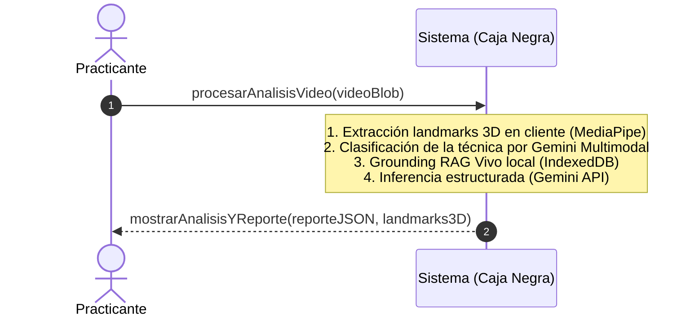
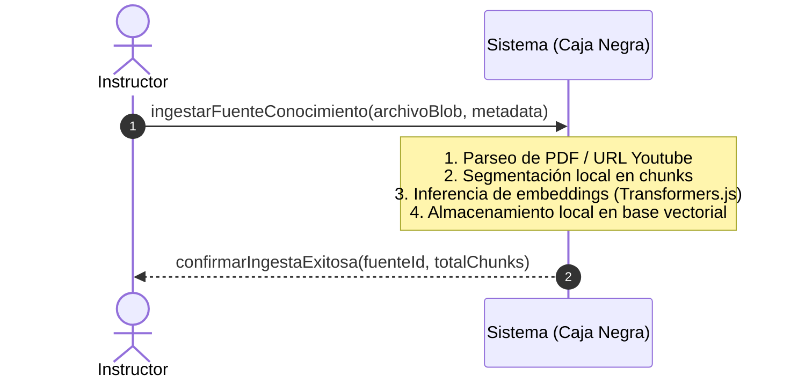
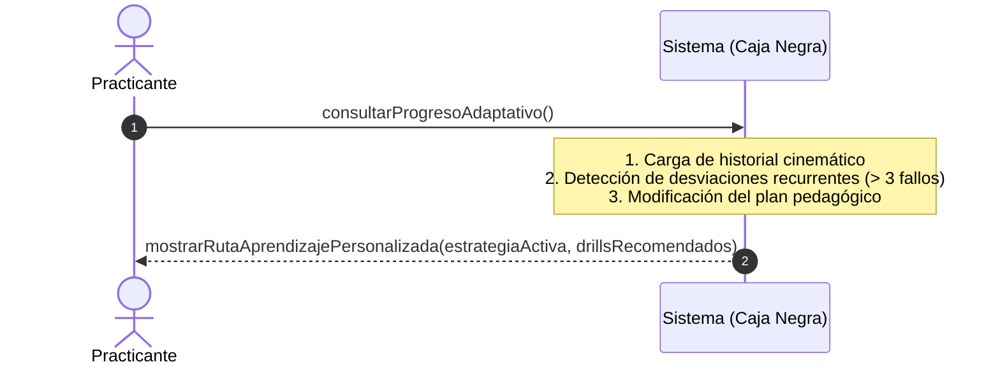
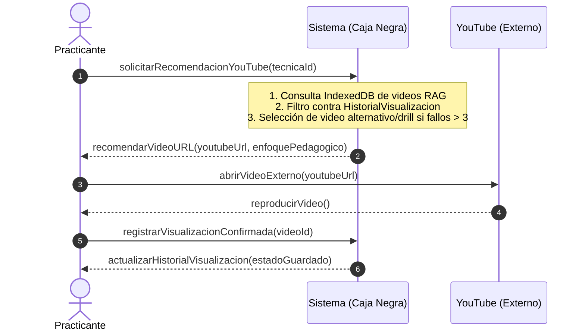
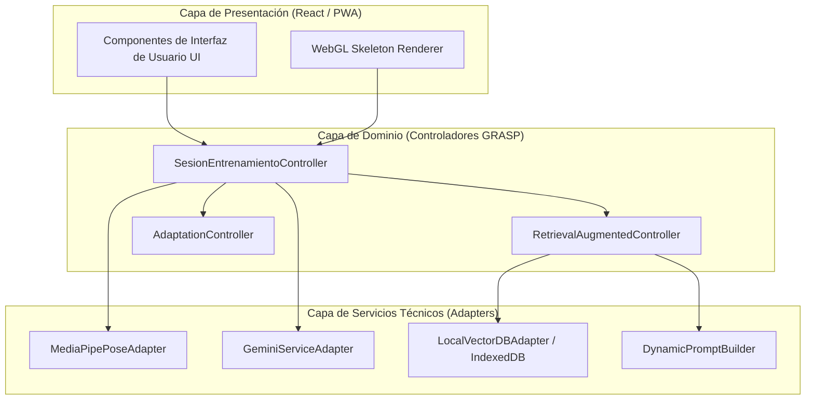
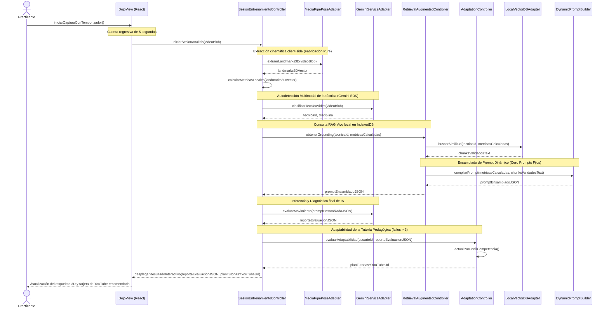
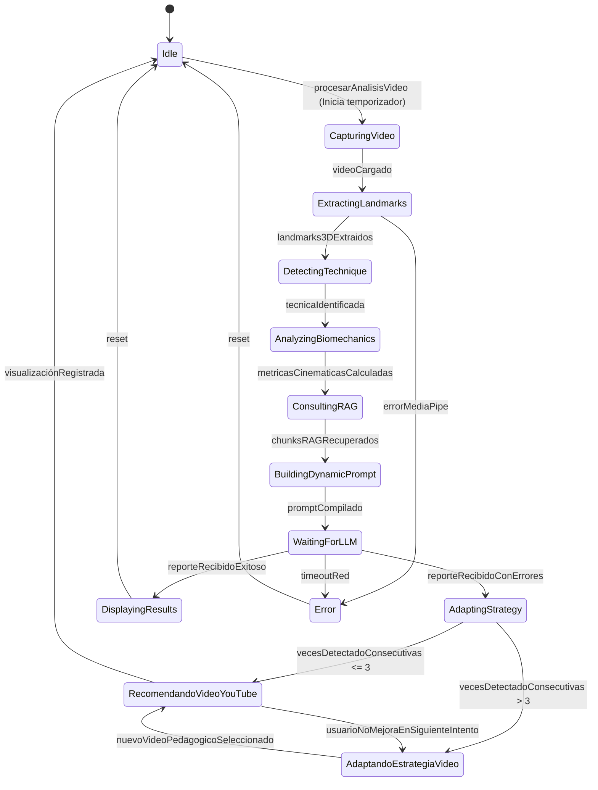
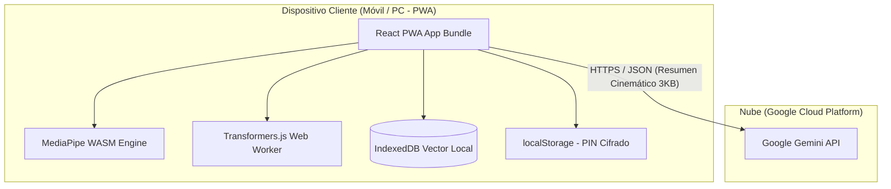

# **Aplicación WEB Inteligente de Tutoría Adaptativa y Análisis Biomecánico para Brazilian Jiu-Jitsu**

<br>

<div align="center">


<br>
<br>

**Santiago Borda Zambrana**  
*Registro: 2021210057*  

<br>

**Facultad de Ingeniería**  
*Carrera de Ingeniería de Sistemas*  
**Universidad Privada de Santa Cruz de la Sierra**  

<br>

**Modalidad de Graduación: Proyecto de Grado**  
*Para optar al título de Licenciado en Ingeniería de Sistemas*  

<br>

**Tutor:** Jose Antonio Benavente Blacutt  

<br>

**Santa Cruz de la Sierra - Bolivia**  
**2026**

</div>

<br>

# **Agradecimientos**

Agradezco a Dios por traerme a este mundo fuerte y saludable.
A mi madre, que gracias a su amor incondicional y su esfuerzo me permitió estudiar. Gracias, mami.
A mi abuela, por alimentarme y tener siempre un plato de comida listo.
A mis tíos, por sus palabras y experiencias de vida compartidas que me ayudaron a aprender.
Al Jiu-Jitsu Brasileño, por enseñarme a afrontar los miedos, a seguir adelante incluso cuando no se percibe un avance inmediato, a lidiar con la sensación de la derrota y, sobre todo, a no rendirme y seguir aprendiendo.

*Un cinturón negro es un cinturón blanco que nunca se rindió.*

<br>

# **Abstract**

| TÍTULO | Aplicación WEB Inteligente de Tutoría Adaptativa y Análisis Biomecánico para Brazilian Jiu-Jitsu |
| :--- | :--- |
| **AUTOR** | SANTIAGO BORDA ZAMBRANA |

### **Problemática**
En el aprendizaje del Brazilian Jiu-Jitsu (BJJ), los practicantes carecen de sistemas objetivos que evalúen su ejecución técnica de manera continua y adaptada a sus características físicas básicas. Las plataformas actuales presentan rigidez semántica al acoplarse a reglas de movimiento codificadas de forma estática (hardcoded), lo que impide la incorporación de nuevas variantes técnicas introducidas por instructores o academias sin reescribir el software. Asimismo, no consideran el historial de errores del alumno para adaptar la estrategia pedagógica, limitando el progreso individual y la retroalimentación en entornos de entrenamiento masivos.

### **Objetivo General**
Desarrollar el diseño de una aplicación web progresiva (PWA) inteligente que combine el análisis biomecánico 3D en el cliente y la recuperación aumentada por generación (RAG) en tiempo real para la tutoría pedagógica adaptativa del Jiu-Jitsu Brasileño, abarcando todos los niveles de graduación (desde cinturón blanco hasta negro) mediante la inyección y autodetección dinámica de conocimiento literario y audiovisual.

### **Contenido**
El presente trabajo de investigación se ha desarrollado bajo la metodología del Proceso Unificado (UP) y consta de los primeros cinco capítulos estructurados de acuerdo con los requisitos lógicos de estimación de pose, RAG dinámico (RAG Vivo), y perfilamiento de competencia de los usuarios:

| CARRERA | Ingeniería de Sistemas |
| :--- | :--- |
| **GUÍA** | Jose Antonio Benavente Blacutt |
| **DESCRIPTORES** | Visión por Computadora 3D, Recuperación Aumentada por Generación (RAG), Modelos de Pose Monocular, Tutoría Adaptativa, GRASP, PWA. |
| **EMAIL** | santiagobordazambrana@gmail.com |
| **FECHA** | Santa Cruz de la Sierra, 2026 |

<br>

# **Resumen**

En este trabajo se expone el diseño y modelado orientado a objetos de una plataforma inteligente de asistencia deportiva y tutoría adaptativa para el Brazilian Jiu-Jitsu. La solución supera las rigideces metodológicas de sistemas previos mediante una arquitectura híbrida cliente-ligero. La extracción cinemática tridimensional (landmarks 3D) ocurre directamente en el navegador del cliente mediante modelos monoculares libres de sensores físicos. Para la evaluación táctica y corrección del movimiento, se inyectan dinámicamente manuales técnicos y transcripciones de videos vectorizados localmente. El sistema realiza el seguimiento del progreso histórico del alumno mediante un perfil de competencia y altera la estrategia didáctica ante fallos recurrentes, ofreciendo una ruta de aprendizaje multi-nivel personalizada. La validez de la arquitectura se sustenta en el Proceso Unificado y el diseño orientado a objetos basado en patrones GRASP.

# **Índice de Contenidos**

- [**Agradecimientos**](#agradecimientos)
- [**Abstract**](#abstract)
- [**Resumen**](#resumen)
- [**Capítulo I: Definición del Proyecto de Investigación**](#capítulo-i-definición-del-proyecto-de-investigación)
  - [1.1 Definición del problema](#11-definición-del-problema)
    - [1.1.1 Situación problemática](#111-situación-problemática)
    - [1.1.2 Situación deseada](#112-situación-deseada)
    - [1.1.3 Objeto de investigación](#113-objeto-de-investigación)
    - [1.1.4 Alcance](#114-alcance)
    - [1.1.5 Justificación](#115-justificación)
  - [1.2 Objetivos](#12-objetivos)
    - [1.2.1 Objetivo General](#121-objetivo-general)
    - [1.2.2 Objetivos Específicos](#122-objetivos-específicos)
  - [1.3 Metodología](#13-metodología)
    - [1.3.1 Ingeniería de Software (Proceso Unificado)](#131-ingeniería-de-software-proceso-unificado)
    - [1.3.2 Gestión del Proyecto (Scrum)](#132-gestión-del-proyecto-scrum)
- [**Capítulo II: Descripción de la Entidad (Corpo \& Mente)**](#capítulo-ii-descripción-de-la-entidad-corpo--mente)
  - [2.1 Descripción de la organización](#21-descripción-de-la-organización)
  - [2.2 Descripción organizacional](#22-descripción-organizacional)
  - [2.3 Manual de funciones](#23-manual-de-funciones)
  - [2.4 Descripción de los productos y servicios](#24-descripción-de-los-productos-y-servicios)
- [**Capítulo III: Marco Teórico y Estado del Arte**](#capítulo-iii-marco-teórico-y-estado-del-arte)
  - [3.1 Conceptos y definiciones](#31-conceptos-y-definiciones)
  - [3.2 Estado del arte](#32-estado-del-arte)
  - [3.3 Modelos y teorías relevantes](#33-modelos-y-teorías-relevantes)
  - [3.4 Tecnologías y herramientas](#34-tecnologías-y-herramientas)
  - [3.5 Valor agregado](#35-valor-agregado)
  - [3.6 Limitaciones](#36-limitaciones)
  - [3.7 Justificación teórica de la metodología](#37-justificación-teórica-de-la-metodología)
- [**Capítulo IV: Definición de Requisitos**](#capítulo-iv-definición-de-requisitos)
  - [4.1 Introducción](#41-introducción)
    - [4.1.1 Propósito](#411-propósito)
    - [4.1.2 Ámbito del Sistema](#412-ámbito-del-sistema)
    - [4.1.3 Definiciones, Acrónimos y Abreviaturas](#413-definiciones-acrónimos-y-abreviaturas)
    - [4.1.4 Referencias](#414-referencias)
    - [4.1.5 Perspectiva General](#415-perspectiva-general)
  - [4.2 Descripción General](#42-descripción-general)
    - [4.2.1 Perspectiva del Producto](#421-perspectiva-del-producto)
    - [4.2.2 Funciones del Producto](#422-funciones-del-producto)
    - [4.2.3 Características de los Usuarios](#423-características-de-los-usuarios)
    - [4.2.4 Restricciones](#424-restricciones)
    - [4.2.5 Suposiciones y Dependencias](#425-suposiciones-y-dependencias)
  - [4.3 Requisitos Específicos](#43-requisitos-específicos)
    - [4.3.1 Interfaces Externas](#431-interfaces-externas)
    - [4.3.2 Requisitos Funcionales](#432-requisitos-funcionales)
    - [4.3.3 Requisitos No Funcionales (Modelo FURPS+)](#433-requisitos-no-funcionales-modelo-furps)
    - [4.3.4 Restricciones de Diseño](#434-restricciones-de-diseño)
    - [4.3.5 Atributos del Sistema de Software](#435-atributos-del-sistema-de-software)
- [**Capítulo V: Análisis y Diseño Orientado a Objetos**](#capítulo-v-análisis-y-diseño-orientado-a-objetos)
  - [5.1 Modelo de Dominio Conceptual](#51-modelo-de-dominio-conceptual)
  - [5.2 Especificación de Casos de Uso Principales](#52-especificación-de-casos-de-uso-principales)
  - [5.3 Diagramas de Secuencia del Sistema (DSS)](#53-diagramas-de-secuencia-del-sistema-dss)
  - [5.4 Contratos de las Operaciones del Sistema](#54-contratos-de-las-operaciones-del-sistema)
  - [5.5 Diseño de la Arquitectura Lógica (Patrón Capas)](#55-diseño-de-la-arquitectura-lógica-patrón-capas)
  - [5.6 Realización del Caso de Uso con Patrones GRASP](#56-realización-del-caso-de-uso-con-patrones-grasp)
  - [5.7 Diagrama de Estados para el Controlador](#57-diagrama-de-estados-para-el-controlador)
  - [5.8 Diagrama de Clases de Diseño (DCD)](#58-diagrama-de-clases-de-diseño-dcd)
  - [5.9 Diagrama de Despliegue Físico](#59-diagrama-de-despliegue-físico)
  - [5.10 Diseño de Interfaces de Usuario (UI)](#510-diseño-de-interfaces-de-usuario-ui)

# **Índice de Tablas**

- [**Tabla 1** *Análisis Comparativo de Soluciones Tecnológicas de Retroalimentación Deportiva*](#tabla-1)
- [**Tabla 2** *Especificación de Requisitos No Funcionales (FURPS+)*](#tabla-2)
- [**Tabla 3** *Responsabilidades por Capa de la Arquitectura Lógica*](#tabla-3)
- [**Tabla 4** *Justificación de Decisiones de Diseño Basadas en Patrones GRASP*](#tabla-4)
- [**Tabla 5** *Diccionario de Datos (Especificaciones de Atributos)*](#tabla-5)

# **Índice de Figuras**

- [**Figura 1** *Modelo de Dominio Conceptual de OpenBJJ*](#figura-1)
- [**Figura 2** *Diagrama Global de Casos de Uso del Sistema*](#figura-2)
- [**Figura 3** *DSS-CU01: Flujo Completo de Análisis Biomecánico y Autodetección*](#figura-3)
- [**Figura 4** *DSS-CU02: Flujo de Ingesta y Vectorización RAG*](#figura-4)
- [**Figura 5** *DSS-CU03: Flujo de Consulta de Progreso y Tutoría Adaptativa*](#figura-5)
- [**Figura 6** *DSS-CU10: Flujo de Recomendación y Adaptación de Videos de YouTube*](#figura-6)
- [**Figura 7** *Diagrama de Secuencia de Diseño (Realización de CU01)*](#figura-7)
- [**Figura 8** *Máquina de Estados de SesionEntrenamientoController*](#figura-8)
- [**Figura 9** *Diagrama de Clases de Diseño (DCD)*](#figura-9)
- [**Figura 10** *Diagrama de Despliegue Físico de OpenBJJ*](#figura-10)

---

# **CAPÍTULO I: DEFINICIÓN DEL PROYECTO DE INVESTIGACIÓN**

## **1.1 Definición del problema**

### **1.1.1 Situación problemática**
En el aprendizaje de las artes marciales y, en específico, del Brazilian Jiu-Jitsu (BJJ), los practicantes se enfrentan a una dependencia crítica de la instrucción presencial y sincrónica para corregir sus errores técnicos. En entornos de entrenamiento masivos, los instructores no pueden proporcionar atención personalizada frame por frame a cada alumno, lo que ralentiza significativamente su curva de aprendizaje.

Las soluciones tecnológicas actuales presentan limitaciones severas que impiden resolver este vacío de manera efectiva:
- **Rigidez del conocimiento (Knowledge Rigidity):** Los sistemas existentes de retroalimentación deportiva poseen reglas técnicas estáticas grabadas directamente en su código fuente (hardcoded). Esto impide la incorporación de literatura técnica diversa (manuales oficiales, reglamentos federativos variados o videos explicativos de YouTube) que los propios profesores o academias desean utilizar como fuente de verdad en un dominio abierto (Open-Domain).
- **Falta de adaptabilidad pedagógica:** Las aplicaciones no consideran el historial de rendimiento del alumno. Emiten diagnósticos aislados y genéricos sin comprender si un error es recurrente, lo que imposibilita la personalización de las estrategias de enseñanza para alumnos que presentan dificultades de progreso en articulaciones específicas.
- **Complejidad y costes de hardware:** Las herramientas que ofrecen análisis biomecánico cuantitativo preciso exigen sensores inerciales físicos (IMUs) adheridos al cuerpo o cámaras de alta velocidad en entornos controlados, lo cual es inviable sobre un tatami de sparring de BJJ por razones de seguridad, costo y usabilidad.

### **1.1.2 Situación deseada**
Se busca desarrollar una plataforma web progresiva (PWA) inteligente que actúe como un tutor biomecánico y táctico adaptativo. El practicante, independientemente de su nivel de graduación (desde cinturón blanco hasta cinturón negro), podrá cargar un video monocular de su sparring o ejecución técnica. 

El sistema procesará el video localmente en el dispositivo del usuario utilizando visión por computadora en el cliente para estimar landmarks biomecánicos en 3D sin requerir sensores físicos. Un motor de Inteligencia Artificial (IA) contrastará esta cinemática en tiempo real con especificaciones técnicas recuperadas dinámicamente desde una base de datos vectorial inyectada por el usuario (motor RAG de manuales en PDF y transcripciones de YouTube).

El sistema detectará automáticamente la técnica o deporte del video mediante inferencia multimodal y mantendrá un perfil de competencia basado en el historial del alumno. Si el alumno falla repetidamente (más de 3 veces) en una desviación técnica detectada (ej. ángulo de codo incorrecto), el motor de tutoría adaptativa modificará automáticamente la estrategia pedagógica, conmutando la recomendación de videos explicativos genéricos a drills específicos de fortalecimiento e indicaciones anatómicas. El sistema operará bajo la filosofía de "RAG Vivo", permitiendo asimilar de forma dinámica nuevas técnicas cargadas por instructores sin reentrenamiento de red.

### **1.1.3 Objeto de investigación**
El objeto de este estudio es el modelado y diseño de una arquitectura de software orientada a objetos que combine la estimación de pose 3D client-side (sin sensores) y el procesamiento semántico RAG (Retrieval-Augmented Generation) para la tutoría adaptativa, multinivel y de dominio abierto (Open-Domain) de artes marciales en tiempo de ejecución.

### **1.1.4 Alcance**
El proyecto OpenBJJ se delimita bajo los siguientes criterios:
- **Alcance Técnico:** Extracción de landmarks corporales en 3D en el lado del cliente (navegador web) a través de MediaPipe y TensorFlow.js, eliminando la transmisión del video original a servidores externos para proteger la privacidad. El motor RAG (incluyendo la generación de embeddings y el almacenamiento vectorial) se ejecuta de manera local en el cliente a través de Transformers.js (para embeddings) e IndexedDB (como base de datos vectorial local). La llamada externa a la nube se restringe a la petición de inferencia multimodal y generación a la API de Gemini.
- **Alcance de Dominio:** Cobertura de técnicas correspondientes a todos los niveles de graduación de Brazilian Jiu-Jitsu (cinturones Blanco, Azul, Morado, Marrón y Negro), con capacidad de extensión a otras disciplinas de artes marciales a través del mecanismo de ingesta dinámica de fuentes de conocimiento (Open-Domain).
- **Alcance Metodológico:** Modelado lógico, diseño orientado a objetos y especificación arquitectónica del Proceso Unificado (UP) hasta la fase de Elaboración inclusive, y la aplicación de los patrones GRASP de Craig Larman (2ª Edición).
- **Alcance de Despliegue:** Aplicación Web Progresiva (PWA) responsiva compatible con dispositivos móviles y ordenadores de escritorio mediante navegadores modernos con soporte WebGL.

### **1.1.5 Justificación**
- **Tecnológica:** Demuestra la viabilidad de implementar arquitecturas cognitivas complejas (visión 3D + RAG) en navegadores web de consumo mediante ejecución híbrida distribuida, reduciendo la infraestructura centralizada a un backend ligero serverless.
- **Económica:** Suprime la necesidad de servidores de procesamiento de video basados en GPU, delegando la carga computacional pesada al procesador local del cliente. El consumo de APIs se restringe a llamadas de texto y embeddings vectoriales de bajo costo.
- **Social:** Facilita el acceso democratizado y autónomo a la educación de artes marciales de alta calidad, alineándose con las fuentes bibliográficas de preferencia de cada academia sin intervención del programador.

## **1.2 Objetivos**

### **1.2.1 Objetivo General**
Desarrollar el diseño arquitectónico de una aplicación web inteligente de tutoría adaptativa y análisis biomecánico para Brazilian Jiu-Jitsu mediante visión computacional client-side e inyección dinámica de conocimiento por recuperación aumentada (RAG).

### **1.2.2 Objetivos Específicos**
1. Diseñar un pipeline de visión computacional client-side (MediaPipe/WebGL) para extraer landmarks en 3D y calcular métricas cinemáticas (ángulos articulares, velocidades, aceleraciones) desde videos monoculares 2D de sparring.
2. Diseñar un mecanismo de clasificación multimodal (Gemini API) para la autodetección automática del tipo de técnica o disciplina en el video sin selección manual previa por parte del usuario.
3. Modelar un motor de recuperación semántica (RAG) local que indexe dinámicamente manuales oficiales (PDF) y transcripciones de videos (YouTube) en una base de datos vectorial local para grounding de la IA evaluadora a través de un Dynamic Prompt Builder.
4. Modelar un motor de recomendación pedagógica adaptativo que evalúe la persistencia de fallos (límite de 3 intentos), mantenga un perfil de competencia y altere las estrategias de retroalimentación (redireccionando a videos de YouTube alternativos o drills de aislamiento) conforme al historial de progreso del estudiante.
5. Modelar el dominio y comportamiento del sistema utilizando diagramas UML y aplicando los patrones GRASP de Craig Larman para aislar la lógica biomecánica, RAG y adaptativa en componentes reutilizables de bajo acoplamiento.

## **1.3 Metodología**

### **1.3.1 Ingeniería de Software (Proceso Unificado)**
El Proceso Unificado (UP) rige la arquitectura técnica, el modelado y la documentación de diseño del sistema, estructurado en cuatro fases clave:
1. **Inicio (Inception):** Definición de la visión del producto, análisis preliminar de la viabilidad y establecimiento de la Lista de Riesgos inicial.
2. **Elaboración (Elaboration):** Diseño y estabilización de la arquitectura lógica ejecutable (mitigando los riesgos principales), especificación de los contratos de las operaciones del sistema, diagramación de secuencia del sistema e iteración de los diagramas de clases de diseño (DCD) y modelo de dominio conceptual.
3. **Construcción (Construction):** Programación iterativa de los componentes de software (para el próximo semestre).
4. **Transición (Transition):** Despliegue de la PWA, pruebas de campo en el tatami, y optimizaciones de rendimiento y latencia (para el próximo semestre).

### **1.3.2 Gestión del Proyecto (Scrum)**
Se utiliza Scrum para organizar el esfuerzo temporal y el backlog del proyecto a través de iteraciones fijas (*Sprints*) de 3 semanas, facilitando la inspección y adaptación constante ante impedimentos técnicos o cambios de API. Los roles clave de Product Owner, Scrum Master y Development Team se definen dentro del contexto académico para la estructuración y revisión de entregables incrementales de diseño.

---

# **CAPÍTULO II: DESCRIPCIÓN DE LA ENTIDAD (CORPO & MENTE)**

## **2.1 Descripción de la organización**
El contexto de aplicación de la plataforma inteligente es la "Academia Moderna de Artes Marciales". Tradicionalmente, los dojos y academias han dependido exclusivamente de la transmisión verbal y la instrucción física sincrónica de las técnicas de combate. Una academia moderna busca integrar la tecnología digital no para sustituir la interacción física —esencia indispensable de los deportes de contacto—, sino para expandir y complementar las capacidades de asimilación cognitiva del alumno fuera del dojo o en momentos de práctica libre autónoma. La entidad actúa como un espacio de entrenamiento híbrido donde los aspectos mecánicos del cuerpo (Corpo) y el entendimiento táctico de la mente (Mente) se unifican mediante la retroalimentación objetiva de datos.

## **2.2 Descripción organizacional**
La estructura organizativa del ecosistema digital de la academia se compone de tres actores principales:
1. **Instructores / Profesores Certificados:** Responsables de la calidad de la enseñanza física y la curación del conocimiento literario y audiovisual inyectado en el sistema.
2. **Practicantes (Alumnos):** Estudiantes de diversos niveles de graduación (cinturón blanco a negro) que interactúan con la interfaz para registrar entrenamientos y recibir tutorías.
3. **Administradores del Sistema:** Personal encargado del soporte operativo local de la PWA y la calibración técnica.

## **2.3 Manual de funciones**
- **Practicante:**
  - Cargar o grabar videos de sparring o drills técnicos.
  - Configurar manualmente sus datos antropométricos básicos (altura, peso) para el escalado cinemático.
  - Consultar reportes cinemáticos y seguir las recomendaciones pedagógicas adaptativas en YouTube o guías de drills.
- **Instructor (Rol de Validador de Fuentes):**
  - Cargar manuales oficiales de la academia (PDF) o transcripciones de videos tutoriales.
  - Revisar y moderar las fuentes de conocimiento subidas colaborativamente por la comunidad de alumnos, otorgando el estado "Validado" que las habilita en el motor RAG local.
- **Administrador:**
  - Administrar el almacenamiento local de IndexedDB del dispositivo del dojo o del usuario.
  - Verificar la conectividad de red con la API externa de Gemini.

## **2.4 Descripción de los productos y servicios**
La aplicación web inteligente proporciona los siguientes servicios clave como extensión del entrenamiento del tatami:
- **Autoevaluación Cinemática Local:** Servicio que procesa videos del usuario en tiempo real y calcula métricas cinemáticas directamente en su dispositivo.
- **Tutoría Adaptativa y Grounding:** Inferencia en lenguaje natural basada en manuales de verdad validados.
- **Redirección de Aprendizaje de YouTube (Deep Linking):** Sugerencia de videos tutoriales en la app móvil o web de YouTube según el error biomecánico detectado, con lógica de cambio de estrategia en caso de persistencia del fallo.

---

# **CAPÍTULO III: MARCO TEÓRICO Y ESTADO DEL ARTE**

## **3.1 Conceptos y definiciones**
- **Inteligencia Artificial Generativa Multimodal:** Modelos fundacionales entrenados con múltiples modalidades de datos (texto, audio, imagen, video) capaces de razonar contextualmente sobre la semántica de una secuencia visual, detectando acciones y posturas en lenguaje natural.
- **Arquitectura Cliente-Ligero (Client-Side Light Architecture):** Patrón de despliegue donde la carga computacional pesada de procesamiento de imagen e indexación vectorial se delega al navegador web mediante WebAssembly y WebGL, limitando el servidor a microservicios serverless de pasarela.
- **RAG Local y Grounding:** Arquitectura que optimiza la generación de respuestas de un LLM al recuperar fragmentos de texto relevantes de documentos externos validados por similitud semántica en tiempo de ejecución de manera local.
- **RAG Vivo (Dynamic Knowledge Ingestion):** Mecanismo de ingesta que asimila nuevos manuales y videos sin requerir reentrenamiento del modelo (Zero-Shot Learning). La adición de un PDF técnico por parte del instructor actualiza inmediatamente el corpus indexado vectorialmente en IndexedDB, quedando disponible para contrastar cinemáticas en la próxima inferencia.
- **Embeddings Vectoriales:** Vectores matemáticos densos generados por redes neuronales (como BERT o MobileBERT) que encapsulan el significado semántico de fragmentos de texto dentro de un espacio de alta dimensionalidad.
- **Biomecánica Computacional:** Disciplina que aplica principios mecánicos a la biología y estructura de los seres vivos mediante análisis numérico computerizado.
- **Estimación de Pose Monocular:** Algoritmo que reconstruye la topología del esqueleto humano en 3D (33 landmarks) a partir de una única transmisión de video en 2D en color (RGB), sin recurrir a sensores de profundidad físicos ni marcadores reflectivos.

## **3.2 Estado del arte**

Las soluciones de análisis cinemático deportivo actuales presentan brechas severas con el Jiu-Jitsu y disciplinas afines. Los sistemas inerciales (IMUs) proveen datos de alta precisión de aceleración y orientación articular, pero su equipamiento físico es costoso y peligroso al rodar sobre el tatami por la fricción de kimonos y las caídas directas. Las videotecas estáticas proveen colecciones ordenadas pero carecen de análisis cinemático interactivo. Las aplicaciones monoculares comerciales de golf y tenis calculan variables de posición en 2D, pero acoplan su lógica a un conjunto de reglas técnicas estáticas codificadas por el programador.

El siguiente cuadro analiza comparativamente las soluciones respecto a la propuesta integrada de OpenBJJ:

<a id="tabla-1"></a>
**Tabla 1**  
*Análisis Comparativo de Soluciones Tecnológicas de Retroalimentación Deportiva*

| Característica / Criterio | Sistemas Inerciales (IMUs) | Apps de Videotecas Estáticas | Apps de Golf/Tenis Monoculares | OpenBJJ (Propuesta) |
| :--- | :--- | :--- | :--- | :--- |
| **Análisis 3D sin Sensores** | No (Hardware físico) | No (Ninguno) | Sí (Estimación 2D/3D acoplada) | Sí (Pose 3D local con MediaPipe) |
| **Ingesta Dinámica (RAG Vivo)** | No | No | No (Reglas rígidas fijas) | Sí (Embeddings de PDF/YouTube) |
| **Soporte Multi-nivel** | N/A | Sí (Solo visualización) | No | Sí (Rutas de Blanco a Negro) |
| **Adaptabilidad Pedagógica** | No | No | No (Evaluación aislada) | Sí (Rastreo histórico de errores) |
| **Seguridad y Privacidad** | Media (Datos en nube) | Alta (No graba) | Baja (Video enviado a servidores) | Alta (Procesamiento local client-side) |
| **Costo Operativo de GPU** | Alto | Nulo | Alto (Servidores en la nube) | Nulo (Ejecución distribuida en cliente) |
| **Autodetección Multimodal** | No (Selección manual) | No | No (Selección manual) | Sí (Detección por Gemini Vision) |
| **Open-Domain (Sin prompts fijos)**| No | No | No (Hardcoded) | Sí (Dynamic Prompt Builder) |

## **3.3 Modelos y teorías relevantes**
- **Proceso Unificado (UP):** Metodología iterativa e incremental guiada por casos de uso y centrada en la arquitectura lógicamente consistente. Permite mitigar los riesgos principales (técnicos y de rendimiento) en las primeras fases del desarrollo.
- **Patrones GRASP (General Responsibility Assignment Software Patterns) de Larman:** Colección de principios de diseño estructurados (Experto, Creador, Controlador, Bajo Acoplamiento, Alta Cohesión, Fabricación Pura, Polimorfismo, Variaciones Protegidas) para guiar la asignación sistemática de responsabilidades en la orientación a objetos.
- **Scrum adaptado:** Marco de trabajo ágil iterativo modificado para integrar los entregables de modelado de software universitarios de manera adaptada al ritmo de iteraciones académicas.

## **3.5 Valor agregado**
- **Privacidad Absoluta de Datos:** Al procesarse el video en memoria RAM local volátil mediante MediaPipe, el video del usuario nunca es transmitido por red. Hacia la nube solo viaja un resumen numérico estructurado de landmarks y variables angulares resumidas en un payload JSON de 3KB.
- **Soberanía y Costo de Infraestructura Cero:** Delegar la extracción cinemática y la vectorización RAG al navegador suprime costes de hosting de GPU en servidores de producción, requiriendo únicamente un backend ligero serverless para comunicación externa.
- **Inferencia en Dominio Abierto (Zero-Shot RAG):** Cualquier dojo puede adaptar el sistema a nuevas artes marciales inyectando manuales en IndexedDB. El prompt builder dinámico nutre al LLM con este contexto semántico instantáneamente, sin requerir reentrenamiento del modelo.

## **3.6 Limitaciones**
- **Dependencia de Aceleración Gráfica (WebGL):** Dispositivos móviles antiguos sin soporte activo de WebGL presentarán tasas de refresco bajas (latencia de extracción).
- **Oclusiones Físicas bajo Kimonos Holgados:** Kimonos de Jiu-Jitsu excesivamente anchos pueden alterar temporalmente la precisión de la estimación de la profundidad z del esqueleto 3D.
- **Validación Humana Inicial:** La consistencia de las respuestas RAG depende directamente de la moderación de instructores humanos autorizados para validar las fuentes subidas de manera colaborativa.

## **3.7 Justificación teórica de la metodología**
La combinación del Proceso Unificado (UP) y los patrones GRASP de Larman resulta óptima para el proyecto OpenBJJ debido a la alta incertidumbre técnica del desarrollo híbrido (estimación de pose client-side y RAG local). UP promueve la estabilización temprana de la arquitectura física y lógica en la fase de Elaboración, mitigando los riesgos principales mediante casos de uso ejecutables y contratos estructurados. Por su parte, los patrones GRASP resuelven de manera formal el acoplamiento y cohesión del código al aislar la estimación de landmarks, la vectorización local y la comunicación externa de Gemini en Fabricaciones Puras y Variaciones Protegidas independientes.

---

# **CAPÍTULO IV: DEFINICIÓN DE REQUISITOS**

## **4.1 Introducción**

### **4.1.1 Propósito**
El propósito de este pliego de condiciones técnicas es definir detalladamente los requisitos de software del sistema para la plataforma OpenBJJ. El documento sirve como la especificación de requisitos formal (SRS) y especificación suplementaria para el desarrollo, pruebas e implementación del próximo semestre, orientando tanto a desarrolladores, personal docente y stakeholders del proyecto.

### **4.1.2 Ámbito del Sistema**
El sistema OpenBJJ es una aplicación web inteligente que actúa como tutor deportivo adaptativo y asistente cinemático. El software analiza videos de combates y sparrings monoculares en 2D sin sensores físicos en el tatami, autodetecta la técnica o arte marcial representada mediante IA multimodal, calcula métricas articulares en 3D en tiempo real de forma local y evalúa el movimiento contrastando la cinemática con literatura inyectada en su base vectorial local (RAG Vivo). El sistema adapta la estrategia pedagógica (enlace dinámico a YouTube o drills físicos) en función de los fallos reiterados detectados en el perfil de competencia histórica del alumno.

### **4.1.3 Definiciones, Acrónimos y Abreviaturas**
- **Landmark 3D:** Coordenada tridimensional estimada para un punto de articulación anatómica del esqueleto corporal.
- **RAG:** Recuperación Aumentada por Generación (Retrieval-Augmented Generation).
- **RAG Vivo:** Mecanismo dinámico de inyección semántica indexada en IndexedDB que habilita Zero-Shot Learning en el LLM.
- **PWA:** Aplicación Web Progresiva (Progressive Web App).
- **LLM:** Modelo de Lenguaje de Gran Escala (Large Language Model).
- **WebGL:** Librería gráfica para la renderización acelerada por GPU en navegadores web.
- **IndexedDB:** Base de datos embebida no relacional de acceso local.

### **4.1.4 Referencias**
1. **IEEE Std 830-1998:** Prácticas recomendadas por IEEE para especificaciones de requisitos de software.
2. **Larman, C. (2003):** Aplicación de patrones UML y GRASP (2ª Edición).
3. **Especificaciones de MediaPipe Pose Landmarker:** Estimación de 33 landmarks tridimensionales corporales.

### **4.1.5 Perspectiva General**
Las secciones subsecuentes detallan la perspectiva del producto en términos arquitectónicos (Sección 4.2), catalogando las interfaces externas, requisitos funcionales y no funcionales detallados (Sección 4.3) para sentar la trazabilidad absoluta del modelo y diseño del Capítulo V.

## **4.2 Descripción General**

### **4.2.1 Perspectiva del Producto**
OpenBJJ opera bajo una topología de arquitectura híbrida orientada al borde (Edge AI). El procesamiento de fotogramas, generación de embeddings vectoriales locales y almacenamiento reside 100% en el navegador del dispositivo cliente. El procesamiento cognitivo de inferencia y generación textual estructurada se realiza de forma remota mediante API serverless HTTPS que consumen el modelo de Gemini.

### **4.2.2 Funciones del Producto**
- **Autodetección Multimodal de Técnicas:** Clasificación analítica del video para detectar la disciplina y movimiento ejecutado.
- **Análisis Biomecánico Monocular:** Cálculo local de ángulos articulares vectoriales, velocidad y aceleraciones.
- **RAG Vivo Local:** Segmentación, indexación y almacenamiento vectorial de manuales técnicos en IndexedDB.
- **Tutoría Pedagógica Adaptativa:** Redirección a videos e inyección de drills de aislamiento si el error biomecánico persiste por más de 3 intentos.

### **4.2.3 Características de los Usuarios**
El sistema define tres actores formales:
1. **Practicante (Alumno):** Usuario atleta que sube videos, registra sus datos antropométricos (altura/peso) en la app y sigue las recomendaciones pedagógicas adaptativas.
2. **Instructor (Validador):** Moderador encargado de cargar y validar las fuentes RAG y drills de la academia.
3. **Administrador:** Encargado del mantenimiento técnico de las bases de datos locales y APIs.

**Gestión de Acceso Local:** La plataforma carece de un backend centralizado de autenticación. Los perfiles se guardan localmente en IndexedDB. Para habilitar las funciones de Instructor (ingesta y validación de fuentes), el usuario conmutará su rol local mediante el ingreso de un PIN de acceso o clave maestra almacenada de forma cifrada en el `localStorage` del cliente.

### **4.2.4 Restricciones**
- La API de MediaPipe client-side exige soporte WebGL activo en el navegador para acelerar el procesamiento de fotogramas.
- El video monocular de entrada debe capturar el cuerpo entero del practicante sin oclusiones severas para garantizar la consistencia temporal de landmarks.
- **Restricción de Tránsito de Datos (Ancho de Banda):** No se permite la transmisión de coordenadas 3D crudas por cada frame de video hacia la API del LLM, para evitar el desbordamiento de tokens y problemas de red. Las coordenadas de landmarks se deben resumir en métricas cinemáticas locales (ángulos críticos y velocidad articular) en el cliente antes de su transmisión hacia la nube.

**Gestión de Riesgos del Proyecto (Risk List):**
Siguiendo las directrices del UP, se identifican y priorizan los riesgos técnicos críticos que restringen el diseño y desarrollo:
- **R-01 (Riesgo Técnico - Carga de Memoria y CPU en el Cliente):** El análisis biomecánico continuo en el navegador mediante MediaPipe puede causar congelamiento de la pestaña o fatiga de la CPU en dispositivos móviles de gama media/baja si los videos son extensos.
  - *Mitigación:* Se implementa un límite estricto de duración de video a 45 segundos en el cliente y se realiza un submuestreo de fotogramas clave en lugar de procesar los 30 fps continuos.
- **R-02 (Riesgo Técnico - Alucinaciones y Desviación del LLM):** El modelo de lenguaje generativo (Gemini) puede inventar detalles biomecánicos erróneos o alucinar técnicas no presentes en el Jiu-Jitsu.
  - *Mitigación:* Se implementa un prompt de grounding rígido con inyección RAG de manuales validados (calidad de datos) y se restringe la respuesta a un esquema JSON estricto mediante la configuración de la API de Gemini.
- **R-03 (Riesgo Técnico - Latencia de Payload en Inferencia):** El envío de coordenadas tridimensionales crudas para 1,350 fotogramas satura el canal de red y excede el límite de tokens de la ventana de contexto.
  - *Mitigación:* La lógica de negocio pre-procesa y filtra los datos cinemáticos en el cliente, extrayendo únicamente los valores angulares y de velocidad críticos (resumen cinemático) para ser inyectados en formato de texto breve (JSON de 3KB).
- **R-04 (Riesgo de Usabilidad - Operación en Tatami):** Dificultad para iniciar y detener el análisis de forma interactiva durante la ejecución física de la técnica.
  - *Mitigación:* Se implementa un temporizador de cuenta regresiva (ej. 5 o 10 segundos) visible y con alertas sonoras previo al inicio de la captura de video, permitiendo al practicante colocarse en posición antes de iniciar la estimación de landmarks.

### **4.2.5 Suposiciones y Dependencias**
El cliente requiere conectividad a internet para interactuar con el backend de inferencia Gemini API y para resolver la redirección de videos de YouTube, aunque el pipeline de estimación y base de datos de grounding operen en local.

## **4.3 Requisitos Específicos**

### **4.3.1 Interfaces Externas**
- **Interfaz de Usuario (UI):** Responsiva, con diseño glassmorphic de alta visibilidad, con interfaz optimizada para iniciar la captura mediante un temporizador simple.
- **Interfaz de Hardware:** Cámara integrada (móvil o laptop) y GPU compatible con WebGL.
- **Interfaz de Software:** SDK de Google Gemini, Transformers.js para JavaScript, IndexedDB local API.
- **Interfaz de Comunicaciones:** Protocolo HTTPS/REST para el envío de payloads resumen de landmarks y recuperación de respuestas JSON estructuradas del LLM.

### **4.3.2 Requisitos Funcionales**
- **RF01: Autodetección Multimodal de la técnica/deporte:** El sistema debe procesar el archivo de video y, utilizando capacidades multimodales de la API de Gemini, detectar la técnica y disciplina realizada sin intervención manual del usuario.
- **RF02: Extracción de Landmarks 3D y cálculo cinemático local:** El sistema debe procesar localmente el video en el navegador mediante MediaPipe, extrayendo los 33 landmarks corporales y derivando ángulos, velocidad y aceleración de articulaciones en WebGL.
- **RF03: Ingesta y vectorización de fuentes externas (RAG Vivo):** El sistema debe segmentar archivos PDF y transcripciones de YouTube e indexar localmente sus chunks vectorizados mediante Transformers.js persistidos en IndexedDB. Si el manual describe una técnica nueva, el RAG inyectará inmediatamente esta verdad a la IA sin reentrenamiento del modelo.
- **RF04: Motor de Tutoría Adaptativa:** El sistema debe contrastar la cinemática del video analizado con la verdad de grounding vectorial. Si detecta desviaciones reiteradas de forma sistemática en el historial, debe alterar la estrategia didáctica.
- **RF05: Perfil de Competencia del Usuario basado en historial:** El sistema debe mantener un perfil local del estudiante que consolide las técnicas practicadas, la frecuencia de errores cinemáticos detectados, la lista de videos vistos y la estrategia pedagógica preferida.
- **RF06: Dynamic Prompt Builder:** El sistema debe compilar en tiempo real el prompt del LLM inyectando dinámicamente las métricas biomecánicas calculadas locales y los fragmentos textuales semánticamente coincidentes del RAG local, evitando prompts estáticos (hardcoded).
- **RF07: Sistema de Recomendación de Videos de YouTube:** El sistema debe redirigir al usuario a URLs específicas de YouTube (deep link) para práctica técnica. Ante fallas recurrentes (más de 3 intentos en el mismo error), debe alternar la recomendación hacia videos alternativos o drills de aislamiento/fortalecimiento.

### **4.3.3 Requisitos No Funcionales (Modelo FURPS+)**

Los requisitos no funcionales se estructuran bajo el estándar de calidad FURPS+:

<a id="tabla-2"></a>
**Tabla 2**  
*Especificación de Requisitos No Funcionales (FURPS+)*

| ID | Categoría (FURPS+) | Descripción del Requisito No Funcional |
| :--- | :--- | :--- |
| **RNF01** | Usabilidad (U) | La interfaz gráfica debe adaptarse responsivamente a pantallas móviles táctiles, asegurando operabilidad dentro del tatami con guantes o vendajes. |
| **RNF02** | Confiabilidad (R) | El sistema debe validar el formato de las coordenadas vectoriales devueltas por MediaPipe antes de enviarlas al LLM, evitando excepciones de formato en tiempo de ejecución. |
| **RNF03** | Confiabilidad / Precisión (R) | **Consistencia Temporal:** El algoritmo debe ser capaz de identificar desviaciones angulares mayores a 15 grados respecto al patrón ideal de la técnica, manteniendo una tasa de falsos positivos inferior al 10% bajo kimonos deportivos. |
| **RNF04** | Rendimiento (P) | El tiempo transcurrido entre la finalización de la extracción de landmarks y la visualización de la retroalimentación adaptativa estructurada debe ser menor a 3 segundos. |
| **RNF05** | Seguridad / Privacidad (+) | **Principio de Confidencialidad:** El archivo de video original en formato bruto nunca debe transmitirse a través de la red; el análisis espacial e inferencia de coordenadas ocurre estrictamente en memoria volátil local. |
| **RNF06** | Mantenibilidad / Soporte (S) | El motor de análisis y la lógica de recomendación pedagógica deben estar desacoplados de los servicios tecnológicos de estimación de pose mediante interfaces y patrones de Fabricación Pura. |
| **RNF07** | Usabilidad (U) | **Simplicidad Operativa:** La interfaz debe permitir iniciar una sesión de análisis en máximo 3 clics/toques, priorizando la rapidez sobre funciones accesorias. |

### **4.3.4 Restricciones de Diseño**
- El desarrollo de cliente se restringe a PWA responsiva programada sobre React y TypeScript de alta cohesión.
- La base de datos vectorial de grounding debe ser local (IndexedDB) utilizando la librería Transformers.js para evitar dependencias de APIs pagadas de persistencia vectorial.
- El único componente de red en inferencia debe ser el llamado al servicio de lenguaje multimodal serverless API de Gemini.
- No se permite el almacenamiento persistente centralizado en la nube de coordenadas cinemáticas crudas frame a frame; toda persistencia local reside en IndexedDB del cliente.

### **4.3.5 Atributos del Sistema de Software**

#### **4.3.5.1 Confiabilidad y Disponibilidad Local**
El sistema debe estar disponible en modo offline para la visualización del perfil de competencia y cálculo biomecánico mediante MediaPipe, tolerando la desconexión a internet hasta el envío final a Gemini.

#### **4.3.5.2 Reglas de Dominio (Reglas de Negocio)**
- **RD-01 (Jerarquía de Graduación):** Un practicante solo puede recibir tutoría de técnicas correspondientes a su cinturón actual o inferior, salvo autorización explícita del instructor.
- **RD-02 (Tolerancia de Rango Articular):** El umbral de error para ángulos articulares ideales se establece en un margen fijo de tolerancia de $\pm 15^{\circ}$, ajustándose en base a las proporciones físicas ingresadas por el usuario, sin requerir pruebas de movilidad previas.
- **RD-03 (Calidad del Grounding RAG):** Ningún chunk semántico proveniente de manuales o videos subidos colaborativamente por alumnos puede ser indexado ni utilizado en prompts de inferencia de IA si no cuenta con el estado de "Validado" firmado por un Instructor certificado.

#### **4.3.5.3 Diccionario de Datos (Especificaciones de Atributos)**

<a id="tabla-5"></a>
**Tabla 5**  
*Diccionario de Datos (Especificaciones de Atributos)*

| Entidad | Atributo | Tipo de Dato | Formato / Rango | Reglas de Validación |
| :--- | :--- | :--- | :--- | :--- |
| **Usuario** | `cinturon` | Enumerado | `{Blanco, Azul, Morado, Marrón, Negro}` | Obligatorio. Rige el catálogo de técnicas visible. |
| **Usuario** | `altura` | Decimal | `[0.50, 2.50]` metros | Mayor que cero. Usado para normalizar las longitudes relativas de landmarks. |
| **Usuario** | `peso` | Decimal | `[30.00, 250.00]` kilogramos | Mayor que cero. Usado para métricas de fuerza/masa relativas si aplica. |
| **MetricaCinematica** | `anguloMedido` | Decimal | `[0.00, 360.00]` grados | Calculado por la fórmula de coseno entre tres landmarks de la articulación. |
| **ErrorBiomecanico** | `severidad` | Enumerado | `{Leve, Moderado, Crítico}` | Leve: desv. $\le 15^{\circ}$; Moderado: desv. entre $15^{\circ}$ y $30^{\circ}$; Crítico: desv. $> 30^{\circ}$ o error recurrente. |
| **FuenteConocimiento** | `estadoValidacion` | Enumerado | `{Pendiente, Validado, Rechazado}` | Por defecto se crea en "Pendiente". Solo "Validado" pasa al RAG activo. |
| **VideoRecomendado** | `youtubeVideoId` | Cadena | Alfanumérico ID de YouTube | Longitud exacta de 11 caracteres. Obligatorio para deep link. |

---

# **CAPÍTULO V: ANÁLISIS Y DISEÑO ORIENTADO A OBJETOS**

## **5.1 Modelo de Dominio Conceptual**
El modelo de dominio representa las abstracciones significativas de la tutoría adaptativa de artes marciales en OpenBJJ, enfocado en el flujo de grounding y persistencia local simplificada.

<a id="figura-1"></a>
**Figura 1**  
*Modelo de Dominio Conceptual de OpenBJJ*


## **5.2 Especificación de Casos de Uso Principales**

### **Paso 1: Diagrama de Casos de Uso del Sistema**

El siguiente diagrama define los límites del sistema, relacionando los actores clave con los 11 casos de uso (CU) propuestos:

<a id="figura-2"></a>
**Figura 2**  
*Diagrama Global de Casos de Uso del Sistema*

```mermaid
flowchart TD
    Practicante((Practicante))
    Instructor((Instructor))
    
    subgraph "Sistema OpenBJJ"
        CU01(CU01: Analizar Video de Combate)
        CU02(CU02: Ingestar Nueva Fuente de Conocimiento - RAG)
        CU03(CU03: Consultar Progreso y Recibir Tutoría Adaptativa)
        CU04(CU04: Gestionar Datos Antropométricos del Usuario)
        CU05(CU05: Validar Fuente de Conocimiento)
        CU06(CU06: Gestionar Sesiones de Entrenamiento)
        CU07(CU07: Exportar/Compartir Reportes)
        CU08(CU08: Configurar Preferencias del Sistema)
        CU09(CU09: Calibrar Entorno de Captura)
        CU10(CU10: Recibir Recomendación de Video de YouTube)
        CU11(CU11: Registrar Visualización de Video de YouTube)
    end
    
    Practicante --> CU01
    Practicante --> CU03
    Practicante --> CU04
    Practicante --> CU06
    Practicante --> CU07
    Practicante --> CU08
    Practicante --> CU09
    Practicante --> CU10
    Practicante --> CU11
    
    Instructor --> CU02
    Instructor --> CU05
```



---

### **Paso 2: Redacción en Formato Larman**

#### **Casos de Uso Completamente Vestidos (Fully Dressed)**

---

##### **Caso de Uso CU01: Analizar Video de Combate**
*   **Actor Principal:** Practicante.
*   **Intereses de las Partes Involucradas:**
    *   **Practicante:** Desea recibir retroalimentación cinemática rápida, precisa y objetiva de su sparring o drill sin sensores físicos invasivos sobre el tatami.
    *   **Instructor:** Desea que la app actúe como un validador de los patrones biomecánicos del dojo.
    *   **API Gemini:** Requiere datos depurados locales para estructurar la respuesta en JSON.
*   **Precondiciones:**
    *   Soporte WebGL activo y cámara/acceso a disco funcional.
*   **Garantías de Éxito (Postcondiciones):**
    *   Landmarks 3D extraídos en cliente, técnica clasificada automáticamente, RAG consultado, prompt dinámico estructurado, evaluación devuelta y persistida localmente.
*   **Escenario Principal de Éxito (Flujo Básico):**
    1.  El Practicante graba o carga un video (máx. 45 seg) de su combate o drill técnico.
    2.  El Sistema valida el límite de duración local y procesa el video frame a frame.
    3.  El `MediaPipePoseAdapter` de visión computacional extrae los landmarks 3D $(x,y,z)$ locales.
    4.  El controlador calcula métricas cinemáticas locales (ángulos críticos, velocidad de extremidades).
    5.  El Sistema envía un resumen visual (keyframes) a la `GeminiServiceAdapter` para clasificar la técnica del video (Autodetección Multimodal).
    6.  La API de Gemini responde con el ID de la técnica e identificador de disciplina (ej. "Guardia Cerrada").
    7.  El `RetrievalAugmentedController` busca fragmentos semánticamente equivalentes en la `VectorDBAdapter` local (IndexedDB) para esa técnica.
    8.  El `DynamicPromptBuilder` fusiona los fragmentos RAG con las métricas biomecánicas calculadas en un prompt JSON de contexto (cero prompts fijos).
    9.  El prompt estructurado es enviado a la API de Gemini para la evaluación cognitiva final.
    10. El Sistema recibe y parsea la evaluación, identificando desviaciones angulares mayores a la tolerancia fija de $\pm 15^{\circ}$ normalizada por las dimensiones antropométricas del usuario.
    11. El Sistema guarda los resultados en el historial del `PerfilCompetencia` y despliega la línea de tiempo 3D del esqueleto con el informe de fallas y recomendaciones de YouTube.
*   **Extensiones (Flujos Alternativos):**
    *   *3a. Fallo en estimación de landmarks (oclusión severa):*
        1. MediaPipe reporta confianza media inferior a 0.5.
        2. El sistema alerta al usuario y detiene el análisis sugiriendo mejor iluminación o encuadre.
    *   *6a. Gemini no identifica la técnica:*
        1. Gemini devuelve "Técnica Desconocida / Estilo Libre".
        2. El sistema conmuta a un prompt de evaluación basado en principios universales de balance, postura y palanca.
    *   *9a. Error de conexión de red:*
        1. El envío del prompt al LLM falla.
        2. El sistema almacena localmente el resumen biomecánico numérico y agenda la inferencia diferida para cuando se restablezca la conexión.

---

##### **Caso de Uso CU02: Ingestar Nueva Fuente de Conocimiento (RAG)**
**Actor Principal:** Instructor.
**Intereses de las Partes Involucradas:**
*   **Instructor:** Desea expandir el corpus de manuales técnicos y videos de su academia para fundamentar las respuestas de la IA con conocimiento curado, sin depender de reentrenamiento de red (RAG Vivo).
*   **Sistema/IA:** Requiere que los nuevos documentos se fragmenten, vectoricen y persistan correctamente para poder ser recuperados por similitud semántica en consultas futuras.
**Precondiciones:**
*   El usuario ha ingresado el PIN maestro local, conmutando la interfaz a "Modo Instructor".
*   El dispositivo cuenta con espacio disponible en IndexedDB para almacenar los nuevos embeddings.
*   El archivo PDF o la URL de YouTube son accesibles y están en un formato soportado por el parser local.
**Garantías de Éxito (Postcondiciones):**
*   Se creó una instancia de `FuenteConocimiento` (o su subclase `ManualPDF` / `VideoYouTube`) con sus metadatos inicializados.
*   El contenido del archivo fue segmentado en chunks lógicos de texto.
*   Se generaron los embeddings vectoriales de cada chunk mediante `Transformers.js` en un Web Worker local.
*   Se persistieron los chunks y sus vectores correspondientes en IndexedDB a través de `VectorDBAdapter`, etiquetados con el estado "Pendiente de Validación".
**Escenario Principal de Éxito (Flujo Básico):**
1.  El Instructor selecciona la opción "Ingestar Fuente de Conocimiento" en el panel de administración.
2.  El Sistema presenta las opciones de carga: archivo PDF técnico o enlace de YouTube.
3.  El Instructor carga un archivo PDF desde su dispositivo o pega una URL de YouTube.
4.  El Sistema valida el formato del archivo o la accesibilidad del enlace.
5.  El Sistema segmenta el contenido en fragmentos (chunks) lógicos de texto (páginas del PDF o transcripción del video).
6.  El Sistema invoca a `Transformers.js` localmente mediante un Web Worker en segundo plano para calcular los embeddings vectoriales de cada chunk.
7.  El Sistema persiste los fragmentos de texto y sus correspondientes vectores en IndexedDB a través de `VectorDBAdapter`, asignando el estado "Pendiente de Validación".
8.  El Sistema confirma al Instructor que la ingesta se completó exitosamente, mostrando el número total de chunks procesados.
**Extensiones (Flujos Alternativos):**
*   **4a. El archivo no es un PDF válido o la URL de YouTube es inaccesible:**
    1.  El Sistema detecta que el formato no es soportado o el enlace no responde.
    2.  El Sistema muestra un mensaje de error descriptivo al Instructor.
    3.  El flujo retorna al paso 3 para que el Instructor seleccione otro archivo o enlace.
*   **6a. El Web Worker de Transformers.js falla por memoria insuficiente:**
    1.  El Sistema detecta que el dispositivo no dispone de RAM suficiente para procesar todos los embeddings de una vez.
    2.  El Sistema divide los chunks en lotes más pequeños y procesa secuencialmente con pausas intermedias.
    3.  Si aún así falla, el Sistema notifica al Instructor y sugiere liberar recursos o utilizar un dispositivo con mayor capacidad.
*   **7a. IndexedDB alcanza su cuota de almacenamiento:**
    1.  El Sistema detecta que la base de datos local ha alcanzado su límite de almacenamiento.
    2.  El Sistema notifica al Instructor y ofrece la opción de purgar fuentes antiguas no validadas o cancelar la operación.
    3.  Si el Instructor acepta purgar, el Sistema elimina los chunks más antiguos y reintenta la persistencia.
**Requisitos Especiales:**
*   El procesamiento de embeddings debe realizarse completamente en el cliente sin transmitir el contenido original del PDF o la transcripción de YouTube a servidores externos.
*   La ingesta de un PDF de hasta 50 páginas debe completarse en un tiempo razonable (menos de 5 minutos en un dispositivo móvil de gama media).

---

##### **Caso de Uso CU03: Consultar Progreso y Recibir Tutoría Adaptativa**
**Actor Principal:** Practicante.
**Intereses de las Partes Involucradas:**
*   **Practicante:** Desea comprender su evolución técnica a lo largo del tiempo y recibir orientaciones pedagógicas personalizadas que aborden sus errores recurrentes de forma específica.
*   **Instructor:** Desea que el sistema identifique patrones de fallo persistentes en sus alumnos para poder intervenir de manera focalizada durante las sesiones presenciales.
*   **Sistema/IA:** Requiere acceder al historial completo de `ErrorBiomecanico` y `PerfilCompetencia` para determinar si la estrategia pedagógica actual es efectiva o debe conmutarse.
**Precondiciones:**
*   El Practicante ha realizado al menos una sesión de análisis biomecánico (CU01) cuyos resultados están persistidos en IndexedDB.
*   Existe una instancia de `PerfilCompetencia` inicializada para el usuario.
**Garantías de Éxito (Postcondiciones):**
*   Se generó un reporte de evolución cinemática basado en el historial de análisis del usuario.
*   Se evaluó la recurrencia de errores biomecánicos y, si se detectaron fallos consecutivos (> 3 veces), se modificó el plan pedagógico en `RutaAprendizaje`.
*   Se desplegaron las recomendaciones adaptativas actualizadas (drills de fortalecimiento, videos alternativos con enfoque pedagógico distinto).
**Escenario Principal de Éxito (Flujo Básico):**
1.  El Practicante navega a la sección "Progreso y Ruta de Aprendizaje" desde el panel principal.
2.  El Sistema carga el `PerfilCompetencia` del usuario desde IndexedDB.
3.  El `AdaptationController` consulta el historial de `ErrorBiomecanico` asociado al perfil del Practicante.
4.  El Sistema procesa la frecuencia y consecutividad de las desviaciones detectadas en análisis previos.
5.  El Sistema identifica los errores recurrentes donde `vecesDetectadoConsecutivas > 3` (ej. ángulo de codo incorrecto persistente en guardia cerrada).
6.  El Sistema evalúa si la estrategia pedagógica actual ha producido mejoría cinemática comparando métricas de las últimas tres sesiones.
7.  Si no hay mejoría, el Sistema activa el cambio de estrategia instruccional: conmuta de recomendaciones de videos técnicos estándar a drills de fortalecimiento muscular o videos con enfoque pedagógico alternativo.
8.  El Sistema compila un reporte visual de evolución con gráficos de progreso por articulación y técnica.
9.  El Sistema despliega la ruta de aprendizaje personalizada, incluyendo los enlaces de YouTube actualizados y los drills anatómicos recomendados.
**Extensiones (Flujos Alternativos):**
*   **3a. No existe historial de análisis previo:**
    1.  El Sistema detecta que `PerfilCompetencia` no contiene entradas de `ErrorBiomecanico`.
    2.  El Sistema muestra un mensaje indicando que aún no hay datos de progreso disponibles e invita al Practicante a realizar su primer análisis (CU01).
*   **6a. El usuario ha mostrado mejoría cinemática en las últimas tres sesiones:**
    1.  El Sistema determina que las métricas angulares se han acercado al rango de tolerancia.
    2.  El Sistema mantiene la estrategia pedagógica actual y felicita al Practicante por su progreso.
    3.  El flujo continúa al paso 8 con la visualización del reporte de evolución.
*   **8a. Error al generar el reporte visual:**
    1.  El Sistema falla al compilar los gráficos de progreso.
    2.  El Sistema despliega la información en formato tabular como fallback y registra el incidente para diagnóstico.
**Requisitos Especiales:**
*   El cálculo de recurrencia de errores debe considerar solo análisis de la misma técnica para evitar falsos positivos entre disciplinas diferentes.
*   La visualización del reporte debe ser responsiva y legible en pantallas móviles de al menos 320px de ancho.

---

##### **Caso de Uso CU04: Gestionar Datos Antropométricos del Usuario**
**Actor Principal:** Practicante.
**Intereses de las Partes Involucradas:**
*   **Practicante:** Desea que las métricas biomecánicas calculadas por el Sistema estén normalizadas según su complexidad física (altura, peso) para recibir evaluaciones justas y comparables a lo largo del tiempo.
*   **Sistema/IA:** Requiere datos antropométricos actualizados para escalar correctamente los umbrales de tolerancia angular y las velocidades articulares esperadas.
**Precondiciones:**
*   El usuario ha creado un perfil de Practicante en la aplicación y su instancia de `Usuario` existe en IndexedDB.
**Garantías de Éxito (Postcondiciones):**
*   Se modificó la instancia de `Usuario` asociada al Practicante, actualizando los atributos `altura` y `peso` con los nuevos valores numéricos validados.
*   Los cambios están disponibles inmediatamente para el siguiente análisis biomecánico (CU01) que utilice estos datos como factor de normalización.
**Escenario Principal de Éxito (Flujo Básico):**
1.  El Practicante navega a la sección "Ajustes de Perfil" desde el menú principal.
2.  El Sistema carga los datos antropométricos actuales del objeto `Usuario` desde IndexedDB y los presenta en un formulario editable.
3.  El Practicante ingresa o modifica su altura (en cm) y peso (en kg).
4.  El Sistema valida que los valores se encuentren dentro de rangos numéricos aceptables (altura: 100-220 cm, peso: 30-200 kg).
5.  El Sistema persiste los nuevos valores en la instancia de `Usuario` en IndexedDB.
6.  El Sistema confirma al Practicante que sus datos fueron actualizados correctamente.
**Extensiones (Flujos Alternativos):**
*   **4a. Los valores ingresados están fuera de rango:**
    1.  El Sistema detecta que la altura o el peso no se encuentran dentro de los rangos aceptables.
    2.  El Sistema resalta el campo inválido con un mensaje de error específico (ej. "La altura debe estar entre 100 y 220 cm").
    3.  El flujo retorna al paso 3 para que el Practicante corrija el valor.
*   **5a. Error de escritura en IndexedDB:**
    1.  El Sistema no puede persistir los datos por un fallo de almacenamiento local.
    2.  El Sistema notifica al Practicante que no se pudieron guardar los cambios y sugiere reintentar.
    3.  Los datos anteriores se mantienen vigentes hasta que la operación se complete exitosamente.
**Requisitos Especiales:**
*   Los datos antropométricos se almacenan exclusivamente en IndexedDB local y nunca se transmiten a servidores externos.
*   El formulario debe incluir indicadores de unidad de medida (cm, kg) claros para evitar confusión del usuario.

---

##### **Caso de Uso CU05: Validar Fuente de Conocimiento**
**Actor Principal:** Instructor.
**Intereses de las Partes Involucradas:**
*   **Instructor:** Desea garantizar que solo el conocimiento técnicamente preciso y alineado con la metodología de su academia sea utilizado por la IA para evaluar a los alumnos, actuando como curador de calidad.
*   **Practicante:** Se beneficia indirectamente al recibir evaluaciones basadas en fuentes de conocimiento verificadas por su instructor de confianza.
*   **Sistema/IA:** Requiere que las fuentes estén marcadas como "Validado" para incluirlas en los fragmentos recuperados durante las consultas semánticas del motor RAG.
**Precondiciones:**
*   El usuario se encuentra autenticado con rol de Instructor (ha ingresado el PIN maestro local).
*   Existen al menos una instancia de `FuenteConocimiento` con `estadoValidacion == "Pendiente"` en IndexedDB, cargada previamente por la comunidad o por el propio Instructor (CU02).
**Garantías de Éxito (Postcondiciones):**
*   Se modificó el atributo `estadoValidacion` de la entidad `FuenteConocimiento` asociada, estableciéndolo en "Validado".
*   Los chunks vectoriales correspondientes a la fuente fueron activados para las consultas semánticas del motor RAG en análisis futuros.
**Escenario Principal de Éxito (Flujo Básico):**
1.  El Instructor accede al panel de administración y selecciona la sección "Fuentes por Validar".
2.  El Sistema consulta en IndexedDB todas las instancias de `FuenteConocimiento` con `estadoValidacion == "Pendiente"`.
3.  El Sistema despliega la lista de fuentes pendientes con sus metadatos (título, tipo, fecha de carga, autor).
4.  El Instructor selecciona una fuente de la lista para revisión.
5.  El Sistema presenta una vista de previsualización con los fragmentos de texto (chunks) de la fuente y sus embeddings asociados.
6.  El Instructor revisa los fragmentos, confirma su exactitud técnica y coherencia con la metodología de la academia, y selecciona la acción "Validar".
7.  El Sistema actualiza el atributo `estadoValidacion` de la entidad `FuenteConocimiento` a "Validado" en IndexedDB.
8.  El Sistema confirma al Instructor que la fuente ha sido validada exitosamente y ya está disponible para el motor RAG.
**Extensiones (Flujos Alternativos):**
*   **3a. No existen fuentes pendientes de validación:**
    1.  El Sistema detecta que no hay instancias de `FuenteConocimiento` con estado "Pendiente".
    2.  El Sistema muestra un mensaje indicando que no hay fuentes por validar e invita al Instructor a ingerir nuevas fuentes (CU02).
*   **6a. El Instructor determina que la fuente contiene información técnica incorrecta:**
    1.  El Instructor selecciona la acción "Rechazar" en lugar de "Validar".
    2.  El Sistema actualiza el atributo `estadoValidacion` a "Rechazado".
    3.  Los chunks de la fuente rechazada quedan excluidos permanentemente de las consultas semánticas del motor RAG.
*   **7a. Error al actualizar el estado en IndexedDB:**
    1.  El Sistema falla al persistir el cambio de estado.
    2.  El Sistema notifica al Instructor y reintenta la operación.
    3.  Si el error persiste, el Sistema mantiene el estado original y registra el incidente.
**Requisitos Especiales:**
*   La previsualización de los chunks debe permitir al Instructor navegar entre fragmentos de texto de forma paginada para facilitar la revisión de documentos extensos.
*   Cada acción de validación o rechazo debe quedar registrada con fecha y autor en el historial de auditoría local del Sistema.

---

##### **Caso de Uso CU10: Recibir Recomendación de Video de YouTube**
*   **Actor Principal:** Practicante.
*   **Precondiciones:**
    *   Se ha ejecutado una sesión de análisis cinemático con detección de desviaciones técnicas.
*   **Garantías de Éxito:**
    *   El usuario recibe una recomendación de video de YouTube con redirección externa para su corrección.
*   **Escenario Principal de Éxito:**
    1.  El Practicante finaliza un análisis donde se identificó un `ErrorBiomecanico` crítico.
    2.  El `AdaptationController` busca en IndexedDB videos instructivos para la técnica y el error específico.
    3.  El controlador contrasta los videos disponibles contra el `HistorialVisualizacion` del usuario y su recurrencia de fallos.
    4.  Si el usuario ya vio el video técnico estándar pero ha fallado más de 3 veces consecutivas en la misma articulación, el sistema marca el video como "Visto sin mejora".
    5.  El sistema conmuta de estrategia pedagógica y recomienda un video alternativo (ej. video explicativo a cámara lenta o drill específico de aislamiento muscular).
    6.  El sistema muestra la tarjeta de YouTube con redirección directa (deep link).
    7.  El Practicante hace clic en el enlace, abriendo YouTube externamente.
    8.  El Practicante confirma su visualización y la app registra el consumo en su historial.

---

##### **Caso de Uso CU06: Gestionar Sesiones de Entrenamiento**
**Actor Principal:** Practicante.
**Intereses de las Partes Involucradas:**
*   **Practicante:** Desea organizar su historial de entrenamientos, eliminando videos obsoletos o clasificando sesiones por fecha, técnica o nivel de intensidad para facilitar la consulta retrospectiva de su progreso.
*   **Sistema/IA:** Requiere mantener el almacenamiento local de IndexedDB optimizado, eliminando registros que el usuario ya no considera relevantes para liberar espacio y mejorar el rendimiento de las consultas.
**Precondiciones:**
*   El Practicante ha realizado al menos una sesión de análisis biomecánico (CU01) que está almacenada como instancia de `SesionEntrenamiento` o `SesionAnalisis` en IndexedDB.
**Garantías de Éxito (Postcondiciones):**
*   Se modificó, eliminó o reclasificó al menos una instancia de `SesionEntrenamiento` en el historial local del Practicante según la operación CRUD solicitada.
*   El espacio de almacenamiento liberado por sesiones eliminadas está disponible para nuevas ingestas de conocimiento o análisis.
**Escenario Principal de Éxito (Flujo Básico):**
1.  El Practicante navega a la sección "Historial de Entrenamientos" desde el panel principal.
2.  El Sistema carga todas las instancias de `SesionEntrenamiento` asociadas al perfil del Practicante desde IndexedDB.
3.  El Sistema despliega la lista de sesiones ordenadas cronológicamente, mostrando metadatos resumidos (fecha, técnica detectada, puntuación táctica).
4.  El Practicante selecciona una sesión específica para gestionar.
5.  El Sistema presenta las opciones disponibles: ver detalle, renombrar, clasificar por etiqueta o eliminar.
6.  El Practicante selecciona la operación deseada y confirma la acción.
7.  El Sistema ejecuta la operación CRUD correspondiente sobre la instancia de `SesionEntrenamiento` en IndexedDB.
8.  El Sistema confirma al Practicante que la operación se completó exitosamente y actualiza la vista del historial.
**Extensiones (Flujos Alternativos):**
*   **3a. No existen sesiones de entrenamiento registradas:**
    1.  El Sistema detecta que IndexedDB no contiene instancias de `SesionEntrenamiento` para este usuario.
    2.  El Sistema muestra un mensaje invitando al Practicante a realizar su primer análisis (CU01).
*   **6a. El Practicante selecciona eliminar una sesión:**
    1.  El Sistema muestra un diálogo de confirmación advirtiendo que la acción es irreversible.
    2.  Si el Practicante confirma, el Sistema elimina la instancia de `SesionEntrenamiento` y sus entidades asociadas (`AnalisisBiomecanico`, `MetricaCinematica`) de IndexedDB.
    3.  Si el Practicante cancela, el flujo retorna al paso 5.
*   **7a. Error de escritura en IndexedDB durante la operación:**
    1.  El Sistema falla al persistir la operación CRUD.
    2.  El Sistema notifica al Practicante que no se pudo completar la acción y sugiere reintentar.
**Requisitos Especiales:**
*   La lista de sesiones debe soportar filtrado por rango de fechas, técnica y etiqueta para facilitar la navegación en historiales extensos.
*   La eliminación de sesiones debe ser lógica (marcado como eliminado) o física según la capacidad del navegador, garantizando que los datos eliminados no sean recuperables por consultas semánticas futuras.

---

##### **Caso de Uso CU07: Exportar/Compartir Reportes**
**Actor Principal:** Practicante.
**Intereses de las Partes Involucradas:**
*   **Practicante:** Desea generar un archivo portable (PDF o imagen) del reporte de análisis biomecánico para compartirlo con su instructor, documentar su progreso o archivarlo externamente a la aplicación.
*   **Instructor:** Se beneficia al recibir reportes estructurados de sus alumnos que facilitan la preparación de sesiones de corrección personalizada.
*   **Sistema/IA:** Requiere componer una representación visual del esqueleto 3D superpuesto al video frame clave junto con la puntuación táctica y las desviaciones detectadas en un formato exportable.
**Precondiciones:**
*   Existe al menos una instancia de `AnalisisBiomecanico` completada con resultados de Gemini persistidos en IndexedDB para la sesión seleccionada.
**Garantías de Éxito (Postcondiciones):**
*   Se generó un archivo exportable (PDF o imagen) que contiene el esqueleto 3D superpuesto, las métricas cinemáticas, la puntuación táctica y las recomendaciones de corrección.
*   El archivo fue descargado al dispositivo del Practicante o compartido mediante el mecanismo nativo de la PWA (Web Share API).
**Escenario Principal de Éxito (Flujo Básico):**
1.  El Practicante selecciona una sesión de análisis completada desde su historial de entrenamientos.
2.  El Sistema despliega el detalle del análisis con las métricas cinemáticas y la evaluación de Gemini.
3.  El Practicante selecciona la opción "Exportar Reporte".
4.  El Sistema presenta las opciones de formato: PDF o imagen PNG.
5.  El Practicante selecciona el formato deseado.
6.  El Sistema compone el reporte renderizando el esqueleto 3D superpuesto al frame clave del video, las métricas cinemáticas calculadas, la puntuación táctica y las desviaciones angulares detectadas.
7.  El Sistema genera el archivo en el formato seleccionado y lo descarga al dispositivo del Practicante.
8.  El Sistema ofrece la opción de compartir el archivo directamente mediante la Web Share API.
**Extensiones (Flujos Alternativos):**
*   **4a. El navegador no soporta Web Share API:**
    1.  El Sistema detecta que el dispositivo no soporta compartir nativamente.
    2.  El Sistema omite la opción de compartir y solo ofrece la descarga del archivo.
*   **6a. Error al renderizar el esqueleto 3D para exportación:**
    1.  El Sistema falla al capturar el frame del WebGL Renderer.
    2.  El Sistema genera el reporte sin la imagen del esqueleto 3D, incluyendo únicamente las métricas numéricas y el texto de evaluación.
    3.  El Sistema notifica al Practicante que la visualización 3D no pudo incluirse.
*   **7a. Error de descarga por almacenamiento insuficiente:**
    1.  El dispositivo no tiene espacio suficiente para guardar el archivo generado.
    2.  El Sistema notifica al Practicante y sugiere liberar espacio antes de reintentar.
**Requisitos Especiales:**
*   El reporte PDF debe incluir la fecha, hora y duración del análisis, así como el nivel de graduación del Practicante para contextualizar la evaluación.
*   La generación del archivo debe completarse en menos de 10 segundos en un dispositivo móvil de gama media.

---

##### **Caso de Uso CU08: Configurar Preferencias del Sistema**
**Actor Principal:** Practicante.
**Intereses de las Partes Involucradas:**
*   **Practicante:** Desea personalizar la experiencia de uso de la PWA según sus necesidades individuales, como el idioma de retroalimentación de la IA, el nivel de zoom del esqueleto 3D y el sistema métrico para la estimación física.
*   **Sistema/IA:** Requiere conocer las preferencias del usuario para adaptar la presentación de resultados, el idioma de los prompts enviados a Gemini y la escala de visualización del renderer 3D.
**Precondiciones:**
*   El Practicante tiene un perfil activo en la aplicación con una instancia de `Usuario` persistida en IndexedDB.
**Garantías de Éxito (Postcondiciones):**
*   Se modificaron las preferencias de configuración del Practicante en su perfil local (`Usuario.preferencias` o entidad asociada `PreferenciasUsuario`).
*   Los cambios se aplican inmediatamente a la interfaz y al comportamiento del Sistema en la sesión activa.
**Escenario Principal de Éxito (Flujo Básico):**
1.  El Practicante navega a la sección "Configuración" desde el menú principal.
2.  El Sistema carga las preferencias actuales del Practicante desde IndexedDB y las presenta en un formulario con las opciones disponibles.
3.  El Practicante modifica una o más preferencias: idioma de retroalimentación de la IA (ej. español, inglés, portugués), nivel de zoom predeterminado del esqueleto 3D, sistema métrico (métrico/imperial).
4.  El Sistema valida que las selecciones sean opciones soportadas.
5.  El Sistema persiste las nuevas preferencias en el perfil del Practicante en IndexedDB.
6.  El Sistema aplica los cambios inmediatamente a la interfaz activa y confirma al Practicante que la configuración fue actualizada.
**Extensiones (Flujos Alternativos):**
*   **4a. El Practicante selecciona una opción no soportada:**
    1.  El Sistema detecta una preferencia inválida (posible manipulación del DOM).
    2.  El Sistema rechaza el cambio y restaura el valor anterior, mostrando un mensaje de error.
*   **5a. Error de escritura en IndexedDB:**
    1.  El Sistema no puede persistir las preferencias por un fallo de almacenamiento local.
    2.  El Sistema notifica al Practicante y mantiene las preferencias anteriores activas hasta que la operación se complete.
**Requisitos Especiales:**
*   Las preferencias de idioma deben afectar tanto la interfaz de usuario como el idioma del prompt enviado a la API de Gemini para la generación de retroalimentación en lenguaje natural.
*   El cambio de sistema métrico debe recalcular y redimensionar las visualizaciones numéricas existentes sin alterar los datos cinemáticos crudos almacenados.

---

##### **Caso de Uso CU09: Calibrar Entorno de Captura**
**Actor Principal:** Practicante.
**Intereses de las Partes Involucradas:**
*   **Practicante:** Desea asegurarse de que las condiciones de iluminación, encuadre y distancia de la cámara sean óptimas antes de iniciar un análisis biomecánico, maximizando la precisión de la estimación de landmarks 3D.
*   **Sistema/IA:** Requiere que el video de entrada cumpla con condiciones mínimas de calidad visual para que MediaPipe pueda extraer landmarks con un nivel de confianza suficiente (media > 0.5).
**Precondiciones:**
*   El dispositivo del Practicante cuenta con una cámara funcional accesible desde el navegador (permiso de cámara concedido).
*   El soporte WebGL está activo para la ejecución de MediaPipe.
**Garantías de Éxito (Postcondiciones):**
*   El Sistema evaluó las condiciones de captura (iluminación, encuadre, distancia) y confirmó que son adecuadas para un análisis biomecánico preciso, o proporcionó indicaciones específicas de mejora.
*   El Practicante ajustó su posición o el entorno según las indicaciones del Sistema antes de iniciar la grabación del análisis (CU01).
**Escenario Principal de Éxito (Flujo Básico):**
1.  El Practicante selecciona la opción "Calibrar Entorno de Captura" desde el panel principal.
2.  El Sistema activa la cámara del dispositivo y muestra una vista en tiempo real con superposiciones de guía visual (zonas de encuadre, indicador de iluminación).
3.  El Sistema ejecuta un análisis preliminar con MediaPipe para detectar la presencia del cuerpo completo del Practicante en el encuadre.
4.  El Sistema evalúa el nivel de iluminación del fondo y la nitidez de la imagen capturada.
5.  El Sistema verifica que todas las articulaciones clave (hombros, codos, caderas, rodillas, tobillos) sean detectables con un nivel de confianza aceptable.
6.  El Sistema muestra un indicador de estado (verde/amarillo/rojo) para cada condición evaluada: encuadre, iluminación, detección corporal.
7.  Si todas las condiciones son adecuadas, el Sistema confirma al Practicante que el entorno está calibrado y listo para grabar.
**Extensiones (Flujos Alternativos):**
*   **3a. MediaPipe no detecta un cuerpo completo en el encuadre:**
    1.  El Sistema identifica que partes del cuerpo (ej. pies o cabeza) están fuera del campo visual.
    2.  El Sistema muestra una superposición visual indicando la zona donde el Practicante debe posicionarse.
    3.  El Practicante ajusta su posición y el Sistema reintenta la detección.
*   **4a. La iluminación es insuficiente:**
    1.  El Sistema detecta que el nivel de luz de fondo está por debajo del umbral mínimo para una estimación precisa.
    2.  El Sistema muestra una alerta: "Iluminación insuficiente. Acérquese a una fuente de luz o encienda una lámpara frontal."
    3.  El Practicante ajusta la iluminación y el Sistema reintenta la evaluación.
*   **4b. La iluminación es excesiva (sobreexposición):**
    1.  El Sistema detecta que la imagen está sobreexpuesta, lo que reduce el contraste de las articulaciones.
    2.  El Sistema sugiere reducir la intensidad de la luz o cambiar el ángulo de la cámara.
*   **5a. Confianza de detección inferior al umbral mínimo:**
    1.  El Sistema detecta que las articulaciones clave tienen un nivel de confianza medio inferior a 0.5.
    2.  El Sistema sugiere alejar la cámara, usar ropa de contraste con el fondo o eliminar obstáculos visuales.
**Requisitos Especiales:**
*   La calibración debe completarse en menos de 15 segundos para no interrumpir significativamente la rutina de entrenamiento del Practicante.
*   Las guías visuales de superposición deben ser claras y visibles incluso en pantallas móviles pequeñas (mínimo 320px de ancho).
*   La cámara NO debe grabar ni almacenar video durante la calibración; solo se procesan frames en memoria volátil para la evaluación de condiciones.

---

## **5.3 Diagramas de Secuencia del Sistema (DSS)**

Los diagramas describen el comportamiento del sistema como caja negra, capturando las operaciones de entrada/salida para los flujos principales.

### **DSS-CU01: Realizar Análisis Biomecánico y Autodetección**

<a id="figura-3"></a>
**Figura 3**  
*DSS-CU01: Flujo Completo de Análisis Biomecánico y Autodetección*



### **DSS-CU02: Ingestar Nueva Fuente de Conocimiento (RAG)**

<a id="figura-4"></a>
**Figura 4**  
*DSS-CU02: Flujo de Ingesta y Vectorización RAG*



### **DSS-CU03: Consultar Progreso y Tutoría Adaptativa**

<a id="figura-5"></a>
**Figura 5**  
*DSS-CU03: Flujo de Consulta de Progreso y Tutoría Adaptativa*



### **DSS-CU10: Recibir Recomendación de Video de YouTube**

<a id="figura-6"></a>
**Figura 6**  
*DSS-CU10: Flujo de Recomendación y Adaptación de Videos de YouTube*



---

## **5.4 Contratos de las Operaciones del Sistema**

### **Contrato CO01: `procesarAnalisisVideo`**
*   **Operación:** `procesarAnalisisVideo(videoBlob: Blob): AnalisisReporte`
*   **Referencias Cruzadas:** Caso de Uso CU01 (Analizar Video de Combate).
*   **Precondiciones:**
    *   La GPU tiene soporte WebGL habilitado y el tamaño del archivo no excede 50MB (duración < 45 segundos).
*   **Postcondiciones:**
    *   Se creó una instancia `s` de la entidad `SesionAnalisis`.
    *   `s.fecha` se estableció con la fecha actual del sistema.
    *   `s.videoBlobLocal` se enlazó con el archivo físico cargado.
    *   Se calculó y almacenó una colección de instancias de `MetricaCinematica` asociadas a `s`.
    *   Se consultó la API de Gemini para la clasificación de la técnica, asociando la correspondiente entidad `Tecnica` a la sesión.
    *   Se consultó `VectorDBAdapter` inyectando los fragmentos recuperados en `DynamicPromptBuilder`.
    *   Se creó e inicializó la instancia `ab` de `AnalisisBiomecanico` vinculada a `s` con el JSON de retroalimentación devuelto por el LLM.

---

### **Contrato CO02: `ingestarFuenteConocimiento`**
*   **Operación:** `ingestarFuenteConocimiento(archivo: Blob, metadata: Metadata): void`
*   **Referencias Cruzadas:** Caso de Uso CU02.
*   **Precondiciones:**
    *   El usuario posee el rol de Instructor y la clave maestra ha sido ingresada localmente.
*   **Postcondiciones:**
    *   Se creó una instancia `fc` de `FuenteConocimiento` (o de sus subclases `ManualPDF` o `VideoYouTube`).
    *   `fc.titulo` y otros campos específicos se inicializaron con los datos del archivo y de `metadata`.
    *   `fc.estadoValidacion` se inicializó con el valor "Pendiente".
    *   El archivo se fragmentó en chunks de texto locales y se crearon sus respectivos vectores de embedding multidimensionales.
    *   Se persistieron los chunks y los vectores en IndexedDB.

---

### **Contrato CO03: `consultarProgresoAdaptativo`**
*   **Operación:** `consultarProgresoAdaptativo(usuarioId: UUID): RutaAprendizaje`
*   **Referencias Cruzadas:** Caso de Uso CU03 y CU10.
*   **Precondiciones:**
    *   Existe un `PerfilCompetencia` inicializado para el `usuarioId`.
*   **Postcondiciones:**
    *   Se leyeron las desviaciones históricas de `ErrorBiomecanico`.
    *   Se detectaron los patrones recurrentes donde `esRecurrente == true` (vecesDetectadoConsecutivas > 3).
    *   Se modificó el plan pedagógico en `RutaAprendizaje` si el alumno no ha mejorado cinemáticamente.
    *   Se retornó el objeto `RutaAprendizaje` actualizado.

---

### **Contrato CO04: `actualizarDatosUsuario`**
*   **Operación:** `actualizarDatosUsuario(usuarioId: UUID, datos: PerfilDatos): void`
*   **Referencias Cruzadas:** Caso de Uso CU04.
*   **Precondiciones:**
    *   `usuarioId` existe en el almacenamiento local.
*   **Postcondiciones:**
    *   Se modificó la instancia de `Usuario` asociada al `usuarioId`.
    *   `Usuario.altura` y `Usuario.peso` se guardaron con los nuevos valores numéricos provistos en `datos`.

---

### **Contrato CO05: `validarFuente`**
*   **Operación:** `validarFuente(fuenteId: UUID, instructorId: UUID): void`
*   **Referencias Cruzadas:** Caso de Uso CU05.
*   **Precondiciones:**
    *   El usuario que realiza la operación posee el rol de Instructor.
*   **Postcondiciones:**
    *   Se modificó el atributo `estadoValidacion` de la entidad `FuenteConocimiento` asociada a `fuenteId` estableciéndose en "Validado".
    *   Los chunks vectoriales correspondientes fueron activados para las consultas semánticas del motor RAG.

---

## **5.5 Diseño de la Arquitectura Lógica (Patrón Capas)**

El sistema se estructura bajo el patrón de arquitectura lógica por capas, aislando los elementos de interacción gráfica del dominio de cálculo cinemático y servicios de bajo nivel:



La asignación de responsabilidades de las capas lógicas se detalla a continuación:

<a id="tabla-3"></a>
**Tabla 3**  
*Responsabilidades por Capa de la Arquitectura Lógica*

| Capa | Responsabilidad Primaria | Componentes Clave |
| :--- | :--- | :--- |
| **Presentación** | Capturar los eventos del usuario, renderizar el reproductor de video con el esqueleto 3D superpuesto y gestionar los botones táctiles y el temporizador inicial. | `HistoryView`, `PoseAnimator`, `DojoDashboard` |
| **Dominio** | Coordinar los flujos del caso de uso, invocar las operaciones cinemáticas, evaluar la recurrencia de errores y decidir el plan de adaptación pedagógica. | `SesionEntrenamientoController`, `RetrievalAugmentedController`, `AdaptationController` |
| **Servicios Técnicos**| Proveer adaptadores especializados de bajo nivel que aíslan las APIs externas del motor del navegador. | `MediaPipePoseAdapter`, `GeminiServiceAdapter`, `LocalVectorDBAdapter`, `DynamicPromptBuilder` |

---

## **5.6 Realización del Caso de Uso con Patrones GRASP**

### **Paso 1: Diagrama de Secuencia de Diseño (DSD) para CU01**

El siguiente diagrama detalla cómo se comunican las clases de diseño asignando responsabilidades según los patrones GRASP:

<a id="figura-7"></a>
**Figura 7**  
*Diagrama de Secuencia de Diseño (Realización de CU01)*



---

### **Paso 2: Justificación del Diseño basada en Patrones GRASP**

La asignación de responsabilidades del diseño dinámico expuesto se fundamenta en los patrones GRASP de Craig Larman:

<a id="tabla-4"></a>
**Tabla 4**  
*Justificación de Decisiones de Diseño Basadas en Patrones GRASP*

| Patrón GRASP | Componente / Decisión de Diseño | Justificación Académica (Larman) |
| :--- | :--- | :--- |
| **Controlador** | `SesionEntrenamientoController` | Es un objeto que no maneja la interfaz gráfica directa, encargado de recibir los eventos del sistema y coordinar el flujo biomecánico y de IA. |
| **Experto en Información** | `AdaptationController` | Posee el acceso directo a las entidades de `PerfilCompetencia` e `HistorialVisualizacion`, resultando idóneo para estimar los fallos recurrentes y readaptar la ruta de estudio. |
| **Fabricación Pura** | `MediaPipePoseAdapter`, `DynamicPromptBuilder` | Clases construidas artificialmente para aislar al dominio de detalles de bajo nivel (cálculo de pose en WebAssembly y parseo del prompt de Gemini) maximizando la cohesión. |
| **Bajo Acoplamiento** | Inyección de interfaces (`IPoseEstimator`, `IVectorStore`) | Los controladores de dominio interactúan con interfaces abstractas y no con implementaciones concretas, blindando el sistema ante cambios tecnológicos de las APIs. |
| **Variaciones Protegidas** | `GeminiServiceAdapter` | Protege al núcleo de dominio de las variaciones de la API externa del modelo multimodal, encapsulando las claves de desarrollo y serialización JSON. |

---

## **5.7 Diagrama de Estados para el Controlador**

La máquina de estados del objeto `SesionEntrenamientoController` coordina el ciclo de vida del análisis y el motor pedagógico cuando se identifican desviaciones técnicas:

<a id="figura-8"></a>
**Figura 8**  
*Máquina de Estados de SesionEntrenamientoController*



---

## **5.8 Diagrama de Clases de Diseño (DCD)**

El diagrama de clases estático detalla los tipos de datos, visibilidad de atributos y la inyección de dependencias para aislar el núcleo del software:

<a id="figura-9"></a>
**Figura 9**  
*Diagrama de Clases de Diseño (DCD)*

```mermaid
classDiagram
    IPoseEstimator <|.. MediaPipePoseAdapter
    IVectorStore <|.. LocalVectorAdapter
    ILLMProvider <|.. GeminiServiceAdapter
    ITechniqueClassifier <|.. GeminiServiceAdapter
    IPersistenceService <|.. IndexedDBAdapter
    
    SesionEntrenamientoController --> IPoseEstimator
    SesionEntrenamientoController --> ILLMProvider
    SesionEntrenamientoController --> ITechniqueClassifier
    SesionEntrenamientoController --> RetrievalAugmentedController
    SesionEntrenamientoController --> AdaptationController
    
    RetrievalAugmentedController --> IVectorStore
    RetrievalAugmentedController --> DynamicPromptBuilder
    
    AdaptationController --> IPersistenceService
    
    class IPoseEstimator {
        <<interface>>
        +extraerLandmarks3D(video: Blob) List~Landmark3D~
    }
    class IVectorStore {
        <<interface>>
        +buscarSimilitud(tecnicaId: String, queryVector: List~float~) List~ChunkText~
        +ingestarChunk(chunk: ChunkText) boolean
    }
    class ILLMProvider {
        <<interface>>
        +evaluarMovimiento(promptJSON: String) String
    }
    class ITechniqueClassifier {
        <<interface>>
        +clasificarTecnicaVideo(video: Blob) String
    }
    class IPersistenceService {
        <<interface>>
        +cargarPerfil(usuarioId: String) PerfilCompetencia
        +guardarAnalisis(analisis: AnalisisBiomecanico) boolean
        +registrarVisualizacion(visualizacion: HistorialVisualizacion) boolean
    }
    
    class MediaPipePoseAdapter {
        -poseModel: WebAssemblyInstance
        -webglContext: WebGL2RenderingContext
        +extraerLandmarks3D(video: Blob) List~Landmark3D~
    }
    class LocalVectorAdapter {
        -transformersModel: EmbeddingsModel
        +buscarSimilitud(tecnicaId: String, queryVector: List~float~) List~ChunkText~
        +ingestarChunk(chunk: ChunkText) boolean
    }
    class GeminiServiceAdapter {
        -apiKey: String
        -client: GeminiClient
        +evaluarMovimiento(promptJSON: String) String
        +clasificarTecnicaVideo(video: Blob) String
    }
    class IndexedDBAdapter {
        -dbConnection: IDBDatabase
        +cargarPerfil(usuarioId: String) PerfilCompetencia
        +guardarAnalisis(analisis: AnalisisBiomecanico) boolean
        +registrarVisualizacion(visualizacion: HistorialVisualizacion) boolean
    }
    
    class SesionEntrenamientoController {
        -poseEstimator: IPoseEstimator
        -llmProvider: ILLMProvider
        -classifier: ITechniqueClassifier
        -ragController: RetrievalAugmentedController
        -adaptationController: AdaptationController
        +iniciarSesionAnalisis(videoBlob: Blob) void
        -calcularMetricasLocales(landmarks: List~Landmark3D~) List~MetricaCinematica~
    }
    class RetrievalAugmentedController {
        -vectorStore: IVectorStore
        -promptBuilder: DynamicPromptBuilder
        +obtenerGrounding(tecnicaId: String, metricas: List~MetricaCinematica~) String
    }
    class AdaptationController {
        -persistence: IPersistenceService
        +evaluarAdaptabilidad(usuarioId: String, reporte: String) String
        -cambiarEstrategiaPedagogica(error: ErrorBiomecanico) String
    }
    class DynamicPromptBuilder {
        +compilarPrompt(metricas: List~MetricaCinematica~, chunks: List~ChunkText~) String
    }
```



---

## **5.9 Diagrama de Despliegue Físico**

El despliegue del sistema sigue la filosofía cliente-ligero. La totalidad del procesamiento de video, cálculo cinemático 3D e indexación vectorial se ejecuta en local, restringiendo el tráfico de red:

<a id="figura-10"></a>
**Figura 10**  
*Diagrama de Despliegue Físico de OpenBJJ*



> [!IMPORTANT]
> **Nota crítica de Privacidad:** El archivo de video original en formato bruto NUNCA sale del dispositivo del cliente. El análisis espacial e inferencia de landmarks ocurre estrictamente en memoria volátil local. A la API de Gemini en la nube solo se transmiten resúmenes cinemáticos (vectores de ángulos y velocidades en formato JSON de 3KB) y prompts de texto consolidando el grounding contextual.

---

## **5.10 Diseño de Interfaces de Usuario (UI)**
El diseño de la interfaz de usuario se rige bajo tres principios ergonómicos fundamentales para entornos deportivos de contacto:
1.  **Mobile-First y Simplicidad Operativa:** Botones e indicadores táctiles sobredimensionados para interactuar fácilmente con dedos vendados. La interfaz integra un temporizador de cuenta regresiva (ej. 5 o 10 segundos) visible y con alertas sonoras previo al inicio de la captura de video, permitiendo al practicante posicionarse sin interacción compleja.
2.  **Estética Glassmorphic Dark UI:** Paleta de colores en base a tonalidades oscuras de alta frecuencia (HSL balanceado) que minimizan el consumo de batería en pantallas AMOLED y aumentan el contraste bajo iluminación de tubos fluorescentes de dojos de BJJ.
3.  **Línea de Tiempo Interactiva 3D:** Renderizado tridimensional del esqueleto superpuesto al video mediante WebGL, permitiendo al usuario rotar el ángulo de la visualización cinemática para entender fallos de profundidad de codos o cadera.

---

### **Pseudocódigo del Motor de Adaptación Pedagógica**

Para complementar la lógica del diseño adaptativo del Capítulo V, se especifica el algoritmo del controlador encargado de conmutar las estrategias didácticas y las redirecciones a YouTube:

```typescript
// Controlador de adaptación e inyección pedagógica adaptativa
function recomendarVideoYouTube(
  errorBiomecanico: ErrorBiomecanico, 
  historialUsuario: PerfilCompetencia
): VideoRecomendado | DrillAlternativo {
  
  // 1. Realizar búsqueda vectorial RAG local para videos asociados al error cinemático
  const videosRelevantes: List<VideoRecomendado> = ragSearchLocal({
    tipoRecurso: "video_tutorial",
    tecnicaId: errorBiomecanico.tecnicaId,
    articulacionAfectada: errorBiomecanico.tipoError
  });
  
  // 2. Filtrar videos que el practicante ya haya visualizado sin mostrar mejora posterior
  const videosNoVistosSinProgreso = videosRelevantes.filter(video => {
    const visualizado = historialUsuario.videosVisualizados.find(v => v.videoId === video.youtubeVideoId);
    return !(visualizado && visualizado.mejoraPosterior === false);
  });
  
  // 3. Si se han acumulado más de 3 fallos consecutivos en el mismo error, cambiar estrategia pedagógica
  if (errorBiomecanico.vecesDetectadoConsecutivas > 3 || videosNoVistosSinProgreso.length === 0) {
    // Cambiar estrategia (ej. de video explicativo a drill físico de aislamiento de fuerza o flexibilidad)
    const estrategiaAlternativa: EstrategiaPedagogica = cambiarEstrategiaPedagogica(
      errorBiomecanico, 
      historialUsuario
    );
    
    // Retornar primer drill físico de la nueva estrategia pedagógica del manual de la academia
    return obtenerDrillAislamientoFisico(estrategiaAlternativa);
  }
  
  // 4. Ordenar y recomendar el video óptimo basado en la efectividad histórica general del dojo
  return videosNoVistosSinProgreso.sort((a, b) => {
    return b.efectividadHistorica - a.efectividadHistorica;
  })[0];
}
```
