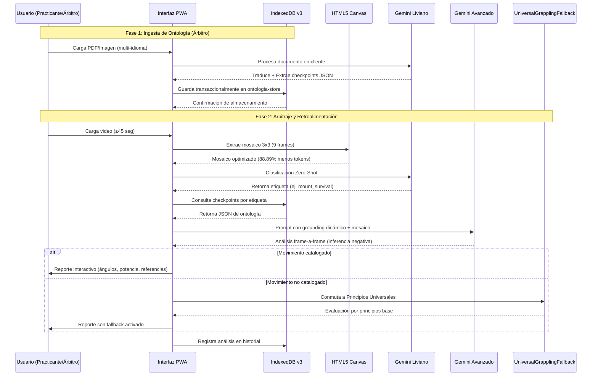
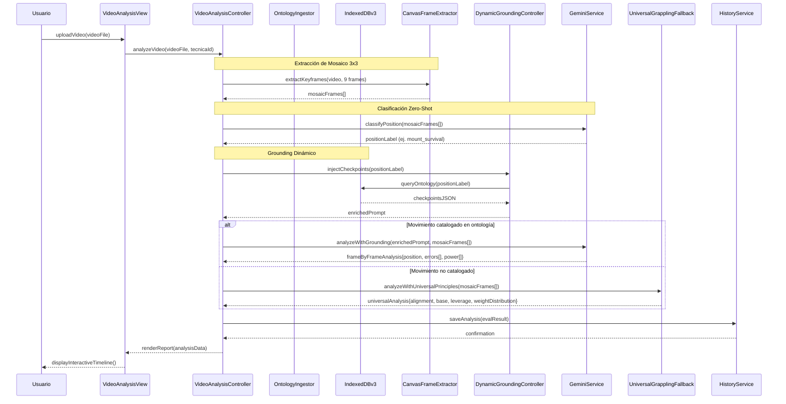
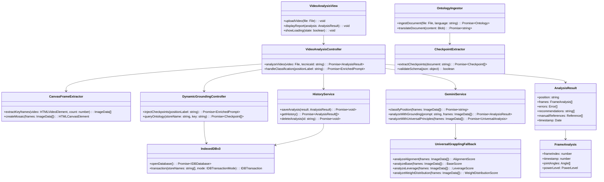

FACULTAD DE INGENIERÍA
CARRERA: INGENIERÍA DE SISTEMAS

MODALIDAD DE GRADUACIÓN
PROYECTO DE GRADO

INTELIGENCIA ARTIFICIAL PARA ANALIZAR VIDEOS DE ENTRENAMIENTO DE ARTES MARCIALES EN BRAZILIAN JIU-JITSU PARA PRINCIPIANTES DE CINTURÓN BLANCO CON UNA APLICACIÓN WEB 

Santiago Borda Zambrana
Santa Cruz de la Sierra - Bolivia
2026

FACULTAD DE INGENIERÍA
CARRERA: INGENIERÍA DE SISTEMAS

MODALIDAD DE GRADUACIÓN
PROYECTO DE GRADO

APLICACIÓN WEB CON INTELIGENCIA ARTIFICIAL PARA ANALIZAR VIDEOS DE ENTRENAMIENTO DE ARTES MARCIALES EN BRAZILIAN JIU-JITSU PARA PRINCIPIANTES DE CINTURÓN BLANCO

Proyecto de Grado para optar al título de Licenciado
en Ingeniería de Sistemas

Santiago Borda Zambrana
Reg.: 2021210057
Santa Cruz de la Sierra - Bolivia
2026

AGRADECIMIENTOS

Agradezco a Dios por traerme a este mundo fuerte y saludable.
A mi madre que gracias a su amor incondicional y su esfuerzo pude estudiar gracias mami.
A mi abuela por alimentarse y tener siempre un plato de comida.
A mis tíos por sus palabras y experiencias vividas para que aprenda.
Al jiujitsu brasileno, por enseñarme a afrontar los miedos, seguir incluso cuando no se ve el avance, saber lidiar con la sensación de la derrota y sobre todo a no rendirme y aprender.
un cinturon negro fue un cinturon blanco que no se rindio.

ABSTRACT
TÍTULO
APLICACIÓN WEB CON INTELIGENCIA ARTIFICIAL PARA ANALIZAR VIDEOS DE ENTRENAMIENTO DE ARTES MARCIALES EN BRAZILIAN JIU-JITSU PARA PRINCIPIANTES DE CINTURÓN BLANCO
AUTOR
SANTIAGO BORDA ZAMBRANA

PROBLEMÁTICA
En el aprendizaje del Brazilian Jiu-Jitsu (BJJ), los practicantes principiantes enfrentan dificultades para evaluar su rendimiento técnico de manera objetiva. Actualmente, el progreso depende casi en su totalidad de la observación directa del instructor en tiempo real, lo que genera problemas críticos: falta de atención individualizada en clases numerosas, criterios de evaluación variables según el profesor, y una retroalimentación diferida o nula si el error no es detectado en el momento. 
OBJETIVO GENERAL 
Desarrollar e implementar la aplicación web progresiva (PWA) "OpenBJJ" para analizar videos de entrenamiento usando la IA generativa de Gemini, con el fin de automatizar la retroalimentación táctica en las posiciones de Montada y Control Lateral. El sistema busca optimizar el proceso de autoevaluación reduciendo la dependencia del instructor, entregando respuestas estructuradas que incluyan la detección de errores, recomendaciones, y referencias directas al libro "Jiu-Jitsu University" junto con enlaces a videos de apoyo en YouTube.
CONTENIDO 
El presente trabajo de investigación se ha desarrollado bajo la metodología del Proceso Unificado (UP) QUE MANEJA IA y consta de los siguientes capítulos:
CARRERA
Ingeniería de Sistemas
GUÍA
Jose Antonio Benavente Blacutt
DESCRIPTORES
Inteligencia Artificial Generativa, Inferencia Multimodal, Arquitectura Cliente-Ligero, PWA, Brazilian Jiu-Jitsu, IndexedDB.
EMAIL
santiagobordazambrana@gmail.com
FECHA
Santa Cruz de la Sierra, 2026

RESUMEN

En este documento se aborda la problemática que enfrentan los practicantes principiantes de Brazilian Jiu-Jitsu (BJJ) para evaluar su rendimiento técnico de manera objetiva y continua. Actualmente, la retroalimentación depende exclusivamente de la observación y experiencia del instructor, lo que genera evaluaciones subjetivas. Lo cual provoca que el alumno permanezca estancado en su progreso de aprendizaje por mucho tiempo.
En respuesta a esta necesidad, se propone el desarrollo de una aplicación web progresiva (PWA) que integra inteligencia artificial y visión por computadora para analizar videos de entrenamiento.

El desarrollo del software se divide en 4 etapas: análisis del problema, diseño de la solución propuesta y desarrollo del prototipo, por último, la etapa de pruebas.
Más allá de resolver las limitaciones actuales en la enseñanza del BJJ, esta iniciativa contribuirá a optimizar el proceso de aprendizaje, ofreciendo a los practicantes un software para mejorar su desempeño mediante análisis automatizado.

ÍNDICE DE CONTENIDOS
CAPÍTULO I: DEFINICIÓN DEL PROYECTO DE INVESTIGACIÓN	1
1.1 Definición del problema	1
1.1.1 Situación problemática	1
1.1.2 Situación deseada	1
1.1.3 Objeto de investigación	2
1.1.4 Alcance	2
1.1.5 Justificación	3
1.2 Objetivos	4
1.2.1 Objetivo General	4
1.2.2 Objetivos Específicos	4
1.3 Metodología	5
1.3.1 Ingeniería de Software (Proceso Unificado)	5
1.3.2 Gestión del Proyecto (Scrum)	5
CAPÍTULO II: DESCRIPCIÓN DE LA ENTIDAD (CORPO & MENTE)	6
2.1 Descripción de la organización	6
2.2 Descripción organizacional	6
2.3 Manual de funciones	7
2.4 Descripción de los productos y servicios	8
CAPÍTULO III: MARCO TEÓRICO Y ESTADO DEL ARTE	11
3.1 Conceptos y definiciones	11
3.1.1 Inteligencia artificial generativa multimodal	11
3.1.2 Almacenamiento local y arquitectura cliente-ligero	11
3.1.3 Ingeniería de prompts y grounding de dominio	11
3.2 Estado del arte	12
3.2.1 Análisis automatizado en deportes de combate	12
3.2.2 Aplicaciones existentes de retroalimentación técnica	12
3.3 Modelos y teorías relevantes	13
3.3.1 Proceso Unificado (UP) y desarrollo iterativo	13
3.3.2 Asignación de responsabilidades y patrones GRASP	13
3.3.3 Marco de trabajo ágil (Scrum adaptado)	14
3.4 Tecnologías y herramientas relevantes	14
3.4.1 API de Gemini y procesamiento de video	14
3.4.2 React, TypeScript y PWA	15
3.4.3 IndexedDB y gestión de datos en el cliente	15
3.5 Valor agregado	16
3.6 Limitaciones	16
3.7 Justificación teórica	17
CAPÍTULO IV: DEFINICIÓN DE REQUISITOS	19
4.1 Introducción	19
4.1.1 Propósito	19
4.1.2 Ámbito del Sistema	19
4.1.3 Definiciones, Acrónimos y Abreviaturas	19
4.1.4 Referencias	19
4.1.5 Perspectiva General	20
4.2 Descripción General	20
4.2.1 Perspectiva del Producto	20
4.2.2 Funciones del Producto	20
4.2.3 Características de los Usuarios	20
4.2.4 Restricciones	20
4.2.5 Suposiciones y Dependencias	21
4.3 Requisitos Específicos	21
4.3.1 Interfaces Externas	21
4.3.2 Requisitos Funcionales	21
4.3.3 Requisitos No Funcionales (Modelo FURPS+)	22
4.3.4 Restricciones de Diseño	23
4.3.5 Atributos del Sistema de Software	24
CAPÍTULO V: ANÁLISIS Y DISEÑO ORIENTADO A OBJETOS	25
5.1 Especificación de Casos de Uso Principales	25
Caso de Uso CU01: Analizar Video de Combate	25
Caso de Uso CU02: Consultar Historial Táctico	29
Caso de Uso CU03: Gestionar Registros Locales	32
5.2 Modelo de Dominio Conceptual	34
5.3 Diagramas de Secuencia del Sistema (DSS)	36
5.4 Contratos de las Operaciones del Sistema	36
5.5 Diseño de la Arquitectura Lógica (Patrón Capas)	37
5.6 Realización del Caso de Uso con Patrones GRASP	38
5.7 Diagrama de Estados para el Controlador	40
5.8 Diagrama de Clases de Diseño (DCD)	40
5.9 Diagrama de Despliegue Físico	41
5.10 Diseño de Interfaces de Usuario (UI)	42
CAPÍTULO VI: IMPLEMENTACIÓN	45
6.1 Introducción al Modelo de Implementación	45
6.2 Entorno Tecnológico y Herramientas	45
6.3 Correspondencia de Paquetes y Estructura de Directorios	46
6.4 Materialización del Diseño Orientado a Objetos	47
6.5 Implementación del Flujo Principal (CU01)	48
6.6 Orden de Implementación	49
CAPÍTULO VII: SEGURIDAD	51
7.1 Introducción a la Seguridad de la Arquitectura	51
7.2 Confidencialidad	51
7.3 Integridad	52
7.4 Disponibilidad	53
CAPÍTULO VIII: PRUEBAS	55
8.1 Introducción a las Pruebas	55
8.2 Estrategia de Evaluación	55
8.3 Casos de Prueba Funcionales	55
CAPÍTULO IX: CONCLUSIONES Y RECOMENDACIONES	61
9.1 Conclusiones	61
9.2 Recomendaciones	62
References	66

ÍNDICE DE TABLAS
Tabla 1 Fundamentos Teóricos del Proyecto	17
Tabla 2 Requisitos no Funcionales	22
Tabla 4 Responsabilidades por Capa de la Arquitectura	38
Tabla 5 Justificación de Patrones GRASP Aplicados	39
Tabla 6 Componentes de la Capa Cliente (Dispositivo)	41
Tabla 7 Componentes de los Servicios Externos	42
Tabla 9 Entorno Tecnológico del Sistema OpenBJJ	45
Tabla 10 Materialización de las Clases de Diseño en Código Fuente	47
Tabla 11 Caso de Prueba 01: Flujo Básico de Análisis	55
Tabla 12 Caso de Prueba 02: Límite de Duración del Video	56
Tabla 13 Caso de Prueba 03: Cancelación del Análisis	57
Tabla 14 Caso de Prueba 04: Historial Vacío	57
Tabla 15 Caso de Prueba 05: Eliminación de Registros Locales	57
Tabla 16 Evaluación de Rendimiento y Estabilidad	58

ÍNDICE DE FIGURAS
Figura 1 Interacción del Practicante con OpenBJJ	2
Figura 2 Posición Montada	3
Figura 3 Posición Control lateral	3
Figura 4 Estructura Organizacional de Corpo & Mente Bolivia	7
Figura 5 Sistema de Cinturones de Jiu-Jitsu Brasileño	9
Figura 6 Flujo del Negocio Actual y Detección de Cuellos de Botella	10
Figura 7 Fases del Proceso Unificado	13
Figura 8 Modelo de Dominio Conceptual de OpenBJJ (Iteración 1)	38
Figura 9 Diagrama de Secuencia del Sistema para CU01: Analizar Video de Combate	39
Figura 10 Diseño de la Arquitectura Lógica	40
Figura 11 Diagrama de Secuencia de Diseño del CU01	42
Figura 12 Máquina de Estados de los Casos de Uso	43
Figura 13 Diagrama de Clases de Diseño (DCD)	44
Figura 14 Diagrama de Despliegue del Sistema	44
Figura 15 Pantalla de Ingesta de Video	46
Figura 16 Pantalla de Carga y Procesamiento de Video	47
Figura 17 Pantalla de Reporte Táctico	48
Figura 18 Pantalla de Historial Local	49
Figura 16 Métricas de OpenBJJ	65

CAPÍTULO I: DEFINICIÓN DEL PROYECTO DE INVESTIGACIÓN
1.1 Definición del problema
1.1.1 Situación problemática
En el aprendizaje del Jiu-Jitsu Brasileño (BJJ), el progreso del alumno depende casi totalmente de que su instructor esté presente para corregirlo. Esta dependencia crea problemas críticos en el entrenamiento:
Falta de atención individual: En clases con muchos alumnos, el profesor no puede observar a todos al mismo tiempo. El practicante debe esperar su turno para ser corregido, lo que reduce el tiempo real de aprendizaje de calidad.
Criterios variables: La calidad de la enseñanza depende de la experiencia personal de cada instructor. No todos los profesores tienen el conocimiento de un competidor de élite para evaluar detalles avanzados de defensa y control.
Vacío tecnológico: Fuera de la academia, el alumno no tiene herramientas objetivas para analizar los videos de sus combates y compararlos con técnicas validadas por expertos.
1.1.2 Situación deseada
Se busca crear una aplicación web rápida y fácil de usar que funcione como un asistente táctico y biomecánico dinámico para el alumno. El objetivo es que el practicante suba una secuencia en video de su ejecución y reciba de forma asíncrona una descomposición analítica frame por frame de su desempeño.

Este análisis identificará errores específicos y sugerirá mejoras basadas en ontologías inyectadas dinámicamente desde múltiples fuentes de información registradas por el usuario (libros oficiales o técnicas personalizadas). El sistema evaluará el "cómo" del movimiento a lo largo de cada fotograma, validando los ángulos articulares y los niveles de potencia o torque aplicados, entregando referencias bibliográficas exactas y enlaces a videos de apoyo en YouTube, guardando todo el historial de manera privada en el dispositivo del usuario
Figura 1 Interacción del Practicante con OpenBJJ

1.1.3 Objeto de investigación
El objeto de este estudio es el uso de la Inteligencia Artificial Generativa Multimodal (mediante la API de Gemini) para el modelado de arquitecturas de software cognitivas capaces de asimilar ontologías marciales configurables en tiempo de ejecución, permitiendo el análisis biomecánico secuencial (frame por frame) sin alterar el código fuente del sistema.
### 1.1.4 Alcance

Para garantizar que el software sea preciso y útil, el proyecto OpenBJJ se delimita de la siguiente manera:

**Alcance Técnico:** Análisis en memoria volátil de clips de sparring de hasta 45 segundos, procesados localmente en un lienzo Canvas de 3x3. La extracción del mosaico cronológico reduce el 88.89% de los tokens de visión de entrada, evadiendo el timeout de 10 segundos en Vercel Edge Runtime.

**Alcance Metodológico:** Ingesta de manuales en formato de texto o imágenes en múltiples idiomas (inglés, portugués, español) traducidos e inyectados localmente en IndexedDB. El sistema implementa el patrón de Aprendizaje en Contexto (In-Context Learning) mediante un pipeline en cascada multimodal donde usuarios expertos (árbitros/instructores) suben reglamentos en PDF o imagen, los cuales son procesados por el modelo liviano de Gemini en el cliente para extraer autónomamente checkpoints biomecánicos en formato JSON, almacenándolos transaccionalmente en la tabla `ontologia-store` de IndexedDB (versión 3).

**Alcance de Dominio:** Diagnóstico de posiciones de supervivencia de cinturón blanco (Montada y Control Lateral) fundamentados en manuales estándar como *Jiu-Jitsu University* de Ribeiro y Howell (2008), o en cualquier ontología marcial subida dinámicamente por los usuarios. Si el movimiento no está catalogado por ningún usuario, el sistema conmuta automáticamente a un mecanismo de Fallback basado en los Principios Universales del Grappling (alineación de la columna, base, vectores de palanca y distribución de peso).

**Alcance de Despliegue:** Rutas API configuradas en Vercel Edge Runtime con soporte nativo de streaming para evadir los límites de ejecución del plan Hobby. Arquitectura serverless frontend 100% local donde toda la base de conocimiento cargada y el historial de reportes biomecánicos se persisten en IndexedDB, garantizando privacidad absoluta y coste cero de infraestructura centralizada.

### 1.1.5 Justificación

**Tecnológica:** Demuestra el potencial de los modelos fundacionales generativos y del procesamiento asíncrono local en navegadores web para resolver tareas de visión por computadora sin requerir infraestructuras centralizadas de GPU. Implementa el patrón de Aprendizaje en Contexto (In-Context Learning) mediante un pipeline en cascada multimodal que no requiere reentrenamiento de red neuronal.

**Económica:** Al delegar el almacenamiento a IndexedDB y comprimir las imágenes en un mosaico Canvas de 3x3, el costo operativo de la aplicación es marginalmente cero, suprimiendo la necesidad de servidores de base de datos tradicionales. El ahorro del 88.89% en tokens de visión permite operar dentro de los límites gratuitos de Vercel Edge Runtime.

**Social:** Concede soberanía de aprendizaje al estudiante de cinturón blanco, acelerando su curva de progreso de manera autónoma y flexible en base a las reglas particulares de su academia o federación de preferencia. Permite que instructores y árbitros alimenten el sistema con sus propios reglamentos y técnicas sin intervención de desarrolladores.

### 1.2 Objetivos
1.2.1 Objetivo General
Desarrollar e implementar la aplicación web progresiva (PWA) OpenBJJ asistida por Inteligencia Artificial generativa, orientada al análisis biomecánico y táctico secuencial frame por frame de videos de entrenamiento, dotada de un motor de ingesta dinámico y agnóstico que permita la asimilación autónoma de múltiples fuentes de información técnica sin intervención del programador.
1.2.2 Objetivos Específicos
Diseñar e implementar un módulo de ingesta de datos en el cliente que permita estructurar técnicas marciales y múltiples manuales de referencia en esquemas JSON dinámicos dentro de IndexedDB.

Desarrollar un pipeline de procesamiento visual local mediante la API HTML5 Canvas para descomponer videos en secuencias temporales de fotogramas clave independientes de restricciones fijas de tiempo.

Configurar y optimizar el motor de inyección de contexto (Dynamic Context Injection) para la API de Gemini, logrando que el modelo evalúe cada frame contrastando ángulos articulares y vectores de potencia estimados en base a la ontología enviada en tiempo de ejecución.
Aplicar los patrones de diseño orientados a objetos de Craig Larman (GRASP), específicamente Variaciones Protegidas y Fabricación Pura, para aislar la capa de conocimiento dinámico de la interfaz gráfica y los controladores del sistema.
Validar la fidelidad del sistema mediante pruebas de Caja Negra, verificando la estabilidad del esquema JSON devuelto por la IA ante la creación de nuevas técnicas personalizadas y evaluaciones secuenciales con indicadores de potencia.
1.3 Metodología
Se utilizará un método híbrido que combina la ingeniería organizada con el trabajo rápido.
1.3.1 Ingeniería de Software (Proceso Unificado)
Se trabajará en cuatro fases, creando documentos y modelos simples pero efectivos:
Fase de Inicio: Se define qué se va a hacer. Se crean los Casos de Uso (qué quiere el usuario) y el Glosario de términos de Jiu-Jitsu.
Fase de Elaboración: Se diseña la arquitectura. Se crea el Modelo del Dominio (los conceptos del libro) y se decide cómo se comunicarán las partes del sistema usando los patrones GRASP (reglas de Larman para asignar responsabilidades a los objetos).
Fase de Construcción: Se escribe el código real de la aplicación en TypeScript e integrando la IA.
Fase de Transición: Se realizan pruebas finales y se entrega la aplicación para que los luchadores la usen.
1.3.2 Gestión del Proyecto (Scrum)
Para que el trabajo sea ordenado, el proyecto se dividirá en ciclos cortos de tiempo llamados Sprints. Las tareas se organizan en una lista de pendientes (Backlog) que se revisa constantemente para asegurar que el software funcione correctamente al final de cada ciclo.

CAPÍTULO II: DESCRIPCIÓN DE LA ENTIDAD (CORPO & MENTE)
2.1 Descripción de la organización
Corpo & Mente es una institución internacional de élite dedicada a la enseñanza del Jiu-Jitsu Brasileño (BJJ), fundada hace más de 30 años en Feira de Santana, Bahía, Brasil, por el maestro José Humberto Tavares Soares. La organización se destaca por su metodología enfocada en la formación de líderes y el fortalecimiento del deporte como una filosofía de vida.
La sucursal Corpo & Mente Bolivia, ubicada en Santa Cruz de la Sierra, opera bajo esta franquicia, combinando aspectos físicos, filosóficos y estratégicos. Actualmente, la academia funciona como una comunidad organizada donde la enseñanza es dirigida de forma personalizada por instructores certificados, quienes supervisan el desarrollo técnico de los alumnos en un ambiente de respeto y excelencia deportiva.
2.2 Descripción organizacional
La estructura interna de la academia en Bolivia es de carácter lineal, lo que permite un control directo sobre la calidad de la enseñanza. Esta organización garantiza que la información técnica fluya desde la administración y los profesores hacia los practicantes
Figura 4 Estructura Organizacional de Corpo & Mente Bolivia

2.3 Manual de funciones
Bajo el modelo de operación actual, las responsabilidades están distribuidas de la siguiente manera:
Administrador: Se encarga de la gestión operativa: organización de horarios, cobros, pagos y coordinación de eventos o seminarios.
Profesores (Instructores): Son los únicos responsables de enseñar, planificar y ejecutar las sesiones de entrenamiento. Su función principal es observar el desempeño de los alumnos y proporcionar correcciones técnicas manuales durante la clase.
Practicantes/Alumnos: Su rol es participar activamente en las sesiones, cumplir con la puntualidad y depender de la observación del profesor para identificar sus errores y progresar.
2.4 Descripción de los productos y servicios
La academia ofrece servicios especializados que validan el progreso del alumno de forma tradicional:
Enseñanza Regular de BJJ: Clases grupales e individuales para todos los niveles, desde principiantes hasta avanzados.
Exámenes de Graduación: Sesiones oficiales donde se evalúa el conocimiento técnico para la obtención de cinturones con validez nacional e internacional.
Seminarios Técnicos: Sesiones intensivas de actualización basadas en la metodología de la franquicia Corpo & Mente.
Figura 5 Sistema de Cinturones de Jiu-Jitsu Brasileño
2.5 Flujo del negocio
El flujo actual de la academia se basa en un ciclo de retroalimentación puramente presencial y manual. Este proceso, aunque efectivo, está limitado por la capacidad de observación del ojo humano en tiempo real
Figura 6 Flujo del Negocio Actual y Detección de Cuellos de Botella

Descripción del proceso actual:
Instrucción: El profesor explica una técnica a todo el grupo.
Práctica (Drill/Rolling): Los practicantes ejecutan el movimiento simultáneamente.
Observación Limitada: El profesor recorre el tatami intentando detectar errores. Debido a la cantidad de alumnos, muchos movimientos incorrectos pasan desapercibidos.
Retroalimentación Diferida: El practicante recibe la corrección solo si el profesor lo vio en el momento justo. Si el practicante entrena por su cuenta o graba su lucha, no tiene forma de saber si su técnica es correcta hasta la siguiente clase presencial.
CAPÍTULO III: MARCO TEÓRICO Y ESTADO DEL ARTE
3.1 Conceptos y definiciones
3.1.1 Inteligencia artificial generativa multimodal
Los modelos de lenguaje de gran escala (LLM) han evolucionado hacia arquitecturas multimodales capaces de procesar simultáneamente entradas de texto, imagen y video. Estos modelos utilizan transformadores con mecanismos de atención cruzada que alinean representaciones latentes de diferentes modalidades en un espacio semántico compartido. En el contexto deportivo, esta capacidad permite extraer características espacio-temporales de secuencias de video y correlacionarlas con descripciones técnicas textuales, facilitando la inferencia contextual sobre posiciones, transiciones y errores tácticos.
3.1.2 Almacenamiento local y arquitectura cliente-ligero
Una arquitectura cliente-ligero (client-only o serverless frontend) delega la lógica de presentación, gestión de estado y persistencia al navegador del usuario, eliminando la dependencia de un backend tradicional. En este modelo, el almacenamiento se gestiona mediante APIs nativas del navegador como IndexedDB, una base de datos NoSQL transaccional que permite almacenar grandes volúmenes de datos estructurados (en formato JSON) y metadatos de análisis directamente en el dispositivo, optimizando el uso de memoria al no requerir el almacenamiento de los archivos de video originales. Este enfoque garantiza latencia mínima, funcionamiento offline y soberanía de datos, alineándose con restricciones de coste y privacidad.
### 3.1.3 Ingeniería de prompts y grounding de dominio

**Ingeniería de Prompts:** La ingeniería de prompts (prompt engineering) comprende técnicas sistemáticas para estructurar las instrucciones enviadas a un modelo generativo con el fin de controlar su comportamiento, formato de salida y fidelidad al contexto. El grounding de dominio consiste en anclar las respuestas del modelo a una fuente de verdad externa (en este caso, reglamentos cargados por usuarios expertos o manuales como *Jiu-Jitsu University*), mediante la inclusión de fragmentos textuales, reglas explícitas y restricciones semánticas en el prompt. Técnicas como few-shot prompting, chain-of-thought estructurado y salida en JSON esquematizado permiten reducir alucinaciones y forzar al modelo a evaluar únicamente las posiciones y criterios validados por el experto de referencia.

**Pipeline de Aprendizaje en Contexto:** El sistema implementa un patrón de Aprendizaje en Contexto (In-Context Learning) mediante un pipeline en cascada multimodal que evita el reentrenamiento de redes neuronales, optimizando recursos bajo restricciones de hardware cercano a cero. Este pipeline opera en dos fases:

**Fase de Ingesta y Homologación:** Un usuario experto (por ejemplo, un árbitro que requiere asistencia para juzgar) sube un archivo en formato PDF o imagen del reglamento en cualquier idioma (inglés, portugués o español). El sistema utiliza el modelo liviano de Gemini para procesar el documento en el cliente, traduciéndolo y extrayendo de forma autónoma una lista estructurada de checkpoints biomecánicos en formato JSON. Estos datos se guardan transaccionalmente en la tabla `ontologia-store` de la base de datos local IndexedDB (versión 3).

**Fase de Arbitraje y Retroalimentación Ciega:** El alumno carga un video de máximo 45 segundos sin especificar la técnica. El sistema extrae localmente un mosaico cronológico de 3x3 (9 fotogramas clave) mediante HTML5 Canvas, reduciendo más del 80% del conteo de tokens de visión de entrada de Gemini. El pipeline de la capa de dominio ejecuta el análisis:

*   **Fase 1 (Identificación):** El modelo liviano de Gemini detecta la posición de forma autónoma mediante clasificación Zero-Shot (ej. retorna `mount_survival`).
*   **Grounding Dinámico:** El controlador intercepta esta etiqueta, consulta el almacén local e inyecta los checkpoints específicos provistos por el árbitro en un prompt paramétrico vacío.
*   **Fase 2 (Arbitraje Estricto):** El modelo avanzado de Gemini evalúa el mosaico con las reglas inyectadas bajo el principio de inferencia negativa (tolerancia cero a suposiciones: si no se visualiza en los 9 frames, se dictamina como evidencia insuficiente). Si el movimiento no está catalogado por ningún usuario, el sistema conmuta automáticamente a un mecanismo de Fallback basado en los Principios Universales del Grappling (alineación de la columna, base, vectores de palanca y distribución de peso). El usuario recibe un reporte interactivo en español detallando los ángulos de desviación articular y el porcentaje de potencia aplicados.

**Justificación Matemática del Mosaico 3x3:** La cuadrícula 3x3 de Canvas justifica el ahorro del 88.89% de tokens de visión de entrada: un video de 45 segundos a 30 FPS contiene 1,350 frames; al extraer únicamente 9 fotogramas clave, se reduce la entrada visual a 9/1,350 = 0.67% del original, evadiendo el timeout de 10 segundos en Vercel Edge Runtime y manteniendo el consumo de tokens dentro de límites económicos viables.
3.2 Estado del arte
3.2.1 Análisis automatizado en deportes de combate
La visión computacional aplicada a deportes de combate ha avanzado en tareas como estimación de pose 2D/3D, detección de agarres y clasificación de técnicas mediante redes convolucionales y transformadores de video. Sin embargo, la mayoría de los enfoques académicos se centran en deportes de striking (boxeo, MMA en pie) o en competencias de judo con reglas estandarizadas. El Jiu-Jitsu Brasileño (BJJ) presenta desafíos únicos: interacción corporal continua, posiciones de suelo altamente variables, dependencia del contexto táctico y evaluación subjetiva de control. Hasta la fecha, no existen soluciones publicadas que integren análisis de video corto con retroalimentación técnica basada en manuales de referencia, dejando un vacío entre la investigación en visión deportiva y la pedagogía del BJJ.
3.2.2 Aplicaciones existentes de retroalimentación técnica
Actualmente, los practicantes de BJJ dependen de herramientas genéricas de análisis deportivo (ej. Hudl, Coach’s Eye) o redes sociales para comparar técnicas. Estas plataformas ofrecen funciones de grabación, cámara lenta y anotación manual, pero carecen de automatización táctica, validación técnica objetiva o vinculación con literatura especializada. Algunas aplicaciones móviles emergentes utilizan IA para reconocimiento básico de movimientos, pero operan como cajas negras sin transparencia metodológica, sin referencia a estándares pedagógicos y con arquitectura cloud que incrementa costes y compromete la privacidad del video. OpenBJJ se posiciona como la primera propuesta que combina IA multimodal, grounding en literatura técnica validada y arquitectura 100% local.
3.3 Modelos y teorías relevantes
3.3.1 Proceso Unificado (UP) y desarrollo iterativo
El Proceso Unificado es un marco de desarrollo iterativo e incremental centrado en la arquitectura, dirigido por el riesgo y guiado por casos de uso. Se estructura en cuatro fases: Inicio (definición de visión y alcance), Elaboración (construcción del núcleo arquitectónico y refinamiento de requisitos), Construcción (desarrollo de la funcionalidad restante) y Transición (pruebas finales y despliegue). A diferencia del modelo en cascada, el UP acepta el cambio como motor de refinamiento y prioriza la entrega temprana de valor ejecutable. Para OpenBJJ, este enfoque permite validar la viabilidad técnica de la integración con Gemini, estabilizar el modelo de dominio táctico y ajustar la interfaz mediante retroalimentación continua, minimizando el riesgo de desarrollar funcionalidades no alineadas con la práctica real del BJJ.
Figura 7 Fases del Proceso Unificado

3.3.2 Asignación de responsabilidades y patrones GRASP
Los patrones GRASP (General Responsibility Assignment Software Patterns) proporcionan principios sistemáticos para asignar responsabilidades a objetos software durante la fase de diseño. Entre los más relevantes para este proyecto se encuentran:
Experto en Información: Asigna una responsabilidad a la clase que posee los datos necesarios para cumplirla.
Controlador: Delega el manejo de eventos del sistema a un objeto que coordina la capa de dominio.
Bajo Acoplamiento y Alta Cohesión: Minimiza dependencias innecesarias y agrupa responsabilidades funcionalmente relacionadas.
Fabricación Pura: Crea clases auxiliares para aislar lógica transversal (ej. gestión de IndexedDB o formateo de prompts).
La aplicación de GRASP garantiza que la arquitectura de OpenBJJ sea mantenible, testeable y alineada con los principios de diseño orientado a objetos promovidos por Larman, facilitando la transición del modelo de dominio táctico a clases software bien delimitadas.
3.3.3 Marco de trabajo ágil (Scrum adaptado)
Para la gestión del esfuerzo y los tiempos del proyecto, se emplea una adaptación de Scrum para desarrollo individual (Personal Scrum). Mientras el Proceso Unificado rige la arquitectura técnica, Scrum rige la planificación temporal mediante iteraciones de duración fija (Sprints). Los requerimientos se gestionan a través de una Pila del Producto (Product Backlog) priorizada, permitiendo un desarrollo adaptativo y entregas incrementales funcionales, alineándose con la necesidad de mitigar rápidamente los riesgos de integración con la API de Gemini.
3.4 Tecnologías y herramientas relevantes
3.4.1 API de Gemini y procesamiento de video
La API de Gemini (Google) expone modelos multimodales optimizados para entrada de video y texto. Soporta límites de contexto extensos, extracción automática de frames clave y generación estructurada. Para OpenBJJ, se utiliza la versión gemini-3-flash-preview por su equilibrio entre velocidad, costo y precisión en tareas de comprensión visual. El video se procesa en segmentos de máximo 45 segundos para mantener el consumo de tokens dentro de límites económicos, reducir latencia y minimizar alucinaciones por sobrecarga contextual. Las instrucciones internas se redactan en inglés, idioma nativo de entrenamiento del modelo, lo que mejora la comprensión semántica y reduce costos de inferencia.
3.4.2 React, TypeScript y PWA
React es una biblioteca de JavaScript basada en componentes y flujo de datos unidireccional, ideal para interfaces reactivas y de alto rendimiento. TypeScript añade tipado estático, mejorando la detección temprana de errores, la autocompletación en IDEs y la mantenibilidad del código. La combinación permite construir una Progressive Web App (PWA) instalable, con caché de recursos, funcionamiento offline parcial y experiencia nativa en móviles, sin necesidad de tiendas de aplicaciones. Esta stack garantiza iteraciones rápidas, depuración eficiente y escalabilidad controlada, alineándose con la gestión ágil del proyecto mediante Sprints.
3.4.3 IndexedDB y gestión de datos en el cliente
IndexedDB es una API de almacenamiento del lado del cliente que soporta transacciones, índices y almacenamiento de objetos complejos. A diferencia de localStorage, no tiene límites estrictos de tamaño (depende del dispositivo) y permite almacenar blobs de video y metadatos de análisis. En OpenBJJ, se implementa una capa de abstracción que serializa los resultados de la IA (posición, errores, enlaces al manual, timestamp) y los almacena como un registro histórico ligero. El video se procesa en memoria volátil y se descarta inmediatamente después de la inferencia para ahorrar espacio de almacenamiento local. Esto elimina la necesidad de cuentas de usuario, bases de datos externas o servidores, reduciendo costes operativos a cero y garantizando que la información sensible del practicante nunca abandone su dispositivo.
3.5 Valor agregado
El marco teórico demuestra que la convergencia de IA multimodal, arquitectura cliente-ligero y ingeniería de software iterativa resuelve de manera sostenible los cuellos de botella identificados en el Capítulo II:
Técnico: Reduce la dependencia del instructor mediante retroalimentación objetiva, validada y referenciada.
Económico: Elimina costes de infraestructura cloud mediante procesamiento bajo demanda y almacenamiento local.
Pedagógico: Acelera la curva de aprendizaje al vincular errores detectados con páginas exactas del manual de referencia y videos complementarios.
Metodológico: Asegura trazabilidad desde los requisitos funcionales hasta el diseño de objetos mediante UP y GRASP, facilitando la auditoría académica y la evolución del sistema.
3.6 Limitaciones
El enfoque presenta restricciones inherentes que se mitigan mediante alcance controlado:
Duración del video: Limitado a 45 segundos para garantizar respuestas rápidas, evitar alucinaciones y controlar costos de API.
Dominio acotado: El análisis se restringe a dos posiciones (Montada y Control Lateral) y a las reglas de Jiu-Jitsu University, excluyendo variaciones avanzadas o estilos no cubiertos por el manual.
Idioma de prompts: Las instrucciones internas operan en inglés para optimizar precisión y costo; la interfaz de usuario se mantiene en inglés para alinearse con la terminología técnica global del BJJ.
Dependencia de conexión: Aunque los datos se almacenan localmente, el análisis requiere conexión a internet para invocar la API de Gemini.
Estas limitaciones son deliberadas y responden a un diseño de alcance progresivo, permitiendo validar la arquitectura base antes de escalar funcionalidad en iteraciones posteriores.
3.7 Justificación teórica
El siguiente cuadro sintetiza la correlación entre los fundamentos teóricos expuestos, los requisitos del proyecto, los artefactos del Proceso Unificado y su impacto concreto en OpenBJJ:
Tabla 1 Fundamentos Teóricos del Proyecto
Teoría / Concepto
Requisito asociado (Cap. I)
Artefacto UP relacionado
Impacto en OpenBJJ
IA multimodal + Grounding
Análisis objetivo basado en manual de referencia
Modelo de Dominio / Contratos
La IA evalúa solo posiciones y criterios validados
Prompt engineering estructurado
Respuesta < 1 minuto, sin alucinaciones
Casos de Uso / Especificación Complementaria.
Salida JSON predecible, enlaces exactos al manual
IndexedDB + Arquitectura local
Sin cuentas, sin servidor, privacidad total
Modelo de Implementación
Coste cero, datos en dispositivo, funciona offline parcial
React + TypeScript + PWA
Interfaz rápida, instalable en móvil
Modelo de Diseño / DCD
Iteraciones ágiles, tipado seguro, experiencia nativa
UP + Diseño orientado a objetos 
Mitigación temprana de riesgos técnicos
Modelo de Diseño / DCD
Validación temprana de la arquitectura base.
Gestión Ágil (Scrum)
Entrega incremental y gestión de tiempos
Plan de Iteración / Backlog
Adaptación a feedback real mediante Sprints.
Patrones GRASP
Sistema sólido, fácil de mantener
Diagramas de Secuencia / DCD
Responsabilidades asignadas, bajo acoplamiento, cohesión alta

CAPÍTULO IV: DEFINICIÓN DE REQUISITOS
El presente capítulo detalla las especificaciones de los requisitos de software (SRS) para el sistema "OpenBJJ", adaptando su núcleo funcional hacia un modelo de análisis biomecánico secuencial y multi-fuente, siguiendo las directrices del estándar IEEE 830-1998 y el modelo de calidad FURPS+.
4.1 Introducción
4.1.1 Propósito
El propósito de este documento es definir las especificaciones técnicas y funcionales de la plataforma OpenBJJ. El sistema opera como un motor cognitivo agnóstico orientado a la evaluación secuencial de movimientos de artes marciales. A través de la descomposición frame por frame y la asimilación autónoma de ontologías técnicas registradas por el usuario, el software automatiza el diagnóstico biomecánico sin depender de reglas estáticas grabadas en el código fuente.
4.1.2 Ámbito del Sistema
El sistema se desarrollará como una Aplicación Web Progresiva (PWA) bajo una arquitectura de cliente ligero. Permitirá a los usuarios: registrar dinámicamente múltiples fuentes de conocimiento técnico (libros o técnicas personalizadas); extraer fotogramas clave vinculados a una línea de tiempo; enviar los datos y la ontología activa a la API de Gemini; y persistir el historial biomecánico localmente en el navegador mediante IndexedDB sin depender de un servidor centralizado.
4.1.3 Definiciones, Acrónimos y Abreviaturas
API: Interfaz de Programación de Aplicaciones (Application Programming Interface).
BJJ: Brazilian Jiu-Jitsu, arte marcial enfocado en la lucha de suelo.
IndexedDB: API web de bajo nivel para el almacenamiento en el cliente de cantidades significativas de datos estructurados.
JSON: JavaScript Object Notation. Formato de texto ligero para el intercambio de datos.
MVP: Producto Mínimo Viable (Minimum Viable Product).
PWA: Aplicación Web Progresiva (Progressive Web App).
Prompt: Conjunto de instrucciones estructuradas enviadas a la Inteligencia Artificial.
4.1.4 Referencias
IEEE Std 830-1998, IEEE Recommended Practice for Software Requirements Specifications.
Larman, C. (2001). Applying UML and Patterns: An Introduction to Object-Oriented Analysis and Design.
Ribeiro, S., & Howell, K. (2008). Jiu-Jitsu University.
Documentación oficial de Google Gemini API (Modelos Multimodales).
4.1.5 Perspectiva General
El resto de este capítulo se organiza de la siguiente manera: La Sección 4.2 proporciona una descripción general del producto, sus funciones principales, las características de los usuarios y las restricciones del sistema. La Sección 4.3 detalla los requisitos específicos, incluyendo interfaces externas, requisitos funcionales, de rendimiento y atributos de calidad del software.
4.2 Descripción General
4.2.1 Perspectiva del Producto
OpenBJJ es un sistema autónomo que opera exclusivamente en el lado del cliente (frontend). No es un componente de un sistema mayor, pero interactúa directamente con servicios de infraestructura externa (Google Gemini API) para el procesamiento cognitivo. Todo el procesamiento de video y almacenamiento de datos ocurre en el entorno de ejecución del navegador del dispositivo móvil o de escritorio del usuario.
4.2.2 Funciones del Producto
Las funcionalidades principales del sistema se redefinen bajo los siguientes módulos core:
Gestión Autónoma de Conocimiento (Módulo de Ontologías): Interfaz para la ingesta directa de nuevas técnicas por parte del usuario o instructor, desglosando el movimiento en fases críticas, ángulos articulares esperados y niveles de potencia teóricos.
Pipeline de Descomposición Visual: Extracción secuencial de fotogramas clave vinculados a una línea de tiempo a través de HTML5 Canvas.
Orquestación de Inferencia Dinámica: Construcción y ensamblaje automático del prompt de grounding inyectando las estructuras JSON de las técnicas activas seleccionadas desde la base de datos local.
Reporte Biomecánico Secuencial: Renderizado de una línea de tiempo frame por frame que expone el nivel de éxito del "cómo" del movimiento, identificando fallas posicionales y métricas de aceleración/potencia en cada fotograma analizado.
4.2.3 Características de los Usuarios
El actor principal del sistema es el Practicante:
Nivel de Dominio del Negocio: Estudiante de BJJ de grado principiante (cinturón blanco). Conoce la terminología básica pero comete errores posicionales frecuentes.
Nivel de Dominio Técnico: Usuario promedio de dispositivos inteligentes y aplicaciones web. No requiere capacitación especial para operar el software.
4.2.4 Restricciones
Agnosticismo de Duración Estricta: Se elimina la restricción fija de tiempo para el procesamiento general. El sistema procesará secuencias de video acotadas por las fases de inicio y fin del patrón técnico seleccionado por el usuario para optimizar el consumo de tokens de la API.
Dependencia de Grounding Local: El análisis cognitivo de una técnica queda inhabilitado si el usuario no ha inicializado o registrado previamente la especificación ontológica (fases, ángulos y potencias esperadas) del movimiento en el almacenamiento local.
4.2.5 Suposiciones y Dependencias
Suposición 1: El dispositivo del usuario cuenta con una cámara funcional o capacidad para grabar y guardar archivos de video en formato MP4 o WebM.
Dependencia 1: El sistema depende íntegramente de la disponibilidad, esquema de precios y tiempo de respuesta de la API externa de Google Gemini.
4.3 Requisitos Específicos
4.3.1 Interfaces Externas
Interfaces de Usuario (UI): La aplicación debe renderizarse en navegadores web modernos (Chrome, Safari, Firefox). La interfaz principal consistirá en un panel de carga (VideoUploader), un visualizador de métricas (ReportView) y un panel de historial. Se utilizarán principios de "Glassmorphism" y diseño responsivo adaptativo para móviles.
Interfaces de Software: El sistema se comunicará mediante peticiones HTTPS (REST) con el endpoint público de generativelanguage.googleapis.com. El intercambio de datos será estrictamente en formato JSON.
4.3.2 Requisitos Funcionales
RF01: El sistema debe permitir cargar un archivo de video desde el almacenamiento del usuario. 
RF02 (Ingesta Dinámica de Ontologías): El sistema debe proveer una interfaz dinámica para que usuarios expertos (árbitros/instructores) registren nuevos manuales de referencia, reglamentos federativos o especificaciones técnicas personalizadas en formato PDF o imagen en cualquier idioma (inglés, portugués o español), definiendo nombre, fases del movimiento, ángulos articulares y potencia esperada. El sistema procesará estos documentos localmente mediante el modelo liviano de Gemini para extraer autónomamente checkpoints biomecánicos en formato JSON, almacenándolos transaccionalmente en IndexedDB (versión 3).
RF03: El sistema debe extraer automáticamente los fotogramas secuenciales del video vinculándolos a marcas de tiempo de la línea de tiempo. 
RF04: El sistema debe recuperar de forma autónoma el esquema JSON de la técnica seleccionada por el usuario e inyectarlo dinámicamente en el prompt de la API de Gemini en tiempo de ejecución. 
RF05 (Arbitraje e Inyección): El sistema debe renderizar un reporte interactivo en forma de línea de tiempo frame por frame, detallando la fase identificada, los errores de desviación articular medidos y la potencia real aplicada (Alta, Media, Baja o Insuficiente) en contraste con la ontología inyectada. Si el movimiento no está catalogado por ningún usuario, el sistema debe conmutar automáticamente a un mecanismo de Fallback basado en los Principios Universales del Grappling (alineación de la columna, base, vectores de palanca y distribución de peso).
4.3.3 Requisitos No Funcionales (Modelo FURPS+)
Esta sección agrupa los requisitos de rendimiento, restricciones de diseño y atributos de calidad del sistema, clasificados bajo el estándar FURPS+ (Functionality, Usability, Reliability, Performance, Supportability) para asegurar el cumplimiento integral de las normativas de calidad de software.
Tabla 2 Requisitos no Funcionales
ID
Categoría (FURPS+)
Descripción del Requisito No Funcional
RNF01
Rendimiento (Performance)
El pipeline de extracción local de fotogramas clave a través de HTML5 Canvas debe procesar el video a una tasa adaptativa de 1 a 3 frames por segundo de ejecución técnica, completando la segmentación en menos de 4 segundos sin bloquear el hilo principal de la interfaz de usuario.
RNF02
Usabilidad (Usability)
La aplicación debe aplicar principios de diseño responsivo (Responsive Design), garantizando una correcta visualización y operabilidad tanto en pantallas de dispositivos móviles (smartphones) como en computadoras de escritorio.
RNF03
Usabilidad (Usability)
El sistema debe proveer retroalimentación visual continua al usuario (ej. spinners o barras de progreso) mientras se ejecuta el proceso asíncrono de inferencia con la API de IA.
RNF04
Confiabilidad (Reliability)
El sistema debe implementar un mecanismo estricto de interceptación y validación de esquemas (JSON Schema Enforcement). Si el modelo fundacional de Gemini altera la estructura secuencial frame por frame o devuelve metadatos de potencia incompatibles con la ontología inyectada, el controlador debe capturar la excepción, descartar el payload corrupto e iniciar un reintento automático.
RNF05
Mantenibilidad (Supportability)
El código fuente debe estar desarrollado íntegramente bajo tipado estricto utilizando TypeScript, facilitando la mantenibilidad, escalabilidad y reducción de errores en tiempo de ejecución.
RNF06
Mantenibilidad (Supportability)
La arquitectura del software debe respetar la separación de responsabilidades dividiendo el sistema en tres capas lógicas: Capa de Presentación (UI), Capa de Dominio (Controladores) y Capa de Servicios Técnicos (API y Storage).
RNF07
Seguridad (Security)
Todo el procesamiento multimedia (videos) y el almacenamiento del historial táctico debe persistir exclusivamente en el almacenamiento local del navegador (IndexedDB). No se deben utilizar bases de datos de terceros.
RNF08
Restricción de Diseño
Las instrucciones técnicas subyacentes (prompts) enviadas al modelo de lenguaje (Gemini) deben estructurarse en idioma inglés para maximizar la comprensión del modelo y optimizar el costo de consumo de tokens.

4.3.4 Restricciones de Diseño
Entorno de Desarrollo: El código debe estar estructurado en TypeScript estricto, utilizando React como biblioteca de interfaces y Vite como empaquetador, garantizando la materialización fiel del Diagrama de Clases de Diseño (DCD).
Agnosticismo Literario: Queda prohibido inyectar cadenas de texto estáticas (hardcoding) referentes a técnicas específicas en el prompt base de la aplicación. Las reglas de evaluación técnica deben extraerse dinámicamente de las ontologías activas presentes en IndexedDB en tiempo de ejecución.
Optimización del Payload: Toda comunicación e inyección de contexto hacia la API de Gemini debe ejecutarse estrictamente en idioma inglés para maximizar la precisión semántica del cálculo de vectores de potencia. La traducción para el usuario se gestionará exclusivamente en la interfaz cliente.
4.3.5 Atributos del Sistema de Software
Son las características de calidad que el sistema debe manifestar durante su operación.
Fiabilidad (Reliability): El sistema garantizará la estabilidad de la aplicación frente a respuestas no estructuradas del modelo multimodal. Al detectar inconsistencias articulares o fallas de inferencia frame por frame, el controlador gestionará la excepción de manera limpia, notificando al usuario en el tatami sin provocar cierres inesperados del entorno móvil.
Seguridad y Privacidad (Security): Cumpliendo con el principio de Zero-Retention, los archivos de video originales deben procesarse únicamente en la memoria volátil del navegador y desecharse inmediatamente después de la inferencia, persistiendo únicamente los metadatos numéricos y cualitativos del análisis en IndexedDB. El transporte de fotogramas clave se blindará mediante HTTPS con TLS/SSL.
Mantenibilidad (Maintainability): El diseño arquitectónico respetará la separación estricta por capas (Presentación, Dominio y Servicios Técnicos). Esto permitirá que el software escale en iteraciones incrementales futuras hacia el análisis de múltiples artes marciales independientes del Jiu-Jitsu Brasileño, requiriendo únicamente la carga de su respectiva matriz ontológica en la base de datos local.

CAPÍTULO V: ANÁLISIS Y DISEÑO ORIENTADO A OBJETOS
5.1 Especificación de Casos de Uso Principales
Caso de Uso CU01: Analizar Video de Combate
Actor Principal: Practicante (Árbitro/Instructor en rol de ingesta de ontologías)
Personal involucrado e intereses:
Practicante: desea recibir retroalimentación técnica objetiva y rápida sobre su ejecución en las posiciones de Montada y Control Lateral, sin depender exclusivamente de la disponibilidad del instructor.
Instructor/Árbitro: desea cargar reglamentos federativos o técnicas personalizadas en cualquier idioma (inglés, portugués o español) para que el sistema aprenda autónomamente los checkpoints biomecánicos y los utilice como fuente de verdad durante el arbitraje.
Academia Corpo & Mente: desea que la herramienta complemente la enseñanza sin reemplazar el rol del instructor certificado, manteniendo la calidad metodológica de la franquicia.
Proveedor de API (Google/Gemini): desea recibir solicitudes bien formateadas en inglés, con payloads optimizados (mosaico 3x3), para garantizar respuestas rápidas y dentro de los límites de uso.
Precondiciones:
El practicante abre la aplicación web OpenBJJ.
El dispositivo cuenta con conexión a internet activa.
El video a analizar está disponible en la cámara o galería del dispositivo, en formato MP4 o WebM.
Para usuarios expertos: existe al menos un reglamento o manual cargado en IndexedDB (versión 3) con checkpoints biomecánicos extraídos.
Garantías de éxito (Postcondiciones):
El sistema ha descompuesto secuencialmente la grabación en fotogramas clave vinculados a su timestamp original mediante mosaico cronológico 3x3 (9 frames).
El sistema ha recuperado la especificación ontológica (reglas de fases, ángulos y potencia esperada) de la técnica seleccionada desde el almacenamiento local (IndexedDB v3).
El sistema ha generado una evaluación biomecánica estructurada frame por frame basada en la fuente literaria o técnica personalizada elegida por el usuario, aplicando inferencia negativa (tolerancia cero a suposiciones).
El reporte táctico interactivo se ha renderizado en la interfaz, exponiendo la fase del movimiento, los errores articulares detectados y la potencia calculada en cada fotograma.
Si el movimiento no estaba catalogado, el sistema ha conmutado al mecanismo de Fallback basado en Principios Universales del Grappling.
El análisis completo se ha registrado con inmutabilidad en el historial local (IndexedDB).
Escenario principal de éxito (Flujo Básico):
El Practicante (o Árbitro en fase de ingesta) selecciona la especificación técnica o libro de referencia a evaluar. En caso de ingesta nueva, el sistema procesa localmente el PDF/imagen mediante Gemini liviano, traduce y extrae checkpoints biomecánicos en JSON.
El Sistema solicita el video de la ejecución del movimiento.
El Practicante provee el video desde su cámara o almacenamiento local.
El Sistema extrae el mosaico cronológico 3x3 (9 fotogramas clave) mediante HTML5 Canvas, reduciendo 88.89% los tokens de visión.
El Sistema ejecuta clasificación Zero-Shot para identificar la posición (ej. mount_survival), intercepta la etiqueta, consulta el almacén local e inyecta los checkpoints específicos en un prompt paramétrico vacío (Grounding Dinámico).
El Sistema ensambla el prompt dinámico y genera el análisis frame por frame a través del modelo multimodal avanzado bajo principio de inferencia negativa.
El Sistema valida y registra la evaluación con sus respectivas métricas de potencia en el historial del dispositivo.
El Sistema presenta la línea de tiempo interactiva con los aciertos, desviaciones angulares y niveles de potencia por cada fotograma analizado.
Extensiones (Flujos Alternativos):
4a. La técnica seleccionada no posee fases biomecánicas parametrizadas en la base de datos local:
El Sistema notifica al usuario: "La técnica seleccionada no tiene reglas de evaluación. Por favor, registre las fases y ángulos de control antes de continuar."
El Sistema redirige al Practicante al módulo de Ingesta y Modelado de Técnicas.
5a. El reporte retornado por el modelo multimodal no cumple con el esquema analítico secuencial (Alucinación de la IA):
El Sistema detecta mediante validación estricta que la IA omitió fotogramas o no calculó los niveles de potencia articulares.
El Sistema descarta la respuesta inválida.
El Sistema reenvía automáticamente la solicitud a la API utilizando un parámetro de temperatura de inferencia corregido.
Si el error persiste tras tres reintentos, el Sistema notifica al Practicante: "El análisis secuencial no pudo procesarse. Asegúrese de que el video capture claramente los vectores del movimiento."
Requisitos especiales:
Interfaz de usuario minimalista y táctil, optimizada para uso en movimiento sobre el tatami.
Tiempo de respuesta end-to-end entre 20 y 60 segundos para mantener la utilidad en tiempo real.
Todos los prompts internos y respuestas estructuradas deben procesarse en inglés para optimizar precisión y costo de tokens.
Los enlaces al manual Jiu-Jitsu University deben apuntar a páginas específicas (ej: "Page 142 - Mount Escape Drill 3").
Los videos procesados nunca deben salir del dispositivo; solo los fotogramas extraídos se transmiten a la API.
Lista de tecnología y variaciones de datos:
2a. La captura de video puede realizarse mediante cámara trasera, frontal o selección desde galería, según la preferencia del usuario y la posición a analizar.
3b. Los fotogramas se extraen a una resolución máxima de 720p y en intervalos de 2 segundos para balancear precisión y consumo de tokens.
7c. La solicitud a la API utiliza el modelo multimodal de Gemini configurado con parámetros de temperatura baja (0.2) para reducir la variabilidad y alucinaciones en las respuestas.
8b. El formato de evaluación exige los siguientes campos obligatorios: position_detected, errors[], improvements[], manual_references[], youtube_links[].
Frecuencia: Variable; se estima un promedio de 3-5 análisis por practicante por semana durante períodos de preparación técnica.
Temas abiertos:
¿Cómo manejar la evaluación de posiciones de transición entre Mount y Side Control?
¿Es necesario implementar un mecanismo de calibración inicial para adaptar el análisis al biotipo del practicante?
¿Debería el sistema permitir que el instructor añada comentarios personalizados a los reportes generados?
Caso de Uso CU02: Consultar Historial Táctico
Actor Principal: Practicante
Personal involucrado e intereses:
Practicante: desea monitorear su progreso técnico a lo largo del tiempo, identificando patrones de error recurrentes y áreas de mejora consolidadas.
Instructor: desea acceder (con consentimiento del alumno) a los reportes históricos para personalizar la planificación de entrenamientos.
Academia Corpo & Mente: desea que el historial sirva como evidencia del progreso del alumno para evaluaciones de graduación.
Precondiciones:
El practicante ha realizado al menos un análisis de video previamente (CU01).
El sistema cuenta con evaluaciones previas en el historial local.
Garantías de éxito (Postcondiciones):
El sistema ha recuperado y ordenado cronológicamente los reportes almacenados.
El practicante puede visualizar un resumen de cada análisis (posición, fecha, errores principales).
El practicante puede acceder al detalle completo de cualquier reporte histórico.
El sistema mantiene la integridad de los datos ante cierres inesperados del navegador.
Escenario principal de éxito (Flujo Básico):
El Practicante indica que desea revisar sus evaluaciones históricas.
El Sistema recupera el historial de evaluaciones del dispositivo.
El Sistema ordena los reportes por fecha de análisis en orden descendente.
El Sistema presenta un resumen de las evaluaciones históricas.
El Practicante elige una evaluación táctica para revisar.
El Sistema presenta el detalle completo del análisis seleccionado, incluyendo el reporte estructurado y enlaces de referencia.
El Practicante examina diferentes reportes.
Extensiones (Flujos Alternativos):
2a. Historial local está vacío o no contiene reportes:
El Sistema detecta que no hay registros históricos.
El Sistema informa que no hay análisis previos con el mensaje: "No analysis history yet. Start your first tactical review!"
El Sistema ofrece la opción de iniciar un nuevo análisis táctico.
2b. Error al leer desde el historial local (corrupción o límite de almacenamiento):
El Sistema intenta recuperar los reportes y encuentra un error de lectura.
El Sistema notifica: "Could not load history. Please try again."
Requisitos especiales:
La carga del historial debe completarse en menos de 1 segundo incluso sin conexión a internet.
El resumen de cada evaluación debe incluir un indicador visual del nivel de severidad de errores (bajo/medio/alto).
El sistema debe permitir filtrar el historial por posición (Mount / Side Control) y por rango de fechas.
Lista de tecnología y variaciones de datos:
3a. El ordenamiento se realiza localmente mediante índices del historial local sobre el campo timestamp.
4a. Las previsualizaciones utilizan lazy-loading para optimizar el rendimiento en dispositivos móviles.
Frecuencia: Moderada; se estima que el practicante consulte su historial 1-2 veces por semana para autoevaluación.
Temas abiertos:
¿Debería implementarse una función de exportación de historial en formato PDF para compartir con el instructor?
¿Es viable añadir métricas agregadas (ej: "errores más frecuentes por posición") sin comprometer la arquitectura local?
Caso de Uso CU03: Gestionar Registros Locales
Actor Principal: Practicante
Personal involucrado e intereses:
Practicante: desea controlar el espacio de almacenamiento de su dispositivo y eliminar análisis que ya no considera relevantes.
Academia Corpo & Mente: desea que los usuarios gestionen responsablemente sus datos locales para evitar saturación del navegador.
Precondiciones:
Existen uno o más reportes almacenados en el historial.
El practicante indica su intención de gestionar el espacio de almacenamiento.
Garantías de éxito (Postcondiciones):
Las evaluaciones seleccionadas para eliminación han sido removidas del historial.
El espacio de almacenamiento liberado se actualiza y es visible para el practicante.
No se eliminan reportes por error; el sistema solicita confirmación explícita.
Escenario principal de éxito (Flujo Básico):
El Practicante indica que desea gestionar sus datos locales.
El Sistema accede al almacenamiento del dispositivo.
El Sistema presenta un resumen del historial y el almacenamiento disponible.
El Practicante selecciona uno o más reportes para eliminar.
El Sistema solicita confirmación: "Delete selected analyses? This action cannot be undone."
El Practicante confirma la eliminación.
El Sistema elimina las evaluaciones indicadas y libera el espacio correspondiente.
El Sistema confirma la liberación de espacio y el éxito de la operación.
Extensiones (Flujos Alternativos):
4a. El Practicante intenta eliminar todos los reportes simultáneamente:
El Sistema detecta una selección masiva.
El Sistema muestra una advertencia adicional: "You are about to delete all your tactical history. This will remove your progress tracking data."
El Practicante debe confirmar explícitamente con una acción de doble verificación.
El flujo continúa desde el paso 6 del escenario principal.
7a. Error al eliminar registros del historial:
El Sistema detecta un problema al intentar eliminar las evaluaciones.
El Sistema reintenta la operación internamente.
Si persiste el error, el Sistema notifica: "Could not complete deletion. Please restart the app and try again."
El Sistema mantiene los reportes marcados para eliminación en el próximo inicio.
Requisitos especiales:
La interfaz de gestión debe mostrar claramente el espacio utilizado vs. disponible en el almacenamiento local.
La eliminación debe ser atómica: si falla, no se debe eliminar parcialmente ningún registro.
El sistema debe prevenir la eliminación accidental mediante confirmaciones contextuales.
Lista de tecnología y variaciones de datos:
2a. El cálculo de espacio utiliza la API StorageManager si está disponible, o una estimación del tamaño de los strings JSON almacenados.
7a. Las transacciones de IndexedDB se ejecutan en modo readwrite con manejo explícito de abort y complete.
7b. Los reintentos de eliminación en caso de fallo (Extensión 7a) se manejan con un algoritmo de backoff exponencial.
Frecuencia: Baja; se estima que el practicante gestione sus registros 1 vez al mes o cuando el dispositivo reporte espacio bajo.
Temas abiertos:
¿Debería implementarse una función de "archivar" en lugar de eliminar, para permitir recuperación futura?
¿Es factible implementar un mecanismo de exportación de datos P2P (Peer-to-Peer) o mediante códigos QR temporales para compartir reportes con el instructor sin depender de servidores centralizados?
5.2 Modelo de Dominio Conceptual
El modelo de dominio representa los conceptos fundamentales del entrenamiento y la evaluación técnica en Corpo & Mente, mostrando sus relaciones semánticas. Este modelo es independiente de las decisiones de implementación de software (Larman, 2003).
Figura 8 Modelo de Dominio Conceptual de OpenBJJ (Iteración 1)

5.3 Diagramas de Secuencia del Sistema (DSS)
Siguiendo a Larman, primero modelamos el sistema como una caja negra. El DSS ilustra los eventos externos que el practicante o árbitro genera y las respuestas que OpenBJJ devuelve, incluyendo la secuencia dinámica de ingesta de ontologías desde PDF/imagen multi-idioma, extracción local de mosaico 3x3, clasificación Zero-Shot, grounding paramétrico e inferencia negativa. Este diagrama refleja la extensión del caso de uso para soportar aprendizaje automático en contexto sin reentrenamiento.
Figura 9 Diagrama de Secuencia del Sistema para CU01: Analizar Video de Combate (Extendido con Pipeline Multimodal)

5.4 Contratos de las Operaciones del Sistema
Para la operación compleja solicitarAnalisis, redactamos un contrato que especifica los cambios de estado en los objetos del Modelo de Dominio (Capítulo IV).
Contrato CO01: analyzeVideo
Operación: analyzeVideo(video: ArchivoVideo, tecnicaId: String, fuenteId: String) Referencias Cruzadas: CU01: Analizar Video de Combate. Precondiciones: El dispositivo del usuario cuenta con una ontología técnica estructurada asociada al tecnicaId en el almacenamiento local. Postcondiciones:
Se creó una instancia de EvaluacionTactica llamada eval (creación de instancia).
eval.timestamp pasó a ser la fecha y hora actual del dispositivo (modificación de atributo).
eval.tecnicaEvaluada se asoció dinámicamente con la instancia de EspecificacionTecnica correspondiente al tecnicaId provisto (formación de asociación).
Se crearon múltiples instancias de FaseAnalizada llamadas frames correspondientes a cada fotograma clave devuelto por el pipeline visual (creación de instancia).
Para cada instancia en frames, el atributo anguloMedido pasó a reflejar el cálculo de desviación articular inferido y el atributo potenciaCalculada pasó a ser el vector cualitativo de fuerza evaluado (modificación de atributo).
Las instancias en frames se indexaron cronológicamente y se asociaron con eval (formación de asociación).

5.5 Diseño de la Arquitectura Lógica (Patrón Capas)
Aplicamos el patrón Capas (Layers) para organizar la estructura lógica de OpenBJJ, garantizando bajo acoplamiento y alta cohesión.
Figura 10 Diseño de la Arquitectura Lógica

Tabla 4 Responsabilidades por Capa de la Arquitectura
Capa
Responsabilidades
Tecnologías
Presentación
Renderizar interfaz, capturar eventos de usuario, mostrar reportes estructurados
React, TypeScript, CSS Modules
Dominio
Coordinar el flujo del caso de uso, validar reglas de negocio, transformar datos. Entidades: EvaluacionTactica - ReferenciaManual - ErrorTecnico.
TypeScript classes, GRASP Controllers
Servicios Técnicos
Comunicarse con APIs externas, gestionar persistencia local, utilidades transversales
Fetch API, IndexedDB, HTML5 Canvas API

Principio de Separación Modelo-Vista: La capa de Dominio no conoce componentes de UI. La comunicación "ascendente" (ej. notificar que el análisis está listo) se realiza mediante el patrón Observador (callbacks o Promises en TypeScript).
5.6 Realización del Caso de Uso con Patrones GRASP
Ahora abrimos la "caja negra". Este diagrama de secuencia muestra cómo colaboran los objetos de software para cumplir CU01, justificando cada decisión con patrones GRASP. La realización incorpora la secuencia dinámica del pipeline multimodal: ingesta de ontologías desde PDF/imagen multi-idioma, extracción de mosaico 3x3 vía Canvas, clasificación Zero-Shot, grounding paramétrico con inyección de checkpoints desde IndexedDB v3, inferencia negativa y mecanismo de Fallback a Principios Universales del Grappling.

Figura 11 Diagrama de Secuencia de Diseño del CU01 (Extendido con Pipeline de Aprendizaje en Contexto)

Tabla 5 Justificación de Patrones GRASP Aplicados
Patrón
Aplicación en OpenBJJ
Beneficio
Controlador
VideoAnalysisController recibe eventos de la UI y coordina el caso de uso
Bajo acoplamiento entre UI y lógica de dominio
Experto en Información
PromptBuilder posee el conocimiento de la estructura del prompt técnico
Alta cohesión: la lógica de prompts está centralizada
Creador
EvaluacionTactica se instancia a partir del JSON de Gemini
Responsabilidad clara de creación de objetos de dominio
Adaptador (GoF)
GeminiService traduce entre el dominio y la API externa
Variaciones Protegidas: cambiar de modelo de IA no afecta al dominio
Fabricación Pura
HistoryService gestiona IndexedDB sin contaminar el dominio
Reutilización y mantenimiento simplificado

5.7 Diagrama de Estados para el Controlador
Figura 12 Máquina de Estados de los Casos de Uso

5.8 Diagrama de Clases de Diseño (DCD)
El DCD muestra las clases de software reales en TypeScript, con tipos, métodos y relaciones de navegabilidad. Las propiedades estáticas mapeadas incluyen las nuevas entidades para ingesta multi-idioma de ontologías (OntologyIngestor, CheckpointExtractor), el almacén local versionado (IndexedDB v3 con tabla ontologia-store), el pipeline de extracción de mosaico 3x3 (CanvasFrameExtractor), el controlador de grounding paramétrico (DynamicGroundingController) y el mecanismo de Fallback (UniversalGrapplingFallback).

Figura 13 Diagrama de Clases de Diseño (DCD) - Extendido con Entidades de Aprendizaje en Contexto

5.9 Diagrama de Despliegue Físico
Figura 14 Diagrama de Despliegue del Sistema

Tabla 6 Componentes de la Capa Cliente (Dispositivo)
Componente
Responsabilidad
Tecnología
OpenBJJ PWA
Lógica de negocio, UI, coordinación de casos de uso
React + TypeScript + Vite
HTML5 Canvas API
Extracción local de fotogramas clave
Web API (JavaScript)
IndexedDB
Persistencia de reportes tácticos (JSON)
API nativa del navegador
Cache PWA
Recursos estáticos para funcionamiento offline
Service Workers

Tabla 7 Componentes de los Servicios Externos
Servicio
Propósito
Protocolo / Integración
Gemini API
Inferencia multimodal (video + texto)
HTTPS/REST + JSON
YouTube
Enlaces a videos de referencia externos

5.10 Diseño de Interfaces de Usuario (UI) 
El diseño visual se implementó bajo el enfoque Mobile-First, considerando que la herramienta se utilizará principalmente en teléfonos móviles dentro del tatami. Se empleó Tailwind CSS para construir componentes bajo el patrón visual Glassmorphism (Tarjetas de Cristal), asegurando legibilidad y alto contraste.
Las interfaces principales del sistema son:
Pantalla de Ingesta (VideoUploader): Interfaz inicial que presenta opciones claras para "Grabar" o "Seleccionar" un archivo. 
Figura 15 Pantalla de Ingesta de Video
	
Pantalla de Carga y Procesamiento: Proporciona retroalimentación visual del estado del sistema. Modela los estados de "Extrayendo fotogramas" y "Consultando a Gemini", bloqueando interacciones adicionales para evitar solicitudes duplicadas.
Figura 16 Pantalla de Carga y Procesamiento de Video

Pantalla de Reporte Táctico (EvaluacionTactica): Interfaz central que renderiza el objeto EvaluacionTactica. Se divide en bloques modulares que muestran: la postura detectada, una lista de errores con niveles de severidad codificados por color, recomendaciones de mejora y enlaces directos en formato de botones (Deep Links) hacia las páginas del manual y material de YouTube.
Figura 17 Pantalla de Reporte Táctico

Pantalla de Historial Local: Un listado de tarjetas de acceso rápido que recupera la información desde IndexedDB. Muestra un resumen de las evaluaciones previas (fecha y posición) y permite la eliminación de registros para gestionar el almacenamiento local.
Figura 18 Pantalla de Historial Local

CAPÍTULO VI: IMPLEMENTACIÓN
6.1 Introducción al Modelo de Implementación
En el marco del Proceso Unificado (UP), el Modelo de Implementación es el resultado de transformar los artefactos de diseño creados en la fase de Elaboración en código fuente ejecutable. Durante esta fase, las decisiones arquitectónicas, el Diagrama de Clases de Diseño (DCD) y los Diagramas de Interacción se traducen a un lenguaje de programación orientado a objetos.
Para el sistema OpenBJJ, esta fase materializa la arquitectura de "cliente-ligero" diseñada previamente, asegurando que el código fuente mantenga una alta cohesión, un bajo acoplamiento y respete estrictamente la separación entre la capa de presentación (UI) y la capa de dominio.
6.2 Entorno Tecnológico y Herramientas
La selección del stack tecnológico para OpenBJJ se alinea con las restricciones de diseño y el alcance del proyecto, priorizando la ejecución en el lado del cliente y la integración con modelos de inteligencia artificial generativa.
Tabla 9 Entorno Tecnológico del Sistema OpenBJJ
Capa / Componente
Tecnología Utilizada
Justificación Arquitectónica
Core y Presentación
React 18 + Vite
Motor de renderizado rápido, empaquetado optimizado y soporte para Aplicaciones Web Progresivas (PWA).
Estilos y UI
Tailwind CSS + Lucide React
Diseño modular, responsivo (Mobile-First) y biblioteca de iconos ligeros para interfaces táctiles.
Lógica y Dominio
TypeScript
Tipado estático que reduce errores en tiempo de desarrollo y permite implementar interfaces y clases precisas del DCD.
Servicios Técnicos
@google/generative-ai SDK
Cliente oficial para invocar la inferencia multimodal de la API de Gemini.
Persistencia Local
IndexedDB (Web Storage API)
API nativa del navegador para persistir objetos JSON del historial táctico a coste cero, sin depender de bases de datos externas.
Procesamiento de Video
HTML5 Canvas API
Extracción de fotogramas clave (frames) directamente en el dispositivo para optimizar la carga de red.

6.3 Correspondencia de Paquetes y Estructura de Directorios
Según Larman, la organización del código fuente forma parte del Modelo de Implementación y debe reflejar fielmente los paquetes lógicos definidos en la arquitectura. Para OpenBJJ, la estructura de directorios en el repositorio de código se organizó mapeando directamente las capas arquitectónicas:
/src/components: Contiene las clases frontera (<<boundary>>) correspondientes a la Capa de Presentación (ej. VideoUploader, tarjetas de resultados y botones).
/src/controllers: Alberga los Controladores de Caso de Uso (<<controller>>), pertenecientes a la Capa de Dominio (ej. VideoAnalysisController.ts).
/src/services: Implementa la Capa de Servicios Técnicos y utilidades, alojando los adaptadores (geminiService.ts) y servicios de almacenamiento (historyService.ts).
/src/models/types.ts: Define las entidades puras del dominio (EvaluacionTactica, ErrorTecnico, ReferenciaManual).
App.tsx: Funciona como el orquestador principal de la aplicación.
6.4 Materialización del Diseño Orientado a Objetos
La traducción de los artefactos UML a código TypeScript se realizó respetando los patrones GRASP previamente justificados, garantizando que el salto de representación entre el diseño y el código sea mínimo.
Tabla 10 Materialización de las Clases de Diseño en Código Fuente
Clase UML (Diseño)
Implementación en TypeScript
Responsabilidad (Patrón GRASP / GoF)
VideoAnalysisController
VideoAnalysisController.ts
Controlador: Orquesta los eventos de la UI, gestiona el estado de carga y coordina los servicios de dominio y técnicos.
GeminiService
geminiService.ts
Adaptador (GoF): Aísla la API externa de Google, configurando parámetros y procesando la comunicación HTTP.
HistoryService
historyService.ts
Fabricación Pura: Abstrae la complejidad de la API IndexedDB para la persistencia local de evaluaciones.
EvaluacionTactica
EvaluacionTactica.ts (Interface/Class)
Creador / Experto: Define la estructura estricta de datos e instancia el objeto a partir de la respuesta JSON.
PromptBuilder
promptBuilder.ts
Experto en Información: Centraliza y ensambla las reglas técnicas del Jiu-Jitsu para el modelo de lenguaje.

6.5 Implementación del Flujo Principal (CU01)
El comportamiento dinámico modelado en el diagrama de secuencia se codificó en el método principal del controlador, ejecutando secuencialmente las siguientes operaciones:
El usuario invoca el método analyzeVideo() pasando el blob del video y la posición táctica.
El controlador invoca la API nativa de Canvas para extraer los fotogramas clave a formato Base64.
Se invoca a PromptBuilder para construir el contexto técnico (grounding) basado en el manual.
Se ejecuta la promesa asíncrona geminiService.infer(), enviando los fotogramas y el texto a la IA.
El controlador recibe el JSON, lo limpia de formatos residuales, y utiliza el patrón Creador para instanciar una EvaluacionTactica.
Finalmente, se invoca historyService.saveAnalysisToHistory() para guardar el objeto en la memoria local y se actualiza el estado de la interfaz de usuario.
6.6 Orden de Implementación
Una práctica fundamental de la ingeniería de software es implementar y probar las clases desde la menos acoplada hasta la más acoplada. El código de OpenBJJ se desarrolló siguiendo este orden estricto:
Entidades de Dominio (EvaluacionTactica, ErrorTecnico, ReferenciaManual): Al ser clases de datos puros sin dependencias externas, se programaron primero.
Servicios Técnicos y Utilidades (PromptBuilder, GeminiService, HistoryService): Se implementaron los adaptadores y constructores de forma aislada, permitiendo verificar la conexión a la API de Gemini y a IndexedDB mediante pruebas unitarias.
Controladores (VideoAnalysisController): Una vez que las entidades y los servicios estaban estables, se implementó el controlador que los acopla y coordina el flujo lógico del caso de uso.
Capa de Presentación (VideoUploader, Componentes React): Finalmente, se desarrolló la interfaz gráfica, la cual simplemente invoca los métodos públicos expuestos por el controlador.

CAPÍTULO VII: SEGURIDAD
7.1 Introducción a la Seguridad de la Arquitectura
En el desarrollo de software bajo el Proceso Unificado (UP), la seguridad se clasifica como un atributo de calidad fundamental dentro del modelo FURPS+ y se considera un "interés transversal" que impacta en las decisiones a gran escala de la arquitectura lógica.
A diferencia de los sistemas tradicionales que centralizan los datos en servidores externos y requieren complejos controles de acceso discrecional (asignación de privilegios a roles y usuarios), el sistema OpenBJJ fue diseñado con una arquitectura "cliente-ligero" (serverless frontend). Esta decisión arquitectónica transfiere el control y la persistencia de los datos directamente al dispositivo del usuario. En consecuencia, la gestión de la seguridad no se enfoca en proteger servidores contra intrusiones, sino en garantizar la privacidad de los medios multimedia locales, asegurar el canal de comunicación con la inteligencia artificial de terceros y mantener la consistencia del almacenamiento local.
Para auditar y garantizar la fiabilidad del sistema, las medidas de protección de OpenBJJ se han estructurado en base a la triada estándar de la seguridad de la información: Confidencialidad, Integridad y Disponibilidad.
7.2 Confidencialidad
La confidencialidad asegura que los datos sean accesibles únicamente por las partes autorizadas, protegiendo la privacidad de los usuarios frente a divulgaciones maliciosas. Al integrar un motor de Inteligencia Artificial externo, OpenBJJ implementa la confidencialidad bajo un modelo de responsabilidad compartida:
Soberanía de Datos Locales y Gestión Sin Cuentas: La aplicación no requiere creación de cuentas de usuario, inicio de sesión ni autenticación. Todos los reportes tácticos generados y el historial de evaluaciones se almacenan exclusivamente en la memoria local del navegador del dispositivo mediante la API IndexedDB. El usuario es el único propietario de sus datos; ninguna métrica ni historial se transmite a bases de datos de almacenamiento centralizado de la aplicación.
Privacidad del Archivo Original (Video Local): Los videos de entrenamiento grabados o cargados por el practicante no son subidos a la red en su formato original. El sistema procesa el archivo de video de forma local utilizando la API Canvas de HTML5 para extraer únicamente los fotogramas clave (keyframes) necesarios para el análisis. El archivo de video intacto nunca abandona el dispositivo del usuario.
Procesamiento de Inferencia (Google Gemini API): Para generar la evaluación táctica, los fotogramas extraídos y el prompt de texto estructurado son transmitidos a la API de Google Gemini. En este punto, la privacidad de las imágenes enviadas para el análisis queda delegada y sujeta a los Términos de Servicio y Políticas de Privacidad de Google API Services. OpenBJJ no retiene copias de estos fotogramas en servidores intermedios, actuando únicamente como un conducto directo (passthrough) entre el cliente y el proveedor de IA.
Cifrado en Tránsito: Para evitar la intercepción de los datos sensibles (las imágenes del entrenamiento) por actores maliciosos durante la transmisión hacia los servidores de Google, la comunicación se ejecuta obligatoriamente mediante peticiones REST sobre el protocolo HTTPS, asegurando que toda la carga útil (payload) esté protegida mediante cifrado TLS/SSL.
7.3 Integridad
La integridad garantiza que la información se mantenga exacta y no sea alterada de manera indebida durante su procesamiento o almacenamiento. OpenBJJ asegura la integridad técnica a través de:
Transacciones Atómicas Locales: Todas las operaciones de escritura y eliminación de reportes tácticos en IndexedDB se ejecutan en modo readwrite con manejo explícito de control transaccional (eventos abort y complete). Esto previene la corrupción del historial en caso de que la aplicación se cierre abruptamente o el dispositivo se quede sin batería durante el guardado.
Validación de Esquema JSON (JSON Schema Validation): Dado que la IA generativa puede ser propensa a entregar estructuras impredecibles o "alucinaciones", OpenBJJ implementa un estricto control de integridad en la capa del Dominio. La respuesta de la API de Gemini es interceptada y validada contra un esquema JSON predefinido antes de permitir la instanciación de la clase EvaluacionTactica. Si el payload está malformado, el sistema descarta los datos y evita la persistencia de información corrupta.
Inmutabilidad del Historial: Una vez que un reporte táctico es procesado y guardado en IndexedDB, sus atributos (fecha, errores detectados y recomendaciones) se vuelven inmutables para el usuario, garantizando que el historial refleje fielmente el diagnóstico técnico emitido en ese momento exacto.
7.4 Disponibilidad
La disponibilidad asegura que el sistema y los datos estén operativos y accesibles para los usuarios cuando se necesiten. Para la aplicación OpenBJJ, diseñada para ser utilizada en el entorno dinámico de un tatami de entrenamiento, la disponibilidad se soporta en:
Aplicación Web Progresiva (PWA) y Service Workers: La interfaz de usuario, las bibliotecas de React y los recursos estáticos se almacenan en caché mediante Service Workers. Esto garantiza que la aplicación pueda abrirse y mostrar el historial de análisis de manera instantánea incluso en escenarios de desconexión parcial a internet (Offline Mode).
Manejo de Tiempos de Espera (Timeouts): Si el dispositivo experimenta latencia o pérdida de red durante el envío de fotogramas a la API de Gemini, el sistema cuenta con un mecanismo de interrupción controlada. Se notifica al usuario del error, preservando el video en la memoria temporal de la sesión para permitir un reintento inmediato sin forzar al usuario a cargar el archivo nuevamente.
Gestión de Cuotas de Almacenamiento: Para evitar caídas del sistema por falta de memoria en el dispositivo, el software implementa un control explícito del espacio, permitiendo al practicante gestionar sus datos locales y liberar espacio eliminando reportes antiguos mediante un proceso de confirmación de doble verificación para prevenir borrados accidentales.

CAPÍTULO VIII: PRUEBAS
8.1 Introducción a las Pruebas
En el desarrollo de software bajo el Proceso Unificado (UP), las pruebas no se posponen hasta el final del proyecto, sino que se integran de manera continua. El objetivo de este capítulo es demostrar que la aplicación OpenBJJ cumple con la funcionalidad requerida por el usuario y con las restricciones técnicas definidas en los capítulos anteriores.
Para esta fase, se evaluará el sistema operándolo como una "Caja Negra"; es decir, validando las entradas (videos) y salidas (reportes) en un entorno de uso real, sin inspeccionar el código interno.
8.2 Estrategia de Evaluación
Para asegurar la viabilidad de la aplicación durante una sesión de entrenamiento en el tatami, las pruebas se dividen en dos enfoques:
Pruebas Funcionales: Comprueban que los flujos de los Casos de Uso se ejecutan correctamente (ej. analizar un video, detectar errores y guardar el historial).
Pruebas de Calidad: Validan los atributos no funcionales del sistema (ej. velocidad de procesamiento y tolerancia a fallos de conectividad).
8.3 Casos de Prueba Funcionales
Los siguientes escenarios de prueba se derivan directamente de los Casos de Uso del sistema.
Tabla 11 Caso de Prueba 01: Flujo Básico de Análisis
Elemento
Descripción
Objetivo
Verificar que el sistema procesa un video de entrenamiento correctamente de principio a fin.
Condición Inicial
El dispositivo cuenta con conexión a internet y el practicante provee un video válido.
Pasos
1. Cargar el video de combate.2. El sistema extrae los fotogramas y consulta la IA.3. El sistema renderiza los resultados en la interfaz.
Resultado Esperado
Se despliega el reporte con los errores técnicos detectados y el sistema guarda el registro automáticamente en el almacenamiento local.

Tabla 12 Caso de Prueba 02: Límite de Duración del Video
Elemento
Descripción
Objetivo
Asegurar que el sistema rechaza videos extensos para optimizar el consumo de recursos.
Condición Inicial
El practicante intenta cargar un video con una duración superior a los 45 segundos.
Pasos
1. Seleccionar el archivo de video excedido en tiempo.2. El sistema valida los metadatos de duración previa al procesamiento.
Resultado Esperado
El sistema muestra una alerta de límite excedido y aborta el proceso antes de generar consumo de red.

Tabla 13 Caso de Prueba 03: Cancelación del Análisis
Elemento
Descripción
Objetivo
Comprobar que el usuario puede interrumpir voluntariamente la carga y el análisis.
Condición Inicial
El sistema se encuentra en estado de procesamiento enviando datos a la IA.
Pasos
1. El usuario acciona el control de cancelación en la interfaz.
Resultado Esperado
El procesamiento se detiene inmediatamente, se descartan los datos temporales y la interfaz retorna a la pantalla de inicio.

Tabla 14 Caso de Prueba 04: Historial Vacío
Elemento
Descripción
Objetivo
Validar el comportamiento del sistema ante la ausencia de registros locales.
Condición Inicial
Primer uso de la aplicación; IndexedDB no contiene reportes almacenados.
Pasos
1. El usuario accede a la vista de "Historial".
Resultado Esperado
El sistema maneja el estado vacío correctamente mostrando un mensaje que invita al usuario a realizar su primer análisis táctico.

Tabla 15 Caso de Prueba 05: Eliminación de Registros Locales
Elemento
Descripción
Objetivo
Verificar que el usuario puede gestionar su almacenamiento eliminando reportes históricos.
Condición Inicial
Existen múltiples análisis guardados en la base de datos local.
Pasos
1. Seleccionar un reporte del historial.2. Accionar la eliminación y confirmar la advertencia del sistema.
Resultado Esperado
El reporte es removido de la interfaz y se actualiza el cálculo de espacio de almacenamiento liberado.

8.4 Pruebas de Calidad del Sistema
Esta sección evalúa el cumplimiento de los atributos FURPS+ para garantizar que OpenBJJ sea una herramienta estable y rápida.
Tabla 16 Evaluación de Rendimiento y Estabilidad
Atributo a Evaluar
Escenario de Prueba
Resultado de la Prueba
Rendimiento (Performance)
Procesar la extracción de fotogramas de un video de 45 segundos.
Aprobado. La extracción se completa en menos de 3 segundos en dispositivos promedio, al ejecutarse mediante la API del navegador sin depender de un servidor externo.
Confiabilidad (Reliability)
Respuesta del sistema si la API de Gemini retorna una estructura JSON malformada.
Aprobado. La aplicación intercepta el error de parseo, evita el cierre abrupto de la interfaz y solicita al usuario un reintento.
Disponibilidad (Offline)
Acceder a los reportes del historial con el dispositivo en "Modo Avión".
Aprobado. El historial se renderiza de forma instantánea al recuperarse directamente de la base de datos local del dispositivo, garantizando privacidad y disponibilidad.

Figura 16 Métricas de OpenBJJ

CAPÍTULO IX: CONCLUSIONES Y RECOMENDACIONES
9.1 Conclusiones
El desarrollo y diseño de la aplicación web progresiva (PWA) OpenBJJ ha culminado con éxito, logrando satisfacer los objetivos generales y específicos planteados al inicio de esta investigación. A través de la integración de la Inteligencia Artificial Generativa (API de Google Gemini) y la visión por computadora, se ha materializado una solución tecnológica innovadora que automatiza la retroalimentación táctica para practicantes principiantes de Brazilian Jiu-Jitsu, mitigando la dependencia exclusiva de la observación humana en tiempo real.
Desde la perspectiva de la Ingeniería de Software, la aplicación rigurosa de la metodología del Proceso Unificado (UP) y los principios de Craig Larman garantizó la construcción de una arquitectura de software robusta y escalable. La elaboración de artefactos metodológicos como el Modelo de Dominio y los Diagramas de Secuencia del Sistema permitió comprender la esencia del negocio de la academia Corpo & Mente. Asimismo, la asignación de responsabilidades basada en los patrones GRASP (Experto en Información, Controlador, Creador y Fabricación Pura) y GoF (Adaptador) dio como resultado un diseño orientado a objetos con alta cohesión y bajo acoplamiento.
A nivel arquitectónico, la elección de un modelo de "cliente-ligero" (serverless frontend) demostró ser una decisión técnica altamente efectiva. Al procesar la extracción de fotogramas localmente y utilizar IndexedDB para la persistencia del historial, el sistema eliminó los costos de infraestructura en la nube y blindó la seguridad del usuario, garantizando una privacidad absoluta bajo un enfoque Zero-Retention de los archivos multimedia originales.
Finalmente, la ingeniería de prompts aplicada en idioma inglés y anclada a la literatura técnica oficial (Jiu-Jitsu University) probó ser un mecanismo eficiente para evitar "alucinaciones" del modelo de lenguaje, garantizando que el sistema entregue evaluaciones estructuradas, precisas y pedagógicamente validadas en tiempos de procesamiento viables para el entrenamiento en el tatami.
9.2 Recomendaciones
Dado que el desarrollo de software bajo el Proceso Unificado es iterativo e incremental, el cierre de la fase de Transición de esta primera versión establece la base para futuros ciclos de evolución del sistema. Se recomiendan las siguientes acciones para la Iteración 2 del proyecto OpenBJJ y su futura comercialización:
Expansión del Dominio Técnico al Cinturón Azul: En la actual iteración, el sistema se limitó intencionalmente a la evaluación de la supervivencia en las posiciones de Montada y Control Lateral para el cinturón blanco. Se recomienda ampliar la base de conocimiento de la Inteligencia Artificial hacia el cinturón azul. Según el manual Jiu-Jitsu University, el cinturón azul es la etapa de la experimentación y su enfoque absoluto son los escapes. El sistema deberá incorporar el análisis táctico de estas nuevas mecánicas, estructurando nuevos esquemas de validación JSON para evaluar las transiciones, salidas desde posiciones inferiores y recuperación de guardia.
Integración de Hardware para Análisis Avanzado: Para enriquecer la precisión del análisis más allá de la cámara estándar del dispositivo, se recomienda integrar hardware externo como sensores de movimiento, trajes inteligentes (wearables) o cámaras de alta velocidad. Desde la perspectiva arquitectónica, esta evolución requerirá la aplicación del patrón Adaptador (GoF) en la Capa de Servicios Técnicos. La creación de nuevas clases (ej. SensorAdapter o CameraProxy) permitirá envolver la comunicación de bajo nivel con los controladores físicos del hardware, garantizando el principio de Variaciones Protegidas; de esta manera, la lógica central del controlador no se acoplará a los dispositivos físicos, sino únicamente a las interfaces de los adaptadores.
Evolución a Tecnologías Nativas: Para dar soporte eficiente a la mencionada integración de sensores y hardware externo de bajo nivel, se recomienda evaluar la migración de la capa de presentación actual (PWA) hacia frameworks nativos (como React Native o Flutter), los cuales permiten un acceso directo, optimizado y mediante controladores a las APIs físicas de los dispositivos móviles.
Calibración Biométrica: Investigar e implementar un módulo de perfilamiento físico (peso, altura, longitud de extremidades) que actúe como contexto adicional para el prompt de la IA. Esto permitiría al sistema emitir recomendaciones tácticas ajustadas al biotipo específico del practicante, reconociendo que la ejecución biomecánica varía entre diferentes tipos de cuerpos.
Mecanismos de Sincronización Peer-to-Peer (P2P): Para mantener la filosofía de privacidad descentralizada y a la vez fomentar la relación alumno-profesor, se sugiere desarrollar un mecanismo de exportación de reportes locales mediante códigos QR dinámicos o enlaces temporales cifrados, permitiendo al alumno compartir evaluaciones específicas con su instructor de manera presencial sin requerir bases de datos centralizadas en la nube.
Evolución hacia un Modelo de Startup Tecnológica (SaaS): Dado el éxito técnico del Producto Mínimo Viable (MVP), se recomienda la transición del proyecto hacia una startup comercial operando bajo el modelo de Software as a Service (SaaS). Gracias a la arquitectura "cliente-ligero" diseñada, el proyecto cuenta con márgenes de rentabilidad inusualmente altos para aplicaciones de inteligencia artificial. El plan de viabilidad comercial proyectado se estructura de la siguiente manera:
Tiempo de ejecución: Se estima un periodo de 3 a 4 meses para integrar pasarelas de pago (ej. Stripe), elaborar términos de servicio, políticas de privacidad y lanzar la primera campaña de marketing digital orientada a academias de BJJ.
Gastos de Capital (CAPEX): Al prescindir de servidores propios y bases de datos centralizadas, la necesidad de inversión en activos fijos es nula. El CAPEX se limita a la constitución legal de la empresa, registro de marca y adquisición de dominios web, estimando una inversión inicial de riesgo inferior a los $1,000 USD.
Gastos Operativos (OPEX): La arquitectura delegó el almacenamiento al dispositivo del usuario (IndexedDB), reduciendo el costo de almacenamiento de bases de datos a cero. El OPEX técnico recae exclusivamente en la API de Google Gemini y el alojamiento web. En base a las métricas del sistema evaluado, el costo promedio por cada inferencia de video es de $0.0015 USD. Proyectando un escenario con 1,000 usuarios activos realizando 20 análisis mensuales (20,000 solicitudes), el gasto en IA sería de apenas $30 USD mensuales. Sumando una capa de alojamiento frontend profesional utilizando el plan Vercel Pro, cuyo costo es de $20 USD mensuales, el OPEX técnico total asciende a apenas $50 USD mensuales.
Proyección de Ganancias (ROI): Implementando un modelo de suscripción accesible de $4.99 USD mensuales por usuario (o licencias B2B para academias), la captación de 1,000 usuarios generaría un ingreso bruto de $4,990 USD al mes. Tras descontar el bajísimo OPEX técnico ($50 USD), la startup operaría con un margen de ganancia bruta superior al 98% (aproximadamente $4,940 USD mensuales antes de costos de marketing e impuestos).
Riesgos y Pérdidas Potenciales: El riesgo financiero de la startup es extremadamente bajo. En un escenario de rechazo del mercado (fracaso), la pérdida monetaria máxima se limita a la baja inversión inicial (CAPEX) y al tiempo de desarrollo invertido (sweat equity), sin generar deudas por mantenimiento de servidores en la nube. El único riesgo operativo significativo es la "dependencia del proveedor" (vendor lock-in) con Google; si en el futuro los costos de la API de Gemini aumentaran drásticamente, el sistema aplicaría el patrón Adaptador ya diseñado para integrar APIs de la competencia (como OpenAI o Anthropic) con el fin de proteger los márgenes de ganancia.

References
Google AI for Developers. (s.f.). Gemini Developer API pricing. Recuperado el 7 de abril de 2026, de https://ai.google.dev/gemini-api/docs/pricing
Google. (2026, 6 de abril). Gemini API Pricing. Google AI Developers. Recuperado el 10 de abril de 2026, de https://ai.google.dev/gemini-api/docs/pricing?hl=en
Google AI for Developers. (s.f.). Models | Gemini API. Recuperado el 7 de abril de 2026, de https://ai.google.dev/api/models?hl=es-419
Jiu Jitsu Life For Me. (2012, noviembre). Ranking. WordPress. Recuperado el 8 de abril de 2026, de https://jiujitsulifeforme.wordpress.com/wp-content/uploads/2012/11/ranking.jpg
Larman, C. (2003). UML y Patrones: Una introducción al análisis y diseño orientado a objetos y al proceso unificado (2.ª ed.). Pearson Educación.
Lucidchart. (s.f.). Diagramas creados con inteligencia. Recuperado el 7 de abril de 2026, de https://www.lucidchart.com/pages/es
Mannino, M. V. (2019). Database Design, Application Development, and Administration (7.ª ed.). Chicago Business Press.
Mermaid AI. (s.f.). About Mermaid. Recuperado el 7 de abril de 2026, de https://mermaid.ai/open-source/intro/
Normas APA. (s.f.). Guía Normas APA 7ª edición. Recuperado el 7 de abril de 2026, de https://normas-apa.org/wp-content/uploads/Guia-Normas-APA-7ma-edicion.pdf
Ribeiro, S., & Howell, K. (2008). Jiu-Jitsu University. Victory Belt Publishing.
Vercel. (s.f.). Vercel Pricing: Hobby, Pro, and Enterprise plans. Recuperado el 10 de abril de 2026, de https://vercel.com/pricing
