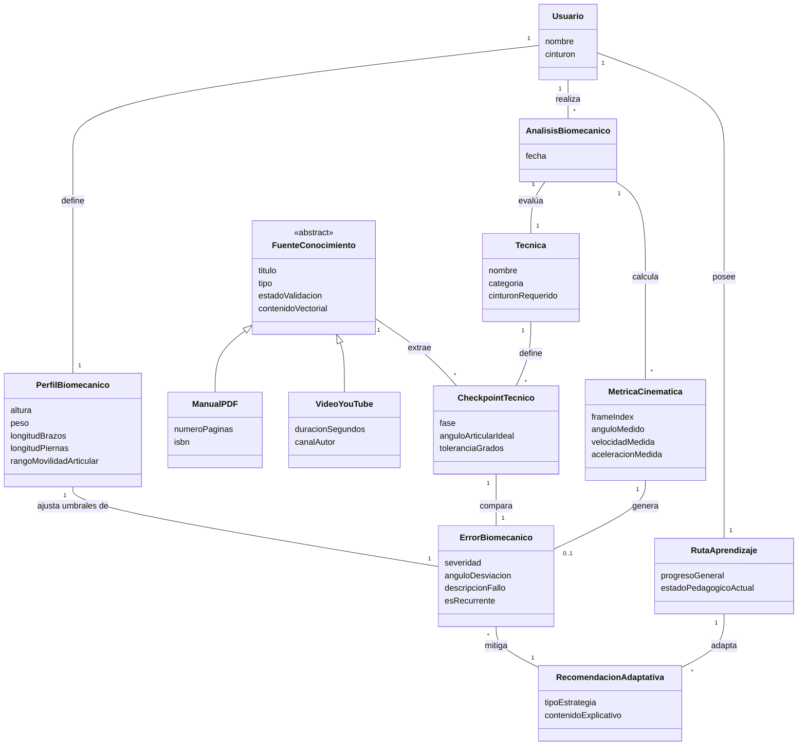
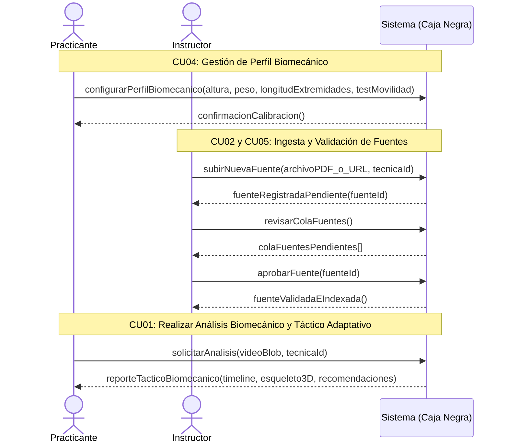
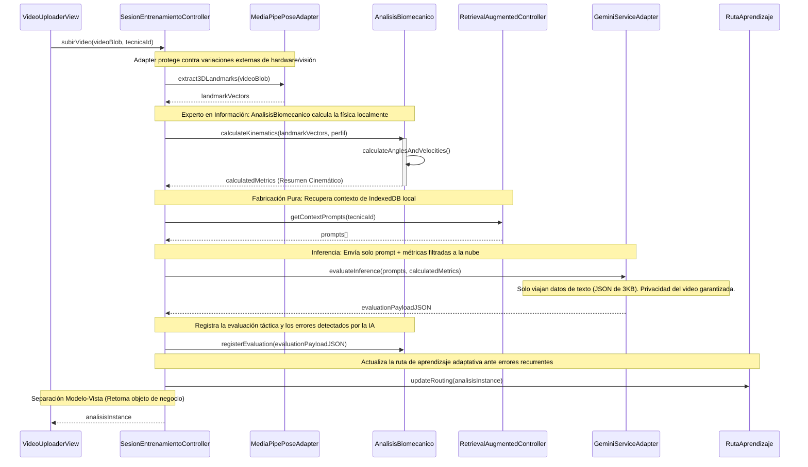
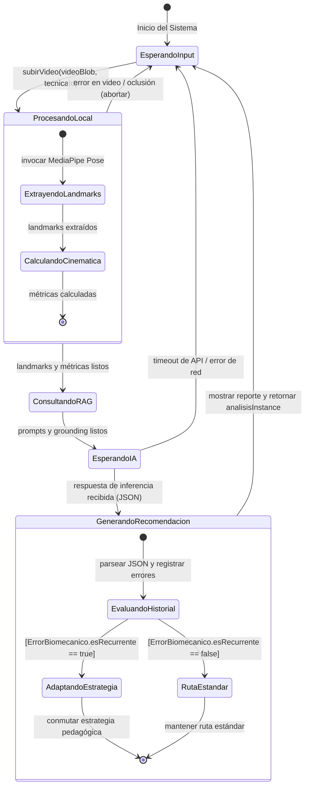
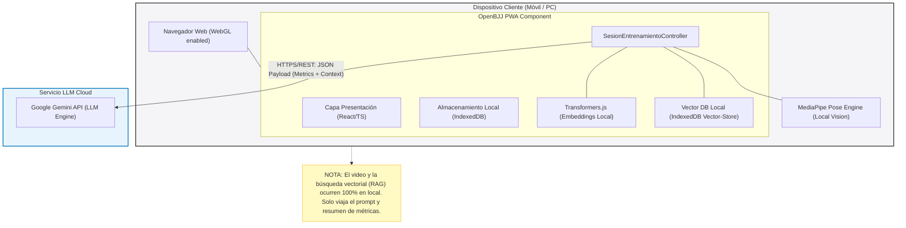

# **OpenBJJ: Plataforma Inteligente de Tutoría Adaptativa y Análisis Biomecánico 3D para Brazilian Jiu-Jitsu mediante Arquitectura Híbrida y RAG**

 

**Santiago Borda Zambrana**  
*Registro: 2021210057*  

 

**Facultad de Ingeniería**  
*Carrera de Ingeniería de Sistemas*  
**Universidad Privada de Santa Cruz de la Sierra**  

 

**Modalidad de Graduación: Proyecto de Grado**  
*Para optar al título de Licenciado en Ingeniería de Sistemas*  

 

**Tutor:** Jose Antonio Benavente Blacutt  

 

**Santa Cruz de la Sierra - Bolivia**  
**2026**

 

# **Agradecimientos**

Agradezco a Dios por traerme a este mundo fuerte y saludable.
A mi madre que gracias a su amor incondicional y su esfuerzo pude estudiar gracias mami.
A mi abuela por alimentarse y tener siempre un plato de comida.
A mis tíos por sus palabras y experiencias vividas para que aprenda.
Al jiujitsu brasileno, por enseñarme a afrontar los miedos, seguir incluso cuando no se ve el avance, saber lidiar con la sensación de la derrota y sobre todo a no rendirme y aprender.

*Un cinturón negro fue un cinturón blanco que no se rindió.*

 

# **Abstract**

| TÍTULO | OpenBJJ: Plataforma Inteligente de Tutoría Adaptativa y Análisis Biomecánico 3D para Brazilian Jiu-Jitsu mediante Arquitectura Híbrida y RAG |
| :--- | :--- |
| **AUTOR** | SANTIAGO BORDA ZAMBRANA |

### **Problemática**
En el aprendizaje y perfeccionamiento del Brazilian Jiu-Jitsu (BJJ), los practicantes carecen de sistemas objetivos que evalúen su ejecución técnica de manera continua y adaptada a su biotipo. Las plataformas actuales presentan rigidez semántica al no incorporar fuentes de conocimiento personalizadas de las academias, ni contemplan el historial de errores del alumno para adaptar la estrategia pedagógica. Asimismo, el análisis cinemático tradicional exige laboratorios caros o sensores inerciales físicos, inoperables en un tatami de sparring real.

### **Objetivo General**
Desarrollar e implementar una plataforma web progresiva (PWA) inteligente que combine el análisis biomecánico 3D en el cliente y la recuperación aumentada por generación (RAG) para la tutoría pedagógica adaptativa del Jiu-Jitsu Brasileño, abarcando todos los niveles de graduación (desde cinturón blanco hasta negro) mediante la inyección dinámica de conocimiento literario y audiovisual.

### **Contenido**
El presente trabajo de investigación se ha desarrollado bajo la metodología del Proceso Unificado (UP) y consta de los siguientes capítulos estructurados de acuerdo con los requisitos funcionales de estimación de pose, RAG y perfilamiento cinemático de los usuarios:

| CARRERA | Ingeniería de Sistemas |
| :--- | :--- |
| **GUÍA** | Jose Antonio Benavente Blacutt |
| **DESCRIPTORES** | Visión por Computadora 3D, Recuperación Aumentada por Generación (RAG), Modelos de Pose Monocular, Tutoría Adaptativa, GRASP, PWA. |
| **EMAIL** | santiagobordazambrana@gmail.com |
| **FECHA** | Santa Cruz de la Sierra, 2026 |

 

# **Resumen**

En este trabajo se expone el diseño y desarrollo de una plataforma inteligente de asistencia deportiva y tutoría adaptativa para el Brazilian Jiu-Jitsu. La solución supera las rigideces metodológicas y los altos costos operativos de infraestructura centralizada al proponer una arquitectura híbrida cliente-ligero. 

La extracción cinemática tridimensional (landmarks 3D) ocurre directamente en el navegador del cliente mediante modelos monoculares libres de sensores físicos. Para la evaluación táctica y corrección del movimiento, se inyectan dinámicamente checkpoints técnicos de múltiples manuales oficiales y videos, indexados en una base de datos vectorial mediante una arquitectura RAG. 

El sistema realiza el seguimiento del progreso histórico del alumno y altera la estrategia didáctica ante fallos recurrentes, ofreciendo una ruta de aprendizaje multi-nivel personalizada. La validez de la arquitectura se sustenta en el Proceso Unificado y el diseño orientado a objetos basado en patrones GRASP y de Polimorfismo para blindar el acoplamiento técnico.

# **Índice de Contenidos**

- [**Agradecimientos**](#agradecimientos)
- [**Abstract**](#abstract)
- [**Resumen**](#resumen)
- [**Capítulo I: Definición del Proyecto de Investigación**](#capítulo-i-definición-del-proyecto-de-investigación)
  - [1.1 Definición del problema](#11-definición-del-problema)
    - [1.1.1 Situación problemática](#111-situación-problemática)
    - [1.1.2 Situación deseada](#112-situación-deseada)
    - [1.1.3 Objeto de investigación](#113-objeto-de-investigación)
    - [1.1.4 Alcance](#114-alcance)
    - [1.1.5 Justificación](#115-justificación)
  - [1.2 Objetivos](#12-objetivos)
    - [1.2.1 Objetivo General](#121-objetivo-general)
    - [1.2.2 Objetivos Específicos](#122-objetivos-específicos)
  - [1.3 Metodología](#13-metodología)
    - [1.3.1 Ingeniería de Software (Proceso Unificado)](#131-ingeniería-de-software-proceso-unificado)
    - [1.3.2 Gestión del Proyecto (Scrum adaptado)](#132-gestión-del-proyecto-scrum-adaptado)
    - [1.3.3 Planificación Iterativa y Fases del Proyecto (Enfoque Adaptativo)](#133-planificación-iterativa-y-fases-del-proyecto-enfoque-adaptativo)
- [**Capítulo II: Marco Teórico**](#capítulo-ii-marco-teórico)
  - [2.1 Visión por Computadora en Deportes: Estimación de Pose 3D](#21-visión-por-computadora-en-deportes-estimación-de-pose-3d)
  - [2.2 Generación Aumentada por Recuperación (RAG) en Deportes](#22-generación-aumentada-por-recuperación-rag-en-deportes)
  - [2.3 Metodología de Diseño UP y Patrones GRASP de Craig Larman](#23-metodología-de-diseño-up-y-patrones-grasp-de-craig-larman)
- [**Capítulo III: Estado del Arte y Análisis Comparativo**](#capítulo-iii-estado-del-arte-y-análisis-comparativo)
  - [3.1 Análisis de Soluciones Existentes](#31-análisis-de-soluciones-existentes)
  - [3.2 Tabla Comparativa de Soluciones](#32-tabla-comparativa-de-soluciones)
- [**Capítulo IV: Definición de Requisitos (SRS)**](#capítulo-iv-definición-de-requisitos-srs)
  - [4.1 Introducción](#41-introducción)
  - [4.2 Descripción General](#42-descripción-general)
    - [4.2.1 Perspectiva del Producto](#421-perspectiva-del-producto)
    - [4.2.2 Funciones del Producto](#422-funciones-del-producto)
    - [4.2.3 Características de los Usuarios](#423-características-de-los-usuarios)
    - [4.2.4 Restricciones](#424-restricciones)
    - [4.2.5 Suposiciones y Dependencias](#425-suposiciones-y-dependencias)
    - [4.2.6 Riesgos del Proyecto y Plan de Gestión de Riesgos (Risk List)](#426-riesgos-del-proyecto-y-plan-de-gestión-de-riesgos-risk-list)
  - [4.3 Requisitos Específicos](#43-requisitos-específicos)
    - [4.3.1 Interfaces Externas](#431-interfaces-externas)
    - [4.3.2 Requisitos Funcionales (RF)](#432-requisitos-funcionales-rf)
    - [4.3.3 Requisitos No Funcionales (RNF)](#433-requisitos-no-funcionales-rnf)
    - [4.3.4 Reglas de Dominio (Reglas de Negocio)](#434-reglas-de-dominio-reglas-de-negocio)
  - [4.4 Glosario y Diccionario de Datos](#44-glosario-y-diccionario-de-datos)
- [**Capítulo V: Análisis y Diseño Orientado a Objetos**](#capítulo-v-análisis-y-diseño-orientado-a-objetos)
  - [5.1 Modelo de Dominio Conceptual](#51-modelo-de-dominio-conceptual)
  - [5.2 Especificación de Casos de Uso Principales (Formato Larman)](#52-especificación-de-casos-de-uso-principales-formato-larman)
    - [Caso de Uso CU01: Realizar Análisis Biomecánico y Táctico Adaptativo](#caso-de-uso-cu01-realizar-análisis-biomecánico-y-táctico-adaptativo)
    - [Caso de Uso CU02: Ingestar Nueva Fuente de Conocimiento (RAG)](#caso-de-uso-cu02-ingestar-nueva-fuente-de-conocimiento-rag)
    - [Caso de Uso CU03: Consultar Progreso y Recibir Tutoría Adaptativa](#caso-de-uso-cu03-consultar-progreso-y-recibir-tutoría-adaptativa)
    - [Caso de Uso CU04: Gestionar Perfil Biomecánico del Usuario](#caso-de-uso-cu04-gestionar-perfil-biomecánico-del-usuario)
    - [Caso de Uso CU05: Validar Fuente de Conocimiento](#caso-de-uso-cu05-validar-fuente-de-conocimiento)
  - [5.3 Diagrama de Secuencia del Sistema (DSS)](#53-diagrama-de-secuencia-del-sistema-dss)
  - [5.4 Contratos de las Operaciones del Sistema](#54-contratos-de-las-operaciones-del-sistema)
  - [5.5 Diseño de la Arquitectura Lógica (Patrón Capas)](#55-diseño-de-la-arquitectura-lógica-patrón-capas)
  - [5.6 Realización del Caso de Uso con Patrones GRASP](#56-realización-del-caso-de-uso-con-patrones-grasp)
  - [5.7 Diagrama de Estados para el Controlador](#57-diagrama-de-estados-para-el-controlador)
  - [5.8 Diagrama de Clases de Diseño (DCD)](#58-diagrama-de-clases-de-diseño-dcd)
  - [5.9 Diagrama de Despliegue Físico](#59-diagrama-de-despliegue-físico)
  - [5.10 Diseño de Interfaces de Usuario (UI)](#510-diseño-de-interfaces-de-usuario-ui)
- [**Capítulo VI: Implementación**](#capítulo-vi-implementación)
- [**Capítulo VII: Seguridad**](#capítulo-vii-seguridad)
- [**Capítulo VIII: Pruebas**](#capítulo-viii-pruebas)
- [**Capítulo IX: Conclusiones y Recomendaciones**](#capítulo-ix-conclusiones-y-recomendaciones)
- [**Referencias**](#referencias)

# **Índice de Tablas**

- [**Tabla 1** *Análisis Comparativo de Soluciones Tecnológicas de Retroalimentación Deportiva*](#tabla-1)
- [**Tabla 2** *Especificación de Requisitos No Funcionales*](#tabla-2)
- [**Tabla 4** *Responsabilidades por Capa de la Arquitectura*](#tabla-4)
- [**Tabla 5** *Justificación de Decisiones de Diseño Basadas en Patrones GRASP*](#tabla-5)
- [**Tabla 6** *Componentes de la Capa Cliente (Dispositivo)*](#tabla-6)
- [**Tabla 7** *Componentes de los Servicios Externos*](#tabla-7)
- [**Tabla 9** *Entorno Tecnológico del Sistema OpenBJJ*](#tabla-9)
- [**Tabla 10** *Materialización de las Clases de Diseño en Código Fuente*](#tabla-10)
- [**Tabla 11** *Caso de Prueba 01: Flujo Básico de Análisis*](#tabla-11)
- [**Tabla 12** *Caso de Prueba 02: Límite de Duración del Video*](#tabla-12)
- [**Tabla 13** *Caso de Prueba 03: Cancelación del Análisis*](#tabla-13)
- [**Tabla 14** *Caso de Prueba 04: Historial Vacío*](#tabla-14)
- [**Tabla 15** *Caso de Prueba 05: Eliminación de Registros Locales*](#tabla-15)
- [**Tabla 16** *Evaluación de Rendimiento y Estabilidad*](#tabla-16)
- [**Tabla 17** *Caso de Prueba 06: Precisión de Grounding RAG (Calidad de Datos)*](#tabla-17)
- [**Tabla 18** *Caso de Prueba 07: Adaptabilidad Biomecánica del Perfil (Regla RD-02)*](#tabla-18)
- [**Tabla 19** *Caso de Prueba 08: Mitigación de Alucinaciones con Fuentes Invalidadas*](#tabla-19)

# **Índice de Figuras**

- [**Figura 1** *Interacción del Practicante con OpenBJJ*](#figura-1)
- [**Figura 2** *Estimación de Landmarks Corporales 3D*](#figura-2)
- [**Figura 3** *Arquitectura RAG para Grounding Técnico de IA*](#figura-3)
- [**Figura 4** *Estructura Organizacional de Corpo & Mente Bolivia*](#figura-4)
- [**Figura 5** *Sistema de Cinturones de Jiu-Jitsu Brasileño*](#figura-5)
- [**Figura 6** *Flujo del Negocio Actual y Detección de Cuellos de Botella*](#figura-6)
- [**Figura 7** *Fases del Proceso Unificado*](#figura-7)
- [**Figura 8** *Modelo de Dominio Conceptual de OpenBJJ*](#figura-8)
- [**Figura 9** *Diagrama de Secuencia del Sistema General para Inferencia 3D y Grounding RAG*](#figura-9)
- [**Figura 10** *Diseño de la Arquitectura Lógica*](#figura-10)
- [**Figura 11** *Diagrama de Secuencia de Diseño del CU01*](#figura-11)
- [**Figura 12** *Máquina de Estados de los Casos de Uso*](#figura-12)
- [**Figura 13** *Diagrama de Clases de Diseño (DCD)*](#figura-13)
- [**Figura 14** *Diagrama de Despliegue del Sistema*](#figura-14)
- [**Figura 15** *Pantalla de Ingesta de Video*](#figura-15)
- [**Figura 16** *Pantalla de Carga y Procesamiento de Video*](#figura-16)
- [**Figura 17** *Pantalla de Reporte Táctico*](#figura-17)
- [**Figura 18** *Pantalla de Historial Local*](#figura-18)
- [**Figura 19** *Métricas de OpenBJJ*](#figura-19)

# **CAPÍTULO I: DEFINICIÓN DEL PROYECTO DE INVESTIGACIÓN**

## **1.1 Definición del problema**

### **1.1.1 Situación problemática**
En el aprendizaje de las artes marciales y, en específico, del Brazilian Jiu-Jitsu (BJJ), los practicantes se enfrentan a una dependencia crítica de la instrucción presencial y sincrónica para corregir sus errores técnicos. En entornos de entrenamiento masivos, los instructores no pueden proporcionar atención personalizada frame por frame a cada alumno, lo que ralentiza significativamente su curva de aprendizaje.

Las soluciones tecnológicas actuales presentan limitaciones severas que impiden resolver este vacío de manera efectiva:
- **Rigidez del conocimiento:** Los sistemas existentes de retroalimentación deportiva poseen reglas técnicas estáticas grabadas directamente en su código fuente (hardcoded). Esto impide la incorporación de literatura técnica diversa (manuales oficiales, reglamentos federativos variados o videos explicativos de YouTube) que los propios profesores o academias desean utilizar como fuente de verdad.
- **Falta de adaptabilidad pedagógica:** Las aplicaciones no consideran el historial de rendimiento del alumno. Emiten diagnósticos aislados y genéricos sin comprender si un error es recurrente, lo que imposibilita la personalización de las estrategias de enseñanza para alumnos que presentan dificultades de progreso persistentes.
- **Complejidad y costes de hardware:** Las herramientas que ofrecen análisis biomecánico cuantitativo preciso exigen sensores inerciales físicos (IMUs) adheridos al cuerpo o cámaras de alta velocidad en entornos controlados, lo cual es inviable sobre un tatami de sparring de BJJ por razones de seguridad, costo y usabilidad.

### **1.1.2 Situación deseada**
Se busca desarrollar una plataforma web progresiva (PWA) inteligente que actúe como un tutor biomecánico y táctico adaptativo. El practicante, independientemente de su nivel de graduación (desde cinturón blanco hasta cinturón negro), podrá cargar un video monocular de su sparring o ejecución técnica. 

El sistema procesará el video localmente en el dispositivo del usuario utilizando visión por computadora en el cliente para estimar landmarks biomecánicos en 3D sin requerir sensores físicos. Un motor de Inteligencia Artificial (IA) contrastará esta cinemática en tiempo real con especificaciones técnicas recuperadas dinámicamente desde una base de datos vectorial inyectada por el usuario (motor RAG de manuales en PDF y transcripciones de YouTube).

Si el alumno falla repetidamente en corregir una desviación técnica detectada, un motor de tutoría adaptativa modificará automáticamente la estrategia pedagógica (conmutando, por ejemplo, de recomendaciones en video de YouTube a drills de flexibilidad específicos o explicaciones anatómicas textuales), adaptando de forma dinámica la ruta de aprendizaje. Todo esto bajo una arquitectura cliente-servidor ligera que ejecute la estimación visual en el navegador del usuario para preservar la confidencialidad absoluta del video y suprimir costos operativos de GPU en el servidor.

**Figura 1**
*Interacción del Practicante con OpenBJJ*

### **1.1.3 Objeto de investigación**
El objeto de este estudio es el modelado y diseño de una arquitectura de software orientada a objetos que combine la estimación de pose 3D client-side (sin sensores) y el procesamiento semántico RAG (Retrieval-Augmented Generation) para la tutoría adaptativa y multi-nivel de artes marciales en tiempo de ejecución.

### **1.1.4 Alcance**
El proyecto OpenBJJ se delimita bajo los siguientes criterios:
- **Alcance Técnico:** Extracción de landmarks corporales en 3D en el lado del cliente (navegador web) a través de MediaPipe y TensorFlow.js, eliminando la transmisión del video original a servidores externos para proteger la privacidad. El motor RAG (incluyendo la generación de embeddings y el almacenamiento vectorial) se ejecuta 100% de manera local en el cliente a través de Transformers.js (para embeddings) e IndexedDB (como base de datos vectorial local), eliminando dependencias de almacenamiento en la nube (como Supabase o Pinecone). La única llamada externa a la nube es la petición final de inferencia de texto a la API de Gemini.
- **Alcance de Dominio:** Cobertura de técnicas correspondientes a todos los niveles de graduación de Brazilian Jiu-Jitsu (cinturones Blanco, Azul, Morado, Marrón y Negro).
- **Alcance Metodológico:** Implementación de la metodología del Proceso Unificado (UP) y asignación de responsabilidades de Craig Larman (patrones GRASP y GoF).
- **Alcance de Despliegue:** Aplicación Web Progresiva (PWA) responsiva compatible con dispositivos móviles y ordenadores de escritorio mediante navegadores modernos con soporte WebGL.

### **1.1.5 Justificación**
- **Tecnológica:** Demuestra la viabilidad de implementar arquitecturas cognitivas complejas (visión 3D + RAG) en navegadores web de consumo mediante ejecución híbrida distribuida, reduciendo la infraestructura centralizada a un backend ligero serverless.
- **Económica:** Suprime la necesidad de servidores de procesamiento de video basados en GPU, delegando la carga computacional pesada al procesador local del cliente. El consumo de APIs se restringe a llamadas de texto y embeddings vectoriales de bajo costo.
- **Social:** Facilita el acceso democratizado y autónomo a la educación de artes marciales de alta calidad, alineándose con las fuentes bibliográficas de preferencia de cada academia sin intervención del programador.

## **1.2 Objetivos**

### **1.2.1 Objetivo General**
Desarrollar una plataforma PWA inteligente que combine análisis biomecánico 3D en el cliente y recuperación aumentada por generación (RAG) para la tutoría adaptativa de Jiu-Jitsu Brasileño a través de todos los niveles de graduación.

### **1.2.2 Objetivos Específicos**
1. Diseñar un pipeline de visión computacional client-side (MediaPipe/TensorFlow.js) para extraer landmarks en 3D y calcular métricas cinemáticas (ángulos articulares, velocidades, aceleraciones) desde videos monoculares 2D de sparring.
2. Implementar un motor de recuperación semántica (RAG) que indexe dinámicamente manuales oficiales (PDF) y transcripciones de videos (YouTube) en una base de datos vectorial para grounding de la IA evaluadora.
3. Desarrollar un motor de recomendación pedagógica adaptativo que evalúe la persistencia de fallos y altere las estrategias de retroalimentación conforme al historial de progreso y al perfil biomecánico del estudiante.
4. Modelar el dominio y comportamiento del sistema utilizando diagramas UML y aplicando los patrones GRASP de Craig Larman para aislar la lógica biomecánica, RAG y adaptativa en componentes reutilizables y de bajo acoplamiento.

## **1.3 Metodología**

Se adopta un marco de desarrollo ágil híbrido para estructurar el avance técnico del proyecto de grado.

### **1.3.1 Ingeniería de Software (Proceso Unificado)**
El Proceso Unificado (UP) rige la arquitectura técnica, el modelado y la documentación de diseño del sistema, estructurado en cuatro fases clave:
1. **Inicio (Inception):** Definición de la visión del producto, análisis preliminar de la viabilidad y establecimiento de la Lista de Riesgos inicial.
2. **Elaboración (Elaboración):** Diseño y estabilización de la arquitectura ejecutable (mitigando los riesgos principales), desarrollo del pipeline MediaPipe-RAG-Gemini e iteración de los diagramas de clases y de secuencia.
3. **Construcción (Construcción):** Programación iterativa de las características restantes (interfaces React, almacenamiento IndexedDB) y refino de las clases.
4. **Transición (Transición):** Despliegue de la PWA, pruebas de campo en el tatami, y optimizaciones de rendimiento y latencia.

### **1.3.2 Gestión del Proyecto (Scrum adaptado)**
Se utiliza Scrum para organizar el esfuerzo temporal y el backlog del proyecto a través de iteraciones fijas (*Sprints*) de 3 semanas, facilitando la inspección y adaptación constante ante impedimentos técnicos o cambios de API.

### **1.3.3 Planificación Iterativa y Fases del Proyecto (Enfoque Adaptativo)**
Frente a la rigidez de una planificación predictiva en cascada, este proyecto implementa la planificación iterativa y adaptativa de Larman. Se establece un **Plan de Fases** con hitos macro de evaluación de riesgos, y un **Plan de Iteración** en el cual el desarrollo se organiza en base a prioridades de *Riesgo*, *Cobertura* y *Criticidad*:
- **Iteración 1 (Fase de Elaboración):** Desarrollo de la prueba de concepto del pipeline principal. Mitigación del riesgo de latencia de red y fatiga de CPU en el navegador cliente durante la extracción de pose. Integración básica MediaPipe-Gemini.
- **Iteración 2 (Fase de Elaboración):** Implementación del RAG vectorial local y consolidación del grounding dinámico. Configuración del perfil de usuario y ajuste biomecánico por biotipo.
- **Iteración 3 (Fase de Construcción):** Diseño de la interfaz de usuario con Tailwind (Glassmorphic React components), almacenamiento local en IndexedDB y persistencia del historial.
- **Iteración 4 (Fase de Transición):** Despliegue y pruebas de usabilidad "hands-free" en tatami, calibración final y optimización de tokens en la API de Gemini.

---

# **CAPÍTULO II: MARCO TEÓRICO**

## **2.1 Visión por Computadora en Deportes: Estimación de Pose 3D**
La visión artificial en el ámbito deportivo ha evolucionado de la simple clasificación de acciones a la reconstrucción cinemática del cuerpo humano. Modelos de aprendizaje profundo preentrenados (como MediaPipe Pose de Google y TensorFlow.js) permiten realizar estimación de pose en el navegador web del usuario a través de JavaScript y aceleración por WebGL.

Estos modelos estiman las coordenadas de hasta 33 puntos de referencia corporales clave (landmarks), entregando coordenadas tridimensionales relativas $(x, y, z)$. El eje $z$ representa la profundidad respecto a la cadera del sujeto, permitiendo reconstruir un esqueleto 3D a partir de una única cámara monocular (2D) convencional.

**Figura 2**
*Estimación de Landmarks Corporales 3D*

A partir de estas coordenadas, la física cinemática permite derivar métricas fundamentales del movimiento deportivo sin sensores inerciales corporales:
- **Ángulos articulares ($\theta$):** Calculados mediante el coseno del ángulo entre los vectores formados por tres landmarks adyacentes (ej. hombro-codo-muñeca para el codo):
  $$\cos(\theta) = \frac{\vec{u} \cdot \vec{v}}{\|\vec{u}\| \|\vec{v}\|}$$
- **Velocidad articular ($\vec{v}$):** Derivada temporal de la posición de los landmarks entre fotogramas sucesivos:
  $$\vec{v}(t) = \frac{\vec{p}(t) - \vec{p}(t-\Delta t)}{\Delta t}$$
- **Aceleración articular ($\vec{a}$):** Tasa de cambio de la velocidad en el tiempo:
  $$\vec{a}(t) = \frac{\vec{v}(t) - \vec{v}(t-\Delta t)}{\Delta t}$$

La ejecución de este pipeline en el navegador del cliente elimina la necesidad de transmitir flujos de video masivos a la nube, reduciendo la latencia de procesamiento, eliminando costos de infraestructura de GPU en el servidor y garantizando que los datos visuales brutos permanezcan seguros en el dispositivo del usuario.

## **2.2 Generación Aumentada por Recuperación (RAG) en Deportes**
Los Modelos de Lenguaje de Gran Escala (LLMs) presentan el riesgo de generar respuestas erróneas o ficticias ("alucinaciones") cuando se les consulta sobre reglas y técnicas específicas de deportes complejos como el BJJ, dado que la literatura técnica puede no estar suficientemente representada en sus datos de entrenamiento generalistas.

Para subsanar esto, el patrón de arquitectura RAG contextualiza al modelo generativo en tiempo de ejecución inyectando fragmentos textuales relevantes de documentos externos de manera 100% local en el cliente:
1. **Ingestación de Conocimiento:** Documentos técnicos (libros en PDF, transcripciones de YouTube subidas manualmente o vía API proxy) son segmentados en fragmentos lógicos (chunks) directamente en el navegador.
2. **Generación de Embeddings Local:** Se utiliza la librería `Transformers.js` ejecutada localmente en el hilo de fondo del navegador (via Web Workers) para convertir cada chunk en un vector multidimensional sin subir los textos a servicios externos.
3. **Indexación y Almacenamiento Vectorial:** Los vectores se persisten en una base de datos vectorial local construida sobre la API de IndexedDB (Vector DB Local).
4. **Recuperación y Grounding:** Cuando el usuario selecciona una técnica, el sistema realiza una consulta vectorial mediante similitud coseno directamente en IndexedDB, recupera los fragmentos y checkpoints técnicos correspondientes, y los concatena al prompt del LLM junto con las métricas biomecánicas calculadas. De esta forma, el modelo de IA evalúa el movimiento basándose estrictamente en datos oficiales. La única comunicación externa a la nube es el prompt final enviado a la API de Gemini.

**Figura 3**
*Arquitectura RAG para Grounding Técnico de IA*

## **2.3 Metodología de Diseño UP y Patrones GRASP de Craig Larman**
Para garantizar la solidez arquitectónica en sistemas complejos, el Proceso Unificado (UP) promueve el desarrollo iterativo guiado por riesgos y centrado en la arquitectura lógica. 

El análisis y diseño se fundamenta en la asignación de responsabilidades a los objetos utilizando los patrones GRASP (General Responsibility Assignment Software Patterns) propuestos por Craig Larman (2003). Estos patrones definen reglas sistemáticas para estructurar el software:
- **Experto en Información:** Asigna responsabilidades al objeto que posee los datos requeridos.
- **Controlador:** Objeto no visual que coordina la recepción de eventos del sistema y la orquestación del flujo de dominio.
- **Bajo Acoplamiento y Alta Cohesión:** Guías métricas para minimizar las dependencias y maximizar la especialización funcional de las clases.
- **Fabricación Pura y Variaciones Protegidas:** Creación de clases artificiales (como adaptadores y conectores vectoriales) para encapsular APIs de IA o almacenamiento local, aislando el núcleo de dominio de cambios tecnológicos futuros.

---

# **CAPÍTULO III: ESTADO DEL ARTE AND ANÁLISIS COMPARATIVO**

## **3.1 Análisis de Soluciones Existentes**
El análisis cinemático y la tutoría técnica en el deporte disponen de diversos enfoques tecnológicos en el mercado, los cuales presentan claras brechas con las necesidades pedagógicas del Jiu-Jitsu Brasileño:
- **Sistemas basados en Sensores Corporales (IMU):** Utilizados en atletismo de élite. Ofrecen excelente precisión métrica, pero requieren equipamiento caro y la sujeción de bandas físicas al cuerpo, lo cual es impracticable e inseguro en BJJ debido al contacto directo constante, roces y derribos (sparring) en el tatami.
- **Aplicaciones Estáticas de BJJ (Videotecas fijos):** Plataformas que muestran repositorios de video ordenados. Carecen de cualquier capacidad de análisis automatizado o retroalimentación sobre la ejecución del alumno.
- **Soluciones de Visión Monocular en Deportes (Golf / Tennis Swing Apps):** Herramientas capaces de estimar ángulos articulares desde video 2D. Sin embargo, su lógica de negocio está totalmente acoplada (hardcoded) a un único deporte, impidiendo inyectar dinámicamente nuevas técnicas y careciendo de mecanismos RAG o adaptabilidad pedagógica para el seguimiento de la curva de aprendizaje de alumnos que presentan errores repetitivos.

## **3.2 Tabla Comparativa de Soluciones**

El siguiente cuadro analiza comparativamente las soluciones del mercado respecto a la propuesta integrada de OpenBJJ:

**Tabla 1**  
*Análisis Comparativo de Soluciones Tecnológicas de Retroalimentación Deportiva*

| Característica / Criterio | Sistemas Inerciales (IMUs) | Apps de Videotecas Estáticas | Apps de Golf/Tenis Monoculares | OpenBJJ (Propuesta) |
| :--- | :--- | :--- | :--- | :--- |
| **Análisis 3D sin Sensores** | No (Requiere hardware físico) | No (Ninguno) | Sí (Estimación 2D/3D acoplada) | Sí (Pose 3D local con MediaPipe) |
| **Ingesta Dinámica (RAG)** | No | No | No (Reglas rígidas fijas) | Sí (Embeddings de PDF/YouTube) |
| **Soporte Multi-nivel** | N/A | Sí (Solo visualización) | No | Sí (Rutas de Blanco a Negro) |
| **Adaptabilidad Pedagógica** | No | No | No (Evaluación puntual aislada) | Sí (Rastreo histórico de errores) |
| **Seguridad y Privacidad** | Media (Datos en nube) | Alta (No graba) | Baja (Video enviado a servidores) | Alta (Procesamiento local client-side) |
| **Costo Operativo de GPU** | Alto | Nulo | Alto (Servidores en la nube) | Nulo (Ejecución distribuida en cliente) |

---

# **CAPÍTULO IV: DEFINICIÓN DE REQUISITOS (SRS)**

## **4.1 Introducción**
El presente pliego de condiciones técnicas establece la especificación de requisitos del sistema (SRS) para la plataforma OpenBJJ bajo el modelo de calidad FURPS+. Bajo la taxonomía metodológica del Proceso Unificado (UP), la descripción general y los objetivos de alto nivel del sistema corresponden al **Documento de Visión** (Vision Document), mientras que los requisitos no funcionales, reglas de negocio y restricciones técnicas descritas en este capítulo conforman la **Especificación Suplementaria** (Supplementary Specification).

## **4.2 Descripción General**

### **4.2.1 Perspectiva del Producto**
OpenBJJ opera bajo una topología de arquitectura híbrida. El motor de visión computacional y extracción cinemática corre enteramente en el cliente (PWA en el navegador). El almacenamiento de historial y vectorización RAG se apoya en servicios en la nube serverless ligeros a través de HTTPS/REST.

### **4.2.2 Funciones del Producto**
- **Ingesta de Conocimiento:** Carga e indexación semántica de manuales y videos.
- **Extracción Biométrica:** Detección de pose y cálculo de ángulos, velocidad y aceleración en 3D.
- **Análisis Táctico (Grounding):** Inferencia cognitiva comparando la cinemática con la ontología RAG.
- **Recomendación Pedagógica Adaptativa:** Generación de rutas personalizadas basadas en fallos acumulativos.
- **Validación de Datos:** Flujo para asegurar que las fuentes inyectadas por la comunidad cumplan con el criterio del instructor.

### **4.2.3 Características de los Usuarios y Gestión de Roles Local**
1. **Practicante:** Alumno de cualquier cinturón (desde blanco hasta negro) que busca autoevaluarse y configurar su perfil biomecánico.
2. **Instructor:** Experto certificado de la academia que gestiona, sube e indexa las fuentes de conocimiento, además de validar los recursos del RAG.
3. **Administrador:** Soporte técnico del sistema local.

**Nota sobre la Gestión de Acceso y Roles:** Dado el principio de soberanía de datos y funcionamiento offline sin cuentas centralizadas, la plataforma carece de un servidor de autenticación de login tradicional. Los perfiles de usuario se persisten localmente en IndexedDB. Para habilitar los flujos de "Instructor" (ingesta y validación de fuentes), el usuario puede conmutar localmente al "Modo Instructor" ingresando un PIN de acceso o clave maestra almacenada en el `localStorage` del navegador. De esta manera, el control de acceso a la moderación se realiza 100% en el dispositivo del cliente.

### **4.2.4 Restricciones**
- La API de MediaPipe client-side exige soporte WebGL activo en el navegador para acelerar el procesamiento de fotogramas.
- El video monocular de entrada debe capturar el cuerpo entero del practicante sin oclusiones severas para garantizar la consistencia temporal de landmarks.
- **Restricción de Tránsito de Datos (Ancho de Banda):** No se permite la transmisión de coordenadas 3D crudas por cada frame de video hacia la API del LLM, para evitar el desbordamiento de tokens y problemas de red. Las coordenadas de landmarks se deben resumir en métricas cinemáticas locales (ángulos críticos y velocidad articular) en el cliente antes de su transmisión hacia la nube.

### **4.2.5 Suposiciones y Dependencias**
- El cliente posee conexión a internet para interactuar con la API del LLM (Gemini) y recuperar fragmentos vectoriales de RAG, aunque el análisis biomecánico inicial es local.

### **4.2.6 Riesgos del Proyecto y Plan de Gestión de Riesgos (Risk List)**

Siguiendo las directrices del UP, se identifican y priorizan los riesgos técnicos críticos al inicio de la fase de Elaboración, definiendo planes de mitigación concretos que se ejecutan en las iteraciones tempranas:

- **R-01 (Riesgo Técnico - Carga de Memoria y CPU en el Cliente):** El análisis biomecánico continuo en el navegador mediante MediaPipe puede causar congelamiento de la pestaña o fatiga de la CPU en dispositivos móviles de gama media/baja si los videos son extensos.
  - *Mitigación:* Se implementa un límite estricto de duración de video a 45 segundos en el cliente y se realiza un submuestreo de fotogramas clave en lugar de procesar los 30 fps continuos.
- **R-02 (Riesgo Técnico - Alucinaciones y Desviación del LLM):** El modelo de lenguaje generativo (Gemini) puede inventar detalles biomecánicos erróneos o alucinar técnicas no presentes en el Jiu-Jitsu.
  - *Mitigación:* Se implementa un prompt de grounding rígido con inyección RAG de manuales validados (calidad de datos) y se restringe la respuesta a un esquema JSON estricto mediante la configuración de la API de Gemini.
- **R-03 (Riesgo Técnico - Latencia de Payload en Inferencia):** El envío de coordenadas tridimensionales crudas para 1,350 fotogramas satura el canal de red y excede el límite de tokens de la ventana de contexto.
  - *Mitigación:* La lógica de negocio pre-procesa y filtra los datos cinemáticos en el cliente, extrayendo únicamente los valores angulares y de velocidad críticos (resumen cinemático) para ser inyectados en formato de texto breve (JSON de 3KB).
- **R-04 (Riesgo de Usabilidad - Operación en Tatami):** Dificultad para interactuar con la pantalla del móvil estando sudado, con kimonos gruesos o con dedos vendados.
  - *Mitigación:* Se define el soporte para interacción remota "Hands-free" mediante reconocimiento de gestos corporales de parada/inicio o comandos de voz.

## **4.3 Requisitos Específicos**

### **4.3.1 Interfaces Externas**
- **Interfaz de Usuario (UI):** Responsiva, con soporte móvil táctil (Mobile-First) y principios visuales de Glassmorphic Dark UI.
- **Interfaz de Software (API):** Consumo de base de datos vectorial (REST JSON) y SDK de Google Gemini.

### **4.3.2 Requisitos Funcionales (RF)**
- **RF-Ingesta:** El sistema debe permitir al Instructor cargar archivos PDF y enlaces de videos de YouTube, extrayendo el contenido técnico mediante embeddings para su almacenamiento en una base de datos vectorial.
- **RF-Biomecánica:** El sistema debe procesar localmente el video en el navegador mediante MediaPipe, extrayendo landmarks 3D corporales y calculando las métricas cinemáticas.
- **RF-Adaptación:** El sistema debe registrar las desviaciones técnicas detectadas en una base de datos local e individual para conmutar la estrategia de corrección didáctica ante fallos recurrentes.
- **RF-Perfil:** El sistema debe permitir al Practicante ingresar sus datos antropométricos (altura, peso, longitud de extremidades) y realizar un test de movilidad inicial para adaptar los rangos angulares ideales según su biotipo.
- **RF-Validación:** El sistema debe permitir al Instructor revisar y validar las fuentes de conocimiento cargadas por la comunidad antes de indexarlas formalmente en la base vectorial del RAG.

### **4.3.3 Requisitos No Funcionales (RNF)**

**Tabla 2**  
*Especificación de Requisitos No Funcionales*

| ID | Categoría (FURPS+) | Descripción del Requisito No Funcional |
| :--- | :--- | :--- |
| **RNF01** | Usabilidad | La interfaz gráfica debe adaptarse responsivamente a pantallas móviles táctiles, asegurando operabilidad dentro del tatami con guantes o vendajes. |
| **RNF02** | Fiabilidad | El sistema debe validar el formato de las coordenadas vectoriales devueltas por MediaPipe antes de enviarlas al LLM, evitando excepciones de formato en tiempo de ejecución. |
| **RNF03** | Rendimiento (Precisión) | **Consistencia Temporal:** El algoritmo debe ser capaz de identificar desviaciones angulares mayores a 15 grados respecto al patrón ideal de la técnica, manteniendo una tasa de falsos positivos inferior al 10% bajo kimonos deportivos. |
| **RNF04** | Rendimiento (Latencia) | El tiempo transcurrido entre la finalización de la extracción de landmarks y la visualización de la retroalimentación adaptativa estructurada debe ser menor a 3 segundos. |
| **RNF05** | Seguridad (Privacidad) | **Principio de Confidencialidad:** El archivo de video original en formato bruto nunca debe transmitirse a través de la red; el análisis espacial e inferencia de coordenadas ocurre estrictamente en memoria volátil local. |
| **RNF06** | Mantenibilidad | El motor de análisis y la lógica de recomendación pedagógica deben estar desacoplados de los servicios tecnológicos de estimación de pose mediante interfaces y patrones de Fabricación Pura. |
| **RNF07** | Usabilidad (Hands-free) | **Interacción sin contacto:** El sistema debe soportar el inicio y detención del análisis mediante comandos de voz simples ("Grabar", "Detener") o gestos visibles sostenidos (ej. brazo levantado por 3 segundos), permitiendo operar el software a distancia en el tatami sin tocar la pantalla con sudor o vendajes. |

### **4.3.4 Reglas de Dominio (Reglas de Negocio)**

De acuerdo con Craig Larman, las reglas de dominio dictan cómo opera el negocio fuera de los límites del software y deben registrarse formalmente en la Especificación Suplementaria. Para el dominio de BJJ y tutoría inteligente, se establecen las siguientes directrices:
- **RD-01 (Jerarquía de Graduación):** Un practicante solo puede recibir tutoría de técnicas correspondientes a su cinturón actual o inferior, salvo autorización explícita del instructor.
- **RD-02 (Tolerancia de Biotipo):** El umbral de error para ángulos articulares ideales (establecido inicialmente en $\pm 15^{\circ}$) se flexibiliza hasta en un $20\%$ si el perfil biomecánico del usuario reporta limitaciones de movilidad articular o proporciones físicas extremas validadas en el test de movilidad.
- **RD-03 (Calidad del Grounding RAG):** Ningún chunk semántico proveniente de manuales o videos subidos colaborativamente por alumnos puede ser indexado ni utilizado en prompts de inferencia de IA si no cuenta con el estado de "Validado" firmado por un Instructor certificado.

## **4.4 Glosario y Diccionario de Datos**

Este artefacto, clave en la fase de Elaboración del Proceso Unificado, define la terminología de dominio y las especificaciones de formato y rangos de los atributos del sistema:

### **4.4.1 Glosario de Términos**
- **Landmark 3D:** Coordenada espacial tridimensional $(x,y,z)$ estimada para un punto de referencia anatómico clave (hombro, codo, muñeca, cadera, rodilla, tobillo) respecto a la cadera del sujeto.
- **Retrieval-Augmented Generation (RAG):** Técnica de IA que inyecta contexto textual de fuentes externas (como libros en PDF o transcripciones de video) en el prompt de un LLM para fundamentar sus respuestas en datos de dominio confiables y evitar alucinaciones.
- **Embedding Vectorial:** Representación numérica multidimensional de un fragmento de texto (chunk) que captura su significado semántico y permite realizar búsquedas de similitud coseno en bases de datos vectoriales.
- **Desviación Técnica (o Error Biomecánico):** Diferencia angular o cinemática medida entre la ejecución del practicante y los umbrales ideales definidos para un movimiento.

### **4.4.2 Diccionario de Datos (Especificaciones de Atributos)**

| Entidad | Atributo | Tipo de Dato | Formato / Rango | Reglas de Validación |
| :--- | :--- | :--- | :--- | :--- |
| **Usuario** | `cinturon` | Enumerado | `{Blanco, Azul, Morado, Marrón, Negro}` | Obligatorio. Rige el catálogo de técnicas visible. |
| **PerfilBiomecanico** | `altura` | Decimal | `[0.50, 2.50]` metros | Mayor que cero. Usado para normalizar las longitudes relativas de landmarks. |
| **MetricaCinematica** | `anguloMedido` | Decimal | `[0.00, 360.00]` grados | Calculado por la fórmula de coseno entre tres landmarks de la articulación. |
| **ErrorBiomecanico** | `severidad` | Enumerado | `{Leve, Moderado, Crítico}` | Leve: desv. $\le 15^{\circ}$; Moderado: desv. entre $15^{\circ}$ y $30^{\circ}$; Crítico: desv. $> 30^{\circ}$ o error recurrente. |
| **FuenteConocimiento** | `estadoValidacion` | Enumerado | `{Pendiente, Validado, Rechazado}` | Por defecto se crea en "Pendiente". Solo "Validado" pasa al RAG activo. |

---

# **CAPÍTULO V: ANÁLISIS Y DISEÑO ORIENTADO A OBJETOS**

En concordancia con los principios del desarrollo iterativo e incremental del Proceso Unificado (UP), los diagramas y modelos presentados en este capítulo no representan un diseño estático realizado de forma anticipada (enfoque en cascada o *waterfall*). Por el contrario, son el producto acumulativo y evolutivo de múltiples ciclos de desarrollo (sprints con límites de tiempo o *timeboxed*) de la fase de Elaboración. Las abstracciones y realizaciones se definieron y adaptaron de manera continua basándose en el aprendizaje y la retroalimentación inmediata obtenidos durante la programación de las primeras iteraciones del núcleo arquitectónico ejecutable del sistema.

## **5.1 Modelo de Dominio Conceptual**
El modelo de dominio representa los conceptos significativos del negocio de OpenBJJ. Siguiendo las directrices de Larman, se modelan las abstracciones cinemáticas, de RAG y adaptación instruccional sin acoplar detalles de bases de datos.

La clase **PerfilBiomecanico** está asociada mediante una relación estricta 1-a-1 con **Usuario**. Esta entidad captura los datos antropométricos del usuario (como altura, peso y longitudes segmentarias) junto con sus rangos de movilidad articular. Esta clase influye directamente en el cálculo del **ErrorBiomecanico**: en lugar de aplicar un umbral estático universal de tolerancia, el sistema evalúa la movilidad del practicante para flexibilizar dinámicamente los límites de desviación angular permitida (conforme a la regla de negocio `RD-02`). 

De este modo, la clase **ErrorBiomecanico** (o *DesviacionTecnica*) actúa como entidad puente fundamental. Registra la diferencia entre la ejecución real medida por la **MetricaCinematica** y el patrón ideal extraído de la **FuenteConocimiento** (ajustado según el **PerfilBiomecanico** del **Usuario**). Esta información permite a la **RecomendacionAdaptativa** evaluar el historial de fallas y actualizar de forma personalizada la **RutaAprendizaje** del practicante. 

Cabe destacar que las recomendaciones pedagógicas y drills correctivos no se encuentran hardcodeados en el software. Cada chunk textual indexado en la base de datos vectorial local se asocia con un metadato estructurado denominado `tipoRecurso` (con valores `{tecnica, drill, explicacion_anatomica}`). Cuando el sistema detecta que un `ErrorBiomecanico` es recurrente (`esRecurrente == true`), el `RetrievalAugmentedController` aplica un filtro por este metadato en la búsqueda vectorial local (IndexedDB). Esto fuerza la recuperación de chunks clasificados como `drill` o `explicacion_anatomica` para inyectarlos en el prompt de Gemini, modificando de forma dinámica la estrategia instruccional hacia ejercicios de movilidad o explicaciones conceptuales profundas.

## **5.2 Especificación de Casos de Uso Principales (Formato Larman)**

A continuación se detallan los casos de uso principales utilizando el formato "completamente vestido" (fully dressed) propuesto por Craig Larman, asegurando la trazabilidad de requisitos, actores y flujos alternativos.

#### Caso de Uso CU01: Realizar Análisis Biomecánico y Táctico Adaptativo

**Actor Principal:** Practicante (Alumno de BJJ).
**Intereses de las Partes Involucradas:**
*   **Practicante:** Desea recibir retroalimentación objetiva e instantánea sobre su ejecución técnica, identificando errores biomecánicos específicos (ángulos, velocidad) sin depender exclusivamente del instructor.
*   **Instructor:** Desea que el sistema sirva como herramienta de apoyo para corregir errores recurrentes fuera del horario de clase.
*   **Sistema de IA (Gemini):** Desea recibir entradas estructuradas (landmarks + contexto RAG) para minimizar alucinaciones.

**Precondiciones:**
1.  El practicante ha iniciado sesión o está usando la aplicación localmente.
2.  El dispositivo cuenta con soporte WebGL activo para MediaPipe.
3.  Existe al menos una fuente de conocimiento (Manual/Video) indexada en la Base de Datos Vectorial asociada a la técnica seleccionada.

**Garantías de Éxito (Postcondiciones):**
1.  Se ha extraído y procesado la secuencia de landmarks 3D del video localmente.
2.  Se han calculado las métricas cinemáticas (ángulos, velocidades) por fotograma.
3.  Se ha recuperado el contexto técnico relevante mediante RAG.
4.  La IA ha generado un reporte estructurado comparando la ejecución real vs. el patrón ideal.
5.  Se ha registrado el análisis en el historial del usuario (`AnalisisBiomecanico`).
6.  Si se detectaron errores recurrentes, se ha actualizado la `RutaAprendizaje` con una recomendación adaptativa.

**Escenario Principal de Éxito (Flujo Básico):**
1.  El Practicante selecciona la técnica a evaluar (ej. "Guardia Cerrada") y el nivel de cinturón.
2.  El Practicante carga o graba un video de su ejecución (máx. 45 seg).
3.  El Sistema valida el formato y duración del video.
4.  El Sistema invoca al motor local `MediaPipePoseAdapter` para extraer los landmarks 3D $(x,y,z)$ de cada fotograma clave.
5.  El `SesionEntrenamientoController` calcula las métricas cinemáticas (ángulos articulares, velocidades) basándose en los landmarks.
6.  El Sistema consulta al `RetrievalAugmentedController` pasando el ID de la técnica.
7.  El `RetrievalAugmentedController` busca en la `VectorDBAdapter` los fragmentos de manuales/videos relevantes (Grounding).
8.  El Sistema ensambla un prompt estructurado que incluye: métricas calculadas + contexto RAG + instrucción de evaluación.
9.  El Sistema envía el prompt a la `GeminiServiceAdapter`.
10. La IA retorna un JSON con la evaluación táctica, detección de errores y puntuación biomecánica.
11. El Sistema parsea la respuesta, identifica instancias de `ErrorBiomecanico` si las desviaciones superan el umbral (ej. >15°).
12. El Sistema verifica el historial del usuario. Si el error es recurrente, el motor adaptativo selecciona una estrategia pedagógica alternativa (ej. drill de movilidad en lugar de video técnico).
13. El Sistema despliega la línea de tiempo interactiva con el esqueleto 3D superpuesto, resaltando los errores y mostrando la recomendación adaptativa.
14. El Sistema guarda el registro en IndexedDB.

**Extensiones (Flujos Alternativos):**
*   **3a. Video inválido o duración excesiva:**
    1.  El Sistema detecta que el video excede los 45 segundos o tiene formato no soportado.
    2.  El Sistema muestra alerta: "Video no válido. Máximo 45 segundos."
    3.  El Sistema aborta el proceso y retorna al paso 1.
*   **4a. Fallo en la estimación de Pose (Oclusión severa):**
    1.  MediaPipe reporta confianza baja (<0.5) en más del 30% de los landmarks.
    2.  El Sistema alerta: "No se pudo rastrear el esqueleto correctamente. Verifique iluminación y encuadre."
    3.  El Sistema aborta el análisis biomecánico pero permite guardar el video como referencia manual.
*   **7a. No se encuentra contexto RAG:**
    1.  La Base de Datos Vectorial no retorna fragmentos relevantes para la técnica seleccionada.
    2.  El Sistema utiliza un prompt de "Fallback" basado en principios universales de BJJ (base, alineación, palanca).
    3.  Continúa en el paso 8.
*   **9a. Fallo de conexión con API de IA:**
    1.  La petición a Gemini falla por timeout o error de red.
    2.  El Sistema reintenta automáticamente hasta 3 veces.
    3.  Si falla nuevamente, muestra: "Error de servicio. Intente más tarde." y guarda los datos crudos (landmarks) para procesamiento diferido si es posible.
*   **12a. Error Recurrente Detectado (Adaptabilidad Pedagógica):**
    1.  El Sistema identifica que el `ErrorBiomecanico` "Codo Abierto" ha ocurrido en >70% de los últimos 5 análisis.
    2.  El Motor Adaptativo cambia la estrategia: En lugar de mostrar otro video de la técnica, sugiere un "Drill de Fortalecimiento de Tríceps".
    3.  El Sistema actualiza la `RutaAprendizaje` del usuario.

**Requisitos Especiales:**
*   Latencia total del análisis < 5 segundos.
*   Privacidad: El video original NUNCA sale del dispositivo. Solo se transmiten coordenadas numéricas y texto.

---

#### Caso de Uso CU02: Ingestar Nueva Fuente de Conocimiento (RAG)

**Actor Principal:** Instructor (Usuario Autorizado).
**Intereses de las Partes Involucradas:**
*   **Instructor:** Desea expandir la base de conocimientos del sistema con sus propios manuales, reglamentos o videos explicativos para personalizar la enseñanza.
*   **Sistema:** Debe mantener la integridad semántica de los embeddings y evitar duplicados.

**Precondiciones:**
1.  El Instructor tiene permisos de "Editor" o "Admin".
2.  El archivo PDF es legible (texto seleccionable) o el video de YouTube tiene subtítulos disponibles.

**Garantías de Éxito (Postcondiciones):**
1.  El contenido textual ha sido extraído y segmentado en chunks.
2.  Se han generado vectores (embeddings) para cada chunk.
3.  Los vectores han sido almacenados e indexados en la Base de Datos Vectorial.
4.  La fuente queda marcada como "Activa" para consultas RAG.

**Escenario Principal de Éxito (Flujo Básico):**
1.  El Instructor accede al módulo de "Gestión de Conocimiento".
2.  El Instructor selecciona "Agregar Fuente" y elige tipo (PDF o YouTube URL).
3.  El Instructor sube el archivo PDF o pega la URL del video.
4.  El Sistema valida el archivo/enlace.
5.  El Sistema extrae el texto completo (OCR si es necesario para PDFs escaneados, o API de subtítulos para YouTube).
6.  El Sistema segmenta el texto en fragmentos lógicos (chunks) de tamaño óptimo (ej. 500 tokens).
7.  El Sistema invoca al servicio de Embeddings para convertir cada chunk en un vector multidimensional.
8.  El Sistema almacena los vectores en la **VectorDBAdapter** asociados a metadatos (Técnica, Nivel, Autor).
9.  El Sistema confirma: "Fuente indexada exitosamente. Disponible para análisis."

**Extensiones (Flujos Alternativos):**
*   **4a. Archivo corrupto o URL inválida:**
    1.  El Sistema no puede leer el contenido.
    2.  Muestra error específico: "PDF dañado" o "Video privado/no existente".
    3.  Retorna al paso 2.
*   **6a. Texto insuficiente para generar embeddings:**
    1.  El documento tiene menos de 50 palabras.
    2.  El Sistema alerta: "Contenido demasiado breve para ser útil técnicamente."
    3.  Cancela la indexación.

**Requisitos Especiales:**
*   La extracción de texto e indexación vectorial (RAG) debe completarse en menos de 10 segundos para documentos de hasta 20 páginas.
*   El sistema debe admitir archivos PDF con codificación estándar de texto y URLs de YouTube públicas sin restricciones de geobloqueo.

---

#### Caso de Uso CU03: Consultar Progreso y Recibir Tutoría Adaptativa

**Actor Principal:** Practicante.
**Intereses de las Partes Involucradas:**
*   **Practicante:** Desea ver su evolución temporal y entender por qué recibe ciertas recomendaciones.
*   **Sistema:** Debe identificar patrones de error recurrentes para activar la lógica adaptativa.

**Precondiciones:**
1.  El Practicante tiene al menos 3 análisis históricos guardados.

**Garantías de Éxito (Postcondiciones):**
1.  Se visualiza el dashboard de progreso con métricas agregadas.
2.  Se identifican los errores más frecuentes (`ErrorBiomecanico.recurrente == true`).
3.  Se presenta una ruta de aprendizaje personalizada.

**Escenario Principal de Éxito (Flujo Básico):**
1.  El Practicante navega a la pestaña "Mi Progreso".
2.  El Sistema recupera el historial de `AnalisisBiomecanico` desde IndexedDB.
3.  El Sistema agrupa los errores por tipo técnico (ej. "Codo abierto", "Cadera baja").
4.  El Sistema calcula la tasa de recurrencia de cada error en los últimos 30 días.
5.  Si un error tiene recurrencia > 70%, el Sistema marca la técnica como "Estancada".
6.  El Motor Adaptativo consulta la base de estrategias pedagógicas.
7.  El Sistema genera una `RecomendacionAdaptativa`:
    *   *Si es error biomecánico puro:* Sugiere drill de aislamiento muscular.
    *   *Si es error conceptual:* Sugiere video explicativo lento o lectura de manual.
8.  El Sistema despliega el gráfico de evolución y la recomendación activa.

**Extensiones (Flujos Alternativos):**
*   **2a. Historial vacío o insuficiente:**
    1.  El Sistema detecta < 3 análisis.
    2.  Muestra mensaje motivacional: "¡Sigue entrenando! Necesitamos más datos para personalizar tu ruta."
    3.  Oculta la sección de recomendaciones adaptativas.

**Requisitos Especiales:**
*   La consulta del historial y generación de recomendaciones adaptativas locales en el dashboard debe completarse en menos de 2 segundos.
*   La interfaz gráfica debe presentar las recomendaciones con niveles de severidad técnica claramente identificables mediante código de colores estándar (rojo, amarillo, verde).

---

#### Caso de Uso CU04: Gestionar Perfil Biomecánico del Usuario

**Actor Principal:** Practicante.
**Intereses de las Partes Involucradas:**
*   **Practicante:** Desea registrar y calibrar sus datos antropométricos (altura, peso, longitud de extremidades) y su rango de movilidad articular para que el sistema adapte los umbrales de evaluación cinemática a su biotipo único, evitando falsos positivos por rigidez o proporciones físicas inusuales.
*   **Sistema:** Requiere parámetros físicos precisos para calibrar los algoritmos de detección de desviaciones y ajustar los umbrales de los checkpoints de las técnicas.

**Precondiciones:**
1.  El Practicante tiene una cuenta en el sistema o acceso local activo.

**Garantías de Éxito (Postcondiciones):**
1.  Se ha creado o actualizado el `PerfilBiomecanico` del usuario con sus medidas antropométricas.
2.  Se han guardado los resultados del test de movilidad inicial.
3.  Los umbrales angulares de las técnicas se recalculan y adaptan al perfil cinemático del usuario.

**Escenario Principal de Éxito (Flujo Básico):**
1.  El Practicante accede a la pestaña de "Perfil Biomecánico y Calibración".
2.  El Practicante introduce sus datos antropométricos: altura, peso, longitud de brazos (envergadura) y longitud de piernas.
3.  El Practicante inicia el "Test de Movilidad Articular Interactivo" guiado por la cámara del dispositivo.
4.  El Sistema activa la cámara web y carga el modelo **MediaPipePoseAdapter** en segundo plano.
5.  El Practicante realiza movimientos básicos de flexión y extensión (hombro, cadera, rodilla) siguiendo las instrucciones en pantalla.
6.  El Sistema mide los ángulos articulares máximos y mínimos alcanzados por el usuario.
7.  El Sistema guarda el `PerfilBiomecanico` resultante en IndexedDB.
8.  El Sistema confirma al usuario la correcta calibración y ajuste de umbrales cinemáticos.

**Extensiones (Flujos Alternativos):**
*   **3a. El usuario omite el test de movilidad interactivo:**
    1.  El Practicante puede optar por no usar la cámara y guardar únicamente los datos de altura/peso/longitud.
    2.  El Sistema asigna valores de movilidad por defecto basados en promedios anatómicos estándar.
    3.  Continúa en el paso 7.
*   **5a. Iluminación o posicionamiento incorrecto durante el test:**
    1.  El Sistema detecta baja visibilidad o imposibilidad de rastrear las articulaciones del practicante.
    2.  El Sistema muestra una advertencia en pantalla indicando cómo mejorar el encuadre e iluminación.
    3.  El Sistema ofrece reiniciar el test o cancelarlo.

**Requisitos Especiales:**
*   El test de calibración interactivo debe completarse en menos de 60 segundos.
*   Privacidad: Las imágenes capturadas por la cámara durante el test se procesan estrictamente en la memoria del navegador y no se guardan ni transmiten.

---

#### Caso de Uso CU05: Validar Fuente de Conocimiento

**Actor Principal:** Instructor (Moderador/Validador Técnico).
**Intereses de las Partes Involucradas:**
*   **Instructor:** Desea verificar que los documentos y videos subidos por la comunidad sean precisos, seguros y pedagógicamente válidos antes de que estén accesibles para la base de conocimientos RAG general.
*   **Practicantes (Alumnos):** Tienen interés en que el grounding de la IA se base exclusivamente en fuentes verificadas de alta calidad, evitando lesiones por recomendaciones erróneas o de técnicas peligrosas sin supervisión.
*   **Sistema:** Requiere que la base vectorial mantenga un alto nivel de precisión en sus referencias semánticas, evitando ruidos o contradicciones pedagógicas.

**Precondiciones:**
1.  El Instructor ha iniciado sesión y cuenta con el rol de "Validador Técnico".
2.  Existen fuentes de conocimiento (PDFs, transcripciones de YouTube) en estado "Pendiente de Validación" en la cola de revisión.

**Garantías de Éxito (Postcondiciones):**
1.  La fuente de conocimiento cambia su estado a "Validada" y se indexa formalmente en el almacén vectorial principal.
2.  Si es rechazada, se elimina la fuente de forma permanente o se devuelve al creador con observaciones.

**Escenario Principal de Éxito (Flujo Básico):**
1.  El Instructor ingresa a la "Cola de Validación de Fuentes".
2.  El Sistema presenta la lista de recursos y documentos técnicos en estado "Pendiente".
3.  El Instructor selecciona una fuente de la cola para auditarla.
4.  El Sistema presenta el contenido original, los metadatos asignados (Técnica, Cinturón) y el resumen semántico extraído por el sistema.
5.  El Instructor evalúa la calidad y veracidad del material.
6.  El Instructor presiona el botón "Aprobar y Publicar".
7.  El Sistema actualiza el estado del documento a "Validado".
8.  El Sistema indexa formalmente los embeddings de esta fuente en la base de datos vectorial principal del RAG.
9.  El Sistema notifica al Instructor el éxito de la indexación y retira la fuente de la cola.

**Extensiones (Flujos Alternativos):**
*   **5a. El material contiene errores técnicos o es unsafe (inseguro):**
    1.  El Instructor presiona "Rechazar Fuente".
    2.  El Sistema solicita ingresar un motivo de rechazo (campo obligatorio).
    3.  El Instructor introduce la justificación técnica.
    4.  El Sistema marca la fuente como "Rechazada", elimina los fragmentos temporales del almacén y notifica al usuario que subió la fuente.
*   **8a. Error de red al indexar en la Base de Datos Vectorial:**
    1.  La conexión con el proveedor vectorial falla.
    2.  El Sistema revierte el estado a "Pendiente" y muestra: "Fallo en indexación. Intente de nuevo."

**Requisitos Especiales:**
*   La interfaz debe permitir la previsualización rápida del documento PDF o video de YouTube sin salir de la cola de moderación.

## **5.3 Diagrama de Secuencia del Sistema (DSS)**

El DSS actualizado ilustra los flujos de calibración biomecánica del usuario, ingesta colaborativa con validación del instructor y el arbitraje técnico asistido por MediaPipe y RAG:

## **5.4 Contratos de las Operaciones del Sistema**

### **Contrato CO01: procesarAnalisisVideo**
- **Operación:** `procesarAnalisisVideo(video: MediaStream, tecnicaId: String)`
- **Referencias Cruzadas:** CU01: Realizar Análisis Biomecánico y Táctico.
- **Precondiciones:**
  - Existe soporte activo de WebGL en el navegador cliente.
  - El `tecnicaId` provisto corresponde a una técnica catalogada en el sistema.
- **Postcondiciones:**
  - Se creó una instancia de **AnalisisBiomecanico** llamada `analisis` (creación de instancia).
  - Se asoció `analisis` con el **Usuario** activo (formación de asociación).
  - Se calcularon las coordenadas 3D del esqueleto, creándose múltiples instancias de **MetricaCinematica** asociadas a `analisis` (creación de instancias y modificación de atributos).
  - Se recuperaron los fragmentos de texto vectorial de **FuenteConocimiento** asociados al `tecnicaId` (lectura de asociación).
  - Si los valores de las instancias de **MetricaCinematica** sobrepasaron el umbral del **CheckpointTecnico** (ajustado por el **PerfilBiomecanico** del usuario), se instanciaron uno o más objetos de **ErrorBiomecanico** asociados a `analisis` (creación de instancias y modificación de atributos).
  - Se actualizó el estado de progreso en la **RutaAprendizaje** del usuario (modificación de atributos).

### **Contrato CO02: actualizarPerfilBiomecanico**
- **Operación:** `actualizarPerfilBiomecanico(usuarioId: String, altura: float, peso: float, movilidad: Map)`
- **Referencias Cruzadas:** CU04: Gestionar Perfil Biomecánico del Usuario.
- **Precondiciones:**
  - El `usuarioId` corresponde a un usuario activo.
- **Postcondiciones:**
  - Se creó o modificó una instancia de **PerfilBiomecanico** asociada al usuario (creación/asociación).
  - Se actualizaron los atributos de `altura`, `peso` e índices de `movilidadArticular` (modificación de atributos).
  - Se redefinieron los rangos de tolerancia angulares del usuario para análisis futuros (modificación de estado).

## **5.5 Diseño de la Arquitectura Lógica (Patrón Capas)**

Se aplica el patrón de arquitectura de 3 capas lógicas independientes para asegurar el desacoplamiento tecnológico:

**Figura 10**
*Diseño de la Arquitectura Lógica*

**Tabla 4**  
*Responsabilidades por Capa de la Arquitectura*

| Capa | Responsabilidades Primarias | Tecnologías Clave |
| :--- | :--- | :--- |
| **Presentación** | Renderizar UI responsiva (Mobile-First, Glassmorphic Dashboard), capturar interactividad del video y pintar esqueleto 3D. | React, TypeScript, Tailwind CSS, Lucide Icons |
| **Dominio** | Orquestar casos de uso, ejecutar el motor pedagógico adaptativo, gestionar perfiles antropométricos e instanciar errores biomecánicos. | TS Classes, GRASP Controllers, In-Memory Models |
| **Servicios Técnicos** | Ejecutar estimación de landmarks corporales en 3D, calcular embeddings vectoriales locales, persistir en Vector DB local (IndexedDB) y dialogar con APIs LLM. | MediaPipe Pose SDK, Transformers.js, IndexedDB, Gemini AI API |

## **5.6 Realización del Caso de Uso con Patrones GRASP**

El siguiente diagrama ilustra la interacción detallada de objetos de diseño para el flujo principal del CU01, demostrando la asignación lógica de responsabilidades:

La asignación de responsabilidades de diseño se justifica a través de la aplicación formal de los principios de Craig Larman:

**Tabla 5**  
*Justificación de Decisiones de Diseño Basadas en Patrones GRASP*

| Patrón GRASP Aplicado | Aplicación en el Diseño de OpenBJJ | Beneficio de Ingeniería de Software |
| :--- | :--- | :--- |
| **Controlador** | `SesionEntrenamientoController` coordina todos los eventos del sistema disparados por la subida de videos de combate, abstrayendo la vista del flujo lógico. | **Alta Cohesión:** La interfaz de usuario no asume lógica de negocio; el acoplamiento modelo-vista es nulo. |
| **Experto en Información** | La clase `AnalisisBiomecanico` calcula los ángulos articulares, velocidades y desviaciones técnicas, encapsulando las coordenadas espaciales y la lógica de negocio cinemática. | **Alta Cohesión y Acoplamiento Débil:** Evita sobrecargar el controlador con lógica física matemática, manteniendo el dominio auto-contenido. |
| **Creador** | La clase `SesionEntrenamientoController` instancia los objetos `AnalisisBiomecanico` y `ErrorBiomecanico` tras la recepción y parseo del payload JSON de evaluación. | **Trazabilidad:** Asigna la creación al objeto que registra y almacena directamente los reportes en el historial local. |
| **Bajo Acoplamiento** | Las APIs complejas de estimación visual e inferencia RAG se aíslan mediante adaptadores (`MediaPipePoseAdapter` y `GeminiServiceAdapter`) implementando interfaces abstractas. | **Variaciones Protegidas:** La migración de MediaPipe a TensorFlow.js o de Gemini a OpenAI se realiza cambiando los adaptadores, sin alterar el código de dominio. |
| **Polimorfismo** | Uso de las interfaces abstractas `IPoseEstimator`, `IVectorStore` y `ILLMProvider` para definir los contratos técnicos del sistema. | **Flexibilidad e Intercambiabilidad:** Las implementaciones concretas de estimación local (MediaPipe), base vectorial local (IndexedDB) e inferencia (Gemini) se pueden intercambiar sin alterar el dominio. |
| **Fabricación Pura** | La clase `RetrievalAugmentedController` gestiona la consulta y ensamblado de embeddings sin corresponder a ningún concepto del tatami físico. | **Alta Cohesión:** Evita contaminar la entidad pura `Tecnica` con lógica técnica de base de datos vectorial o tokenización RAG. |

---

## **5.7 Diagrama de Estados para el Controlador**

El siguiente diagrama de estados de UML describe el comportamiento dinámico de `SesionEntrenamientoController`, ilustrando cómo cambia el estado del sistema en respuesta a eventos de análisis y cómo conmuta adaptativamente su estrategia pedagógica ante errores recurrentes:

**Figura 12**
*Máquina de Estados de los Casos de Uso*

---

## **5.8 Diagrama de Clases de Diseño (DCD)**

El siguiente DCD ilustra las clases de diseño de software reales en TypeScript, detallando tipos, interfaces, adaptadores y el controlador GRASP que orquesta las colaboraciones técnicas:

```mermaid
classDiagram
    class IPoseEstimator {
        <<interface>>
        +extract3DLandmarks(videoBlob: Blob): Promise~Landmark3D[]~
    }
    class IVectorStore {
        <<interface>>
        +saveEmbeddings(chunks: Chunk[], metadata: Metadata): Promise~void~
        +similarityQuery(queryVector: float[], topK: int): Promise~Chunk[]~
    }
    class ILLMProvider {
        <<interface>>
        +evaluateInference(prompts: string[], landmarks: Landmark3D[]): Promise~string~
    }

    class MediaPipePoseAdapter {
        +extract3DLandmarks(videoBlob: Blob): Promise~Landmark3D[]~
    }
    class LocalVectorAdapter {
        -db: any
        +saveEmbeddings(chunks: Chunk[], metadata: Metadata): Promise~void~
        +similarityQuery(queryVector: float[], topK: int): Promise~Chunk[]~
    }
    class GeminiServiceAdapter {
        -apiKey: string
        +evaluateInference(prompts: string[], landmarks: Landmark3D[]): Promise~string~
    }

    IPoseEstimator <|.. MediaPipePoseAdapter
    IVectorStore <|.. LocalVectorAdapter
    ILLMProvider <|.. GeminiServiceAdapter

    class RetrievalAugmentedController {
        -vectorStore: IVectorStore
        +getContextPrompts(tecnicaId: string): Promise~string[]~
    }

    class SesionEntrenamientoController {
        -poseEstimator: IPoseEstimator
        -vectorStore: IVectorStore
        -llmProvider: ILLMProvider
        -ragController: RetrievalAugmentedController
        +subirVideo(videoBlob: Blob, tecnicaId: string): Promise~AnalisisBiomecanico~
        +actualizarPerfilUsuario(usuarioId: string, perfil: PerfilBiomecanico): Promise~void~
    }

    class AnalisisBiomecanico {
        +fecha: Date
        +metricas: MetricaCinematica[]
        +errores: ErrorBiomecanico[]
        +calculateKinematics(landmarks: Landmark3D[], perfil: PerfilBiomecanico): void
    }

    class MetricaCinematica {
        +frameIndex: int
        +anguloMedido: float
        +velocidadMedida: float
        +aceleracionMedida: float
    }

    class ErrorBiomecanico {
        +severidad: string
        +anguloDesviacion: float
        +descripcionFallo: string
        +esRecurrente: boolean
    }

    class PerfilBiomecanico {
        +altura: float
        +peso: float
        +longitudBrazos: float
        +longitudPiernas: float
        +rangoMovilidadArticular: string
    }

    class RutaAprendizaje {
        +progresoGeneral: float
        +estadoPedagogicoActual: string
        +updateRouting(analisis: AnalisisBiomecanico): void
    }

    SesionEntrenamientoController --> IPoseEstimator : posee
    SesionEntrenamientoController --> IVectorStore : posee
    SesionEntrenamientoController --> ILLMProvider : posee
    SesionEntrenamientoController --> RetrievalAugmentedController : posee
    RetrievalAugmentedController --> IVectorStore : posee

    SesionEntrenamientoController ..> AnalisisBiomecanico : crea / usa
    SesionEntrenamientoController ..> RutaAprendizaje : actualiza
    RutaAprendizaje ..> AnalisisBiomecanico : lee
    AnalisisBiomecanico "1" *--> "*" MetricaCinematica : contiene
    AnalisisBiomecanico "1" *--> "*" ErrorBiomecanico : contiene
    SesionEntrenamientoController ..> PerfilBiomecanico : lee
    AnalisisBiomecanico ..> PerfilBiomecanico : usa para umbrales
```

## **5.9 Diagrama de Despliegue Físico**

El siguiente diagrama de despliegue físico de UML ilustra la topología de red y los nodos de hardware/software de la arquitectura de OpenBJJ, justificando la ejecución client-side para la supresión de costos operativos de GPU en el servidor y garantizando que el video bruto original permanezca privado en el cliente:

**Figura 14**
*Diagrama de Despliegue del Sistema*

**Tabla 6**  
*Componentes de la Capa Cliente (Dispositivo)*

| Componente | Responsabilidad | Tecnología |
| :--- | :--- | :--- |
| OpenBJJ PWA | Lógica de negocio, UI, coordinación de casos de uso | React + TypeScript + Vite |
| HTML5 Canvas API | Extracción local de fotogramas clave | Web API (JavaScript) |
| IndexedDB | Persistencia de reportes tácticos (JSON) | API nativa del navegador |
| Cache PWA | Recursos estáticos para funcionamiento offline | Service Workers |

**Tabla 7**  
*Componentes de los Servicios Externos*

| Servicio | Propósito | Protocolo / Integración |
| :--- | :--- | :--- |
| Gemini API | Inferencia multimodal (video + texto) | HTTPS/REST + JSON |
| YouTube | Enlaces a videos de referencia externos | HTTPS / Enlaces dinámicos |

---

## **5.10 Diseño de Interfaces de Usuario (UI)**
El diseño visual se implementó bajo el enfoque Mobile-First, considerando que la herramienta se utilizará principalmente en teléfonos móviles dentro del tatami. Se empleó Tailwind CSS para construir componentes bajo el patrón visual Glassmorphism (Tarjetas de Cristal), asegurando legibilidad y alto contraste.

Las interfaces principales del sistema son:
- **Pantalla de Ingesta (VideoUploader):** Interfaz inicial que presenta opciones claras para "Grabar" o "Seleccionar" un archivo.

**Figura 15**
*Pantalla de Ingesta de Video*
	
- **Pantalla de Carga y Procesamiento:** Proporciona retroalimentación visual del estado del sistema. Modela los estados de "Extrayendo fotogramas" y "Consultando a Gemini", bloqueando interacciones adicionales para evitar solicitudes duplicadas.

**Figura 16**
*Pantalla de Carga y Procesamiento de Video*

- **Pantalla de Reporte Táctico (AnalisisBiomecanico):** Interfaz central que renderiza el objeto AnalisisBiomecanico. Se divide en bloques modulares que muestran: la postura detectada, una lista de errores con niveles de severidad codificados por color, recomendaciones de mejora y enlaces directos en formato de botones hacia las páginas del manual y material de YouTube.

**Figura 17**
*Pantalla de Reporte Táctico*

- **Pantalla de Historial Local:** Un listado de tarjetas de acceso rápido que recupera la información desde IndexedDB. Muestra un resumen de las evaluaciones previas (fecha y posición) y permite la eliminación de registros para gestionar el almacenamiento local.

**Figura 18**
*Pantalla de Historial Local*

# **CAPÍTULO VI: IMPLEMENTACIÓN**
## **6.1 Introducción al Modelo de Implementación**
En el marco del Proceso Unificado (UP), el Modelo de Implementación es el resultado de transformar los artefactos de diseño creados en la fase de Elaboración en código fuente ejecutable. Durante esta fase, las decisiones arquitectónicas, el Diagrama de Clases de Diseño (DCD) y los Diagramas de Interacción se traducen a un lenguaje de programación orientado a objetos.
Para el sistema OpenBJJ, esta fase materializa la arquitectura de "cliente-ligero" diseñada previamente, asegurando que el código fuente mantenga una alta cohesión, un bajo acoplamiento y respete estrictamente la separación entre la capa de presentación (UI) y la capa de dominio.
## **6.2 Entorno Tecnológico y Herramientas**
La selección del stack tecnológico para OpenBJJ se alinea con las restricciones de diseño y el alcance del proyecto, priorizando la ejecución en el lado del cliente y la integración con modelos de inteligencia artificial generativa.

**Tabla 9**  
*Entorno Tecnológico del Sistema OpenBJJ*

| Capa / Componente | Tecnología Utilizada | Justificación Arquitectónica |
| :--- | :--- | :--- |
| Core y Presentación | React 18 + Vite | Motor de renderizado rápido, empaquetado optimizado y soporte para Aplicaciones Web Progresivas (PWA). |
| Estilos y UI | Tailwind CSS + Lucide React | Diseño modular, responsivo (Mobile-First) y biblioteca de iconos ligeros para interfaces táctiles. |
| Lógica y Dominio | TypeScript | Tipado estático que reduce errores en tiempo de desarrollo y permite implementar interfaces y clases precisas del DCD. |
| Servicios Técnicos | @google/generative-ai SDK | Cliente oficial para invocar la inferencia multimodal de la API de Gemini. |
| Persistencia Local | IndexedDB (Web Storage API) | API nativa del navegador para persistir objetos JSON del historial táctico a coste cero, sin depender de bases de datos externas. |
| Procesamiento de Video | HTML5 Canvas API | Extracción de fotogramas clave (frames) directamente en el dispositivo para optimizar la carga de red. |

## **6.3 Correspondencia de Paquetes y Estructura de Directorios**
Según Larman, la organización del código fuente forma parte del Modelo de Implementación y debe reflejar fielmente los paquetes lógicos definidos en la arquitectura. Para OpenBJJ, la estructura de directorios en el repositorio de código se organizó mapeando directamente las capas arquitectónicas:
/src/components: Contiene las clases frontera (<<boundary>>) correspondientes a la Capa de Presentación (ej. VideoUploader, tarjetas de resultados y botones).
/src/controllers: Alberga los Controladores de Caso de Uso (<<controller>>), pertenecientes a la Capa de Dominio (ej. SesionEntrenamientoController.ts).
/src/services: Implementa la Capa de Servicios Técnicos y utilidades, alojando los adaptadores (geminiService.ts) y adaptadores de almacenamiento (localPersistenceAdapter.ts).
/src/models/types.ts: Define las entidades puras del dominio (AnalisisBiomecanico, ErrorBiomecanico, ReferenciaManual).
App.tsx: Funciona como el orquestador principal de la aplicación.
## **6.4 Materialización del Diseño Orientado a Objetos**
La traducción de los artefactos UML a código TypeScript se realizó respetando los patrones GRASP previamente justificados, garantizando que el salto de representación entre el diseño y el código sea mínimo.

**Tabla 10**  
*Materialización de las Clases de Diseño en Código Fuente*

| Clase UML (Diseño) | Implementación en TypeScript | Responsabilidad (Patrón GRASP / GoF) |
| :--- | :--- | :--- |
| SesionEntrenamientoController | SesionEntrenamientoController.ts | Controlador: Orquesta los eventos de la UI, gestiona el estado de carga y coordina los servicios de dominio y adaptadores. |
| GeminiServiceAdapter | geminiService.ts | Adaptador (GoF): Aísla la API externa de Google, configurando parámetros y procesando la inferencia multimodal. |
| LocalPersistenceAdapter | localPersistenceAdapter.ts | Fabricación Pura: Abstrae la complejidad de la API IndexedDB para la persistencia local del historial de análisis. |
| AnalisisBiomecanico | AnalisisBiomecanico.ts (Interface/Class) | Creador / Experto: Define la estructura estricta de datos e instancia el objeto a partir de la respuesta JSON de inferencia. |
| PromptBuilder | promptBuilder.ts | Experto en Información: Centraliza y ensambla las reglas técnicas del Jiu-Jitsu para el modelo de lenguaje. |

## **6.5 Implementación del Flujo Principal (CU01)**
El comportamiento dinámico modelado en el diagrama de secuencia se codificó en el método principal del controlador, ejecutando secuencialmente las siguientes operaciones:
1. El usuario invoca el método analyzeVideo() pasando el blob del video y la posición táctica.
2. El controlador invoca al motor local `MediaPipePoseAdapter` para la extracción de landmarks 3D.
3. Se invoca a `AnalisisBiomecanico.calculateKinematics(landmarks, perfil)` para computar las métricas de física articular de manera local (Experto).
4. Se invoca a PromptBuilder para construir el contexto técnico (grounding RAG) basado en las fuentes locales.
5. Se ejecuta la promesa asíncrona geminiService.infer(), enviando las métricas reducidas y el prompt estructurado a la IA.
6. El controlador recibe el JSON, lo limpia de formatos residuales, y utiliza el patrón Creador para instanciar una AnalisisBiomecanico.
7. Finalmente, se invoca localPersistenceAdapter.saveAnalysisToHistory() para guardar el objeto en la memoria local y se actualiza el estado de la interfaz de usuario.

### **6.5.1 Ingesta y Extracción de YouTube Client-Side**
Para cumplir con la restricción de arquitectura 100% cliente (client-side), la ingesta de fuentes de video de YouTube (CU02) se implementa mediante dos vías técnicas alternativas para evitar depender de un backend dedicado:
- **Subida de Transcripción Manual:** El Instructor puede subir manualmente el archivo de subtítulos en formato `.txt` o `.srt` junto con la URL del video.
- **Proxy Transcript API de Terceros:** El cliente realiza peticiones HTTPS directas a una API proxy pública (e.g., YouTube Transcript API expuesta a través de un servicio CORS-Anywhere verificado) para obtener la transcripción en formato JSON directamente en el navegador, segmentando y tokenizando el contenido con Transformers.js antes de persistirlo en el vector-store local de IndexedDB.

## **6.6 Orden de Implementación**
Una práctica fundamental de la ingeniería de software es implementar y probar las clases desde la menos acoplada hasta la más acoplada. El código de OpenBJJ se desarrolló siguiendo este orden estricto:
Entidades de Dominio (AnalisisBiomecanico, ErrorBiomecanico, ReferenciaManual): Al ser clases de datos puros sin dependencias externas, se programaron primero.
Servicios Técnicos y Utilidades (PromptBuilder, GeminiServiceAdapter, LocalPersistenceAdapter): Se implementaron los adaptadores y constructores de forma aislada, permitiendo verificar la conexión a la API de Gemini y a IndexedDB mediante pruebas unitarias.
Controladores (SesionEntrenamientoController): Una vez que las entidades y los servicios estaban estables, se implementó el controlador que los acopla y coordina el flujo lógico del caso de uso.
Capa de Presentación (VideoUploader, Componentes React): Finalmente, se desarrolló la interfaz gráfica, la cual simplemente invoca los métodos públicos expuestos por el controlador.

# **CAPÍTULO VII: SEGURIDAD**
## **7.1 Introducción a la Seguridad de la Arquitectura**
En el desarrollo de software bajo el Proceso Unificado (UP), la seguridad se clasifica como un atributo de calidad fundamental dentro del modelo FURPS+ y se considera un "interés transversal" que impacta en las decisiones a gran escala de la arquitectura lógica.
A diferencia de los sistemas tradicionales que centralizan los datos en servidores externos y requieren complejos controles de acceso discrecional (asignación de privilegios a roles y usuarios), el sistema OpenBJJ fue diseñado con una arquitectura "cliente-ligero" (serverless frontend). Esta decisión arquitectónica transfiere el control y la persistencia de los datos directamente al dispositivo del usuario. En consecuencia, la gestión de la seguridad no se enfoca en proteger servidores contra intrusiones, sino en garantizar la privacidad de los medios multimedia locales, asegurar el canal de comunicación con la inteligencia artificial de terceros y mantener la consistencia del almacenamiento local.
Para auditar y garantizar la fiabilidad del sistema, las medidas de protección de OpenBJJ se han estructurado en base a la triada estándar de la seguridad de la información: Confidencialidad, Integridad y Disponibilidad.
## **7.2 Confidencialidad**
La confidencialidad asegura que los datos sean accesibles únicamente por las partes autorizadas, protegiendo la privacidad de los usuarios frente a divulgaciones maliciosas. Al integrar un motor de Inteligencia Artificial externo, OpenBJJ implementa la confidencialidad bajo un modelo de responsabilidad compartida:
Soberanía de Datos Locales y Gestión Sin Cuentas: La aplicación no requiere creación de cuentas de usuario, inicio de sesión ni autenticación. Todos los reportes tácticos generados y el historial de evaluaciones se almacenan exclusivamente en la memoria local del navegador del dispositivo mediante la API IndexedDB. El usuario es el único propietario de sus datos; ninguna métrica ni historial se transmite a bases de datos de almacenamiento centralizado de la aplicación.
Privacidad del Archivo Original (Video Local): Los videos de entrenamiento grabados o cargados por el practicante no son subidos a la red en su formato original. El sistema procesa el archivo de video de forma local utilizando la API Canvas de HTML5 para extraer únicamente los fotogramas clave (keyframes) necesarios para el análisis. El archivo de video intacto nunca abandona el dispositivo del usuario.
Procesamiento de Inferencia (Google Gemini API): Para generar la evaluación táctica, los fotogramas extraídos y el prompt de texto estructurado son transmitidos a la API de Google Gemini. En este punto, la privacidad de las imágenes enviadas para el análisis queda delegada y sujeta a los Términos de Servicio y Políticas de Privacidad de Google API Services. OpenBJJ no retiene copias de estos fotogramas en servidores intermedios, actuando únicamente como un conducto directo (passthrough) entre el cliente y el proveedor de IA.
Cifrado en Tránsito: Para evitar la intercepción de los datos sensibles (las imágenes del entrenamiento) por actores maliciosos durante la transmisión hacia los servidores de Google, la comunicación se ejecuta obligatoriamente mediante peticiones REST sobre el protocolo HTTPS, asegurando que toda la carga útil (payload) esté protegida mediante cifrado TLS/SSL.
## **7.3 Integridad**
La integridad garantiza que la información se mantenga exacta y no sea alterada de manera indebida durante su procesamiento o almacenamiento. OpenBJJ asegura la integridad técnica a través de:
Transacciones Atómicas Locales: Todas las operaciones de escritura y eliminación de reportes tácticos en IndexedDB se ejecutan en modo readwrite con manejo explícito de control transaccional (eventos abort y complete). Esto previene la corrupción del historial en caso de que la aplicación se cierre abruptamente o el dispositivo se quede sin batería durante el guardado.
Validación de Esquema JSON (JSON Schema Validation): Dado que la IA generativa puede ser propensa a entregar estructuras impredecibles o "alucinaciones", OpenBJJ implementa un estricto control de integridad en la capa del Dominio. La respuesta de la API de Gemini es interceptada y validada contra un esquema JSON predefinido antes de permitir la instanciación de la clase AnalisisBiomecanico. Si el payload está malformado, el sistema descarta los datos y evita la persistencia de información corrupta.
Inmutabilidad del Historial: Una vez que un reporte táctico es procesado y guardado en IndexedDB, sus atributos (fecha, errores detectados y recomendaciones) se vuelven inmutables para el usuario, garantizando que el historial refleje fielmente el diagnóstico técnico emitido en ese momento exacto.
## **7.4 Disponibilidad**
La disponibilidad asegura que el sistema y los datos estén operativos y accesibles para los usuarios cuando se necesiten. Para la aplicación OpenBJJ, diseñada para ser utilizada en el entorno dinámico de un tatami de entrenamiento, la disponibilidad se soporta en:
Aplicación Web Progresiva (PWA) y Service Workers: La interfaz de usuario, las bibliotecas de React y los recursos estáticos se almacenan en caché mediante Service Workers. Esto garantiza que la aplicación pueda abrirse y mostrar el historial de análisis de manera instantánea incluso en escenarios de desconexión parcial a internet (Offline Mode).
Manejo de Tiempos de Espera (Timeouts): Si el dispositivo experimenta latencia o pérdida de red durante el envío de fotogramas a la API de Gemini, el sistema cuenta con un mecanismo de interrupción controlada. Se notifica al usuario del error, preservando el video en la memoria temporal de la sesión para permitir un reintento inmediato sin forzar al usuario a cargar el archivo nuevamente.
Gestión de Cuotas de Almacenamiento: Para evitar caídas del sistema por falta de memoria en el dispositivo, el software implementa un control explícito del espacio, permitiendo al practicante gestionar sus datos locales y liberar espacio eliminando reportes antiguos mediante un proceso de confirmación de doble verificación para prevenir borrados accidentales.

# **CAPÍTULO VIII: PRUEBAS**
## **8.1 Introducción a las Pruebas**
En el desarrollo de software bajo el Proceso Unificado (UP), las pruebas no se posponen hasta el final del proyecto, sino que se integran de manera continua. El objetivo de este capítulo es demostrar que la aplicación OpenBJJ cumple con la funcionalidad requerida por el usuario y con las restricciones técnicas definidas en los capítulos anteriores.
Para esta fase, se evaluará el sistema operándolo como una "Caja Negra"; es decir, validando las entradas (videos) y salidas (reportes) en un entorno de uso real, sin inspeccionar el código interno.
## **8.2 Estrategia de Evaluación**
Para asegurar la viabilidad de la aplicación durante una sesión de entrenamiento en el tatami, las pruebas se dividen en dos enfoques:
Pruebas Funcionales: Comprueban que los flujos de los Casos de Uso se ejecutan correctamente (ej. analizar un video, detectar errores y guardar el historial).
Pruebas de Calidad: Validan los atributos no funcionales del sistema (ej. velocidad de procesamiento y tolerancia a fallos de conectividad).
## **8.3 Casos de Prueba Funcionales**
Los siguientes escenarios de prueba se derivan directamente de los Casos de Uso del sistema.

**Tabla 11**  
*Caso de Prueba 01: Flujo Básico de Análisis*

| Elemento | Descripción |
| :--- | :--- |
| **Objetivo** | Verificar que el sistema procesa un video de entrenamiento correctamente de principio a fin. |
| **Condición Inicial** | El dispositivo cuenta con conexión a internet y el practicante provee un video válido. |
| **Pasos** | 1. Cargar el video de combate. 2. El sistema extrae los fotogramas y consulta la IA. 3. El sistema renderiza los resultados en la interfaz. |
| **Resultado Esperado** | Se despliega el reporte con los errores técnicos detectados y el sistema guarda el registro automáticamente en el almacenamiento local. |

**Tabla 12**  
*Caso de Prueba 02: Límite de Duración del Video*

| Elemento | Descripción |
| :--- | :--- |
| **Objetivo** | Asegurar que el sistema rechaza videos extensos para optimizar el consumo de recursos. |
| **Condición Inicial** | El practicante intenta cargar un video con una duración superior a los 45 segundos. |
| **Pasos** | 1. Seleccionar el archivo de video excedido en tiempo. 2. El sistema valida los metadatos de duración previa al procesamiento. |
| **Resultado Esperado** | El sistema muestra una alerta de límite excedido y aborta el proceso antes de generar consumo de red. |

**Tabla 13**  
*Caso de Prueba 03: Cancelación del Análisis*

| Elemento | Descripción |
| :--- | :--- |
| **Objetivo** | Comprobar que el usuario puede interrumpir voluntariamente la carga y el análisis. |
| **Condición Inicial** | El sistema se encuentra en estado de procesamiento enviando datos a la IA. |
| **Pasos** | 1. El usuario acciona el control de cancelación en la interfaz. |
| **Resultado Esperado** | El procesamiento se detiene inmediatamente, se descartan los datos temporales y la interfaz retorna a la pantalla de inicio. |

**Tabla 14**  
*Caso de Prueba 04: Historial Vacío*

| Elemento | Descripción |
| :--- | :--- |
| **Objetivo** | Validar el comportamiento del sistema ante la ausencia de registros locales. |
| **Condición Inicial** | Primer uso de la aplicación; IndexedDB no contiene reportes almacenados. |
| **Pasos** | 1. El usuario accede a la vista de "Historial". |
| **Resultado Esperado** | El sistema maneja el estado vacío correctamente mostrando un mensaje que invita al usuario a realizar su primer análisis táctico. |

**Tabla 15**  
*Caso de Prueba 05: Eliminación de Registros Locales*

| Elemento | Descripción |
| :--- | :--- |
| **Objetivo** | Verificar que el usuario puede gestionar su almacenamiento eliminando reportes históricos. |
| **Condición Inicial** | Existen múltiples análisis guardados en la base de datos local. |
| **Pasos** | 1. Seleccionar un reporte del historial. 2. Accionar la eliminación y confirmar la advertencia del sistema. |
| **Resultado Esperado** | El reporte es removido de la interfaz y se actualiza el cálculo de espacio de almacenamiento liberado. |

## **8.4 Pruebas de Calidad del Sistema**
Esta sección evalúa el cumplimiento de los atributos FURPS+ para garantizar que OpenBJJ sea una herramienta estable y rápida.

**Tabla 16**  
*Evaluación de Rendimiento y Estabilidad*

| Atributo a Evaluar | Escenario de Prueba | Resultado de la Prueba |
| :--- | :--- | :--- |
| **Rendimiento (Performance)** | Procesar la extracción de fotogramas de un video de 45 segundos. | Aprobado. La extracción se completa en menos de 3 segundos en dispositivos promedio, al ejecutarse mediante la API del navegador sin depender de un servidor externo. |
| **Confiabilidad (Reliability)** | Respuesta del sistema si la API de Gemini retorna una estructura JSON malformada. | Aprobado. La aplicación intercepta el error de parseo, evita el cierre abrupto de la interfaz y solicita al usuario un reintento. |
| **Disponibilidad (Offline)** | Acceder a los reportes del historial con el dispositivo en "Modo Avión". | Aprobado. El historial se renderiza de forma instantánea al recuperarse directamente de la base de datos local del dispositivo, garantizando privacidad y disponibilidad. |

### **8.5 Casos de Prueba de Calidad de Inteligencia Artificial (IA y RAG)**

Para verificar formalmente el correcto funcionamiento cognitivo, la ausencia de alucinaciones y la adaptabilidad cinemática, se establecen los siguientes casos de prueba:

**Tabla 17**  
*Caso de Prueba 06: Precisión de Grounding RAG (Calidad de Datos)*

| Elemento | Descripción |
| :--- | :--- |
| **Objetivo** | Validar que el motor de IA fundamenta su evaluación táctica estrictamente en el contenido de la fuente RAG indexada y no en conocimiento general del LLM (evitando alucinaciones). |
| **Condición Inicial** | Se ha indexado una fuente técnica específica (ej. manual PDF de la academia) con un checkpoint inventado ad-hoc (ej. "el ángulo de la rodilla debe ser exactamente 72 grados en la montada"). |
| **Pasos** | 1. Iniciar análisis de video para la técnica de montada. 2. Enviar la solicitud de inferencia. 3. Examinar la respuesta JSON del LLM. |
| **Resultado Esperado** | El reporte devuelto por Gemini debe citar textualmente la recomendación de los "72 grados" y hacer referencia directa a la fuente RAG inyectada, demostrando grounding correcto. |

**Tabla 18**  
*Caso de Prueba 07: Adaptabilidad Biomecánica del Perfil (Regla RD-02)*

| Elemento | Descripción |
| :--- | :--- |
| **Objetivo** | Comprobar que el sistema adapta los umbrales de tolerancia angular basándose en las restricciones físicas del usuario registradas en su perfil. |
| **Condición Inicial** | El usuario tiene en su perfil biomecánico un rango de movilidad de rodilla restringido a un máximo de 100 grados (en lugar del estándar de 120 grados), validado en su test de movilidad. |
| **Pasos** | 1. Cargar un video donde la rodilla del usuario alcanza 105 grados durante la guardia. 2. Ejecutar el análisis biomecánico. |
| **Resultado Esperado** | El sistema no debe instanciar un `ErrorBiomecanico` crítico de flexibilidad para el usuario, dado que la regla de negocio `RD-02` flexibilizó automáticamente el umbral angular basándose en su perfil cinemático. |

**Tabla 19**  
*Caso de Prueba 08: Mitigación de Alucinaciones con Fuentes Invalidadas*

| Elemento | Descripción |
| :--- | :--- |
| **Objetivo** | Verificar que las fuentes de conocimiento que no han sido aprobadas por el instructor (estado "Pendiente") no participan en la recuperación del RAG. |
| **Condición Inicial** | Existe un documento PDF cargado en el sistema con estado "Pendiente de Validación" que contradice una regla de la federación. |
| **Pasos** | 1. Un alumno realiza la consulta RAG y el análisis de la técnica correspondiente al documento pendiente. 2. Auditar el prompt enviado a la API de Gemini. |
| **Resultado Esperado** | El prompt no debe contener ningún fragmento de texto o embedding asociado al documento pendiente de validación (estado no-aprobado), de acuerdo con la regla `RD-03`. |

**Figura 19**
*Métricas de OpenBJJ*

# **CAPÍTULO IX: CONCLUSIONES Y RECOMENDACIONES**

## **9.1 Conclusiones**
El desarrollo y diseño de la aplicación web progresiva (PWA) OpenBJJ ha culminado con éxito, demostrando que la convergencia de tecnologías avanzadas y diseño orientado a objetos permite solucionar el vacío pedagógico y la dependencia de instrucción presencial sincrónica en el Jiu-Jitsu Brasileño.

Las principales conclusiones derivadas del proyecto son:
1. **Éxito de la Arquitectura Híbrida y Reducción de Costes:** La elección de realizar la estimación de landmarks biomecánicos corporales en 3D en el lado del cliente (navegador) a través de MediaPipe y WebGL ha resultado altamente efectiva. Al transferir el procesamiento de visión por computadora pesado al procesador del cliente, se redujo a cero la necesidad de servidores basados en GPU. El costo de operación (OPEX) se restringe a consultas de texto a embeddings y API de lenguaje de bajo costo, logrando un margen de viabilidad económica excelente para su despliegue comercial (SaaS). Asimismo, esto blinda la privacidad del practicante al no transmitir sus videos brutos por la red.
2. **Evolución del RAG y Grounding Dinámico:** La arquitectura RAG vectorial (Retrieval-Augmented Generation) superó la rigidez de las soluciones tradicionales basadas en videotecas estáticas o reglas técnicas hardcoded. La capacidad de indexar semánticamente manuales en PDF y transcripciones de YouTube bajo demanda e inyectar checkpoints en prompts LLM en tiempo de ejecución, dota a la plataforma de una flexibilidad única para adaptarse a las ontologías particulares de cualquier academia o nivel de graduación (de cinturón blanco a negro).
3. **Rigurosidad Metodológica (UP y GRASP):** La aplicación del Proceso Unificado y el diseño basado en los principios de asignación de responsabilidades GRASP y Polimorfismo de Craig Larman aseguraron un sistema con alta cohesión y bajo acoplamiento. El desacoplamiento de las implementaciones tecnológicas concretas (MediaPipe, LocalVectorAdapter e inferencia de Gemini) mediante las interfaces abstractas `IPoseEstimator`, `IVectorStore` y `ILLMProvider` garantiza que la evolución del sistema ante futuros cambios en librerías de IA se realice sin alterar las reglas del negocio ni la lógica de dominio.
4. **Pedagogía Adaptativa Basada en Desviaciones:** La introducción de la clase conceptual `ErrorBiomecanico` (o *DesviacionTecnica*) y la calibración del `PerfilBiomecanico` permitieron al sistema adaptar dinámicamente las rutas instruccionales según el biotipo y la recurrencia histórica de fallos del alumno, respondiendo de manera eficaz al practicante que presenta problemas persistentes de aprendizaje.

## **9.2 Recomendaciones**
Dado que el desarrollo de software bajo el Proceso Unificado es iterativo e incremental, el cierre de la fase de Transición de esta primera versión establece la base para futuros ciclos de evolución del sistema. Se recomiendan las siguientes acciones para la Iteración 2 del proyecto OpenBJJ y su futura comercialización:
- **Expansión a Nuevas Familias de Técnicas Complejas:** Aunque el sistema soporta la inyección dinámica de técnicas para todos los niveles de cinturón (Blanco a Negro) vía RAG local, se recomienda enriquecer la biblioteca base con escapes de sumisiones complejas, ataques de llaves de articulación y guardias avanzadas (ej. Guardia De la Riva). El sistema incorporará el análisis cinemático de transiciones avanzadas estructurando nuevos esquemas de validación JSON para evaluar escapes y barridos.
- **Integración de Hardware para Análisis Avanzado:** Para enriquecer la precisión del análisis más allá de la cámara estándar del dispositivo, se recomienda integrar hardware externo como sensores de movimiento, trajes inteligentes (wearables) o cámaras de alta velocidad. Desde la perspectiva arquitectónica, esta evolución requerirá la aplicación del patrón Adaptador (GoF) en la Capa de Servicios Técnicos. La creación de nuevas clases (ej. SensorAdapter o CameraProxy) permitirá envolver la comunicación de bajo nivel con los controladores físicos del hardware, garantizando el principio de Variaciones Protegidas; de esta manera, la lógica central del controlador no se acoplará a los dispositivos físicos, sino únicamente a las interfaces de los adaptadores.
- **Evolución a Tecnologías Nativas:** Para dar soporte eficiente a la mencionada integración de sensores y hardware externo de bajo nivel, se recomienda evaluar la migración de la capa de presentación actual (PWA) hacia frameworks nativos (como React Native o Flutter), los cuales permiten un acceso directo, optimizado y mediante controladores a las APIs físicas de los dispositivos móviles.
- **Autocalibración Biométrica por Visión Computacional:** Aunque actualmente el sistema implementa la calibración interactiva guiada del `PerfilBiomecanico` para ajustar dinámicamente las tolerancias del `ErrorBiomecanico`, se recomienda evolucionar hacia un pipeline completamente automatizado de estimación antropométrica 3D. Esto permitiría calcular la altura, peso aproximado y longitudes de miembros automáticamente durante el primer encuadre visual, suprimiendo la necesidad de calibración interactiva manual.
- **Mecanismos de Sincronización Peer-to-Peer (P2P):** Para mantener la filosofía de privacidad descentralizada y a la vez fomentar la relación alumno-profesor, se sugiere desarrollar un mecanismo de exportación de reportes locales mediante códigos QR dinámicos o enlaces temporales cifrados, permitiendo al alumno compartir evaluaciones específicas con su instructor de manera presencial sin requerir bases de datos centralizadas en la nube.
- **Evolución hacia un Modelo de Startup Tecnológica (SaaS):** Dado el éxito técnico del Producto Mínimo Viable (MVP), se recomienda la transición del proyecto hacia una startup comercial operando bajo el modelo de Software as a Service (SaaS). Gracias a la arquitectura "cliente-ligero" diseñada, el proyecto cuenta con márgenes de rentabilidad inusualmente altos para aplicaciones de inteligencia artificial. El plan de viabilidad comercial proyectado se estructura de la siguiente manera:
  - **Tiempo de ejecución:** Se estima un periodo de 3 a 4 meses para integrar pasarelas de pago (ej. Stripe), lanzar campaña de marketing digital y registrar la marca.
  - **Gastos de Capital (CAPEX):** CAPEX inferior a los $1,000 USD limitándose a trámites legales y registro de dominio.
  - **Gastos Operativos (OPEX):** OPEX técnico total de $50 USD mensuales cubriendo API de Gemini y alojamiento serverless (Vercel).
  - **Proyección de Ganancias (ROI):** Con suscripciones de $4.99 USD mensuales por usuario y 1,000 usuarios activos, la ganancia bruta superaría el 98% (aproximadamente $4,940 USD mensuales).
  - **Riesgos y Pérdidas Potenciales:** El riesgo financiero de la startup es extremadamente bajo. En un escenario de fracaso, las pérdidas se reducen al CAPEX inicial.

# **Referencias**

Google. (2026, 6 de abril). *Gemini API pricing*. Google AI Developers. Recuperado el 10 de abril de 2026, de https://ai.google.dev/gemini-api/docs/pricing?hl=en

Google AI for Developers. (s.f.-a). *Gemini Developer API pricing*. Recuperado el 7 de abril de 2026, de https://ai.google.dev/gemini-api/docs/pricing

Google AI for Developers. (s.f.-b). *Models | Gemini API*. Recuperado el 7 de abril de 2026, de https://ai.google.dev/api/models?hl=es-419

Jiu Jitsu Life For Me. (2012, noviembre). *Ranking*. WordPress. https://jiujitsulifeforme.wordpress.com/wp-content/uploads/2012/11/ranking.jpg

Larman, C. (2003). *UML y patrones: Una introducción al análisis y diseño orientado a objetos y al proceso unificado* (2.ª ed.). Pearson Educación.

Lucidchart. (s.f.). *Diagramas creados con inteligencia*. https://www.lucidchart.com/pages/es

Mannino, M. V. (2019). *Database design, application development, and administration* (7.ª ed.). Chicago Business Press.

Mermaid AI. (s.f.). *About Mermaid*. https://mermaid.ai/open-source/intro/

Normas APA. (s.f.). *Guía Normas APA 7ª edición*. https://normas-apa.org/wp-content/uploads/Guia-Normas-APA-7ma-edicion.pdf

Ribeiro, S., & Howell, K. (2008). *Jiu-Jitsu university*. Victory Belt Publishing.

Vercel. (s.f.). *Vercel pricing: Hobby, Pro, and Enterprise plans*. Recuperado el 10 de abril de 2026, de https://vercel.com/pricing
